# 原理与流程图

> 配套：[`01-产品说明书.md`](01-产品说明书.md)、[`02-创新点穷举.md`](02-创新点穷举.md)、[`04-优势对比与行业背景.md`](04-优势对比与行业背景.md)
> 本文用 **Mermaid 图（架构 / 流程 / 时序 / 状态机 / 数据流）+ 表格 + 关键代码/伪代码**，把系统核心原理层层讲透。
> 图表若在某些 Markdown 渲染器不显示，请用支持 Mermaid 的查看器（VS Code + Mermaid 插件 / Typora / GitHub）。

---

## 1. 系统总体架构

三个异构节点、四条契约化链路。各节点跑各自最擅长的事，物理隔离、互不编译依赖。

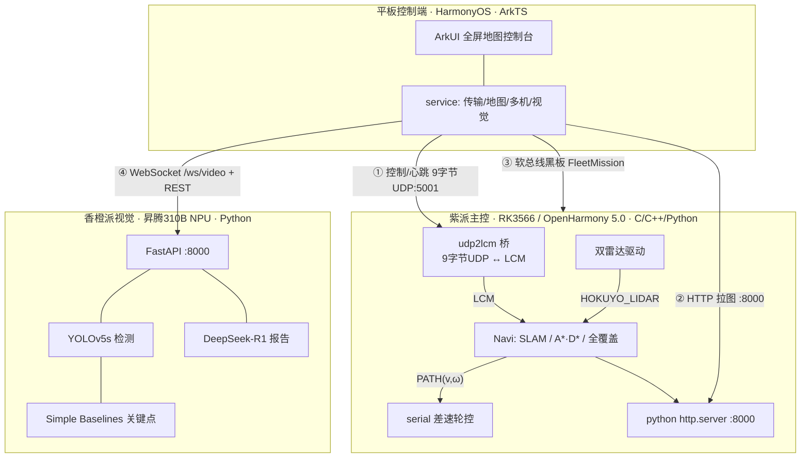
```mermaid
graph TB
  subgraph TABLET["平板控制端 · HarmonyOS · ArkTS"]
    UI["ArkUI 全屏地图控制台"]
    SVC["service: 传输/地图/多机/视觉"]
    UI --- SVC
  end

  subgraph PURPLE["紫派主控 · RK3566 / OpenHarmony 5.0 · C/C++/Python"]
    BRIDGE["udp2lcm 桥<br/>9字节UDP ↔ LCM"]
    NAVI["Navi: SLAM / A*·D* / 全覆盖"]
    WHEEL["serial 差速轮控"]
    HTTP["python http.server :8000"]
    LIDAR["双雷达驱动"]
    BRIDGE -- LCM --> NAVI
    NAVI -- "PATH(v,ω)" --> WHEEL
    LIDAR -- "HOKUYO_LIDAR" --> NAVI
    NAVI --> HTTP
  end

  subgraph ORANGE["香橙派视觉 · 昇腾310B NPU · Python"]
    FAST["FastAPI :8000"]
    YOLO["YOLOv5s 检测"]
    POSE["Simple Baselines 关键点"]
    DS["DeepSeek-R1 报告"]
    FAST --- YOLO --- POSE
    FAST --- DS
  end

  SVC -- "① 控制/心跳 9字节UDP:5001" --> BRIDGE
  SVC -- "② HTTP 拉图 :8000" --> HTTP
  SVC -- "③ 软总线黑板 FleetMission" --> PURPLE
  SVC -- "④ WebSocket /ws/video + REST" --> FAST
```

**四链路职责**：

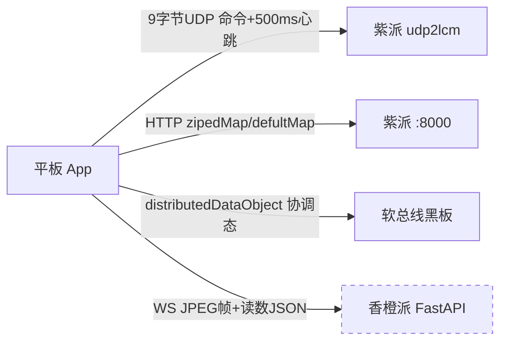
```mermaid
graph LR
  A["平板 App"]
  A -->|"9字节UDP 命令+500ms心跳"| B["紫派 udp2lcm"]
  A -->|"HTTP zipedMap/defultMap"| C["紫派 :8000"]
  A -->|"distributedDataObject 协调态"| D["软总线黑板"]
  A -->|"WS JPEG帧+读数JSON"| E["香橙派 FastAPI"]
  style E stroke-dasharray: 5 5
```

> **关键原理 · 双链路解耦**：视觉链路（④）与导航链路（①②）在**网络层（独立 socket）、线程层（独立 WS）、代码依赖层（VisionService 不 import 导航服务）**三重隔离。展开/收起视觉只连断本 WS，导航的保活/控制/建图照常运行，互不阻塞。

---

## 2. UDP 9 字节协议原理

### 2.1 字节布局

```
发送 App→紫派 (9字节, 大端):
┌────┬────────┬───────┬─────────────┬─────────────┬──────┐
│byte0│ byte1  │ byte2 │  byte3-4    │  byte5-6    │byte7-8│
│命令码│方向/号 │ 速度  │ endX int16  │ endY int16  │ 保留 │
└────┴────────┴───────┴─────────────┴─────────────┴──────┘

接收 紫派→App 心跳 (9字节, 大端, 每500ms):
┌────┬───────┬─────────────┬─────────────┬─────────────┐
│byte0│ 保留  │  byte3-4 x  │  byte5-6 y  │  byte7-8 r  │
│=3带坐标│      │ 当前X int16 │ 当前Y int16 │ 朝向(度)    │
└────┴───────┴─────────────┴─────────────┴─────────────┘
```

> **byte0 一字节双关**：取值对齐 ASCII，既是 App 状态也是紫派命令码——`'f'`=102 全路径、`'m'`=0x6d 强制建图、`'l'`=108 覆盖对角点2。
> **字节复用**：cmd105 把主机 IP 四段打进 byte[1,2,4,6]（复用 endX/endY 两个 int16 的低字节，高字节恒 0）。

### 2.2 命令 → LCM 翻译（桥模块核心职责）

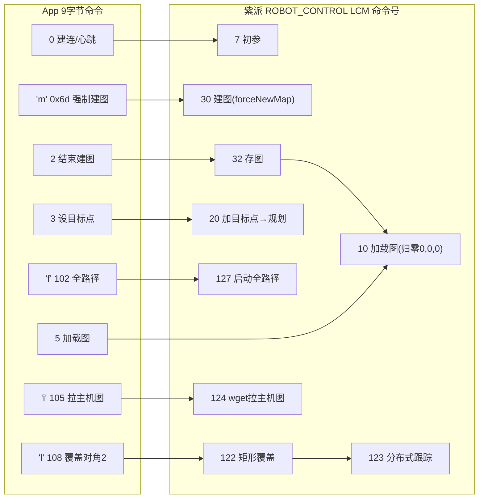
```mermaid
graph LR
  subgraph APP["App 9字节命令"]
    c0["0 建连/心跳"]
    cm["'m' 0x6d 强制建图"]
    c2["2 结束建图"]
    c3["3 设目标点"]
    c5["5 加载图"]
    cf["'f' 102 全路径"]
    cl["'l' 108 覆盖对角2"]
    ci["'i' 105 拉主机图"]
  end
  subgraph LCM["紫派 ROBOT_CONTROL LCM 命令号"]
    L7["7 初参"]
    L30["30 建图(forceNewMap)"]
    L32["32 存图"]
    L10["10 加载图(归零0,0,0)"]
    L20["20 加目标点→规划"]
    L127["127 启动全路径"]
    L122["122 矩形覆盖"]
    L123["123 分布式跟踪"]
    L124["124 wget拉主机图"]
  end
  c0 --> L7
  cm --> L30
  c2 --> L32 --> L10
  c3 --> L20
  c5 --> L10
  cf --> L127
  cl --> L122 --> L123
  ci --> L124
```

### 2.3 连接保活与看门狗时序

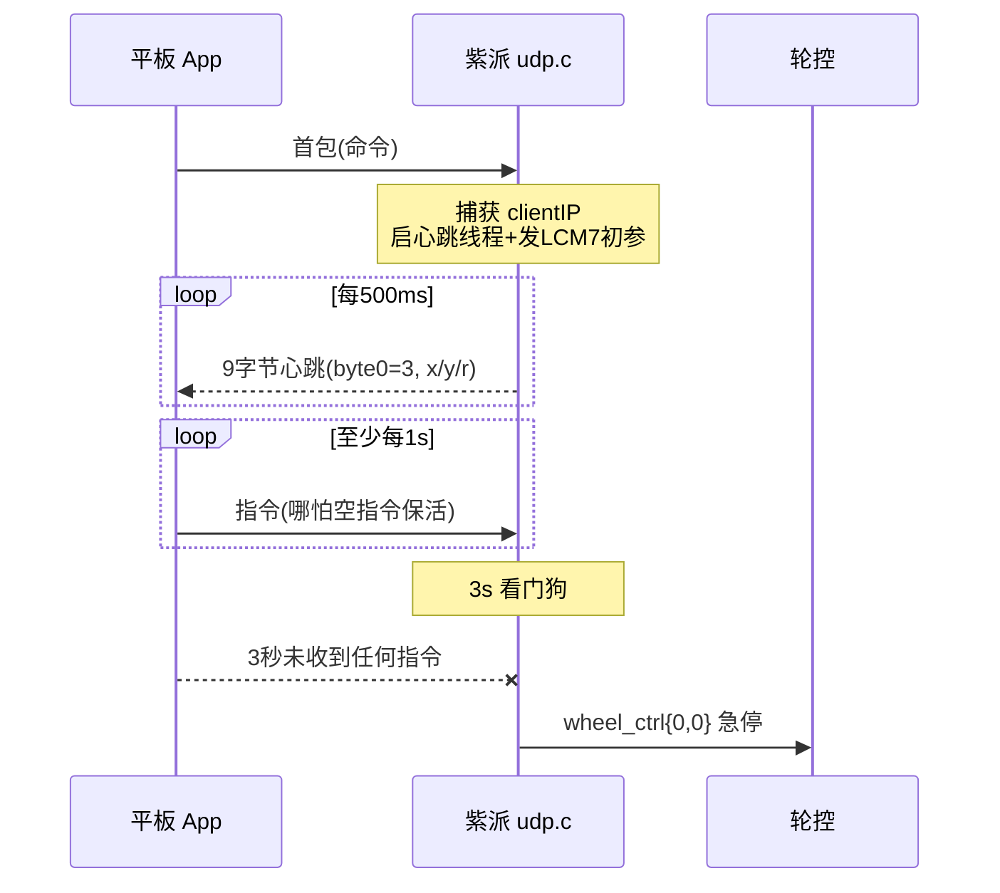
```mermaid
sequenceDiagram
  participant App as 平板 App
  participant Bridge as 紫派 udp.c
  participant Wheel as 轮控
  App->>Bridge: 首包(命令)
  Note over Bridge: 捕获 clientIP<br/>启心跳线程+发LCM7初参
  loop 每500ms
    Bridge-->>App: 9字节心跳(byte0=3, x/y/r)
  end
  loop 至少每1s
    App->>Bridge: 指令(哪怕空指令保活)
  end
  Note over Bridge: 3s 看门狗
  App--xBridge: 3秒未收到任何指令
  Bridge->>Wheel: wheel_ctrl{0,0} 急停
```

> **发现 ping 例外**：App 广播 `0x06`，紫派命中 `isDiscoveryPing` 只回 9 字节发现响应，**不记 clientIP / 不起心跳 / 不武装急停**——故广播不会误连/误急停子网内其它车。

---

## 3. SLAM 建图原理与流程

### 3.1 建图状态机（App 视角）

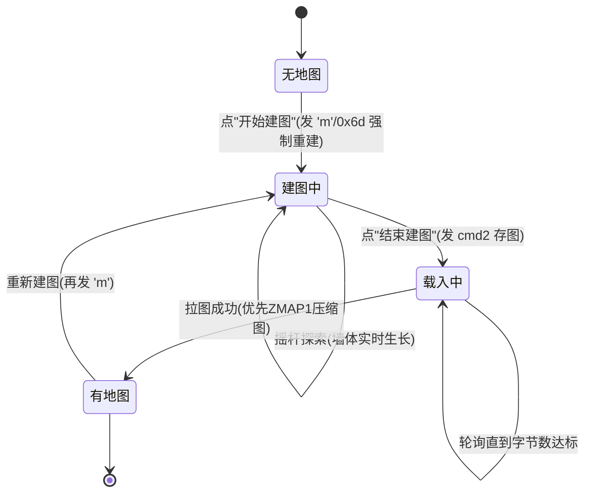
```mermaid
stateDiagram-v2
  [*] --> 无地图
  无地图 --> 建图中: 点"开始建图"(发 'm'/0x6d 强制重建)
  建图中 --> 建图中: 摇杆探索(墙体实时生长)
  建图中 --> 载入中: 点"结束建图"(发 cmd2 存图)
  载入中 --> 有地图: 拉图成功(优先ZMAP1压缩图)
  载入中 --> 载入中: 轮询直到字节数达标
  有地图 --> 建图中: 重新建图(再发 'm')
  有地图 --> [*]
```

> **为何必须发 `'m'` 而非 `cmd0`**：紫派 `cmd0` 在已有图/导航态时被 `Navi.createMap` 忽略（日志 `Ignore create map ... force=0`）、沿用旧图 → 摇杆在旧图上定位漂移、cmd2 存的还是旧图。`'m'`/0x6d 走 `forceNewMap=true` 清空旧图从头建。这是经真机定位的接口语义。

### 3.2 SLAM 内部原理

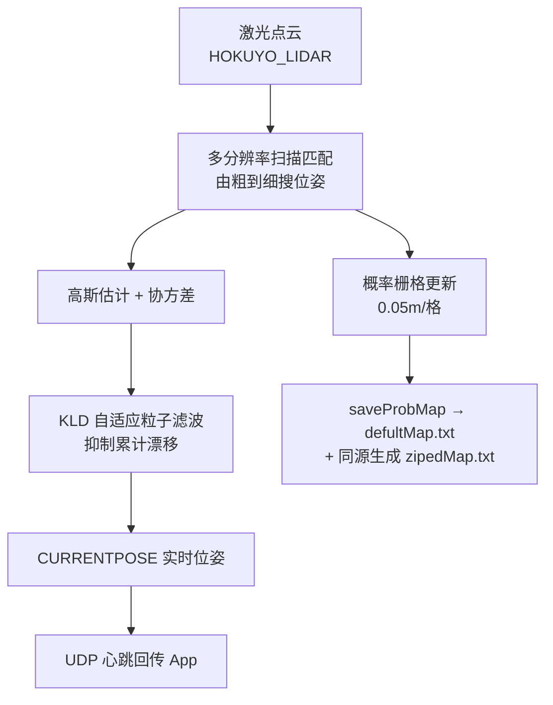
```mermaid
graph TB
  L["激光点云<br/>HOKUYO_LIDAR"] --> SM["多分辨率扫描匹配<br/>由粗到细搜位姿"]
  SM --> GE["高斯估计 + 协方差"]
  GE --> PF["KLD 自适应粒子滤波<br/>抑制累计漂移"]
  PF --> POSE["CURRENTPOSE 实时位姿"]
  SM --> MAP["概率栅格更新<br/>0.05m/格"]
  MAP --> SAVE["saveProbMap → defultMap.txt<br/>+ 同源生成 zipedMap.txt"]
  POSE --> HB["UDP 心跳回传 App"]
```

**概率栅格落盘格式**（首行 7 值）：

| 字段 | range | resolution | height | width | metersPerPixel | x0 | y0 |
|---|---|---|---|---|---|---|---|
| 位置 | parts[0] | [1] | **[2]=行** | **[3]=列** | [4]≈0.05 | [5] | [6] |
| 说明 | 量程 | 分辨率 | 栅格行数 | 栅格列数 | 每格米 | 最小角世界X(可负) | 最小角世界Y |

> **世界↔栅格换算**：`grid = (world − x0) / metersPerPixel`。⚠️ 行列在第 3、4 位，**不是末两个**（末两个是 x0/y0 偏移，误取即"空气图"——真机渲染 bug 根因）。

### 3.3 压缩地图 ZMAP1 编解码

```
ZMAP1                                       ← magic
range resolution height width mpp x0 y0     ← 同 defultMap 的7值头
rowBitCount wordCount word0 word1 ...        ← 每行一条, 共 height 行
```

- 编码：障碍格→bit 1，空旷→bit 0；每 64 格打包成无符号 64 位整数（cell0 在 bit63，依次向低位）。
- 解码：`bit = (word[col>>6] >> (63-(col&63))) & 1`；**必须用 BigInt**（number 仅 53 位精度会丢高位）。


```mermaid
graph LR
  R["普通图 -1/0 行"] -->|"打包 64格/uint64"| Z["ZMAP1 word序列 ~6×小"]
  Z -->|"HTTP 拉到 App"| BI["BigInt 解每个 word→64位串"]
  BI -->|"按width截断补零"| G["归一化栅格 1=障碍"]
```

---

## 4. A\* 导航原理与流程

### 4.1 导航时序

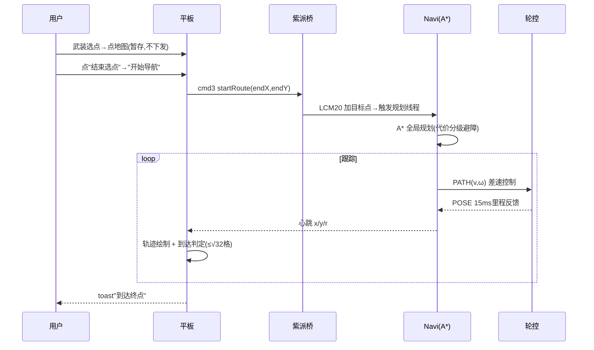
```mermaid
sequenceDiagram
  participant U as 用户
  participant App as 平板
  participant B as 紫派桥
  participant N as Navi(A*)
  participant W as 轮控
  U->>App: 武装选点→点地图(暂存,不下发)
  U->>App: 点"结束选点"→"开始导航"
  App->>B: cmd3 startRoute(endX,endY)
  B->>N: LCM20 加目标点→触发规划线程
  N->>N: A* 全局规划(代价分级避障)
  loop 跟踪
    N->>W: PATH(v,ω) 差速控制
    W-->>N: POSE 15ms里程反馈
    N-->>App: 心跳 x/y/r
    App->>App: 轨迹绘制 + 到达判定(≤√32格)
  end
  App-->>U: toast"到达终点"
```

### 4.2 A\* 代价模型

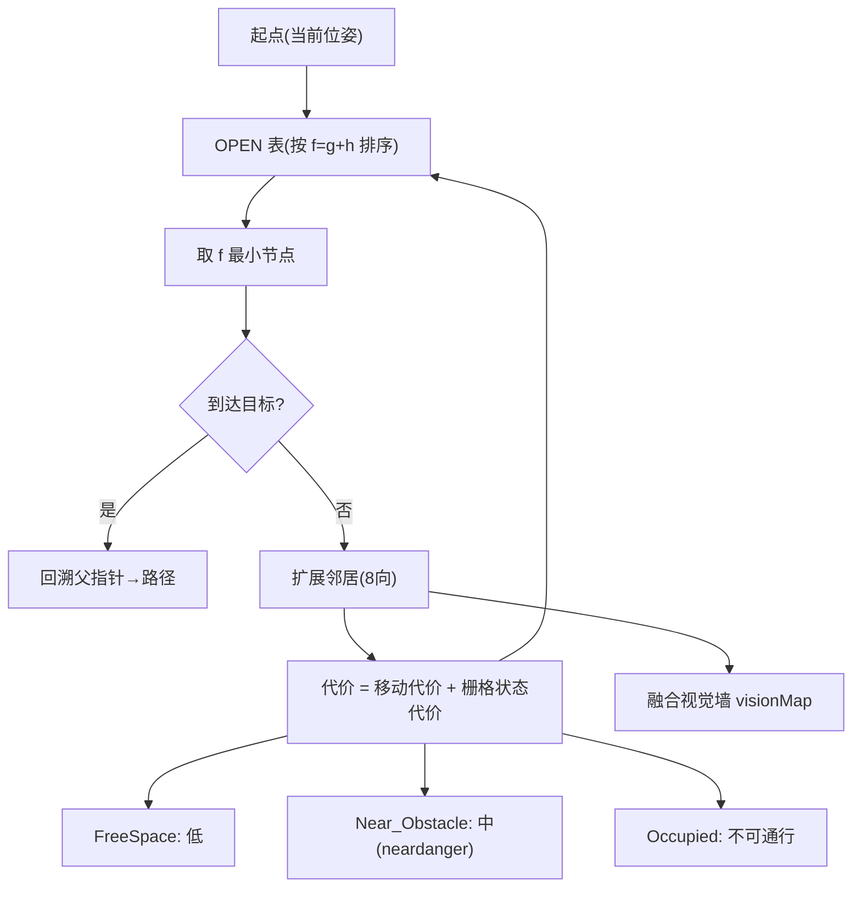
```mermaid
graph TB
  START["起点(当前位姿)"] --> OPEN["OPEN 表(按 f=g+h 排序)"]
  OPEN --> POP["取 f 最小节点"]
  POP --> GOAL{"到达目标?"}
  GOAL -->|是| PATH["回溯父指针→路径"]
  GOAL -->|否| NB["扩展邻居(8向)"]
  NB --> COST["代价 = 移动代价 + 栅格状态代价"]
  COST --> C1["FreeSpace: 低"]
  COST --> C2["Near_Obstacle: 中(neardanger)"]
  COST --> C3["Occupied: 不可通行"]
  NB --> VIS["融合视觉墙 visionMap"]
  COST --> OPEN
```

> 栅格状态分级（`FreeSpace / Near_Obstacle / Occupied`）赋不同代价（`heighcost/neardanger/danger`），使路径**主动远离障碍**而非贴墙。支持 A\*/D\*/BFS 三种搜索，D\* 用于动态重规划。

---

## 5. 全覆盖路径原理与流程（重点）

### 5.1 覆盖算法决策

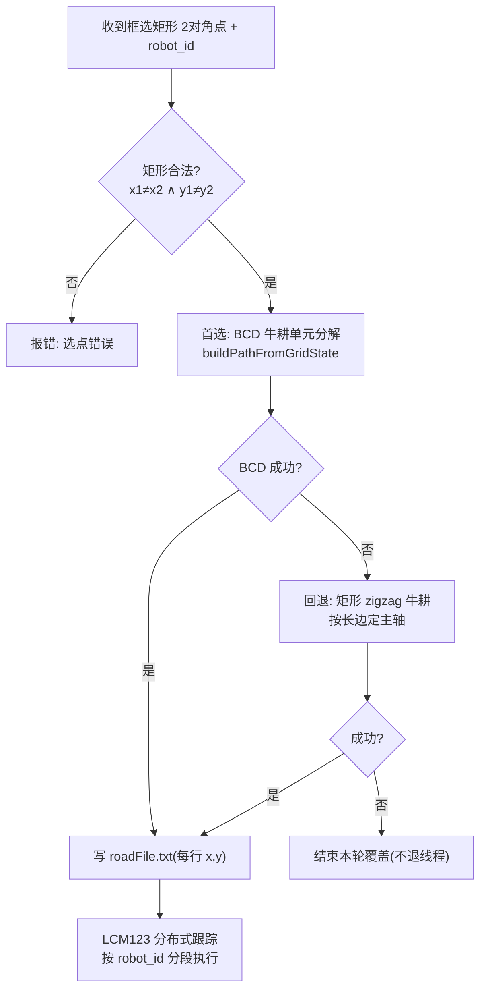
```mermaid
flowchart TB
  S["收到框选矩形 2对角点 + robot_id"] --> CHK{"矩形合法?<br/>x1≠x2 ∧ y1≠y2"}
  CHK -->|否| ERR["报错: 选点错误"]
  CHK -->|是| BCD["首选: BCD 牛耕单元分解<br/>buildPathFromGridState"]
  BCD --> OK1{"BCD 成功?"}
  OK1 -->|是| WRITE["写 roadFile.txt(每行 x,y)"]
  OK1 -->|否| ZIG["回退: 矩形 zigzag 牛耕<br/>按长边定主轴"]
  ZIG --> OK2{"成功?"}
  OK2 -->|是| WRITE
  OK2 -->|否| FAIL["结束本轮覆盖(不退线程)"]
  WRITE --> TRACK["LCM123 分布式跟踪<br/>按 robot_id 分段执行"]
```

### 5.2 BCD 牛耕单元分解原理

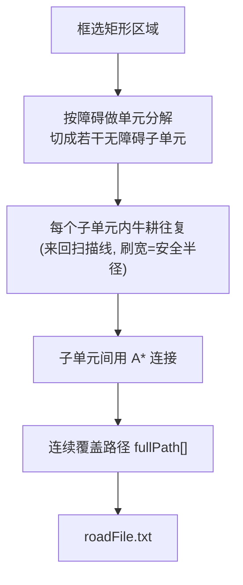
```mermaid
graph TB
  RECT["框选矩形区域"] --> DECOMP["按障碍做单元分解<br/>切成若干无障碍子单元"]
  DECOMP --> CELL["每个子单元内牛耕往复<br/>(来回扫描线, 刷宽=安全半径)"]
  CELL --> CONNECT["子单元间用 A* 连接"]
  CONNECT --> FULL["连续覆盖路径 fullPath[]"]
  FULL --> FILE["roadFile.txt"]
```

**覆盖线程伪代码**（`CoverageThreadProc`，algNum=0 牛耕+D\*）：

```text
while 等待 algNum 就绪:
  清空旧覆盖路径队列
  房间边界 = 自动凸包 or 手动选点
  初始化覆盖状态图 → 写 tmpcoverageMap.txt
  起点入队
  while 未完成:
    方向 = 前/后/左/右 探测
    用 D* 在当前方向规划探测路径
    沿路径牛耕，标记已覆盖格
  输出最终 coverageMap.txt
```

### 5.3 覆盖进度估算（App 侧实时，本次新增）

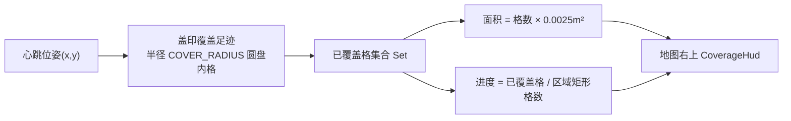
```mermaid
graph LR
  HB["心跳位姿(x,y)"] --> STAMP["盖印覆盖足迹<br/>半径 COVER_RADIUS 圆盘内格"]
  STAMP --> CELLS["已覆盖格集合 Set"]
  CELLS --> AREA["面积 = 格数 × 0.0025m²"]
  CELLS --> PROG["进度 = 已覆盖格 / 区域矩形格数"]
  AREA --> HUD["地图右上 CoverageHud"]
  PROG --> HUD
```

> 单格面积 = (5cm)² = 0.0025 m²；覆盖刷半径 ≈ 4 格 ≈ 20cm 半径（≈40cm 刷宽）。

---

## 6. 多机协同原理

### 6.1 软总线黑板模型

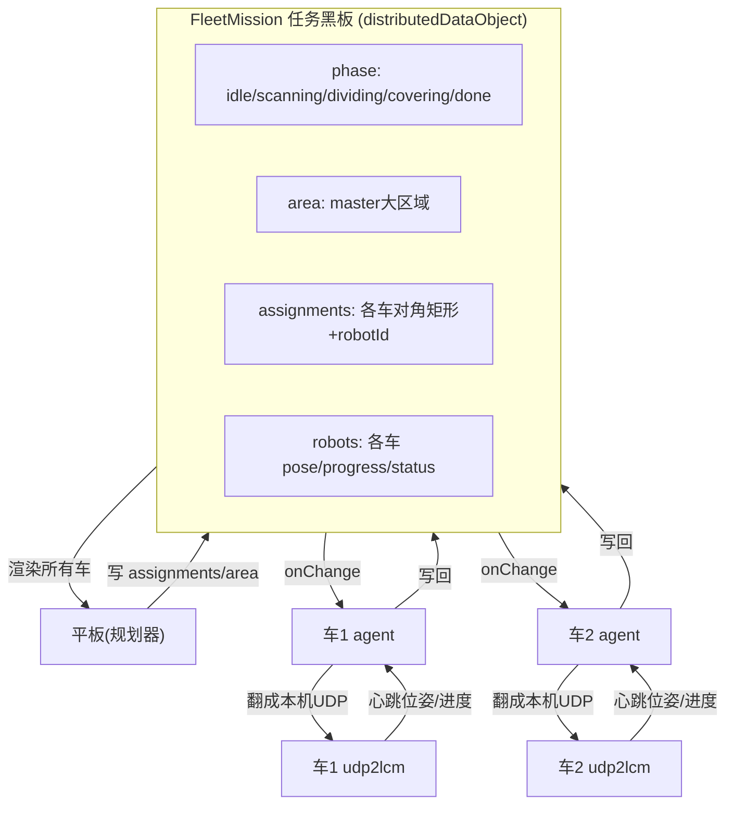
```mermaid
graph TB
  subgraph BB["FleetMission 任务黑板 (distributedDataObject)"]
    P["phase: idle/scanning/dividing/covering/done"]
    AR["area: master大区域"]
    AS["assignments: 各车对角矩形+robotId"]
    RB["robots: 各车 pose/progress/status"]
  end
  TABLET["平板(规划器)"] -->|"写 assignments/area"| BB
  BB -->|"onChange"| AG1["车1 agent"]
  BB -->|"onChange"| AG2["车2 agent"]
  AG1 -->|"翻成本机UDP"| CAR1["车1 udp2lcm"]
  AG2 -->|"翻成本机UDP"| CAR2["车2 udp2lcm"]
  CAR1 -->|"心跳位姿/进度"| AG1 -->|"写回"| BB
  CAR2 -->|"心跳位姿/进度"| AG2 -->|"写回"| BB
  BB -->|"渲染所有车"| TABLET
```

### 6.2 多机协同时序

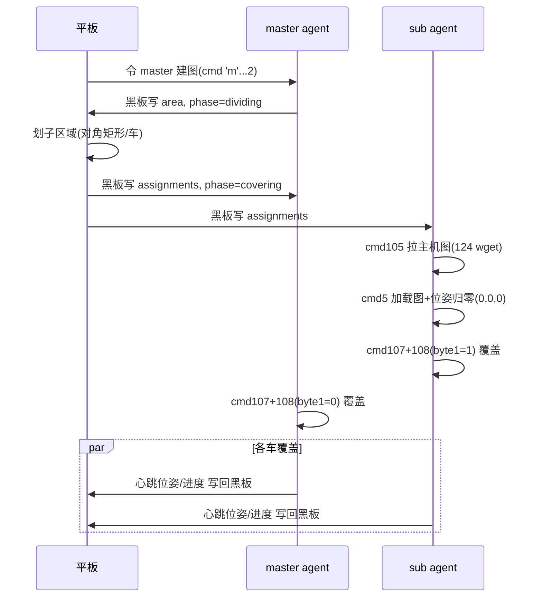
```mermaid
sequenceDiagram
  participant T as 平板
  participant Mz as master agent
  participant Sz as sub agent
  T->>Mz: 令 master 建图(cmd 'm'...2)
  Mz->>T: 黑板写 area, phase=dividing
  T->>T: 划子区域(对角矩形/车)
  T->>Mz: 黑板写 assignments, phase=covering
  T->>Sz: 黑板写 assignments
  Sz->>Sz: cmd105 拉主机图(124 wget)
  Sz->>Sz: cmd5 加载图+位姿归零(0,0,0)
  Sz->>Sz: cmd107+108(byte1=1) 覆盖
  Mz->>Mz: cmd107+108(byte1=0) 覆盖
  par 各车覆盖
    Mz->>T: 心跳位姿/进度 写回黑板
    Sz->>T: 心跳位姿/进度 写回黑板
  end
```

> **坐标系按构造对齐**：子机从 master 同一物理起点出发，`cmd5` 加载图把初始位姿强制归零 (0,0,0)，无需全局重定位。朝向比位置敏感，需把起点位置+朝向都卡死、顺序出发。

### 6.3 车间协同避障（COOP_AVOID，独立通道）

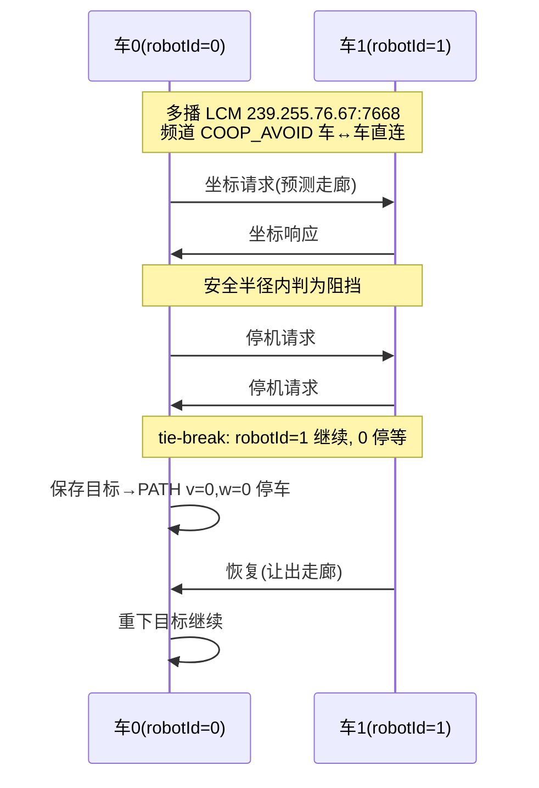
```mermaid
sequenceDiagram
  participant C0 as 车0(robotId=0)
  participant C1 as 车1(robotId=1)
  Note over C0,C1: 多播 LCM 239.255.76.67:7668<br/>频道 COOP_AVOID 车↔车直连
  C0->>C1: 坐标请求(预测走廊)
  C1->>C0: 坐标响应
  Note over C0,C1: 安全半径内判为阻挡
  C0->>C1: 停机请求
  C1->>C0: 停机请求
  Note over C0,C1: tie-break: robotId=1 继续, 0 停等
  C0->>C0: 保存目标→PATH v=0,w=0 停车
  C1->>C0: 恢复(让出走廊)
  C0->>C0: 重下目标继续
```

> 该通道与平板/软总线/UDP **完全解耦**，不改 9 字节协议，App 无需感知（仅可视化不可把"避让暂停"误判为"卡死掉线"）。

---

## 7. 边缘视觉原理与流程

### 7.1 推理流水线

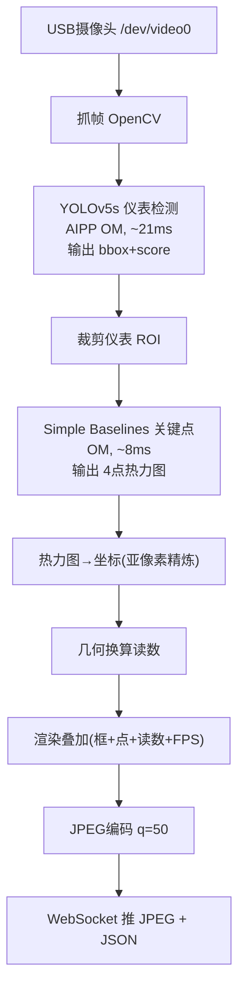
```mermaid
flowchart TB
  CAM["USB摄像头 /dev/video0"] --> GRAB["抓帧 OpenCV"]
  GRAB --> YOLO["YOLOv5s 仪表检测<br/>AIPP OM, ~21ms<br/>输出 bbox+score"]
  YOLO --> ROI["裁剪仪表 ROI"]
  ROI --> KP["Simple Baselines 关键点<br/>OM, ~8ms<br/>输出 4点热力图"]
  KP --> REFINE["热力图→坐标(亚像素精炼)"]
  REFINE --> READ["几何换算读数"]
  READ --> RENDER["渲染叠加(框+点+读数+FPS)"]
  RENDER --> JPEG["JPEG编码 q=50"]
  JPEG --> WS["WebSocket 推 JPEG + JSON"]
```

### 7.2 几何法读数原理

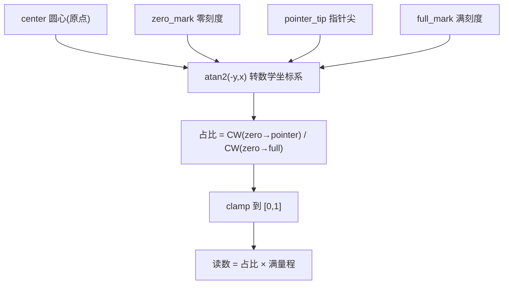
```mermaid
graph TB
  C["center 圆心(原点)"]
  P["pointer_tip 指针尖"]
  Z["zero_mark 零刻度"]
  F["full_mark 满刻度"]
  C --> CALC["atan2(-y,x) 转数学坐标系"]
  Z --> CALC
  P --> CALC
  F --> CALC
  CALC --> RATIO["占比 = CW(zero→pointer) / CW(zero→full)"]
  RATIO --> CLAMP["clamp 到 [0,1]"]
  CLAMP --> VAL["读数 = 占比 × 满量程"]
```

`reading = CW(zero→pointer) / CW(zero→full) × 满量程`（CW=顺时针夹角）。

### 7.3 视觉数据流与告警

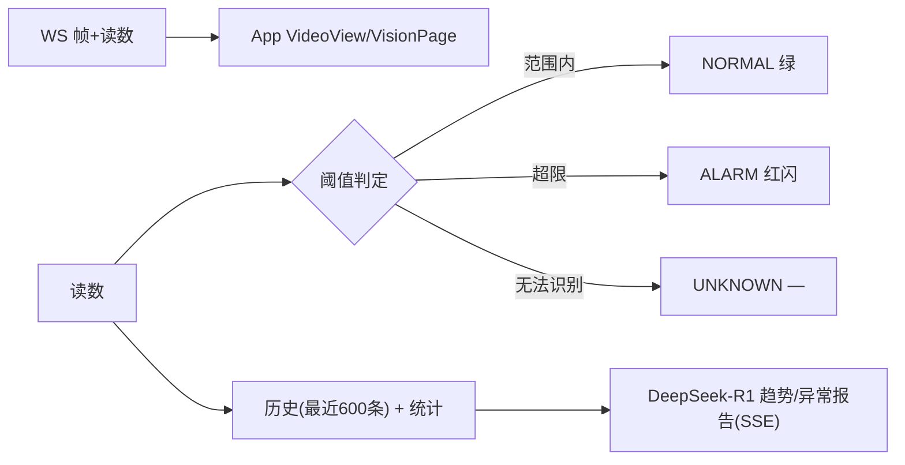
```mermaid
graph LR
  WS["WS 帧+读数"] --> APP["App VideoView/VisionPage"]
  READ["读数"] --> TH{"阈值判定"}
  TH -->|范围内| N["NORMAL 绿"]
  TH -->|超限| AL["ALARM 红闪"]
  TH -->|无法识别| UK["UNKNOWN —"]
  READ --> HIST["历史(最近600条) + 统计"]
  HIST --> DS["DeepSeek-R1 趋势/异常报告(SSE)"]
```

---

## 8. App 交互状态机

### 8.1 四态连接状态机

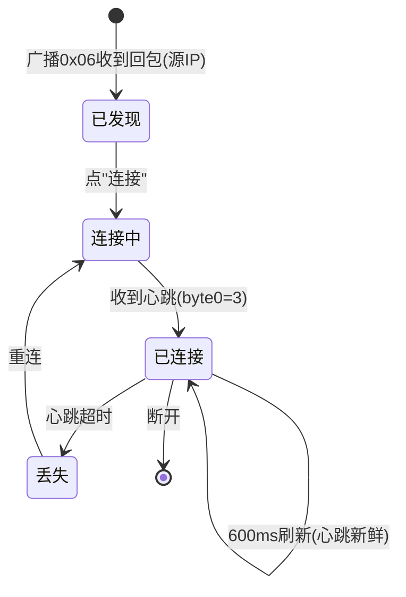
```mermaid
stateDiagram-v2
  [*] --> 已发现: 广播0x06收到回包(源IP)
  已发现 --> 连接中: 点"连接"
  连接中 --> 已连接: 收到心跳(byte0=3)
  已连接 --> 已连接: 600ms刷新(心跳新鲜)
  已连接 --> 丢失: 心跳超时
  丢失 --> 连接中: 重连
  已连接 --> [*]: 断开
```

> 连接状态驱动**命令门控**：未连接时下发按钮禁用，`enablePick` 也要求已连接。

### 8.2 两段式武装选点状态机（本次新增）

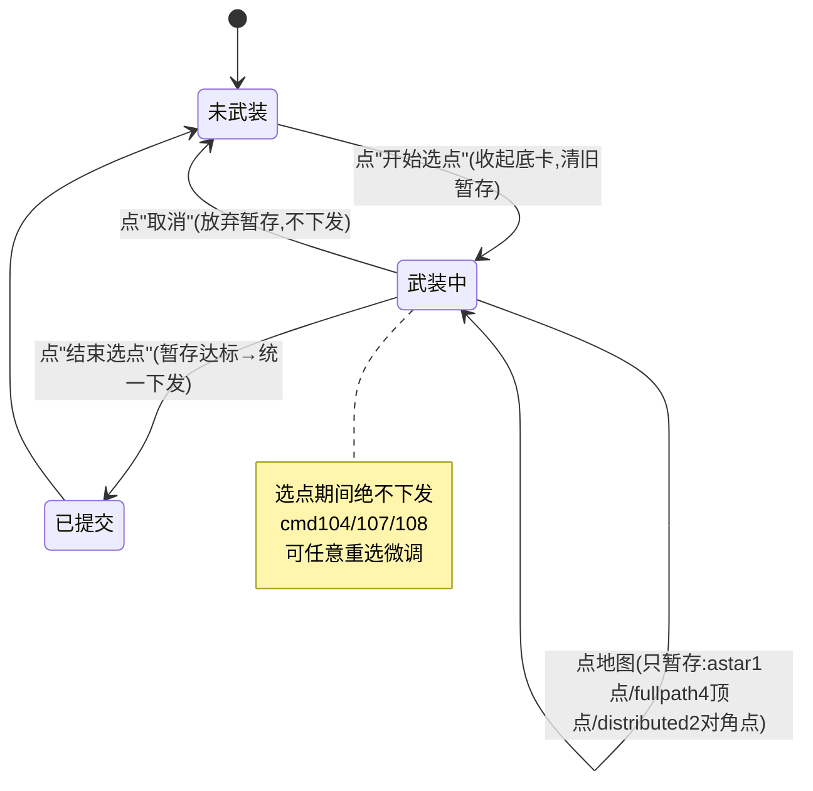
```mermaid
stateDiagram-v2
  [*] --> 未武装
  未武装 --> 武装中: 点"开始选点"(收起底卡,清旧暂存)
  武装中 --> 武装中: 点地图(只暂存:astar1点/fullpath4顶点/distributed2对角点)
  武装中 --> 未武装: 点"取消"(放弃暂存,不下发)
  武装中 --> 已提交: 点"结束选点"(暂存达标→统一下发)
  已提交 --> 未武装
  note right of 武装中
    选点期间绝不下发
    cmd104/107/108
    可任意重选微调
  end note
```

> **原理**：`onPick` 在 `picking==true` 时只写 `mission.endPoints`/`fpVertices`/`distCorners` 暂存，`finishPicking` 才按 mode 批量 `sendTo`（fullpath 顺序发 4×cmd104 + 延时 cmd102；distributed assignArea 发 cmd107+108）。纯 App 侧下发时机，9 字节协议字节/语义不变。

### 8.3 三种作业模式总览

```mermaid
graph TB
  MODE{"控制模式"}
  MODE --> ASTAR["单机导航 astar<br/>选1目标点→cmd3"]
  MODE --> FULL["全路径覆盖 fullpath<br/>选4顶点→cmd104×4+cmd102<br/>+ 覆盖进度HUD"]
  MODE --> DIST["多机协同 distributed<br/>每车划对角矩形→cmd107+108<br/>+ 各车进度HUD + 软总线黑板"]
```

---

## 9. 差速轮控数据流

```mermaid
graph LR
  PATH["Navi PATH(v,ω)"] --> SOLVE["差速解算<br/>vL=v-ω·d/2<br/>vR=v+ω·d/2"]
  WCTRL["建图期 wheel_ctrl 遥控"] --> SOLVE
  SOLVE --> SERIAL["串口下发驱动板"]
  SERIAL --> MOTOR["左右轮电机"]
  MOTOR --> ENC["编码器"]
  ENC -->|"每15ms"| POSE["POSE 里程反馈"]
  POSE --> NAVI["Navi 定位融合"]
```

---

## 10. 完整作业流程（端到端）

```mermaid
flowchart TB
  START([开机]) --> DISC["广播发现双车+香橙派(0x06/0x07)"]
  DISC --> CONN["点击连接(四态机)"]
  CONN --> BUILD["建图: 'm'强制重建→摇杆探索→cmd2存图→拉ZMAP1"]
  BUILD --> CHOOSE{"选作业模式"}
  CHOOSE -->|单机导航| NAV["武装选点→结束选点→cmd3→A*行驶→到达判定"]
  CHOOSE -->|全覆盖| COV["选算法→框选4顶点→BCD/牛耕→足迹+面积HUD"]
  CHOOSE -->|多机协同| MULTI["划对角矩形/车→软总线黑板→各车分区+COOP_AVOID避障→进度HUD"]
  NAV --> VIS
  COV --> VIS
  MULTI --> VIS
  VIS["仪表识别: PiP瞥表/全屏(YOLO+关键点+读数)→告警→DeepSeek报告"]
  VIS --> END([完成,数据资产沉淀])
```

---

*所有图表与公式均来自项目实际代码（紫派 Navi/udp2lcm、App service/model、香橙派 web/backend）与契约文档，可逐条核查。*
