# OpenHarmony 工业巡检机器人 · 作品设计文档（全量版）

> **作品名称**：OpenHarmony 工业巡检机器人（让巡检自己跑起来 · 看见每一处，读懂每一块表）
> **技术底座**：开源鸿蒙 OpenHarmony 分布式软总线 · 华为昇腾 NPU 边缘智能 · 国产 ArkTS · 全自研算法栈（零 ROS 依赖）
> **文档定位**：选拔赛作品设计文档（覆盖全部子系统、协议、算法、实现、对比与创新）。所有技术事实均来自项目实际代码与 `contracts/` 契约，可逐条核查。
> **图表说明**：本文含 30+ 张 Mermaid 图，建议用支持 Mermaid 的查看器（VS Code + Mermaid 插件 / Typora / GitHub）打开。

---

## 摘要

本作品是一台**面向工业场景的自主巡检机器人系统**，由三名成员从小车底盘硬件接线、电机差速轮控、激光 SLAM 建图、A\* 导航、全覆盖路径规划，到昇腾视觉模型（自采集数据集、自标注、自训练），再到鸿蒙平板控制 App 与车载分布式协同 agent，**全栈自主搭建、不依赖任何 ROS 中间件**。它要回答一个有现实意义、也有战略意义的问题：在不依赖 ROS、不依赖 NVIDIA 算力、不依赖国外云 AI 的前提下，能不能用纯国产的软硬件生态，做出一台可建图、可导航、可全覆盖、可多机协同、可读表告警、并且好用到"像地图 App 一样"的工业巡检机器人？本作品给出的答案是肯定的，并且已在真机上跑通了完整能力闭环。

系统由**三个异构节点**组成，运行在三种硬件与操作系统上，通过**四条经过逐字节对账的契约化链路**协同：

| 节点 | 硬件 / 系统 | 语言 | 职责 |
|---|---|---|---|
| **平板控制端** | HarmonyOS 平板 | ArkTS | 总控 / 规划 / 可视化：建图、选点、路径下发、多机调度、仪表监看 |
| **紫派主控（每台车）** | Purple Pi OH（RK3566 / OpenHarmony 5.0） | C / C++ / Python3 | 激光 SLAM、A\*/D\* 导航、BCD 全覆盖、差速轮控、UDP↔LCM 桥 |
| **香橙派视觉** | OrangePi AI Pro（昇腾 310B NPU） | Python / C++ | 工业仪表实时检测、关键点读数、DeepSeek 报告 |

系统的能力闭环是：**激光自主建图 → A\* 单点导航 → 全覆盖遍历 → 多机协同分区 → 边缘视觉读表 → 异常告警与智能分析报告**。在这条闭环上，每一个环节的核心技术都由成员独立实现：SLAM 是自研的多分辨率扫描匹配加粒子滤波，路径规划是自研的 A\*/D\* 加牛耕单元分解全覆盖，轮控是自己写的差速解算加串口驱动，通信是自定义的 9 字节二进制协议加紫派内部 LCM 总线，视觉是自己采集标注训练的 YOLOv5s 加 Simple Baselines 关键点模型、再用几何法反算读数，连分析报告用的大模型都是本地化部署的 DeepSeek-R1 蒸馏版。整套系统**国产化、自主可控、无"卡脖子"依赖**，恰好落在"具身智能量产元年"与"信创自主可控"两条国家战略的交汇点上。

### 文档导航

| 章节 | 内容 |
|---|---|
| 一、目标问题与意义价值 | 应用领域、行业痛点、目标功能、政策/市场/自主可控意义 |
| 二、设计思路与方案 | 总体思路、技术路线选型、系统架构、四条协议、六大算法设计原理 |
| 三、方案实现 | 硬件、紫派中间层、香橙派视觉层、平板应用层、车载 agent、集成方法 |
| 四、运行结果/应用效果 | 闭环实测、性能指标、竞品对比、应用价值、局限与展望、演示片 |
| 五、创新与特色 | 九大维度穷举式创新清单（可由评审/团队取舍） |
| 附录 | 协议表、命令表、坐标系、视觉接口、数据资产、术语、参考来源 |

---

# 一、目标问题与意义价值

## 1.1 应用领域

本作品面向**流程工业的设备巡检**。流程工业（电力、石化、化工、冶金、轨道交通等）的共同特征是：生产连续不停、设备密集分布、现场环境危险、对安全和稳定性要求极高。在这些行业里，"巡检"不是可有可无的辅助工作，而是**安全生产的第一道防线**——它要在故障演变成事故之前，把隐患发现出来。本作品的目标，就是把这道防线从"人去走、人去看、人去记"，升级为"机器人去走、AI 去看、系统去记"。

具体的典型应用场景包括：

- **电力（变电站 / 配电室）**：巡检设备外观、刀闸分合位置、表计读数（电压表、电流表、油温表、SF₆ 压力表、避雷器动作计数器等），以及红外测温、局部放电等带电检测。电力是当前智能巡检机器人最大的落地市场，行业占比接近九成。
- **化工 / 石化（厂区 / 焦炉 / 储罐区 / 管廊）**：在高温、高粉尘、强腐蚀性气体、易燃易爆的危险区域，巡检压力表、液位计、阀门状态、管线泄漏、可燃/有毒气体浓度等。这类场景对"人不进场"的诉求最强烈。
- **轨道交通（隧道 / 机房 / 牵引变电所）**：巡检隧道结构、设备温度、机房环境与设备指示灯状态。
- **仓储 / 厂房（地面巡查）**：做地面全覆盖巡查、资产盘点、环境（温湿度、烟感）监测，这类场景最能发挥"全覆盖路径规划 + 多机协同分区"的能力。

这些场景的共同诉求可以归纳为一句话：**环境危险、设备/仪表密集、需要可追溯的数据**。本作品的设计正是围绕这三点展开。

举一个更具体的画面：在一座变电站里，过去每天清晨和傍晚各有两名巡检员，戴着安全帽、拿着记录本和红外测温枪，沿固定路线走一圈，逐个设备看外观、读表计、记数据、测温度。高压设备区有严格的安全距离，夜间照明不足，夏天设备区温度很高。换成本作品的方案后，是这样一幅画面：操作员在值班室的平板上，先让机器人对站区建一张地图（或直接用已有的图），然后框选要巡检的区域，机器人就自己沿牛耕路径把区域扫一遍；走到每个表计前，车上的摄像头自动识别读数，超阈值就在平板上告警；遇到两台车作业区域交汇，它们自己协商避让；一圈下来，所有读数都进了系统，能查历史、能看趋势、能生成报告。人，待在安全的值班室里，看着平板就行。这就是本作品要把"人去走、人去看、人去记"升级成的样子。

## 1.2 关注与解决的问题

### 1.2.1 传统人工巡检的三类结构性痛点

人工巡检在工业现场已经沿用了几十年，但随着设备规模膨胀和安全标准提高，它的局限越来越突出。结合行业资料，可以把痛点归纳为三类：

**第一，安全风险高。** 变电站的高压电场、化工焦炉车间的高温高粉尘强腐蚀性气体、辐射区与有毒气体环境，使巡检人员长期暴露在风险之中。行业资料明确指出，焦炉车间等化工场景存在高温、高粉尘、强腐蚀性气体等恶劣环境特征，传统人工巡检面临安全风险、检测盲区和数据离散等难题；高危场景（如辐射区、有毒气体环境）的人工巡检甚至会直接威胁人员生命安全。

**第二，效率低、覆盖不全。** 制造业的高速生产线让人工点检难以应对；流程工业的大型设备数以万计，巡检工作量剧增；电力行业的高空高压环境本身就限制了人能去的地方，必然存在检测盲区。人靠走、靠看，频次受限于体力和排班，往往"每天巡两次"已是上限，关键设备的状态变化很可能在两次巡检之间被漏掉。

**第三，读数主观、数据离散。** 工业现场至今仍有大量**指针式机械仪表**，人工读数受经验、疲劳、光照、视角影响，主观性强、易错，夜间和高位仪表尤甚。更关键的是，人工记录通常是纸质或离散的，难以汇聚成结构化、可追溯、可分析的数据资产，也就无法支撑后续的趋势分析和预测性维护。

### 1.2.2 智能巡检的价值（行业实测佐证）

智能巡检机器人正是针对上述痛点的系统性替代方案，行业实测数据印证了其价值：

- **变电站**：巡检机器人通过视觉算法识别仪表读数、刀闸状态，**准确率达 99%、效率是人工的 5 倍**。
- **石化厂区**：AGV 机器人巡检效率是人工的 **4 倍**；通过预设最优巡检路径和多机协同算法，某炼油厂将巡检频次从"每日 2 次"提升到"每小时 1 次"，**人力成本降低约 60%**。
- **化工**：巡检机器人代替人员深入高危区域，**减少了人员在有毒有害、高温高压等恶劣环境中的暴露时间**，极大降低了安全事故发生的可能性。

这三个数字——准确率 99%、效率 4~5 倍、频次从"每日 2 次"到"每小时 1 次"——清楚地说明：智能巡检不是对人工的简单替代，而是在安全、效率、覆盖、数据四个维度上的整体跃升。本作品要做的，正是把这套能力用**完全国产、自主可控**的技术栈实现出来。

## 1.3 实现的目标与基本功能

**总目标**：用一套完全国产、自主可控的技术栈，做出一台可建图、可导航、可全覆盖、可多机协同、可读表告警的工业巡检机器人，并把"复杂机器人系统"收敛到一块平板上**像用地图导航 App 一样简单**的交互里——让没有机器人背景的现场人员也能直接上手。

围绕这个总目标，作品已实现并在真机跑通了以下基本功能（每一项都是完整能力闭环的一环）：

1. **零配置设备发现与连接。** 平板在局域网内广播探测，自动发现同网络的车辆和视觉设备，按回包的源 IP 收集在线设备，点击即连，免去手工输入 IP 的麻烦；连接状态用一个四态状态机（已发现 / 连接中 / 已连接 / 丢失）实时呈现，并据此对控制按钮做门控（没连上就不许下发命令）。
2. **激光 SLAM 自主建图。** 用摇杆遥控车体探索未知环境，激光雷达扫描的墙体在平板地图上实时生长；探索完成后一键结束建图，地图存盘并自动拉取到平板（优先拉压缩格式，约为原图的六分之一大小）。
3. **A\* 单机导航。** 在地图上点选目标点，紫派用 A\* 做代价分级的全局规划，车辆自主行驶到达；行驶过程中轨迹实时绘制，接近目标自动判定到达。
4. **全覆盖遍历。** 框选一块作业区域，系统用牛耕单元分解（BCD）或矩形牛耕生成往复覆盖路径，把区域"一寸不漏"地扫过；覆盖足迹和已覆盖面积/进度在地图旁实时显示。
5. **多机协同。** 借助鸿蒙分布式软总线共享一块任务黑板，平板为每辆车划分一块对角矩形子区域，各车分区清扫、互不重叠；两车路线交汇时由车间独立通道做协同避障。
6. **边缘视觉读表。** 香橙派在昇腾 NPU 上实时检测工业仪表、定位四个关键点、用几何法反算读数，超阈值告警；并用本地大模型基于历史读数生成趋势/异常分析报告，沉淀为可追溯的数据资产。

## 1.4 典型作业流程（端到端）

把上述功能串起来，一次完整的巡检作业流程如下：

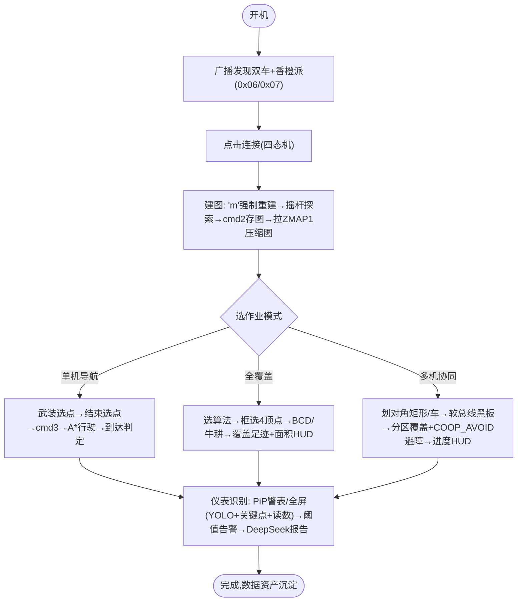
```mermaid
flowchart TB
  START([开机]) --> DISC["广播发现双车+香橙派(0x06/0x07)"]
  DISC --> CONN["点击连接(四态机)"]
  CONN --> BUILD["建图: 'm'强制重建→摇杆探索→cmd2存图→拉ZMAP1压缩图"]
  BUILD --> CHOOSE{"选作业模式"}
  CHOOSE -->|单机导航| NAV["武装选点→结束选点→cmd3→A*行驶→到达判定"]
  CHOOSE -->|全覆盖| COV["选算法→框选4顶点→BCD/牛耕→覆盖足迹+面积HUD"]
  CHOOSE -->|多机协同| MULTI["划对角矩形/车→软总线黑板→分区覆盖+COOP_AVOID避障→进度HUD"]
  NAV --> VIS
  COV --> VIS
  MULTI --> VIS
  VIS["仪表识别: PiP瞥表/全屏(YOLO+关键点+读数)→阈值告警→DeepSeek报告"]
  VIS --> END([完成,数据资产沉淀])
```

操作者先开机让平板发现设备并连接；如果还没有地图，就先遥控建图；有了地图后按需选择三种作业模式之一——要么点一个目标点让车自己导航过去，要么框一块区域让车全覆盖清扫，要么把区域分给多辆车协同作业；作业过程中可以随时展开视觉窗口看仪表读数，超阈值会告警，还能一键生成分析报告。整个过程在一块平板上完成，操作逻辑和用地图导航 App 几乎一致。

## 1.5 理论意义与应用价值

本作品的技术路线——**开源鸿蒙 + 华为昇腾 + 国产 ArkTS + 全自研算法**——不是为了标新立异，而是**精准踩中了当前三条国家级战略主线的交汇点**。这使得它既有技术价值，也有政策和市场层面的现实意义。

### 1.5.1 政策导向：三重风口交汇

**其一，具身智能与机器人产业政策。** 工信部《人形机器人创新发展指导意见》把 2025 年定为关键节点，要求"大脑、小脑、肢体"等关键技术取得突破，并特别强调要**确保核心部组件安全有效供给**——这正是"自主可控"在机器人领域的具体表述。业界普遍把 2025 年称为"量产元年"：国内整机企业超过 140 家、发布产品超过 330 款。2025 年 12 月，工信部"人形机器人与具身智能标准化技术委员会"成立，标志着这个领域进入标准化与产业化加速期。此外，工信部与国资委联合推出的专项行动覆盖北京、上海、广东、四川等十个省市，划定了**工业制造、民生服务、特种作业**三大核心方向——而**工业巡检正属于"特种作业"这一重点方向**。

**其二，国务院"人工智能+"行动。** 2025 年 8 月 26 日，国务院印发《关于深入实施"人工智能+"行动的意见》，部署了科技、产业、消费、民生、治理、全球合作六大重点行动，并提出要强化八项基础支撑能力。其中两项与本作品高度契合：一是"**促进开源生态繁荣**"——本作品深度运用开源鸿蒙 OpenHarmony，是开源生态的真实落地案例；二是"**提升安全能力水平**"——本作品用机器人替代人进入高危环境，并内置了多重安全机制。《意见》提出的目标是：到 2027 年，新一代智能终端、智能体等应用普及率超过 70%；到 2030 年超过 90%。工业巡检机器人正是"智能终端 / 智能体"在特种作业领域的典型形态。

**其三，信创与自主可控。** 2025 年被视为信创产业从"国产替代"向"自主可控"跃迁的关键之年，核心任务是构建国产化的信息技术软硬件底层架构、解决核心技术关键环节的"卡脖子"问题。在这条主线上，国产操作系统（如麒麟）已连续多年居国内 Linux 市场第一，国产 CPU、操作系统、数据库等核心技术逐步逼近国际主流水平，央企信息系统也在加速国产化替代。机器人是一个软硬件深度耦合的系统工程——它同时涉及操作系统、AI 算力、开发语言、通信中间件、核心算法、AI 模型。如果这些环节全部用国产生态实现，那么它就是一个"全栈自主可控"的示范样本。本作品恰恰做到了这一点。

把三条主线放在一起看，会发现它们指向同一个方向：国家既要机器人产业做大（具身智能量产元年），又要 AI 深度赋能千行百业（人工智能+），还要核心技术不被卡脖子（信创自主可控）。一台"全栈国产、自主可控、能在工业现场真正干活"的巡检机器人，正好同时回应了这三个诉求。这也是本作品在立项层面最大的底气——它不是蹭某一个热点，而是站在三个国家战略的交汇点上。更进一步说，工业巡检属于专项行动明确点名的"特种作业"方向，电力等核心行业又对供应链安全、数据安全格外敏感，国产自主可控的方案在这些行业有着政策和现实的双重刚需。

### 1.5.2 市场价值

工业巡检机器人不仅有政策牵引，也有真实且高速增长的市场需求：

| 指标 | 2025 | 2026（预测） | 增速 |
|---|---|---|---|
| 中国智能巡检机器人市场规模 | **27.48 亿元** | **31.85 亿元** | **≈15.9%** |
| 市场需求量 | 7738 台 | 9722 台 | ≈25.6% |

其中电力领域是最大的应用市场，2025 年占比高达 **88.54%**；另有研究机构按不同口径预计市场规模将突破 70 亿元量级。无论按哪个口径，市场都处于高速增长阶段：电力是基本盘，化工、轨道交通、仓储是增量空间。本作品具备的"全覆盖 + 多机协同"能力，恰好契合仓储、厂房这类需要大面积无遗漏巡查的增量场景。

### 1.5.3 自主可控的战略意义与理论贡献

需要特别强调的是，本作品**不是"为国产而国产"**——它的每一项技术选型都有工程上的合理性，只是恰好这些最优选型都落在了国产生态里：操作系统选开源鸿蒙是因为它原生提供分布式软总线和可信组网；AI 算力选华为昇腾是因为它能在边缘做低时延推理、数据不出端；开发语言选 ArkTS 是因为它和鸿蒙 UI 框架天然契合；算法全自研是因为这样最可控、也最能规避对国外开源中间件的路径依赖；分析大模型本地化是因为巡检数据涉及工业安全、不宜上传云端。

从理论和方法论层面，本作品也有可复制的贡献：

- **契约驱动的异构协作方法论。** 工业机器人项目"集成失败几乎都来自接口不一致"。本作品用一套 `contracts/` 契约目录作为三端唯一事实来源，配合逐字节对账和异步对接问答机制，从机制上根治了这一顽疾。这套方法对任何多人、多语言、多设备的系统工程都有借鉴意义。
- **几何法仪表读数。** 用四个关键点 + 顺时针夹角占比反算读数，避免了"每块表单独训练一个分类模型"的高成本路线，泛化性更好。
- **"按构造对齐"的多机坐标方案。** 让子车从主车的同一物理起点出发、用加载地图命令把初始位姿强制归零，一个巧妙的工程约束就消解了多机全局重定位这个难题。

这些贡献加在一起，使本作品既是一台能用的机器人，也是一份"国产生态下如何做机器人系统工程"的范本。

## 1.6 量化收益与场景测算

为了把价值说清楚，这里用行业公开数据做一个粗略的收益测算（仅示意，实际因场景而异）。以一座中型变电站为例，传统人工巡检通常配 2 名巡检员、每天巡 2 次，每次约 2 小时。引入巡检机器人后，按行业实测"效率为人工 5 倍、人力成本降约 60%"的口径：

- **频次跃升**：机器人可做到每小时一次甚至连续巡检，把"每天 2 次"提升到"每天 24 次"量级，关键设备状态变化几乎不会被漏过。
- **人力释放**：原来 2 名巡检员的现场工作大部分被替代，人力成本下降约 60%，释放出来的人可转去做更高价值的分析、维护工作。
- **安全归零**：巡检员不再需要进入高压、高温、有毒区域，这类场景的人身风险趋近于零——这部分价值难以用金钱衡量，却是最重要的。
- **数据增值**：每一次巡检都沉淀结构化读数，汇聚成可追溯、可分析的数据资产，为预测性维护提供基础——这是人工纸质记录完全做不到的。

把这些算在一起，巡检机器人的投资回收期通常在一两年量级，而本作品因为用国产硬件自主装配、成本远低于动辄十几万美元的国际竞品，回收期还能进一步缩短。这正是工业巡检机器人市场以每年约 16% 高速增长、电力领域渗透率已近九成的根本原因。

## 1.7 为什么是"现在"、为什么是"我们"

**为什么是现在。** 三个条件同时成熟了：一是政策——具身智能被列为国家战略重点方向、"人工智能+"行动明确要繁荣开源生态和提升安全能力；二是生态——开源鸿蒙生态设备已突破 13 亿台、昇腾边缘算力成熟可用，国产软硬件第一次能完整支撑一台机器人；三是需求——工业现场对"减人、增效、降风险、留数据"的诉求空前强烈。三者叠加，正是做这件事的最佳时间窗口。

**为什么是我们。** 本作品最大的不同，是它**不是在国外开源生态上做集成，而是在国产生态上从零自研**。三名成员分别负责平板 App（鸿蒙 ArkTS）、紫派主控（SLAM/导航/覆盖/轮控的 C/C++/Python）、香橙派视觉（昇腾上的检测/关键点/读数/大模型），从硬件接线一直做到上层交互，每一层都是自己实现、自己调通的。这种"全栈自研"虽然慢、虽然累，但换来的是对系统每一个环节的完全掌控——前面那些真机 bug 之所以能逐层定位、彻底解决，正是因为没有任何一层是"别人的黑盒"。

# 二、设计思路与方案

## 2.1 总体设计思路

整个系统的设计，可以用四条贯穿始终的原则来概括。它们不是事后总结的口号，而是从一开始就决定了系统形态的根本选择。

**原则一：异构分布式、各司其职。** 巡检机器人系统里有三类性质完全不同的任务——交互可视化要求现代 UI 框架和良好的人机体验，实时运动控制要求确定性强、延迟低的嵌入式执行，AI 视觉推理要求专门的神经网络算力。把这三类任务塞进同一块板子，必然是顾此失彼。所以我们把它们拆到三个最合适的设备上：交互放在 HarmonyOS 平板，实时控制放在跑 OpenHarmony 的紫派（RK3566），视觉推理放在带昇腾 NPU 的香橙派。三者物理隔离、互不编译依赖，只通过契约化接口通信。

**原则二：契约驱动开发（Contract-First）。** 三个节点用三种语言、跑在三种系统上，谁也不依赖谁的源码编译。这种架构最大的风险就是接口不一致——事实上，工业机器人项目的集成失败几乎都源于此。我们的对策是：把所有跨设备接口集中到一个 `contracts/` 目录里，作为三端唯一的事实来源；任何一端要改协议，必须先改契约文档、再改两侧代码，并做到逐字节、逐字段一致。配合一个异步对接问答文档（`integration-qa.md`），让三端的开发者（和 AI 助手）即使不在同一时间、同一地点，也能就接口达成一致。这套机制把"集成"从一件碰运气的事，变成了一件有据可查、可对账的工程。

**原则三：视觉链路与导航链路彻底解耦。** 视觉（看仪表）和导航（建图、走路）是两件独立的事，不应互相拖累。我们让视觉的 WebSocket 自持一条连接，在网络层（独立 socket）、线程层（独立收帧线程）、代码依赖层（视觉服务不 import 任何导航模块）三个层面与导航完全隔离。这样一来，操作者展开或收起视觉窗口，只会连接或断开那一条视觉 WS，导航的保活、控制、建图照常运行，互不阻塞。

**原则四：把机器人做成"像地图 App 一样好用"。** 机器人系统天然复杂，但操作它的人未必懂机器人。我们借鉴成熟地图导航 App 的范式：全屏地图打底、浮层操控、分步引导、安全门控。让现场人员用熟悉的"点地图、点按钮"方式，就能完成建图、选点、覆盖、多机调度这些原本需要专业知识的操作。

## 2.2 技术路线与选型权衡

每一项核心选型，都是在"功能能不能实现"之外，进一步考虑了"是否自主可控"之后做出的。下表汇总了关键选型及其取代对象和理由：

| 选型 | 取代了什么 | 选择理由 |
|---|---|---|
| 开源鸿蒙 OpenHarmony 5.0 | Ubuntu/Linux + ROS | 国产可控；分布式软总线、可信组网、设备发现是系统原生能力 |
| 自定义 9 字节 UDP 协议 | ROS topic / gRPC / JSON-RPC | 嵌入式实时控制开销极低、确定性强、零序列化框架依赖 |
| 鸿蒙分布式软总线 | 自造 RPC / MQTT broker | 设备发现 + 可信组网 + 数据对象自动同步，开箱即用 |
| 华为昇腾 NPU + ATC/OM 工具链 | NVIDIA CUDA / TensorRT | 国产边缘算力，推理数据不出端，低时延低带宽 |
| 全自研 SLAM / A\* / 覆盖 / 轮控 | ROS move_base / amcl / gmapping | 完全自主可控，规避对国外开源机器人中间件的路径依赖 |
| 自采集自训练视觉模型 + 本地 DeepSeek | 现成商用 API / 国外云大模型 | 数据安全、低时延、训练全流程自主 |
| LCM 组播总线（紫派内部） | ROS topic | 基于 UDP 组播，高带宽低延迟，轻量；UDP 命令翻译成 LCM 命令号即可驱动各模块 |

这里特别说明几个权衡：

- **为什么不用 ROS。** ROS 是机器人领域事实上的标准中间件，用它能省很多事。但 ROS 的导航栈（move_base、amcl、gmapping）是一个庞大的国外开源生态，深度依赖它意味着把系统的"地基"建在别人的代码上。本作品选择全部自研，虽然工作量更大，但换来了完全的自主可控，也让我们对每一行算法逻辑都了如指掌——这在调试真机问题时价值巨大（后文会看到，多个真机 bug 的根因定位都得益于此）。
- **为什么自定义 9 字节协议而不用现成 RPC。** 嵌入式实时控制的核心诉求是确定性和低开销。一个定长 9 字节的二进制包，发送端直接写 DataView、接收端直接用 `htons/ntohs` 解，没有任何序列化框架、没有任何不确定的内存分配，单包即一条完整指令。这种极简协议在弱网、资源受限的车载环境里最稳。
- **为什么视觉用昇腾而不用云端 AI。** 工业巡检数据涉及生产安全，不宜上传云端；而且现场网络未必稳定，依赖云端会引入不可控的时延。昇腾 NPU 让我们能在车上本地完成全部推理，数据不出端，时延确定。

## 2.3 系统总体架构

系统由三个异构节点和四条契约化链路构成。下图展示了节点内部模块与节点间链路的全貌：

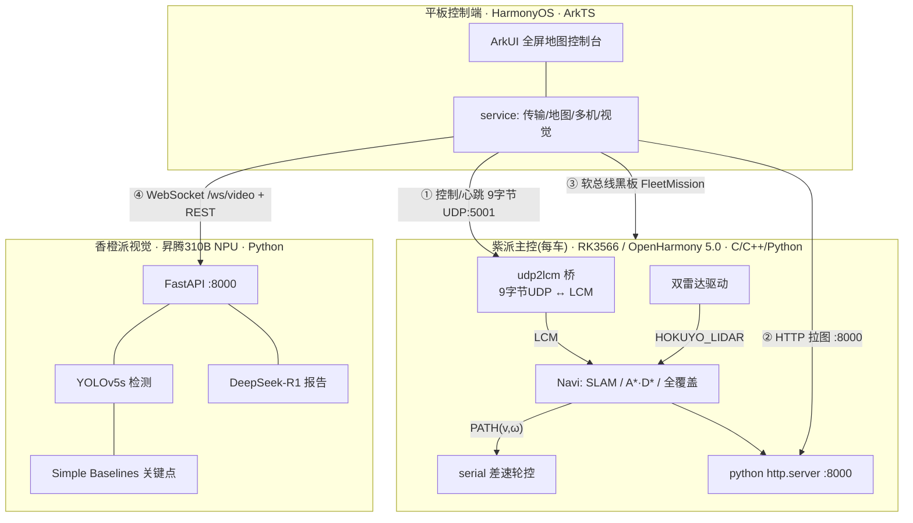
```mermaid
graph TB
  subgraph TABLET["平板控制端 · HarmonyOS · ArkTS"]
    UI["ArkUI 全屏地图控制台"]
    SVC["service: 传输/地图/多机/视觉"]
    UI --- SVC
  end
  subgraph PURPLE["紫派主控(每车) · RK3566 / OpenHarmony 5.0 · C/C++/Python"]
    BRIDGE["udp2lcm 桥<br/>9字节UDP ↔ LCM"]
    NAVI["Navi: SLAM / A*·D* / 全覆盖"]
    WHEEL["serial 差速轮控"]
    HTTP["python http.server :8000"]
    LIDAR["双雷达驱动"]
    BRIDGE -- LCM --> NAVI
    NAVI -- "PATH(v,ω)" --> WHEEL
    LIDAR -- "HOKUYO_LIDAR" --> NAVI
    NAVI --> HTTP
  end
  subgraph ORANGE["香橙派视觉 · 昇腾310B NPU · Python"]
    FAST["FastAPI :8000"]
    YOLO["YOLOv5s 检测"]
    POSE["Simple Baselines 关键点"]
    DS["DeepSeek-R1 报告"]
    FAST --- YOLO --- POSE
    FAST --- DS
  end
  SVC -- "① 控制/心跳 9字节UDP:5001" --> BRIDGE
  SVC -- "② HTTP 拉图 :8000" --> HTTP
  SVC -- "③ 软总线黑板 FleetMission" --> PURPLE
  SVC -- "④ WebSocket /ws/video + REST" --> FAST
```

**四条链路**各自承载不同性质的数据，端口和协议都不同，互不打扰：

| 链路 | 协议 | 端口 | 承载 | 性质 |
|---|---|---|---|---|
| 控制 / 心跳 | 自定义 **9 字节二进制 UDP**（大端） | 5001 | 命令下发 + 500ms 位姿心跳 | 实时、低延迟 |
| 地图传输 | HTTP（紫派 `python -m http.server`） | 8000 | 压缩图 `zipedMap.txt` / 普通图 `defultMap.txt` | 大数据、可靠 |
| 多机协同 | 鸿蒙**分布式软总线** `distributedDataObject` | — | `FleetMission` 任务黑板（协调态） | 反应式、自动同步 |
| 视觉流 | **WebSocket** + REST | 8000（香橙派） | JPEG 帧 + 读数/告警 JSON + 配置/报告 | 流式、可独立连断 |

**紫派内部**还有一层 LCM 组播总线，把 C/C++ 模块串起来：

| 信道 | 方向 | 用途 |
|---|---|---|
| `HOKUYO_LIDAR` | 雷达 → 导航 | 激光点集，供 SLAM 建图/定位 |
| `POSE` | → 导航 | 位姿输入修正定位；轮控每 15ms 反馈估算坐标 |
| `ROBOT_CONTROL` | 桥/上层 → 导航 | 功能控制指令（命令号 7/10/20/30/32/122–127） |
| `CURRENTPOSE` | 导航 → 上层 | 实时当前位姿（也是 App 心跳坐标的来源） |
| `PATH` | 导航 → 轮控 | 路径规划输出（速度、角速度） |
| `wheel_ctrl` | 桥 → 轮控 | 建图阶段移动端遥控指令 |

可以看到，UDP↔LCM 桥（udp2lcm）是连接"App 世界"和"紫派内部世界"的枢纽：它把平板下发的 9 字节命令翻译成 LCM 命令号发给导航/轮控模块，又把导航产出的位姿封装成 9 字节心跳回传平板。这种"桥"的设计让 App 完全不需要知道紫派内部用的是 LCM，只面对一个干净的 9 字节协议。

## 2.4 通信协议设计

### 2.4.1 9 字节协议的设计哲学

App 与紫派之间的全部控制和心跳，都用一个**定长 9 字节、大端字节序**的二进制包承载。字节布局如下：

```
发送 App→紫派 (9字节, 大端/网络序):
┌────┬────────┬───────┬─────────────┬─────────────┬──────┐
│byte0│ byte1  │ byte2 │  byte3-4    │  byte5-6    │byte7-8│
│命令码│方向/号 │ 速度  │ endX int16  │ endY int16  │ 保留 │
└────┴────────┴───────┴─────────────┴─────────────┴──────┘

接收 紫派→App 心跳 (9字节, 大端, 每500ms):
┌────┬───────┬─────────────┬─────────────┬─────────────┐
│byte0│ 保留  │  byte3-4 x  │  byte5-6 y  │  byte7-8 r  │
│=3带坐标│     │ 当前X int16 │ 当前Y int16 │ 朝向(度)    │
└────┴───────┴─────────────┴─────────────┴─────────────┘
```

这个看似简单的协议里藏着几个精巧的设计：

**byte0 一字节双关。** 命令码的取值是刻意对齐 ASCII 的，所以同一个 byte0 既是 App 当前的状态枚举，也是下发给紫派的命令码。例如全路径覆盖的命令码是 102，正好是字符 `'f'`（full）；强制建图是 0x6d，正好是字符 `'m'`（map）；覆盖矩形的两个对角点命令是 107/108，正好是 `'k'`/`'l'`。这样一来，紫派的命令分发代码可以直接 `switch(buffer[0])` 对着字符常量写，可读性极好；App 端也不需要在"状态"和"命令"之间做映射——它们本来就是同一个字节。

**字节按命令复用。** 9 个字节要表达十几种命令，靠的是字节复用：byte1 在遥控命令里是运动方向、在全路径选顶点命令里是顶点序号、在覆盖命令里是 robot_id；byte2 在遥控命令里是速度。最巧妙的是拉取主机地图命令（cmd105）——它要把主机的 IP 地址（四个字节）塞进 9 字节包里，于是复用了 endX/endY 两个 int16 字段的低字节，把 IP 四段打进 byte[1]、byte[2]、byte[4]、byte[6]（byte[3]、byte[5] 是 int16 高字节，恒为 0）。举个具体例子：主机 IP 是 `192.168.1.5`，那么 byte[1]=192、byte[2]=168、byte[4]=1、byte[6]=5。

**坐标单位统一。** 全系统统一约定：1 个整数单位 = 1/20 米 = 5 厘米，正好与地图栅格 1:1 对应（建图分辨率就是 0.05 米/格）；朝向 r 用度表示，范围 [-180, 180]，0 度指向 +X 方向，正角逆时针朝 +Y。这个统一约定写在契约里，三端都遵守，避免了单位换算错误。

**安全优先的看门狗。** 紫派每 500 毫秒回一帧心跳；同时它有一个 3 秒看门狗——如果 3 秒内没收到平板的任何指令，立即令轮控急停，防止失控（比如平板崩溃或网络断开时车还在跑）。对应地，平板约定至少每 1 秒发一次指令（哪怕是空指令）来保活。这个超时值在契约里明确，两端必须一致。

### 2.4.2 零配置设备发现

一个看似简单却很关键的问题是：平板怎么知道车的 IP？紫派的桥要收到第一个包才能知道平板的 IP，而平板又得先知道车的 IP 才能发包——这是一个先有鸡还是先有蛋的死循环。我们用一个专门的"发现 ping"破解它：

```mermaid
sequenceDiagram
  participant App as 平板
  participant Car as 紫派(车)
  participant Vis as 香橙派(视觉)
  App->>App: 向 255.255.255.255:5001 广播 9字节 byte0=0x06
  App-->>Car: 0x06 发现 ping
  App-->>Vis: 0x06 发现 ping
  Car-->>App: 回 9字节 [0]=0x06 [1]robotId [2]状态 [3..8]位姿
  Vis-->>App: 回 9字节 [0]=0x07 (区分视觉源)
  Note over Car: 只回包,不记clientIP/不起心跳/不武装急停
  App->>App: 按回包源IP收集设备; 收到0x07→设为视觉host
```

平板向广播地址发一个 byte0=0x06 的发现 ping，紫派收到后**只回一帧发现响应，不记录客户端、不启动心跳、不武装 3 秒急停**——这一点至关重要，否则一发广播就会让子网内所有车都进入"已连受控"状态，没被选中的车随后会因为 3 秒收不到指令而集体急停。香橙派视觉设备则回 byte0=0x07 以区分自己不是车而是视觉源。平板按回包的源 IP 收集设备，收到 0x07 就把那个 IP 设为视觉服务地址。这样一来，即使香橙派是 DHCP 动态 IP，平板扫一次也能自动定位它，再也不用硬编码 IP。

### 2.4.3 命令到 LCM 的翻译

桥模块的核心职责是把 9 字节命令翻译成紫派内部的 LCM 命令号：

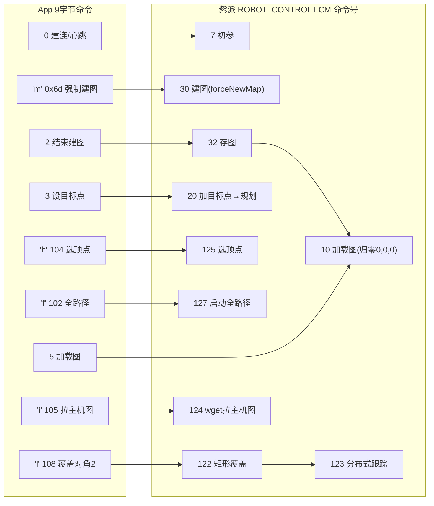
```mermaid
graph LR
  subgraph APP["App 9字节命令"]
    c0["0 建连/心跳"]
    cm["'m' 0x6d 强制建图"]
    c2["2 结束建图"]
    c3["3 设目标点"]
    c5["5 加载图"]
    cf["'f' 102 全路径"]
    ch["'h' 104 选顶点"]
    cl["'l' 108 覆盖对角2"]
    ci["'i' 105 拉主机图"]
  end
  subgraph LCM["紫派 ROBOT_CONTROL LCM 命令号"]
    L7["7 初参"]
    L30["30 建图(forceNewMap)"]
    L32["32 存图"]
    L10["10 加载图(归零0,0,0)"]
    L20["20 加目标点→规划"]
    L125["125 选顶点"]
    L127["127 启动全路径"]
    L122["122 矩形覆盖"]
    L123["123 分布式跟踪"]
    L124["124 wget拉主机图"]
  end
  c0 --> L7
  cm --> L30
  c2 --> L32 --> L10
  c3 --> L20
  c5 --> L10
  cf --> L127
  ch --> L125
  cl --> L122 --> L123
  ci --> L124
```

### 2.4.4 连接保活与看门狗时序

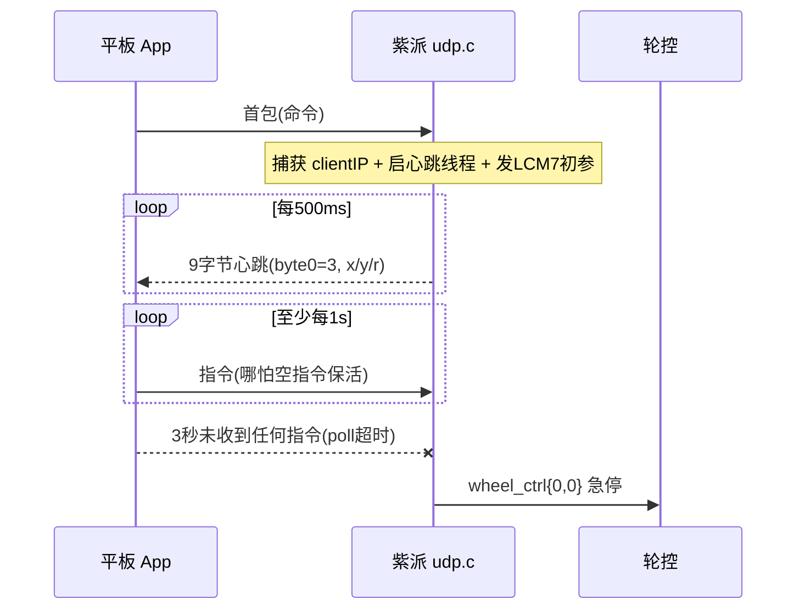
```mermaid
sequenceDiagram
  participant App as 平板 App
  participant Bridge as 紫派 udp.c
  participant Wheel as 轮控
  App->>Bridge: 首包(命令)
  Note over Bridge: 捕获 clientIP + 启心跳线程 + 发LCM7初参
  loop 每500ms
    Bridge-->>App: 9字节心跳(byte0=3, x/y/r)
  end
  loop 至少每1s
    App->>Bridge: 指令(哪怕空指令保活)
  end
  App--xBridge: 3秒未收到任何指令(poll超时)
  Bridge->>Wheel: wheel_ctrl{0,0} 急停
```

### 2.4.5 一条命令的完整旅程

把前面的协议、桥、LCM 串起来，看一条"开始导航"命令是怎么从操作员的手指走到轮子转动的，能帮助理解整个控制链路：

1. 操作员在平板地图上选好目标点、点"开始导航"。
2. 平板把目标点的屏幕坐标换算成真实世界坐标，再除以 0.05 换算成 5 厘米栅格单位，构造一个 9 字节包：byte0=3（startRoute），byte3-4=目标 X，byte5-6=目标 Y，大端写入。
3. 这个包经 UDP 发到紫派的 5001 端口。
4. 紫派的 udp.c 收到包，更新"最后收到指令的时间"（喂狗），把包交给 udp2lcm.c 的 parseCmd。
5. parseCmd 看到 byte0=3，构造一条 LCM 命令号 20（加目标点）的消息，发到 ROBOT_CONTROL 信道。
6. Navi 模块收到 LCM20，把目标点加入路径点队列，触发 A\* 规划线程。
7. A\* 在概率栅格地图上规划出一条代价最小、远离障碍的路径。
8. Navi 沿路径逐步算出当前应有的线速度 v 和角速度 ω，经 PATH 信道发给轮控。
9. 轮控把 v、ω 解算成左右轮差速，经串口下发驱动板，轮子转起来。
10. 与此同时，编码器和激光定位不断更新当前位姿，经 CURRENTPOSE 信道，再由 udp2lcm 封装成 9 字节心跳每 500 毫秒回传平板。
11. 平板收到心跳，更新车在地图上的位置和朝向，绘制轨迹，并判断是否接近目标——接近到 28 厘米内就提示"到达"。

整条链路上，App 只面对干净的 9 字节协议，完全不需要知道紫派内部用的是 LCM；紫派内部各模块只面对 LCM，完全不需要知道外面是 UDP。这种分层和"桥"的设计，让每一端都只需关心自己那一层的接口，是系统能被三人分头实现、又能顺利集成的关键。

## 2.5 关键算法设计原理

这一节是全文的技术核心，逐一讲透机器人"会建图、会走路、会看表"背后的算法原理。考虑到读者未必有机器人背景，每一个算法都先给示意图、再用大白话讲透这张图，力求"不懂代码也能看明白"。

### 2.5.0 导航算法全景：它们如何分工协作

机器人能自己走路，靠的不是一个算法，而是一整套算法像流水线一样分层协作。先看全景，再钻细节。

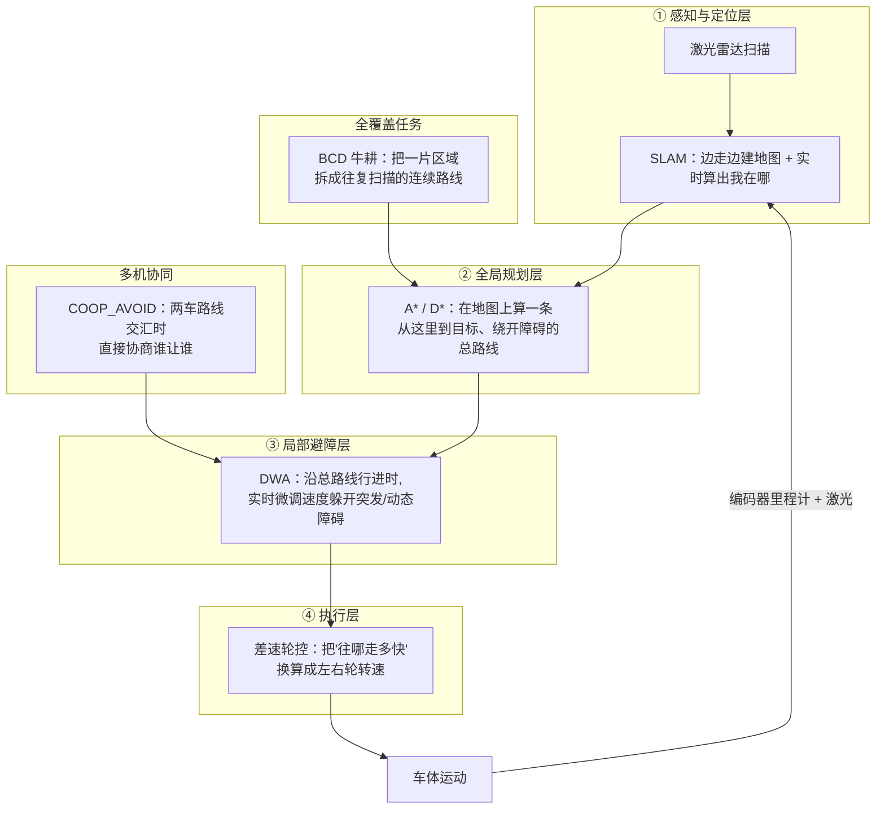
```mermaid
graph TB
  subgraph SENSE["① 感知与定位层"]
    LIDAR["激光雷达扫描"] --> SLAM["SLAM：边走边建地图 + 实时算出我在哪"]
  end
  subgraph GLOBAL["② 全局规划层"]
    SLAM --> ASTAR["A* / D*：在地图上算一条<br/>从这里到目标、绕开障碍的总路线"]
  end
  subgraph LOCAL["③ 局部避障层"]
    ASTAR --> DWA["DWA：沿总路线行进时,<br/>实时微调速度躲开突发/动态障碍"]
  end
  subgraph EXEC["④ 执行层"]
    DWA --> WHEEL["差速轮控：把'往哪走多快'<br/>换算成左右轮转速"]
  end
  WHEEL --> MOVE["车体运动"]
  MOVE -->|"编码器里程计 + 激光"| SLAM
  subgraph COVER["全覆盖任务"]
    BCD["BCD 牛耕：把一片区域<br/>拆成往复扫描的连续路线"] --> ASTAR
  end
  subgraph MULTI["多机协同"]
    COOP["COOP_AVOID：两车路线交汇时<br/>直接协商谁让谁"] --> DWA
  end
```

**这张图怎么读**：从上往下是一条"从看到走"的指挥链。第一层"感知与定位"，激光雷达不停扫描周围，SLAM 算法一边把扫到的墙拼成地图、一边实时算出"我现在在地图的哪个位置、朝哪个方向"——这是后面一切的前提，因为不知道自己在哪就没法规划路线。第二层"全局规划"，A\*（或它的动态版本 D\*）在地图上算出一条从当前位置到目标点、绕开所有已知障碍的"总路线"，相当于导航软件给你画的那条蓝线。第三层"局部避障"，DWA 算法负责在车真正沿着总路线走的时候，实时应对那些地图上没有的突发情况（比如临时出现的人或物），微调车的速度和转向把它躲开。第四层"执行"，差速轮控把上层算出的"该往哪走、走多快"翻译成左右两个轮子各自转多快。车一动，编码器和激光又把新的位置反馈回第一层，形成闭环，循环往复。右侧还有两个专门任务：做全覆盖时，BCD 牛耕算法负责把一整片区域规划成一条来回往复、不漏不重的扫描路线，再交给全局规划去执行；多机协同时，COOP_AVOID 负责在两辆车路线交汇时直接协商避让。下面把这几个算法逐一拆开细讲。

### 2.5.1 激光 SLAM 建图与定位

SLAM（同步定位与建图）

### 2.5.1 激光 SLAM 建图与定位

SLAM（同步定位与建图）要解决的是一个"先有鸡还是先有蛋"的问题：要定位就得有地图，要建图就得知道自己在哪。紫派的 SLAM 全部自研，核心思路是"扫描匹配 + 概率栅格 + 粒子滤波"：


```mermaid
graph TB
  L["激光点云 HOKUYO_LIDAR"] --> SM["多分辨率扫描匹配<br/>由粗到细搜最佳位姿"]
  SM --> GE["高斯估计 (协方差/置信度)"]
  GE --> PF["KLD 自适应粒子滤波<br/>动态粒子数,抑制累计漂移"]
  PF --> POSE["CURRENTPOSE 实时位姿"]
  SM --> MAP["概率栅格更新 (占据概率, 0.05m/格)"]
  MAP --> SAVE["saveProbMap → defultMap.txt + 同源 zipedMap.txt"]
  POSE --> HB["UDP 心跳回传 App"]
```

**多分辨率扫描匹配**（`MultiResolutionScanMatcher`）是定位的主力。它把当前激光帧和已经建好的地图，在由粗到细的多个分辨率层级上做相关匹配：先在粗分辨率上快速锁定大致位姿（搜索范围大但格子粗、计算快），再逐级细化到精确位姿。这种"由粗到细"的策略兼顾了搜索范围和精度，比单分辨率穷举快得多。

**高斯估计**（`gaussestimator/`）在扫描匹配的基础上估计位姿的不确定度（协方差），为后续滤波提供置信度信息。

**KLD 自适应粒子滤波**（`particlefilter/KLD`）维护一组代表位姿分布的粒子。它的"自适应"体现在：用 KL 散度来动态决定需要多少个粒子——位姿很确定时用少量粒子（省算力），位姿不确定时自动增加粒子（保精度）。这有效抑制了里程计随时间累积的漂移。

**概率栅格**（`map/MapServer`、`Gridmap`）是地图的存储形式：把空间切成 0.05 米的方格，每格维护一个"被占据"的概率（占据上限 0.9、下限 0.2）。激光每扫到一帧，就更新经过的格子（降低占据概率）和命中的格子（提高占据概率）。建图完成后，`saveProbMap` 把概率栅格落盘成地图文件。用概率而非简单的"占据/空闲"二值，好处是能融合多帧观测、抑制单帧噪声——一个格子偶尔被误测为障碍不会立刻翻转，要多帧一致才会确信，这让地图更干净、更稳定。

这里值得说明一下为什么扫描匹配能定位。机器人不知道自己精确在哪，但它知道大概在哪（来自上一时刻的位姿加里程计推算）。扫描匹配就是在这个"大概位置"附近搜索一个小范围，把当前这一帧激光"贴"到已有地图上，找到贴得最严丝合缝的那个位姿——激光点都落在地图的墙上、不穿墙、不悬空，就说明位姿对了。多分辨率的意义在于：如果直接在精细分辨率上搜，搜索空间太大、太慢；先在粗分辨率上快速圈定大致区域，再在精细分辨率上精修，既快又准。这套自研的扫描匹配加粒子滤波方案，功能上对标 ROS 生态里的 gmapping/amcl，但每一行都是自己实现、可控可调的。

为了让"扫描匹配怎么定位"更直观，下面这张图展示它"由粗到细"的搜索过程：

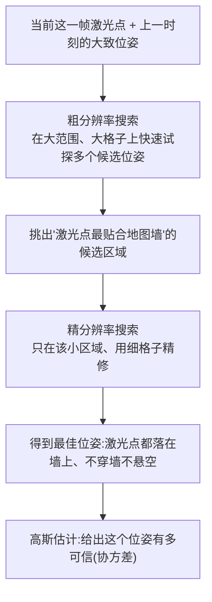
```mermaid
flowchart TB
  IN["当前这一帧激光点 + 上一时刻的大致位姿"] --> COARSE["粗分辨率搜索<br/>在大范围、大格子上快速试探多个候选位姿"]
  COARSE --> PICK1["挑出'激光点最贴合地图墙'的候选区域"]
  PICK1 --> FINE["精分辨率搜索<br/>只在该小区域、用细格子精修"]
  FINE --> BEST["得到最佳位姿:激光点都落在墙上、不穿墙不悬空"]
  BEST --> COV["高斯估计:给出这个位姿有多可信(协方差)"]
```

**这张图怎么读**：机器人虽然不知道自己精确在哪，但根据上一刻的位置和轮子转了多少，能猜出一个"大概位置"。扫描匹配做的就是在这个大概位置附近，试着把当前这一帧激光"贴"到已有地图上，找哪个位姿贴得最严丝合缝——所谓贴合，就是激光打到的点都正好落在地图的墙上，不穿墙、也不悬在空中。如果直接在最精细的尺度上一个一个试，候选太多、太慢；所以先在"粗尺度"（大格子、大范围）上快速圈出大致对的区域，再在这个小区域里用"细尺度"精修，又快又准。最后高斯估计还会给出"这次定位有多可信"，供下一步的粒子滤波参考。

而粒子滤波，则是用来对抗"误差越积越多"的问题：

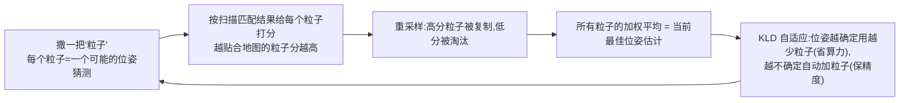
```mermaid
graph LR
  P0["撒一把'粒子'<br/>每个粒子=一个可能的位姿猜测"] --> W["按扫描匹配结果给每个粒子打分<br/>越贴合地图的粒子分越高"]
  W --> R["重采样:高分粒子被复制,低分被淘汰"]
  R --> EST["所有粒子的加权平均 = 当前最佳位姿估计"]
  EST --> KLD["KLD 自适应:位姿越确定用越少粒子(省算力),<br/>越不确定自动加粒子(保精度)"]
  KLD --> P0
```

**这张图怎么读**：机器人的轮子里程计会随时间慢慢积累误差（走得越久越不准），光靠它定位会越漂越远。粒子滤波的思路很形象：同时撒出一大把"粒子"，每个粒子代表一个"我可能在这儿、朝这个方向"的猜测；然后用激光扫描匹配的贴合程度给每个粒子打分，贴合得好的粒子分高；接着"重采样"——把高分粒子多复制几份、把低分粒子淘汰掉，于是粒子群慢慢向真实位姿聚拢；所有粒子的加权平均就是当前的最佳位姿。本项目用的是"KLD 自适应"版本：当大家都很确定位姿时（粒子都挤在一起）就用很少的粒子以节省算力，当位姿不确定时（粒子散开）就自动增加粒子以保住精度。这样既准又省，有效压住了里程计的累计漂移。

地图文件的格式（首行 7 个值）是经过和紫派逐字段对账确认的：

| 字段 | range | resolution | height | width | metersPerPixel | x0 | y0 |
|---|---|---|---|---|---|---|---|
| 位置 | [0] | [1] | **[2]=行数** | **[3]=列数** | [4]≈0.05 | [5] | [6] |
| 含义 | 量程 | 分辨率 | 栅格行数 | 栅格列数 | 每格米 | 最小角世界X(可负) | 最小角世界Y |

数据区是空格分隔的 `-1`（障碍）/`0`（空旷）/`2`（已覆盖）。世界坐标到栅格坐标的换算是 `grid = (world − x0) / metersPerPixel`。这里有一个真机踩过的坑值得记录：行数、列数在首行的第 3、4 个位置，**绝不能"取末两个值"**——末两个是 x0/y0（栅格最小角的世界坐标偏移，常为负数）。早期 App 误取末两个当行列，结果把负偏移当成了地图尺寸，渲染出一张"空气图"。这个 bug 的定位和修复，正是得益于我们对地图格式的逐字段对账。

**强制重建语义。** 还有一个经真机定位的关键接口约定：紫派的 cmd0（早期 App 的"开始建图"）在已经有地图或正在导航时，会被 `Navi.createMap` 直接忽略、沿用旧图。现象是：开始建图后摇杆在旧图上定位，导致漂移，结束建图存的还是旧图，平板反复拉到同一张旧图。根因是接口语义没对齐。解决办法是 App"开始建图"改发 `'m'`/0x6d（`forceNewMap=true`），它会清空旧图、旧路径、旧覆盖产物，从头开始建。这个语义已写入契约，避免后人再踩。建图的状态机如下：

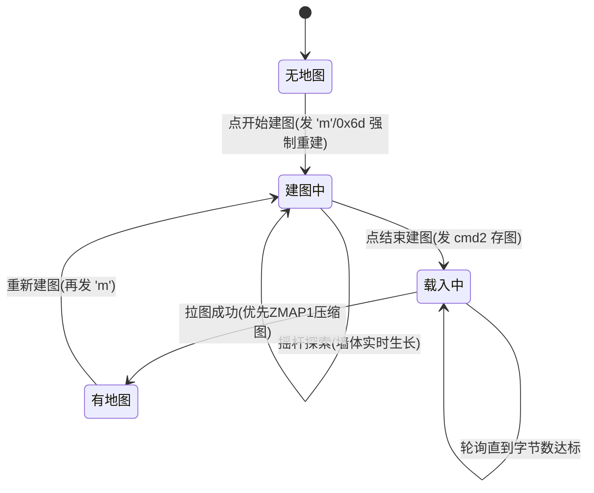
```mermaid
stateDiagram-v2
  [*] --> 无地图
  无地图 --> 建图中: 点开始建图(发 'm'/0x6d 强制重建)
  建图中 --> 建图中: 摇杆探索(墙体实时生长)
  建图中 --> 载入中: 点结束建图(发 cmd2 存图)
  载入中 --> 有地图: 拉图成功(优先ZMAP1压缩图)
  载入中 --> 载入中: 轮询直到字节数达标
  有地图 --> 建图中: 重新建图(再发 'm')
```

### 2.5.2 A\* / D\* 路径规划

有了地图，导航要解决的是"从当前位置到目标点，怎么走一条安全的路"。紫派的全局规划器 `CAstar`（`Navi/planner/Astarplanner`）实现了 A\*、D\* 和 BFS 三种搜索：

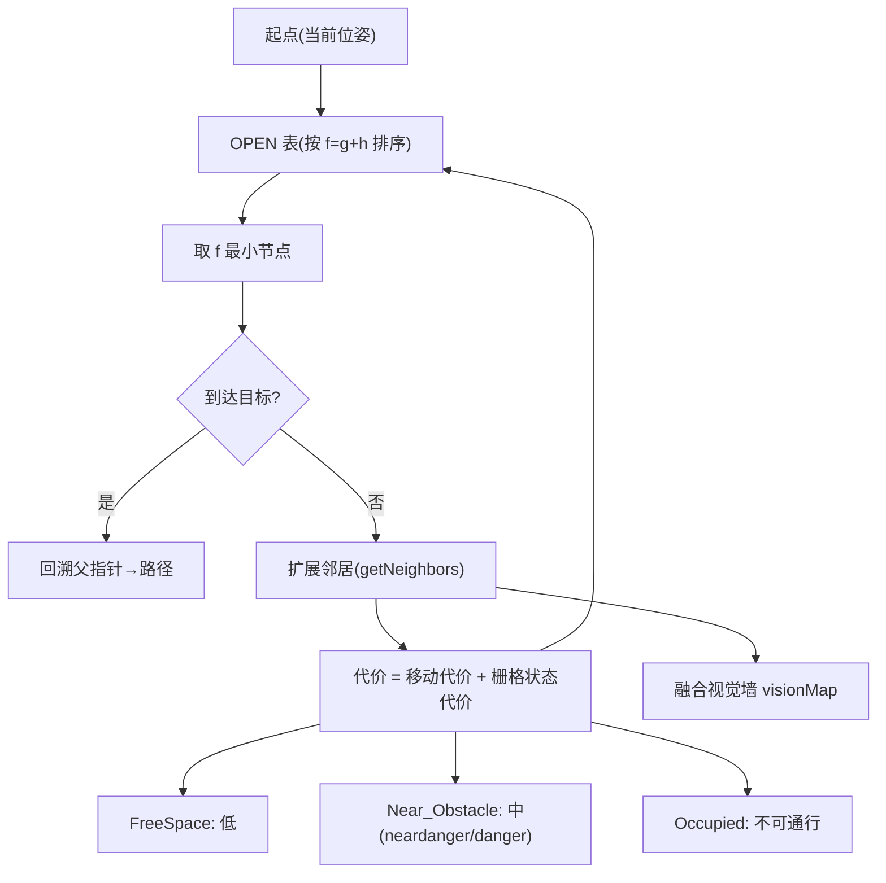
```mermaid
graph TB
  START["起点(当前位姿)"] --> OPEN["OPEN 表(按 f=g+h 排序)"]
  OPEN --> POP["取 f 最小节点"]
  POP --> GOAL{"到达目标?"}
  GOAL -->|是| PATH["回溯父指针→路径"]
  GOAL -->|否| NB["扩展邻居(getNeighbors)"]
  NB --> COST["代价 = 移动代价 + 栅格状态代价"]
  COST --> C1["FreeSpace: 低"]
  COST --> C2["Near_Obstacle: 中(neardanger/danger)"]
  COST --> C3["Occupied: 不可通行"]
  NB --> VIS["融合视觉墙 visionMap"]
  COST --> OPEN
```

A\* 的基本框架是大家熟悉的：维护一个按 `f = g + h`（g 是从起点到当前的实际代价，h 是当前到目标的启发式估计）排序的 OPEN 表，每次取 f 最小的节点扩展，直到到达目标，再回溯父指针得到路径。本作品在此基础上有几个工程化的设计：

- **代价分级避障。** 栅格不是简单的"可走/不可走"二值，而是分成 `FreeSpace`（空旷）、`Near_Obstacle`（近障碍）、`Occupied`（占据）几级，并赋予不同代价（`heighcost`、`neardanger`、`danger`）。这样规划出的路径会**主动远离障碍**走中间，而不是贴着墙根走——这对实际行驶的安全性很重要。
- **机器人半径膨胀。** 通过 `SetConfig(radius)` 把机器人的物理尺寸考虑进去，对障碍做膨胀，避免规划出"理论可过、实际撞墙"的路径。
- **视觉墙融合。** 把视觉识别到的障碍注入 `visionMap`，和激光地图联合参与规划——激光看不到的玻璃、悬空障碍，视觉可以补上。
- **D\* 动态重规划。** 当环境动态变化（比如覆盖探测过程中）时，D\* 能在已有搜索结果的基础上增量重规划，比每次从头 A\* 高效。

到达判定（在 App 侧镜像实现）用的是栅格距离平方：当车的位姿与目标点的栅格距离平方 ≤ 32 cell²（即 √32 ≈ 5.66 格 ≈ 28 厘米）时，判定为到达。这个阈值对照了旧系统的经验值。

**A\* 到底在干什么（大白话版）**：可以把 A\* 想象成一个聪明的探路人。他站在起点，手里有一张评分表，对每一个还没走但能走到的格子打一个分 `f = g + h`：`g` 是"从起点走到这个格子已经花了多少代价"，`h` 是"从这个格子直线估计还要多远才能到目标"。他每次都挑分数最低（最有希望）的格子往前探一步，把它周围的邻居加进评分表，如此反复，直到探到目标，再顺着"我是从哪个格子过来的"指针一路回溯，就得到整条路径。`g+h` 这个评分让他既不盲目乱走（靠 `h` 朝目标使劲），又能记住已付出的代价（靠 `g` 不走冤枉路），所以 A\* 能又快又稳地找到最优路径。本项目还给"贴近障碍的格子"额外加分（提高代价），所以探路人会自然地选择走在离墙远一点的中间地带，更安全。

**D\* 动态重规划：路上情况变了怎么办**：A\* 适合"一次性算好一条路"，但如果走到一半发现地图变了（探测到新障碍、或覆盖过程中环境更新），从头再算一遍 A\* 就太浪费了。D\* 是 A\* 的"动态升级版"，它能在已有计算结果的基础上，只对受影响的那一小片区域做增量修正，快速给出新路线。

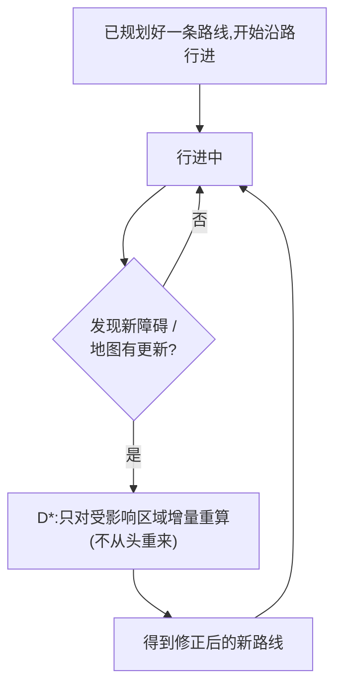
```mermaid
flowchart TB
  PLAN["已规划好一条路线,开始沿路行进"] --> WALK["行进中"]
  WALK --> CHK{"发现新障碍 /<br/>地图有更新?"}
  CHK -->|否| WALK
  CHK -->|是| LOCAL["D*:只对受影响区域增量重算<br/>(不从头重来)"]
  LOCAL --> NEW["得到修正后的新路线"]
  NEW --> WALK
```

**这张图怎么读**：车沿着已规划的路线走，一边走一边检查有没有冒出新障碍或地图更新。没有变化就继续走；一旦发现变化，D\* 不会推倒重来，而是只针对被影响的那一小块重新计算、快速打补丁，得到一条修正后的路线，然后继续前进。这种"增量修正"让机器人在动态变化的环境里既能及时避让、又不会因为频繁全局重算而卡顿。

**DWA 局部避障：应对地图上没有的突发障碍**：全局规划（A\*/D\*）解决的是"大方向怎么走"，但现场随时可能冒出地图上没有的东西——临时走过的人、挪动的设备、另一台车。这要靠 DWA（动态窗口法）在执行层做实时的局部避障。

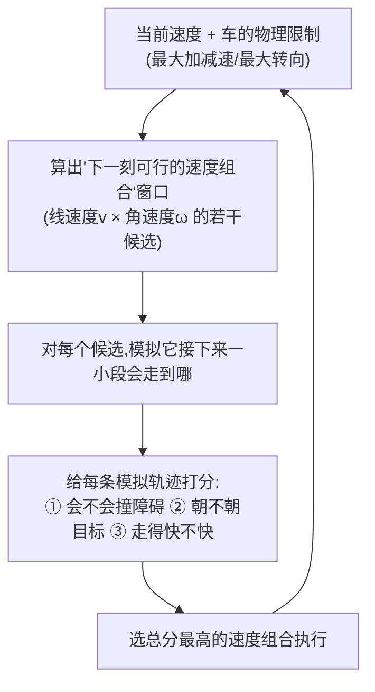
```mermaid
graph TB
  CUR["当前速度 + 车的物理限制<br/>(最大加减速/最大转向)"] --> WIN["算出'下一刻可行的速度组合'窗口<br/>(线速度v × 角速度ω 的若干候选)"]
  WIN --> SIM["对每个候选,模拟它接下来一小段会走到哪"]
  SIM --> SCORE["给每条模拟轨迹打分:<br/>① 会不会撞障碍 ② 朝不朝目标 ③ 走得快不快"]
  SCORE --> PICK["选总分最高的速度组合执行"]
  PICK --> CUR
```

**这张图怎么读**：DWA 的名字"动态窗口"指的是——在每一个瞬间，车不可能突然变到任意速度，它只能在当前速度附近、受物理限制（最大加速度、最大转向能力）允许的一小"窗口"范围内挑下一步的速度。DWA 在这个窗口里采样若干个"线速度 + 角速度"的候选组合，对每个组合模拟"如果按这个速度走，接下来一小段会画出什么轨迹"，再给每条轨迹打分：会撞障碍的直接否决，朝目标方向的加分，走得快的加分；最后选总分最高的速度组合真正执行。下一刻再重新算一遍。这样车就能在沿着全局路线大方向前进的同时，灵活地实时绕开那些突然出现、地图上根本没有的障碍。当 A\* 规划失败、连续无路径、或 DWA 判定前方不可达时，在多机场景下还会触发后面要讲的车间协同避障（COOP_AVOID）。

### 2.5.3 全覆盖路径规划（算法亮点）

全覆盖要解决的是"把一块区域一寸不漏地扫一遍"，这是巡检和清扫的核心能力。本作品采用**两套算法 + 优雅降级**的策略：

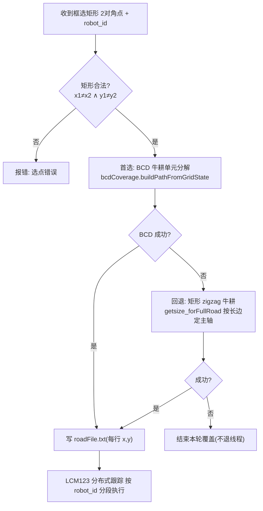
```mermaid
flowchart TB
  S["收到框选矩形 2对角点 + robot_id"] --> CHK{"矩形合法?<br/>x1≠x2 ∧ y1≠y2"}
  CHK -->|否| ERR["报错: 选点错误"]
  CHK -->|是| BCD["首选: BCD 牛耕单元分解<br/>bcdCoverage.buildPathFromGridState"]
  BCD --> OK1{"BCD 成功?"}
  OK1 -->|是| WRITE["写 roadFile.txt(每行 x,y)"]
  OK1 -->|否| ZIG["回退: 矩形 zigzag 牛耕<br/>getsize_forFullRoad 按长边定主轴"]
  ZIG --> OK2{"成功?"}
  OK2 -->|是| WRITE
  OK2 -->|否| FAIL["结束本轮覆盖(不退线程)"]
  WRITE --> TRACK["LCM123 分布式跟踪 按 robot_id 分段执行"]
```

**首选算法：BCD 牛耕单元分解（Boustrophedon Cellular Decomposition）。** "牛耕"形象地描述了它的运动模式——像牛耕地一样来回往复扫描。BCD 的核心思想是：先把框选的矩形区域按照内部障碍切成若干个**不含障碍的子单元**（cell），然后在每个子单元内部做牛耕往复（一条扫描线扫到底、平移一个刷宽、反向再扫），子单元之间用 A\* 连接起来，最终拼成一条覆盖整个区域的连续路径。这样即使区域内部有障碍（柱子、设备），也能保证覆盖完整且路径连续。

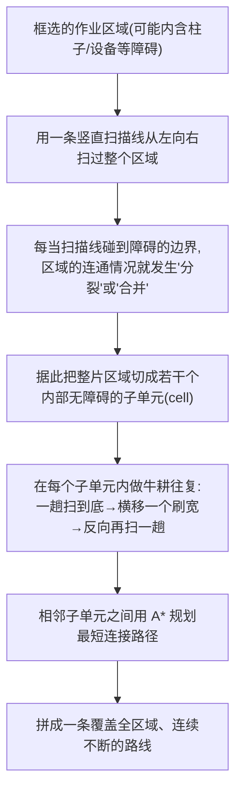
```mermaid
flowchart TB
  A["框选的作业区域(可能内含柱子/设备等障碍)"] --> B["用一条竖直扫描线从左向右扫过整个区域"]
  B --> C["每当扫描线碰到障碍的边界,<br/>区域的连通情况就发生'分裂'或'合并'"]
  C --> D["据此把整片区域切成若干个内部无障碍的子单元(cell)"]
  D --> E["在每个子单元内做牛耕往复:<br/>一趟扫到底→横移一个刷宽→反向再扫一趟"]
  E --> F["相邻子单元之间用 A* 规划最短连接路径"]
  F --> G["拼成一条覆盖全区域、连续不断的路线"]
```

**这张图怎么读**：想象有一面竖直的"扫描线"从作业区域的最左边匀速扫到最右边。如果区域里没有障碍，那从头到尾连通情况都不变；但只要扫描线碰到一根柱子或一台设备的边缘，区域就会在那里"裂成两半"或"重新合并"——BCD 正是利用这些"连通情况发生变化"的位置，把整片区域切成几块**内部干干净净、没有障碍**的子单元。每一块子单元内部是规整的，就可以放心地来回牛耕（扫一趟、横移一个刷宽、反向再扫一趟，像耕地一样）；扫完一块再用 A\* 走最短路连到下一块。这样拼起来，就是一条既覆盖了全部区域（连障碍周围的边角也照顾到）、又连续不断的路线。相比之下，简单的矩形牛耕遇到中间的柱子要么撞上去、要么只能整行跳过留下盲区，而 BCD 通过"先分解再分别覆盖"巧妙地解决了带障碍区域的完整覆盖问题。

**回退算法：矩形 zigzag 牛耕。** 如果 BCD 因为某些原因失败，系统自动回退到更简单的矩形牛耕：比较矩形的横边长和纵边长，谁长就以谁为主轴方向做规则的往复扫描；扫描线之间的间距（刷宽）由机器人的安全半径 `safesize` 和最小尺寸 `minsize` 决定。这个"优雅降级"保证了"总能扫"，不会因为复杂情况完全失败。

**可选算法：最小生成树（MST）。** 单车全路径模式下，操作者还可以选择"最小生成树"算法。App 通过命令 102 的 byte1 传算法号（0 牛耕 / 1 最小生成树），紫派据此选择不同的覆盖路径生成逻辑。

覆盖线程（`CoverageThreadProc`）的执行逻辑可以用伪代码概括：

```text
等待 算法号 algNum 就绪
清空上一轮覆盖路径队列
确定房间边界:
    自动方式 → autoGetRoomBoundary (凸包算法圈定)
    手动方式 → manualGetRoomBoundary (操作员选点框定)
初始化覆盖状态图 initCoverageState → 写 tmpcoverageMap.txt
当前位姿入路径队列
while 未完成覆盖 (isFinished == false):
    选定探测方向 direction ∈ {前0, 后1, 左2, 右3}
    用 D* 在该方向 detectFrontPlan 规划探测路径
    沿规划路径牛耕行进, 标记沿途格子为已覆盖
输出最终覆盖图 coverageMap.txt
覆盖路径写入 roadFile.txt (每行一个 "x,y" 栅格点)
```

覆盖路径文件 `roadFile.txt` 是紫派内部产物，每行一个 `x,y`（5 厘米栅格单位）。在多机协同时，`robot_id=0`（主车）走路径的前半段，`robot_id=1`（子车）走后半段并逆序，从而两车各扫一半、互不重叠。

为什么要"BCD 优先、牛耕兜底"这样设计？因为现实区域里常有障碍（柱子、设备），简单的矩形牛耕遇到障碍要么撞、要么漏。BCD 的价值就在于它能把带障碍的区域分解成若干干净的子单元分别覆盖、再连起来，覆盖更完整。但 BCD 实现复杂、在某些退化情形下可能生成失败，这时如果直接报错、什么都不扫，体验就太差了。所以我们让它在 BCD 失败时自动回退到最简单可靠的矩形牛耕——宁可路径不那么优、也要保证"总能扫起来"。这种"首选优雅方案、兜底可靠方案"的优雅降级思想，在工程上比"只押一个方案"稳健得多。刷宽（扫描线间距）取机器人安全半径量级（约 40 厘米），既保证相邻两趟有重叠不漏扫，又不会因为太密而浪费时间。覆盖进度则在 App 侧实时估算：每收到一次心跳位姿，就在该位置周围一个圆盘范围内"盖章"标记已覆盖的格子，已覆盖格子数乘以单格面积（0.0025 平方米）就是已覆盖面积，除以区域总格数就是进度百分比，实时显示在地图旁的进度卡上。

### 2.5.4 差速轮控与里程闭环

轮控是把"想往哪走"变成"轮子怎么转"的执行层：

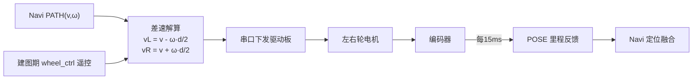
```mermaid
graph LR
  PATH["Navi PATH(v,ω)"] --> SOLVE["差速解算<br/>vL = v - ω·d/2<br/>vR = v + ω·d/2"]
  WCTRL["建图期 wheel_ctrl 遥控"] --> SOLVE
  SOLVE --> SERIAL["串口下发驱动板"]
  SERIAL --> MOTOR["左右轮电机"]
  MOTOR --> ENC["编码器"]
  ENC -->|"每15ms"| POSE["POSE 里程反馈"]
  POSE --> NAVI["Navi 定位融合"]
```

轮控模块（`serial/`）订阅两个来源的命令：导航产出的 `PATH`（线速度 v 和角速度 ω）和建图阶段的 `wheel_ctrl`（手动遥控）。它用差速驱动模型把 v 和 ω 解算成左右轮的速度：左轮 `vL = v − ω·d/2`、右轮 `vR = v + ω·d/2`（d 是轮距）。解算结果经串口下发给电机驱动板。同时，电机编码器每 15 毫秒经 `POSE` 信道回传一次位姿估计，与 SLAM 的激光定位互补，形成里程闭环——激光定位准但慢，里程计快但会漂移，两者融合取长补短。

### 2.5.5 边缘视觉读数

视觉子系统要解决的是"看懂一块指针式仪表读数是多少"。这在香橙派的昇腾 NPU 上分两级流水线完成：

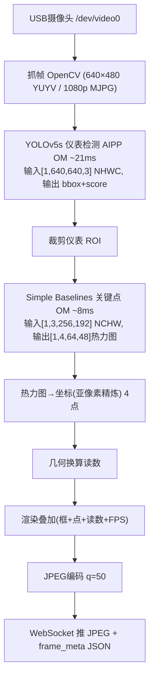
```mermaid
flowchart TB
  CAM["USB摄像头 /dev/video0"] --> GRAB["抓帧 OpenCV (640×480 YUYV / 1080p MJPG)"]
  GRAB --> YOLO["YOLOv5s 仪表检测 AIPP OM ~21ms<br/>输入[1,640,640,3] NHWC, 输出 bbox+score"]
  YOLO --> ROI["裁剪仪表 ROI"]
  ROI --> KP["Simple Baselines 关键点 OM ~8ms<br/>输入[1,3,256,192] NCHW, 输出[1,4,64,48]热力图"]
  KP --> REFINE["热力图→坐标(亚像素精炼) 4点"]
  REFINE --> READ["几何换算读数"]
  READ --> RENDER["渲染叠加(框+点+读数+FPS)"]
  RENDER --> JPEG["JPEG编码 q=50"]
  JPEG --> WS["WebSocket 推 JPEG + frame_meta JSON"]
```

**第一级：YOLOv5s 仪表检测。** 先用一个 YOLOv5s 目标检测模型，在整幅画面里框出仪表的位置（输出检测框和置信度）。这个模型是成员自己采集仪表图像、自己标注、自己训练的，经昇腾 ATC 工具转成 OM 格式在 NPU 上原生推理，约 21 毫秒一帧。

**第二级：Simple Baselines 关键点检测。** 把检测到的仪表区域裁剪出来（ROI），送进一个关键点检测模型（Simple Baselines，输出热力图），定位四个关键点：圆心（center，表盘旋转轴心）、指针尖（pointer_tip）、零刻度（zero_mark）、满刻度（full_mark）。热力图再经亚像素精炼得到精确坐标，约 8 毫秒一帧。

**几何法换算读数。** 有了四个关键点，读数就是一个纯几何问题：以圆心为原点，用 `atan2(-y, x)` 把像素坐标转到数学坐标系，然后计算指针相对零刻度扫过的顺时针角度，除以满刻度相对零刻度的顺时针角度，得到占比，再乘以满量程：

```
reading = CW(zero → pointer) / CW(zero → full) × 满量程     # 占比 clamp 到 [0,1]
```

这个几何法的好处是**泛化性强**——它不需要为每一种仪表单独训练一个分类模型，只要能定位这四个点，任何圆盘指针表都能读。**多表支持**也做了优化：把 YOLO 置信度阈值降到 0.10，再加上长宽比（0.6–1.7）和面积（小于全图 85%）过滤，剔除跨表大框和残框等误检，从而能在一幅画面里同时检测多块表并各自读数。实测一幅画面里两块压力表都能正确检出并分别读数。端到端性能：YOLO 21ms + 关键点 8ms + 预后处理 3ms + JPEG 编码 2ms ≈ 34 毫秒，约 29 FPS。

**模型从数据到部署全自主。** 这套视觉能力特别值得强调的一点是：它不是调用现成的商用识别 API，也不是直接拿别人的预训练模型，而是**成员自己采集数据集、自己标注、自己训练**的。具体流程是：先用摄像头在不同光照、角度、距离下采集大量工业仪表图像；然后人工标注两类标签——给 YOLO 标注仪表的检测框，给关键点模型标注圆心、指针尖、零刻度、满刻度四个点的坐标；接着分别训练 YOLOv5s 检测模型和 Simple Baselines 关键点模型（另备了 RTMPose 作为关键点的备选方案）；最后用华为的 ATC 工具把训练好的模型转成昇腾的 OM 格式，部署到 NPU 上原生推理。整条链路——数据、标注、训练、转换、部署——没有任何一环依赖外部黑盒，这是"自主可控"在 AI 层面的彻底体现。也正因为模型是自己训的，才能针对实际仪表的特点做阈值、过滤、多表等一系列调优。

### 2.5.6 多机协同：软总线黑板模型

多机协同要解决的是"让多辆车共享地图、分工作业、互不打架"。本作品的多机协同**直接构建在华为鸿蒙的分布式软总线之上**，用它原生的"分布式数据对象（distributedDataObject，简称 DDO）"做一块所有设备共享的"任务黑板"。在讲黑板之前，先把它脚下的地基——分布式软总线——讲清楚，这也是本作品最迎合鸿蒙生态、最具特色的一环。

#### 软总线是什么、怎么工作（原理示意）

分布式软总线是鸿蒙操作系统的一项**系统级能力**。一句话概括它的作用：让原本各自独立的多台设备（平板、车 A、车 B），在用户和程序看来"融合成一台超级设备"，彼此之间像访问本机内存一样方便地共享数据、互相调用能力——而开发者**完全不用自己写 IP 管理、socket 连接、消息协议、断线重连**这些底层通信代码。

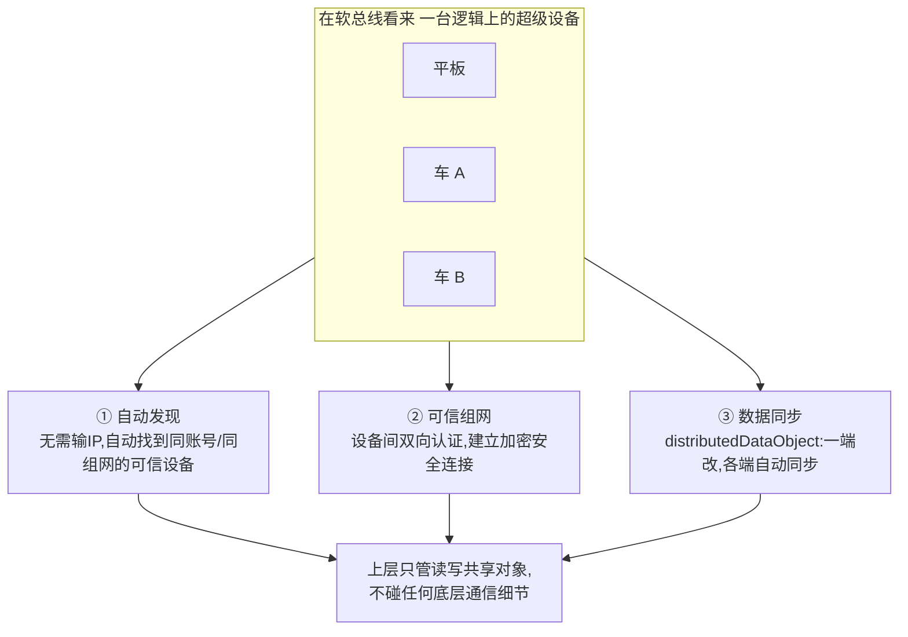
```mermaid
graph TB
  subgraph SUPER["在软总线看来 一台逻辑上的超级设备"]
    direction LR
    TAB["平板"]
    C1["车 A"]
    C2["车 B"]
  end
  SUPER --> L1["① 自动发现<br/>无需输IP,自动找到同账号/同组网的可信设备"]
  SUPER --> L2["② 可信组网<br/>设备间双向认证,建立加密安全连接"]
  SUPER --> L3["③ 数据同步<br/>distributedDataObject:一端改,各端自动同步"]
  L1 --> APP["上层只管读写共享对象,<br/>不碰任何底层通信细节"]
  L2 --> APP
  L3 --> APP
```

**这张图怎么读**：上方框里的平板、车 A、车 B，在分布式软总线的撮合下，被虚拟成"一台超级设备"。软总线为它们提供三层基础能力——第一层"自动发现"：设备不需要手工输 IP，软总线会自动找到同一账号或同一可信组网内的其它设备；第二层"可信组网"：设备之间先做双向身份认证，再建立加密的安全连接，保证"只有自己人能加进来"；第三层"数据同步"：这是最关键的一层，它提供了一种叫**分布式数据对象**的东西。有了这三层，上层应用（平板和车）就只需要专心读写那个共享对象，底层那些通信的脏活累活全被软总线接管了。

#### 分布式数据对象（DDO）：一块所有设备共享的"白板"

分布式数据对象可以理解成**一块所有设备都能看到、都能写的白板**，类似多人在线协作文档：任何一台设备改了白板上的某个内容，**其它所有设备会自动、实时地收到这个变化**（触发一个"内容变了"的回调），不需要谁主动去问"有没有更新"。本作品正是用它来承载多机协同的全部协调状态。要让多台设备共享同一块白板，有两个前提：所有设备的应用**包名必须相同**（本作品统一为 `com.example.carapp`），并且都**加入同一个会话**。

#### 任务黑板 FleetMission：把协同变成"读写白板"

本作品在 DDO 之上定义了一块叫 **FleetMission** 的任务黑板，把多机协同从"互相远程调用"彻底简化成了"读写共享白板"：

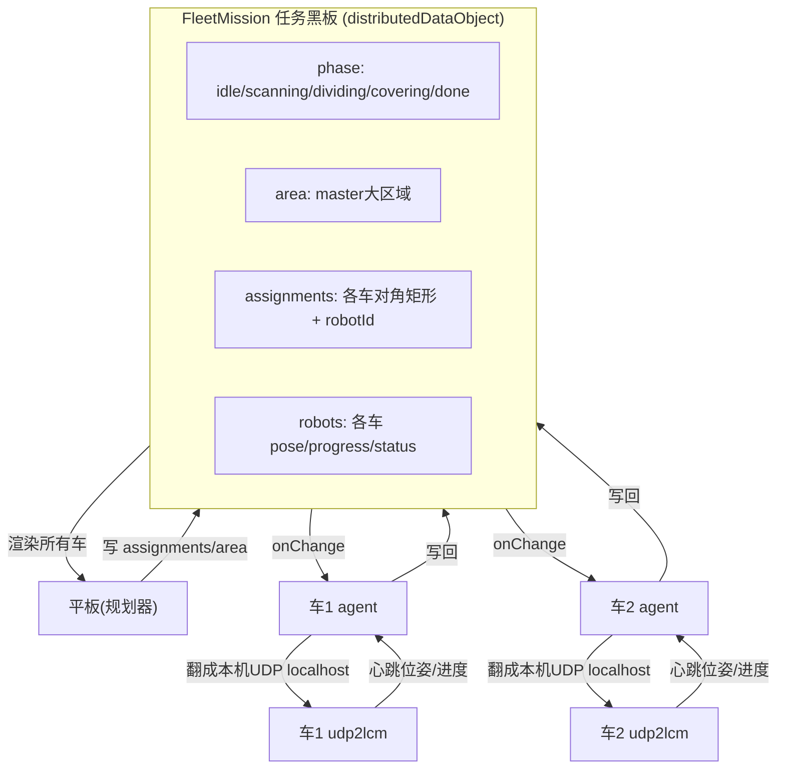
```mermaid
graph TB
  subgraph BB["FleetMission 任务黑板 (distributedDataObject)"]
    P["phase: idle/scanning/dividing/covering/done"]
    AR["area: master大区域"]
    AS["assignments: 各车对角矩形 + robotId"]
    RB["robots: 各车 pose/progress/status"]
  end
  TABLET["平板(规划器)"] -->|"写 assignments/area"| BB
  BB -->|"onChange"| AG1["车1 agent"]
  BB -->|"onChange"| AG2["车2 agent"]
  AG1 -->|"翻成本机UDP localhost"| CAR1["车1 udp2lcm"]
  AG2 -->|"翻成本机UDP localhost"| CAR2["车2 udp2lcm"]
  CAR1 -->|"心跳位姿/进度"| AG1 -->|"写回"| BB
  CAR2 -->|"心跳位姿/进度"| AG2 -->|"写回"| BB
  BB -->|"渲染所有车"| TABLET
```

所有节点（平板和各车的 agent）常驻加入同一个分布式数据对象会话，共享一块叫 `FleetMission` 的任务黑板。黑板上有任务阶段（phase）、主车扫出的大区域（area）、各车的子区域分配（assignments，每个是一个对角矩形加 robot_id）、各车的实时状态（robots，含位姿、进度、状态）。协同就是"谁改谁广播、其余端响应"：平板做规划，往黑板写子区域分配；各车的 agent 监听到属于自己的任务，就翻成本机 UDP 命令下发给本车；各车的心跳位姿和进度又经 agent 写回黑板，平板据此实时渲染所有车。整个过程没有"远程调用"，只有"共享状态的读写"。

协同覆盖的完整时序如下：

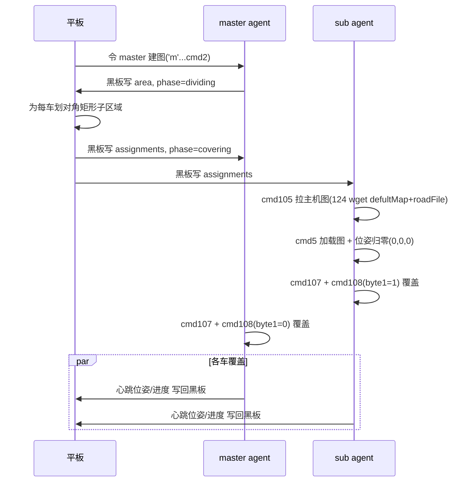
```mermaid
sequenceDiagram
  participant T as 平板
  participant Mz as master agent
  participant Sz as sub agent
  T->>Mz: 令 master 建图('m'...cmd2)
  Mz->>T: 黑板写 area, phase=dividing
  T->>T: 为每车划对角矩形子区域
  T->>Mz: 黑板写 assignments, phase=covering
  T->>Sz: 黑板写 assignments
  Sz->>Sz: cmd105 拉主机图(124 wget defultMap+roadFile)
  Sz->>Sz: cmd5 加载图 + 位姿归零(0,0,0)
  Sz->>Sz: cmd107 + cmd108(byte1=1) 覆盖
  Mz->>Mz: cmd107 + cmd108(byte1=0) 覆盖
  par 各车覆盖
    Mz->>T: 心跳位姿/进度 写回黑板
    Sz->>T: 心跳位姿/进度 写回黑板
  end
```

这里有两个关键设计：

**坐标系按构造对齐。** 多机协同最棘手的问题是各车的坐标系怎么统一。一般做法需要全局重定位（让子车在地图里找到自己），很复杂。本作品用一个巧妙的工程约束消解了它：让子车从主车建图的**同一个物理起点、同一朝向**出发，然后用加载地图命令（cmd5）把子车的初始位姿强制归零到 (0,0,0)。由于主车的地图原点就是它的建图起点，而子车也从这个点出发，所以子车的坐标系"按构造"就和主车对齐了，根本不需要全局重定位。需要注意的是朝向比位置敏感（位置差几厘米无妨，起始朝向差几度会随距离放大），所以起点要把位置和朝向都用卡位或地面标线固定死，并且顺序出发（主车离开起点后子车再占位）。

**车间协同避障（COOP_AVOID）。** 两车覆盖时路线可能交汇。我们在紫派 `Navi` 内部新增了一条**独立的多播 LCM 通道**（`udpm://239.255.76.67:7668`，频道 `COOP_AVOID`，用负命令号 -40 到 -35），让两车**直接点对点协商**，不经过平板、不经过软总线。触发条件是 A\* 规划失败、无路径、或检测到对方在自己的安全走廊内；处理逻辑是被让行的车保存当前目标、发 `PATH v=0,w=0` 停车等待，待走廊让出后再重下目标继续；两车互相请求停机时，按 robot_id 决定优先级（1 继续、0 等待）。这条避障通道**完全不改 9 字节 UDP 协议**，App 端无需感知（仅需在可视化上注意：不要把"避让暂停"误判为"卡死掉线"）。

### 2.5.7 可靠性与安全设计

工业巡检机器人在现场自主运动，安全和可靠性是底线。本作品在多个层面做了系统性的设计，这里集中说明。

**运动安全：双重急停防失控。** 第一重是紫派的 3 秒看门狗——它独立于平板运行，只要 3 秒内没收到任何指令（无论是平板崩溃、网络断开还是 App 退出），就立即令轮控急停。第二重是平板侧的命令门控——连接状态机一旦判定"丢失"，控制按钮立即禁用，不允许再下发运动命令。两重机制一个在车端兜底、一个在平板端预防，确保"失联即停车"。

**发现安全：广播不误连、不误急停。** 设备发现用的 0x06 ping 经过专门设计：紫派收到后只回一帧，绝不把发送方记为受控客户端、不启动心跳、不武装看门狗。这避免了一个隐蔽的事故——如果发现复用普通控制命令，那么平板一发广播就会"连上"子网内所有车，而没被选中的车随后会因 3 秒收不到后续指令而集体急停。专门的发现协议从根上杜绝了这种误触发。

**建图安全：强制重建避免旧图漂移。** 前面讲过，cmd0 在有图时会被忽略、沿用旧图，导致定位漂移。我们用 'm'/0x6d 强制重建确保每次"开始建图"都从干净状态开始，避免在错误的旧图上定位、行驶。

**弱网鲁棒：压缩、回退、退避、可取消。** 现场网络往往不稳。地图传输优先拉压缩图、失败回退普通图；轮询拉图把"读超时"和"连接超时"分开设置（连不上快速失败，慢传输给足时间），且轮询可随时取消；视觉 WS 断开后按退避策略自动重连。这些让系统在弱网下尽量可用而不是直接崩。

**容错鲁棒：解析层不信任外部输入。** 视觉服务端推来的 JSON 可能字段缺失或类型不对（真机就遇到过 detections 缺 score 字段导致崩溃）。App 侧把整个消息处理包在 try/catch 里，并把缺失/非数字字段一律转成 NaN——再缺字段也不会崩，最多那个读数显示成"—"。这种"不信任外部输入"的防御式编程，是真机加固出来的经验。

**多机安全：协同避障 + 顺序出发。** 多车作业时，车间 COOP_AVOID 通道做实时避障，路线交汇时被让行的车主动停等；起点要求位置和朝向都卡死、顺序出发，避免一开始就因朝向偏差累积导致两车坐标系错位。

这些安全设计不是事后补丁，而是融入协议、状态机、解析层的系统性考量。

## 2.6 人机交互设计

交互层把上述所有复杂能力包装成"像地图 App 一样"的体验。这里讲三个最能体现设计用心的交互。

### 2.6.1 四态连接状态机

设备连接不是简单的"连上/没连上"二值，而是一个四态状态机，每 600 毫秒根据心跳新鲜度刷新：

```mermaid
stateDiagram-v2
  [*] --> 已发现: 广播0x06收到回包(源IP)
  已发现 --> 连接中: 点连接
  连接中 --> 已连接: 收到心跳(byte0=3)
  已连接 --> 已连接: 600ms刷新(心跳新鲜)
  已连接 --> 丢失: 心跳超时
  丢失 --> 连接中: 重连
  已连接 --> [*]: 断开
```

这个状态机驱动**命令门控**：只有在"已连接"状态下，控制按钮才可用，地图选点（`enablePick`）也要求已连接。这从交互层面避免了"对着一台没连上的车瞎发命令"的尴尬。

### 2.6.2 两段式武装选点

这是本次迭代重点打磨的交互。旧逻辑是"点开始选点 → 点地图 → 立即下发"，一点就发，没法中途反悔或微调。新逻辑改成两段式：

```mermaid
stateDiagram-v2
  [*] --> 未武装
  未武装 --> 武装中: 点开始选点(自动收起底卡,清旧暂存)
  武装中 --> 武装中: 点地图(只暂存:astar1点/fullpath4顶点/distributed2对角点)
  武装中 --> 未武装: 点取消(放弃暂存,不下发)
  武装中 --> 已提交: 点结束选点(暂存达标→统一下发)
  已提交 --> 未武装
```

点"开始选点"进入武装态（自动收起底部操作卡，让地图最大化方便点选）；在地图上选点期间**只暂存、不下发**（单机导航暂存 1 个目标点，全覆盖暂存 4 个顶点，多机暂存 2 个对角点），可以任意重选微调，未提交前**绝不污染紫派状态**；点"结束选点"才把本轮暂存的选点统一下发（全覆盖会顺序发 4 个选顶点命令加一个启动命令，多机会发两个对角点命令），点"取消"则放弃本轮。这个改动是**纯 App 侧的"下发时机"调整**——9 字节协议的命令字节和语义完全没变，建图仍然发 `'m'`/0x6d 强制重建，与紫派完全兼容。

### 2.6.3 三种作业模式与覆盖进度上图

三种作业模式对应三套操作卡：

```mermaid
graph TB
  MODE{"控制模式"}
  MODE --> ASTAR["单机导航 astar: 选1目标点→cmd3"]
  MODE --> FULL["全路径覆盖 fullpath: 选4顶点→cmd104×4+cmd102 + 覆盖进度HUD"]
  MODE --> DIST["多机协同 distributed: 每车划对角矩形→cmd107+108 + 各车进度HUD + 软总线黑板"]
```

另一个本次打磨的交互是**覆盖进度上图**。覆盖进度原先埋在底部操作卡里，边扫边看不方便，多机时更挤。现在把全覆盖和多机两种模式的覆盖进度从操作卡里摘出来，做成浮在地图右上角的 CoverageHud 卡片：单车显示一条进度条加已覆盖面积，多机则每辆车一行（车号、进度条、百分比、面积）。HUD 只在已经开始覆盖或已划区域时显示（避免空卡），位置经过精心安排，不与缩放按钮、底部卡、视觉小窗重叠。同时地图上还会绘制每辆车的**行走轨迹**（做成软辉光底 + 历史淡痕 + 头部渐亮的"彗尾"观感）和**覆盖足迹**（绿色填充），覆盖面积按每格 0.0025 平方米（覆盖刷半径约 4 格、约 20 厘米）实时累计。此外，底部操作卡本身也做成可收起的形式：默认收起只占一行（当前步摘要 + 主操作按钮 + 把手），让地图最大化；点把手才展开完整控件（可滚动、按屏高封顶），根治了"操作卡向上长、遮挡地图"的问题。每个模式的每一步都配有引导文案，告诉操作者"现在该点哪个"。

# 三、方案实现

本章说明作品从硬件到软件的具体实施方案，以及各部分如何集成为一个跑通闭环的系统。

## 3.1 硬件实现（全自主装配）

小车的底盘、电机驱动接线、电源管理全部由成员亲手装配调试，不是买来的成品平台。主要部件选型如下：

| 部件 | 选型 | 说明 |
|---|---|---|
| 主控 | Purple Pi OH（RK3566） | 烧录 OpenHarmony 5.0，跑全部 C/C++/Python 控制栈 |
| 建图雷达 | **LDS-50C-2** | 专司 SLAM 建图 |
| 导航雷达 | **RPLIDAR A2M8** | 专司导航避障 |
| 串口转换 | cp210x | 雷达与电机驱动板的串口接入 |
| 视觉计算 | OrangePi AI Pro（**昇腾 310B NPU**） | 达芬奇 V300 AI Core + Taishan V200M，INT8 算力 20 TOPS，4GB LPDDR4X |
| 控制端 | HarmonyOS 平板 | 全 UI App |

这里有一个值得说明的设计：**双雷达分工**。建图和导航对激光雷达的扫描特性诉求其实不一样——建图希望扫描范围大、点密、利于构建完整地图，导航更看重实时避障的响应。本作品用 LDS-50C-2 专门负责建图、RPLIDAR A2M8 专门负责导航，让两个雷达各自发挥所长，而不是用一个雷达将就两件事。电机驱动板通过串口接收轮控模块解算出的差速指令，编码器再把转速反馈回来形成里程闭环。电源部分做了分路管理，保证主控、雷达、电机各自供电稳定。

## 3.2 中间层实现（紫派 C/C++/Python3）

紫派承载了机器人最核心的实时控制栈，代码组织如下：

```
紫派/
├── NewWheelCtrl/
│   ├── udp2lcm/   # UDP↔LCM 桥: udp.c(收发+心跳+看门狗) + udp2lcm.c(parseCmd 命令翻译)
│   ├── serial/    # 差速轮控: serial.c 串口驱动板
│   └── myctrl/    # 轮控测试客户端
├── Navi/
│   ├── main.cpp           # LCM 命令分发主循环
│   ├── NaviInterface.cpp  # A*/D*调度、CreateFullPath/CoverageThreadProc 覆盖、cmd124 wget拉图、协同避障
│   ├── planner/           # CAstar A*/D*/BFS 规划器
│   ├── map/               # MapServer(saveProbMap)/Gridmap/ScanMatcher/MultiResolutionScanMatcher
│   ├── particlefilter/    # KLD 自适应粒子滤波
│   └── gaussestimator/    # 高斯估计
└── Lidar/         # RPLIDAR/LDS 驱动
```

**UDP↔LCM 桥**是紫派对外的唯一窗口。`udp.c` 把 socket 绑定在 `INADDR_ANY:5001`，收到第一个非发现包时捕获平板 IP 并启动一个每 500 毫秒回心跳的发送线程；对发现 ping（0x06）则通过 `isDiscoveryPing` 判定后调 `sendDiscoveryResponse` 只回一帧、不记客户端、不武装急停；主循环用 `poll` 监听，一旦 3 秒超时就向 `wheel_ctrl` 发停止指令急停。`udp2lcm.c::parseCmd` 负责把 9 字节翻译成 LCM 命令号——这是前面 2.4.3 那张翻译图的代码实现。

**Navi 导航模块**是算法的主体。`main.cpp` 是一个 LCM 命令分发主循环，按 `ROBOT_CONTROL` 信道收到的命令号分派到对应处理。`NaviInterface.cpp` 是最大的文件（7000 多行），里面有 A\*/D\* 的调度、全覆盖路径生成（`CreateFullPath` 和独立的覆盖线程 `CoverageThreadProc`）、子机拉主机地图的 `wget` 逻辑（cmd124）、以及协同避障。`planner/` 是独立的 A\*/D\*/BFS 规划器 `CAstar`，`map/` 下是地图服务（`MapServer::saveProbMap` 落盘）、栅格地图、扫描匹配器，`particlefilter/` 和 `gaussestimator/` 分别是粒子滤波和高斯估计。

**地图 HTTP 服务**很轻量：紫派 `chdir` 到 `/data/test` 后直接拉起 `python -m http.server :8000`，以 `/data/test` 为 web 根暴露地图文件（所以 URL 不带 `/data/test` 前缀）。每次保存 `defultMap.txt` 后，会同源生成一份压缩图 `zipedMap.txt`（约六分之一大小）。

**分布式拉图（方案 B）**：子车要拿到主车的地图时，发 cmd105，紫派内部转成 cmd124，用 `wget` 从主车的 `:8000` 优先拉压缩图（拉到后解压成 `defultMap.txt`）加覆盖路径文件 `roadFile.txt`。这条路径复用现成的 HTTP 服务，改动最小。

**显示保活**是一个工程细节：OpenHarmony 默认 30 秒息屏，会影响渲染。`test.sh run` 在启动控制进程前执行 `power-shell wakeup` 和 `power-shell timeout` 把息屏超时拉到极大，停止时再恢复。

### 3.2.1 OpenHarmony 交叉编译工具链与系统适配（国产化硬骨头）

把上面这些 C/C++ 算法真正"装"进紫派开发板，并不是直接编译就能跑——这里有一块外人看不见、却最能体现自主可控功力的硬骨头：**交叉编译与系统适配**。这也是本作品在国产操作系统生态上最扎实的工作之一。

**什么是交叉编译（给非技术读者）**：我们写代码、编译代码用的是普通 x86 架构的 Windows/Linux 电脑，而机器人上的紫派主板是 ARM（aarch64）架构、跑的是开源鸿蒙 OpenHarmony 5.0。两者的 CPU 指令集不一样，在电脑上编出来的程序拿到板子上根本跑不了。"交叉编译"就是**在 x86 电脑上，用一套专门的工具链，编译出能在 ARM 鸿蒙板子上运行的程序**。这套工具链不是现成拿来即用的，需要自己搭建、配置。

```mermaid
flowchart LR
  SRC["x86 开发机上的 C/C++ 源码<br/>(SLAM/导航/轮控/雷达驱动)"] --> TC["OpenHarmony 交叉编译工具链<br/>(clang + musl libc + OH SDK)"]
  TC --> BIN["aarch64 鸿蒙可执行程序<br/>lidar_driver / navigation / serial / udp2lcm"]
  BIN --> HDC["hdc 推送到板子 /data/test"]
  HDC --> RUN["在 OpenHarmony 5.0 上原生运行"]
```

**这张图怎么读**：左边是我们在普通电脑上写的算法源码，经过中间这套针对鸿蒙的交叉编译工具链（基于 clang 编译器、musl C 库和鸿蒙官方 SDK），编译出右边能在 ARM 鸿蒙板子上跑的四个程序，再用鸿蒙的调试工具 hdc 把它们推送到板子的 `/data/test` 目录，最终在 OpenHarmony 5.0 上原生运行。

**适配的真实难点**：把为标准 Linux 写的代码移植到鸿蒙上，并不是改改路径就行——鸿蒙的交叉编译工具链与标准 Linux 有差异。一个真实的例子：雷达驱动用到的线程库里有一个 `pthread_cancel`（强制取消线程）函数，**鸿蒙的交叉编译工具链并不支持它**，直接编译会报错。我们的处理是定位到驱动里调用该函数的那一行，暂时注释并改用其它线程收尾方式绕过，使驱动得以在鸿蒙上编译通过、正常运行。类似这样"标准 Linux 有、鸿蒙没有"的差异点需要逐个排查、逐个适配。正是这些看不见的适配工作，才让一整套机器人控制栈真正跑在了国产操作系统上——这远比"在 Ubuntu 上装个 ROS"要难，也正是其价值所在。

### 3.2.2 雷达驱动：从厂商示例到自编驱动

机器人的"眼睛"是激光雷达，但厂商给的只是示例程序，要把它变成项目能用的驱动、还要发布到内部通信总线上，需要自己改写。本项目的雷达驱动 `lidar_driver` 由 RPLIDAR 厂商的 `ultra_simple` 示例程序改造而来：保留其通过 `/dev/ttyUSB0`（波特率 115200）读取激光点的能力，去掉示例里的打印演示，改成**把一整圈扫描到的激光点打包进 `laser_t` 结构体、通过 LCM 的 `HOKUYO_LIDAR` 通道发布出去**，供 Navi 的 SLAM 订阅。建图雷达（LDS-50C-2，SLAMTEC 系列）和导航雷达（RPLIDAR A2M8）分别有各自的驱动适配。前面提到的 `pthread_cancel` 适配，正是发生在这个驱动的线程收尾代码里。

### 3.2.3 真机部署与进程编排

四个控制程序之间有启动依赖和运行约束，本项目用一个 `test.sh` 脚本统一编排真机的启动、停止与清理。它的 `run` 流程是：先 `cd /data/test`（所有程序和地图、日志都在这个目录，因此代码里不写绝对路径）；拉起前台的鸿蒙界面 App 以**防止屏幕息屏**（OpenHarmony 默认会休眠，影响运行）；检查是否插了恰好两个 USB 串口设备（一个雷达、一个底盘驱动板，缺一即报错退出，避免在硬件没接好时空跑）；最后用 `nohup` 依次后台拉起 `lidar_driver`、`navigation`、`serial`、`udp2lcm` 四个进程，各自把输出重定向到独立日志文件（`lidar.log` 等）便于排查。`stop` 则按进程名优雅地逐个 `kill`。这套编排让真机的"一键启动、一键停止"成为可能，也体现了系统集成的工程完整度。

## 3.3 视觉层实现（香橙派 Python / 昇腾）

香橙派承载视觉推理，代码组织如下：

```
orangepi-vision/
├── web/backend/
│   ├── main.py              # FastAPI: /ws/video + 全部 REST 接口
│   ├── video_camera.py      # 摄像头抓帧
│   ├── deepseek_service.py  # DeepSeek-R1 报告(SSE 流式)
│   ├── data_storage.py      # 历史读数/统计/报告持久化
│   └── discovery_responder.py # 0x06→0x07 发现响应
├── deployment_bundle/       # YOLOv5s / Simple Baselines / RTMPose 的 OM 推理
└── test_gauge_reading*.py   # 单表/多表读数测试
```

**服务层用 FastAPI + Uvicorn**。核心是 `/ws/video` 这个 WebSocket：建立连接后服务器持续推送，每帧由两条消息组成——一条二进制（已经叠加了检测框、关键点、读数、FPS 的 JPEG 图），一条文本（`frame_meta` JSON，含帧号、FPS、推理耗时、检测结果数组、各表读数）。除了视频流，还有一整套 REST 接口：`/api/summary`（实时状态，含各表读数和 NORMAL/ALARM/UNKNOWN 状态）、`/api/history`（最近 600 条历史）、`/api/data/stats`（统计）、`/api/thresholds`（设置告警阈值）、`/api/gauge/configs`（仪表量程标定的增删改查）、`/api/data/report`（生成 DeepSeek 报告）、`/api/llm/query`（DeepSeek 对话，SSE 流式）等。

**推理层在昇腾 NPU 上跑。** 模型先经华为的 ATC 工具转成 OM 格式，然后用 ACL（昇腾计算语言）原生推理。为了保证实时性，ACL 上下文在一个独立子线程里初始化，用帧队列加跳帧策略——当推理跟不上抓帧速度时主动丢旧帧，保证延迟不累积。

**本地大模型。** `deepseek_service.py` 集成了 DeepSeek-R1-Distill-Qwen-1.5B，能基于最近 24 小时的读数历史生成趋势和异常分析报告，结果以 SSE 流式返回（边生成边显示）。由于生成时要占用 NPU，会暂停摄像头推理释放算力，完成后自动恢复。这一步把视觉系统从"只会报数字"升级成"会看趋势、给结论"——比如它能基于一段时间的读数判断某块表是否在持续上升、是否接近告警阈值、是否存在异常波动，并用自然语言给出分析。关键是，这个大模型是**本地部署**的，巡检数据不上传任何云端，既符合工业数据安全要求，又不受现场网络好坏的影响。这与国际竞品把读表、分析交给国外云 AI 的路线形成根本区别。

需要强调的是，整个视觉系统对导航毫无侵入：它跑在另一块板子（香橙派）上，通过独立的 WebSocket 把结果推给平板，与紫派的导航控制完全不共享任何连接和线程。操作员在控制页随时可以展开一个画中画小窗瞥一眼仪表，也可以放大进全屏识别页细看，这期间车该建图建图、该导航导航，互不打扰。

**设备发现。** `discovery_responder.py` 监听 5001 端口，收到平板的 0x06 广播就回一帧 0x07，让动态 IP 的香橙派也能被平板自动发现，免去硬编码 IP。

模型权重（`.om`/`.pt` 等）按规范不进 git，用 Git LFS 或共享盘分发。

### 3.3.1 视觉子系统总体：一条"从镜头到洞察"的流水线

在展开细节前，先用一张总图建立全局印象。视觉子系统要做的事，是把摄像头拍到的画面，一步步变成"这块表读数是多少、有没有超标、最近趋势如何"的结论。

```mermaid
flowchart LR
  CAM["USB 摄像头<br/>采集画面"] --> Y["第一级<br/>YOLOv5s 找表"]
  Y --> CROP["裁剪出表盘"]
  CROP --> P["第二级<br/>关键点找4个点"]
  P --> G["几何法算读数"]
  G --> DB[("存进数据库")]
  G --> ALARM["超阈值告警"]
  DB --> LLM["DeepSeek 大模型<br/>分析趋势出报告"]
  G --> WS["WebSocket 推给平板"]
  LLM --> WS
```

**这张图怎么读**：最左边是摄像头，最右边是平板上看到的结果。中间这条流水线分成清晰的几段——先用一个 AI 模型在整幅画面里"找到表在哪"（第一级 YOLOv5s），把表盘那一小块裁出来；再用第二个 AI 模型在这一小块里"找到 4 个关键点"（第二级关键点模型）；有了关键点，就用纯几何的方法算出指针指到了几（不需要再用 AI）；算出的读数一路存进数据库、一路判断要不要告警、一路推给平板显示；数据库里攒下的历史读数，再交给 DeepSeek 大模型定期分析、生成报告。整条流水线全部跑在香橙派这一块国产开发板上，数据不上传任何云端。下面逐段拆开讲。

### 3.3.2 训练数据：自己采集、自己标注的多类别数据集

AI 模型的本事是"喂"出来的，喂什么数据，决定了它在现场认不认得出表。本项目没有用现成的、标注好的商用数据，而是**自己构建并标注了训练数据集**，这本身就是一项扎实的工作。

数据来源综合了三个不同类型的数据集：第一个、也是最大的是**合成数据集**——把各种角度、距离、光照、反光、遮挡情况下的表盘，合成到形形色色的工厂背景图里，这样一张张"假"图片就涵盖了真实工厂里几乎所有可能的拍摄情况；第二个是工厂**实拍**的仪表图片；第三个专门包含**一张图里同时出现多块表**的真实图片，用来训练多表识别。三者结合，让模型既见过足够多的变化，又贴近真实现场。

更关键的是**标注**。三个数据集虽然自带标注，但格式不统一（不是模型要求的 COCO 格式），而且只画了仪表的检测框，**对读数最关键的四个部位——表盘中心、指针尖端、量程起点、量程终点——根本没有标注**。如果偷懒用"检测框的中心"来近似这四个点，会有一个隐蔽但致命的问题：检测框的中心和真正的关键点位置可能差很远，算角度时误差会被放大。所以本项目**逐张手动标注**了这四个关键点，并统一转换成规范的 COCO 关键点格式。这一步看似枯燥，却是后面"读数准不准"的根基。

### 3.3.3 两级模型耦合：为什么不是一个模型干到底

本项目用了两个模型串联：**YOLOv5s** 负责检测（找表在哪），**Simple Baselines** 负责关键点定位（找 4 个点）。一个很自然的问题是：为什么不用一个模型直接干到底？这正是本项目在模型设计上的巧思。

```mermaid
flowchart TB
  IMG["1080P 整幅画面"] --> YOLO["YOLOv5s：在整幅画面里检测仪表<br/>输出每块表的检测框 + 置信度"]
  YOLO --> CUT["按检测框裁剪：只留表盘那一小块<br/>背景干扰被去掉、计算量大减"]
  CUT --> POSE["Simple Baselines：在小块里回归 4 个关键点<br/>(中心 / 指针尖 / 零刻度 / 满刻度)"]
  POSE --> HEAT["输出 4 张热力图 → 取峰值得到 4 个像素坐标"]
```

**这张图怎么读**：原始画面是 1080P 的大图，直接在大图上找 4 个精细的小点又慢又不准。所以先让 YOLOv5s 在大图上把"表在哪"框出来（这一步它很擅长、很快），然后**把表盘那一小块裁下来**——这一裁有两个好处：一是把无关的工厂背景全去掉了，第二级模型不会被背景干扰；二是要处理的像素少了很多，第二级模型跑得飞快（一张 1080P 图，第二级只需约 10 毫秒）。裁出来的小块再交给 Simple Baselines，它输出 4 张"热力图"，每张热力图上最亮的那个点，就是对应关键点的位置。

为什么关键点要用专门的模型、而不用 YOLO 的检测框来代替？因为检测框给的是"一个方框"，要取点只能取方框中心，而方框中心和真正的关键点（比如指针尖）可能差很远，算角度会错得离谱；关键点模型直接回归"点"的坐标，精度高得多。值得一提的是，Simple Baselines 原本是用来识别**人体姿态**的（人体有 17 个关键点），本项目把它的输出从 17 个关键点改成 4 个（只要让模型最后一层的输出通道数等于 4 即可），就完美适配了表盘的 4 个关键部位——用最小的改动复用了一个成熟模型。这种"YOLO 出 ROI、关键点网络在 ROI 内做高帧率点位回归"的两级解耦设计，既提精度又提速度，非常符合工业系统精简化的需求。

### 3.3.4 几何法读数：从 4 个点到一个数

定位到 4 个关键点之后，"指针指到几"就变成了一道纯粹的几何题，完全不需要 AI，因此又快又可解释。

```mermaid
graph TB
  C["以 表盘中心(center) 为原点"] --> Z["把 零刻度(zero_mark) 方向定为 0°"]
  Z --> ANG["用 atan2 算出 指针尖(pointer_tip) 相对零刻度的夹角 θ<br/>(顺时针方向)"]
  ANG --> RATIO["占比 = θ / (零刻度→满刻度 的总夹角)"]
  RATIO --> CALIB["查 calib.json：该表的量程 [最小值, 最大值] / 非线性刻度曲线"]
  CALIB --> READ["读数 = 最小值 + 占比 × (最大值 − 最小值)"]
```

**这张图怎么读**：想象把一块圆表盘放到坐标纸上，圆心就是"表盘中心"这个关键点。我们把"零刻度"所在的方向定为 0 度（起始方向），然后量出"指针尖"相对这个起始方向转过了多大的角度 θ（顺时针为正）。指针从零刻度转到满刻度，对应表盘的整个量程；那么指针当前转过的角度占"零到满"总角度的比例，就等于读数占整个量程的比例。最后查一个叫 `calib.json` 的标定文件——里面记着每块表的量程（比如 0 到 1.6 MPa）甚至非线性刻度曲线——把这个比例换算成真实的物理读数。比如占比算出来是 50%、量程是 0~10 MPa，读数就是 5.0 MPa。这套方法的妙处在于：换一块不同量程的表，**不用改代码、不用重新训练**，只要在 `calib.json` 里加一条标定记录就行，一套系统通吃压力表、温度计、流量计。

### 3.3.5 多表识别与鲁棒性优化

真实工厂常常一个视野里有好几块表。要让系统在一张画面里同时读多块表、又不被各种干扰误导，本项目做了几项工程优化：把 YOLO 的检测置信度阈值适当降低（到 0.10）以免漏检小表或边缘表；再用长宽比（0.6~1.7，圆表盘接近正方形）和面积（不超过整幅画面的 85%，排除"把整幅图当成一块表"的超大误检框）两道过滤，把跨表大框、残缺框等误检剔除掉。这样一来，一张画面里的多块压力表都能被分别检出、各自读数（实测两块表同时正确读数）。

### 3.3.6 DeepSeek 大模型：让系统"会分析、会说话"

读数只是数字，真正有价值的是"这些数字说明了什么"。本项目在香橙派本地部署了 **DeepSeek-R1-Distill-Qwen-1.5B** 蒸馏大模型，让系统不仅能报数，还能看趋势、给结论、写报告，并支持运维人员用自然语言提问。选 1.5B 蒸馏版，是因为香橙派的 20 TOPS 算力跑不动更大的模型，而 1.5B 蒸馏版能在香橙派上流畅运行——这是"在边缘设备的算力约束下选最合适的模型"的务实选择。

把一个大模型在边缘开发板上跑顺、跑出好体验，本项目克服了三个真问题：

```mermaid
flowchart TB
  subgraph OPT["三项关键优化"]
    A["① 编译加速 JIT Decoder<br/>原生每Token 1~2秒 → 优化后 ~0.3秒"]
    B["② 流式传输 队列+WebSocket<br/>逐字显示,不让用户干等"]
    C["③ 思考折叠 正则切 think<br/>思考过程默认折叠,要看可展开"]
  end
  A --> RES["在香橙派上可用的本地大模型分析"]
  B --> RES
  C --> RES
```

**第一，编译加速。** 原生推理下,这个模型每生成一个字要 1~2 秒,生成一份几百字的报告要等好几分钟,完全不可用。本项目参照华为官方实战案例,采用 **JIT Decoder 图编译优化**（MindSpore GRAPH_MODE + O2 优化、`model.jit()` 全图编译、StaticCache 静态缓存、`@mindspore.jit` 装饰 decoder）：首次图编译要花约 140 秒（一次性代价），但之后每个字只要约 0.3 秒——长文本生成的提速尤其明显。

**第二，流式传输。** 即便每字 0.3 秒,一次性等全部生成完再显示仍有等待感。本项目让回答**逐字逐句实时显示**：但 DeepSeek 推理虽支持 yield、却无法直接和 FastAPI 框架对接,于是本项目**手动建了一个队列**,把每生成的新字塞进队列、再通过 WebSocket 推给前端,实现了边生成边显示,用户可以像看打字一样阅读。

**第三,思考折叠。** DeepSeek-R1 是"思考型"模型——回答前会先输出一长串思考过程(用 `</think>` 和正式回答分隔)。用户通常只想看结论、不想看冗长的思考。本项目用**正则表达式切分** `</think>`,配合流式传输:思考部分照样实时显示,但等思考结束、正式回答开始时,自动把之前的思考内容**折叠收起**,想看的人点一下还能展开。这个处理极大简化了界面、优化了体验。

此外还做了**离线加固**:模型每次启动会从镜像源拉取 tokenizer 配置以获取更新,但现场一旦断网就会推理失败;本项目改成"首次从镜像源拉、之后从本地缓存加载",从此断网也能跑。报告生成时还手动实现了 `repetition_penalty=1.2` 重复惩罚(因为用了 JIT 手动 decoder、绕过了官方封装的 generate 方法),改善了长报告的重复啰嗦问题。

### 3.3.7 昇腾 NPU 部署与算力调度

要让模型真正跑在昇腾 NPU 上(而不是慢上百倍的 CPU),必须做模型转换:用 MindSpore 官方训练代码训出的是 `.ckpt` 权重,先转成 `.onnx` 或 `.air`,再用华为的 **ATC 离线模型编译工具**转成 `.om` 格式,才能在昇腾 NPU 上用 ACL 原生推理。

香橙派上同时跑着一个 Web 服务器、两个视觉模型、还有一个大模型,算力调度很关键。本项目的做法是:**ACL 上下文不在主线程初始化,而在各自的子线程里初始化**——这样线程之间能独立上锁、互不打扰;摄像头服务启动时,ACL 只加载和推理 YOLO、Pose 两个视觉模型;当用户要用 DeepSeek 分析时,**暂停摄像头服务、把显存腾给大模型**;大模型用完,再把显存还给视觉模型。视频侧也做了一连串优化:跳帧(每两帧处理一帧,在仪表这种相对静态的场景下,体感帧率仍接近摄像头的 30FPS)、降分辨率(640×480)、快速缩放(INTER_NEAREST)、JPEG 质量压到 50、批量收集数据;再加上摄像头断线自动重连(最多 5 次)、出错时生成黑屏提示帧、严格的进程数与显存占用管理,保证整套系统在算力受限的开发板上稳定运行在约 15FPS 真实帧率。

### 3.3.8 后端七大模块与数据资产

视觉后端采用前后端分离、微服务化的设计,由七个核心模块构成,各司其职:

| 模块 | 职责 | 关键设计 |
|---|---|---|
| `main.py` 核心调度 | FastAPI 入口、21 个 API 端点、WebSocket 视频流、SSE 流式 AI | 异步处理、CORS、摄像头暂停/恢复资源管理 |
| `deepseek_service.py` AI 引擎 | DeepSeek 加载、JIT 编译、流式生成 | 图编译、静态缓存、并发锁(拒绝并发推理) |
| `video_camera.py` 视频检测 | 摄像头、YOLO、Pose、实时帧处理 | 后台线程 + ACL 子线程、帧队列 deque(2)、FPS 统计 |
| `data_storage.py` 持久化 | SQLite、读数/报告/配置 CRUD | 三张表 + 索引 + 批量插入 |
| `data_analyzer.py` 分析引擎 | 统计、趋势判断、构建提示词 | min/max/avg/std;前后半段均值差 >5% 判升/降 |
| `data_collector.py` 采集器 | 缓冲收集、批量写入 | 10 条/批或 30 秒触发,异步不阻塞 |
| `gauge_config.py` 配置 | 量程标定、百分比↔物理值 | `实际值 = 最小 + 占比×(最大−最小)`;阈值告警 |

数据库设计了三张表:`gauge_readings`(读数:时间戳、表型、读数、单位、置信度、帧号)、`analysis_reports`(报告:创建时间、统计期、报告正文、摘要)、`gauge_configs`(配置:表型、单位、量程、阈值、显示名)。所有读数自动入库,运维人员可按时间范围、表型筛选查询,一键生成 AI 报告并导出 Markdown,形成**可追溯的巡检数据资产**——这正是人工抄表完全做不到的。

### 3.3.9 与平板 App 的契约接口（本系统独有的整合创新）

上述视觉能力,在原始系统里是"香橙派自己有一个网页前端"。本项目的整合创新在于:**把香橙派视觉作为一条标准化的链路,无缝接入鸿蒙平板 App,与机器人的导航控制并行、解耦、互不打扰**。这一层"契约接口"是单独的视觉分支所不具备的。

```mermaid
sequenceDiagram
  participant App as 平板 App(VisionService)
  participant Vis as 香橙派 FastAPI
  App->>Vis: 复用 0x06 广播发现(局域网)
  Vis-->>App: 回 0x07 → App 记下视觉设备 IP(动态IP也能找到)
  App->>Vis: WebSocket 连 ws://<香橙派IP>:8000/ws/video
  loop 每帧
    Vis-->>App: ① 二进制 JPEG 帧(已叠加框/点/读数)
    Vis-->>App: ② 文本 frame_meta JSON(读数/置信度/告警/角度)
  end
  App->>Vis: REST /api/summary /api/history /api/thresholds /api/data/report
```

**这张图怎么读**:平板要连香橙派,第一个问题是"香橙派 IP 是多少"——香橙派常是动态 IP。本项目**复用了发现机器人用的同一套广播机制**:平板广播一个探测包(0x06),香橙派回一个带特殊标志(0x07)的包,平板据此自动记下香橙派的 IP,无需任何手工配置。拿到 IP 后,平板的视觉服务(VisionService)去连香橙派的 WebSocket;之后香橙派每帧推两条消息——一条是已经画好检测框、关键点、读数的 JPEG 图,一条是结构化的读数元数据(JSON)。平板还能通过若干 REST 接口拉取实时摘要、历史读数、设置告警阈值、生成分析报告。

这条视觉链路与导航链路(9 字节 UDP + HTTP 拉图)在**网络、线程、代码三个层面完全隔离**:视觉走自己的 WebSocket socket、自己的收帧线程,视觉服务的代码不引用任何导航模块。带来的效果是:操作员在控制页可以随时展开一个画中画小窗"瞥一眼"仪表,也可以放大进全屏识别页细看,而这期间机器人该建图建图、该导航导航,两条链路互不阻塞。平板侧还做了几项工程加固:视觉小窗和全屏页**共享同一条 WebSocket**(用引用计数管理,放大、返回时不会误断流);连接断开后按退避策略自动重连;收到的元数据整段包在容错处理里,即使某个字段缺失也只是把该读数显示成"—",绝不崩溃。这些接口约定全部写在 `contracts/` 的 `vision-stream-api.md`、`server-api.md` 和 `calib.schema.json` 契约里,与香橙派端逐字段对账,保证两端严丝合缝。

## 3.4 应用层实现（平板 ArkTS App）

平板 App 用 ArkTS 加 ArkUI 声明式框架开发，严格做了关注点分离（model / service / component / pages 分层），并刻意去全局化（不再像旧版那样持有全局的画布上下文）：

```
app-harmony/entry/src/main/ets/
├── model/        protocol(9字节编解码) / mission(黑板schema) / geometry / mapContour / vision
├── service/      RobotTransport(UDP) / MapService(拉图解析) / FleetMissionService(软总线) / VisionService(WS)
├── component/    MapCanvas(地图+轨迹+覆盖) / Joystick / DeviceList / VideoView / ReadingPanel
├── pages/        Home / Control / Vision / DeviceTrust / SetIP
└── constants/    protocol / theme / motion / icons / vision
```

**协议编解码**（`model/protocol.ets`）实现了前面讲的 9 字节协议：`encodeSend` 把命令对象编成 9 字节大端缓冲，`encodePullMap` 单独处理 cmd105 那个把主机 IP 四段打进 byte[1,2,4,6] 的特殊布局，`decodeReceive` 解析心跳。这些都与紫派的 `udp2lcm.c` 逐字段对账过。

**地图服务**（`MapService.ets`）是 App 里逻辑最密的模块之一。`fetchMapPreferZiped` 优先拉压缩图、遇到非 ZMAP1 或失败就回退普通图。`parseMap` 把三种源格式（普通图的空格分隔 `-1/0`、兼容图的密排 `1/0`、压缩图的 `ZMAP1`）统一归一成一套栅格，再做障碍包围盒裁剪和正方形化。压缩图的解码 `decodeZipedRow` 必须用 BigInt——因为 ArkTS 的 number 只有 53 位整数精度，而压缩图每 64 格打包成一个无符号 64 位整数，用普通 number 会丢高位、导致整行错乱。渲染上还做了"墙体水平行程合并"加 max-pool 粗网格加平滑矢量等高线的优化，让 1800 格级别的亚像素地图在缩放平移时依然跟手、不出现发丝缝隙。

**传输层**（`RobotTransport.ets`）负责 UDP 收发、广播发现、保活节流，并支持平板直发模式下的 `sendBuffer`。**多机服务**（`FleetMissionService.ets`）封装软总线的设备发现、入会话、黑板读写，关键是它设计成传输层无关的——万一软总线在某些硬件上受阻，可以切换到 LAN socket 而上层接口不变。**视觉服务**（`VisionService.ets`）自持一条 WebSocket，用引用计数管理（PiP 小窗和全屏页共享同一条连接，最后一个释放时才真正断开，避免"从小窗放大到全屏再返回"时误断流），断开后退避重连，整个消息处理包在 try/catch 里——即使服务端推来的字段缺失或类型不对，也只是把那个读数显示成"—"，不会崩溃（这是真机加固出来的）。

**页面**有五个：HomePage（设备发现、连接、模式选择、互信和视频入口）、ControlPage（建图、导航、覆盖、多机，全屏地图加浮层，是交互最复杂的页面）、VisionPage（全屏仪表识别加读数面板加报告）、DeviceTrustPage（软总线互信配对）、SetIPPage（手填 IP 兜底，应对公共 AP 或客户端隔离场景）。

压缩地图的解码流程和覆盖进度的估算可以用两张小图说明：

```mermaid
graph LR
  R["普通图 -1/0 行"] -->|"打包 64格/uint64"| Z["ZMAP1 word序列 ~6×小"]
  Z -->|"HTTP 拉到 App"| BI["BigInt 解每 word→64位串"]
  BI -->|"按width截断补零"| G["归一化栅格 1=障碍"]
```

```mermaid
graph LR
  HB["心跳位姿(x,y)"] --> STAMP["盖印覆盖足迹 (半径COVER_RADIUS圆盘内格)"]
  STAMP --> CELLS["已覆盖格集合 Set"]
  CELLS --> AREA["面积 = 格数 × 0.0025m²"]
  CELLS --> PROG["进度 = 已覆盖格 / 区域矩形格数"]
  AREA --> HUD["地图右上 CoverageHud"]
  PROG --> HUD
```

### 3.4.1 地图渲染与交互：把一堆数字画成"能用的地图"

平板拉到的地图，本质是一大片"哪格是墙、哪格是空"的数字。要把它变成操作员能看、能缩放、能点选的地图，`MapCanvas` 组件做了不少工作，这也是 App 端代码量和打磨最密集的地方。

```mermaid
flowchart TB
  RAW["原始栅格(几千×几千格的 0/1)"] --> CONTOUR["提取墙体轮廓 + 平滑成矢量线条<br/>(避免直接画格子的锯齿/发丝缝隙)"]
  CONTOUR --> POOL["max-pool 粗化 + 水平行程合并<br/>(减少绘制图元,缩放不卡)"]
  POOL --> T["世界坐标→屏幕坐标 矩阵变换<br/>(随手势缩放/平移实时更新)"]
  T --> DRAW["分层绘制:墙体→覆盖足迹→轨迹彗尾→机器人朝向→目标pin"]
  GES["双指缩放 / 单指平移手势"] --> T
```

**这张图怎么读**：原始地图是几千乘几千个小格子，如果老老实实一格一格画，既慢又丑（满屏锯齿、缩放卡顿）。所以先做两步"美化 + 提速"：一是提取墙体的轮廓线并平滑成矢量线条，让墙看起来是干净的连续线而不是马赛克；二是用 max-pool 把格子粗化、再把同一行连续的墙合并成一段，大幅减少要画的图元数量。接着是关键的坐标变换——地图用的是真实世界坐标（米），屏幕用的是像素坐标，两者之间用一个变换矩阵换算；操作员双指缩放、单指拖动地图时，这个矩阵实时更新，于是地图跟手地放大缩小、平移。最后分层绘制：先画墙体，再画绿色的覆盖足迹，再画各车的轨迹彗尾，再画表示机器人位置和朝向的图标，最后画导航目标的红色泪滴 pin。这些图层叠在一起，就是操作员看到的那张"活"的地图。

特别值得一提的是几个真机打磨出来的渲染细节：墙体用"提取轮廓 + 平滑"而非直接画格子，根治了缩放时墙体边缘出现发丝状缝隙的问题；机器人朝向用一个带方向的图标实时表达（朝向比位置更敏感，必须画准）；轨迹做成"软辉光底 + 历史淡痕 + 头部渐亮"的彗尾观感，让人一眼看出车的来路和去向。

### 3.4.2 UI 设计系统与产品化打磨

为了让整个 App 观感统一、专业，本项目建立了一套**单一来源的设计系统**：颜色、动效、图标分别集中在 `theme.ets`、`motion.ets`、`icons.ets` 三个文件里统一定义，全 App 引用同一套常量。视觉风格刻意选择"暖纸墨绿"的克制配色（米白纸底 + 墨绿主色 + 适度留白），**禁用深色霓虹风**，营造工业产品应有的沉稳专业感；图标统一用鸿蒙的 SymbolGlyph 矢量符号；交互动效（按钮按压、卡片展开、状态切换）统一走 `motion.ets` 的缓动曲线，保证全局节奏一致。整体布局遵循 Google-Maps 范式——全屏地图打底，顶部状态胶囊、右侧缩放悬浮按钮、底部可收起操作卡、左上视觉画中画浮层，让复杂功能"浮"在地图之上而不喧宾夺主。这套设计系统让一个功能繁多的机器人控制台，看起来像一款打磨过的消费级 App。

## 3.5 车载轻 agent 实现（无界面 ArkTS）

`car-agent/` 是常驻紫派的无界面 ArkTS 节点（代码已完成），它是多机协同里"软总线黑板"和"本机 UDP"之间的桥：

```
car-agent/entry/src/main/ets/
├── agent/AgentCore.ets        # 运行时核心: bind本机UDP+保活 / 入软总线持黑板 / 黑板变更→reconcile→发UDP / 心跳→写回黑板
├── reconciler/Reconciler.ets  # 黑板→本机命令 纯决策(幂等)
├── agentability/AgentAbility.ets  # UIAbility 外壳托管 AgentCore
└── {model,constants,utils,service}/  # 与 app-harmony 同源的 UI 无关层
```

它的核心是 `Reconciler`——一个纯函数式的幂等决策器：输入是黑板上属于本车的任务，输出是本车应该处于的命令序列（子车需要补"拉主机图 cmd105 → 加载并归零 cmd5 → 覆盖 cmd107/108"这一串）。`AgentCore` 把这些命令翻成本机 9 字节 UDP 发给 localhost 的 udp2lcm，又把车的心跳位姿节流写回黑板。它的 bundleName 必须和平板一致（都是 `com.example.carapp`），这是软总线黑板能同步的硬前提。agent 和平板 App 共享同一套 UI 无关层（model/constants/utils/service）。

需要说明的是，本作品多机协同的**主架构是"分布式软总线 DDO + 车载 agent"**——这是充分运用鸿蒙系统级能力、最优雅也最具创新性的产品级方案（其原理见 2.5.6）。软总线的可信组网在不同的现场无线环境下，会受路由器/AP 是否允许设备直连等硬件因素影响；为了让系统在任何现场都能稳定演示与作业，`FleetMissionService` 被特意设计成**传输无关**：协同的上层逻辑（划分区域、读写黑板、回写进度）完全不变，底层既可走软总线 DDO，也可在软总线受限的现场切换到平板直连的等价传输。这是一种"上层架构不动、底层可适配"的稳健工程设计，DDO 始终是其原生与首选形态。

## 3.6 集成方法

前面反复强调"集成失败几乎都来自接口不一致"，本作品用一整套机制系统性地规避这个风险。

**契约驱动。** `contracts/` 目录是三端唯一的事实来源，里面有 UDP 协议、地图格式、多机协同、视觉 API、LCM 信道五份契约。任何一端要改接口，必须先改契约文档、再改两侧代码，并逐字节对账。配套的 `integration-qa.md` 是一个异步对接问答本，三端的开发者（包括 AI 助手）把结论和问题带日期追加进去——到目前为止已经沉淀了十几项对接决策，比如"建图必须发 'm' 而不是 cmd0"、"cmd105 的 IP 按 byte[1,2,4,6] 打包"、"地图首行行列取第 3、4 位而非末两位"、"多车覆盖不支持选算法"等等。这些都是真机调试中暴露、然后写进契约固化下来的，避免后人重复踩坑。

**离线 mock 联调。** 为了让三端能各自独立开发，我们写了三个 mock：`tools/mock-purplepi`（假紫派栈，在 127.0.0.1:5001 模拟车）、`tools/mock-orangepi`（假视觉 WS 服务）、`tools/mock-app`（假平板）。任何一端在另外两端不在场时，都能对着 mock 联调。

**纯逻辑测试守护。** 关键逻辑有自动化测试守护：`verify.mjs` 覆盖协议编解码和坐标换算（17 项全过），`verify-reconciler.mjs` 覆盖黑板到命令的决策（9 项全过），还有专门的用例守护 ZMAP1 压缩图的位序、补零、全障碍等边界情况，防止回归。

**构建与装机。** App 和 agent 都用 DevEco Studio 构建、自动签名，再用 hdc 装到设备上（紫派装 agent 的 hap、平板装 App 的 hap，两者 bundleName 相同但装在不同设备）。签名上踩过坑：app-harmony 自己的调试证书缺少 .p7b profile 文件，会导致打包报错，于是改用 car-agent 那套同 bundleName、完整含 profile 的证书。

## 3.7 整体达成的功能 / 服务

把各层串起来，系统达成的端到端能力如下表：

| 能力 | 实现链路 |
|---|---|
| 设备发现连接 | 广播 0x06/0x07 → 按源 IP 收集 → 四态连接机 |
| SLAM 建图 | 'm' 强制重建 → 摇杆探索 → cmd2 存图 → HTTP 拉 ZMAP1 压缩图 |
| A\* 导航 | 武装选点 → cmd3 → LCM20 规划 → PATH 跟踪 → 到达判定 |
| 全覆盖 | 框选 → cmd104×4+cmd102 / cmd107+108 → BCD/牛耕 → roadFile → 足迹+面积 HUD |
| 多机协同 | 软总线黑板 → agent 翻 UDP → 分区覆盖 + COOP_AVOID 避障 → 进度回写 |
| 视觉读表 | WS JPEG+读数 → 检测框+关键点+读数 → 阈值告警 → DeepSeek 报告 + 历史资产 |

## 3.8 研发历程与工程战例

一台跑通闭环的机器人，背后是一连串真机问题的定位与解决。这些"战例"最能说明本作品不是停留在 demo 层面的玩具，而是经过真机打磨的系统。这里选几个有代表性的：

**战例一：建图反复拉到旧图、定位漂移。** 真机现象是：点了"开始建图"后，平板反复拉到、渲染同一张旧图（建图前那张），结束建图后坐标还漂移。我们逐层排查：先确认 App 每次都是真发 HTTP GET（日志里每次都是 200、实传），且地图是 @State 变量变了就重绘，排除了 App 端"缓存旧图"的可能；再到紫派侧，发现根因是接口语义没对齐——紫派的 cmd0 在已有图或导航态时，会被 `Navi.createMap` 直接忽略（日志打印 `Ignore create map ... force=0`）、沿用旧图。于是 cmd0 被忽略 → Navi 一直用旧图 → 摇杆在旧图上定位（漂移）→ cmd2 存的还是旧图 → 平板反复拉到同一张旧图。解决办法是 App"开始建图"改发紫派新增的 'm'/0x6d 强制重建命令（forceNewMap=true），并把这个语义写进契约。这个 bug 的定位，正是得益于"全自研、对每行逻辑都清楚"和"契约化逐层对账"。

**战例二：地图渲染成"空气图"。** 真机现象是地图渲染出来一片空白或乱码。根因是地图首行格式解析错了——早期 App 按"取首行最后两个整数作为行列"解析，但紫派 `MapServer::saveProbMap` 实际写的首行是 7 个值 `range resolution height width metersPerPixel x0 y0`，行列在第 3、4 位，**末两个是 x0/y0（栅格最小角的世界坐标偏移，常为负数）**。误取末两个就把负偏移当成了地图尺寸，渲染全乱。我们对照紫派源码逐字段核对后，改成按位置取第 3、4 位，并能自动识别空格分隔和密排两种数据格式。

**战例三：6.5MB 大图在单线程 server 上拉不完。** 紫派的地图 HTTP 服务是单线程的 `python -m http.server`，吞吐只有约 47KB/s，一张约 6.5MB 的普通地图要拉两分多钟，体验极差还容易超时。解决办法是紫派在存图后同源生成一份压缩图 `zipedMap.txt`——用 1bit 表示一格、每 64 格打包成一个无符号 64 位整数，体积约为原图的六分之一。App 优先拉压缩图、失败回退普通图。这里又踩了一个坑：ArkTS 的 number 只有 53 位整数精度，直接读 64 位字会丢高位、导致整行错乱，所以解码必须用 BigInt，并写了位序、补零、全障碍等边界用例守护防回归。

**战例四：视觉第一帧就崩溃。** 真机连上视觉 WS、JPEG 解码正常，但收到第一帧带检测的元数据就崩，报 `Cannot read property toFixed of undefined`。根因是服务端推的 detections 对象里没有契约约定的 score 字段。我们一方面在契约里请视觉端补齐字段，另一方面（更重要）在 App 侧做了防御式加固：把消息处理整段 try/catch、缺失/非数字字段一律转 NaN，从此再缺字段也不崩。

**战例五：多机软总线在某些硬件上连不上。** 分布式软总线依赖可信组网，但真机上发现某些 AP（无线接入点）开启了客户端隔离，导致软总线的设备发现拿不到对端。为此我们保留了"平板直连双车 UDP"作为稳健退路，并把多机服务的传输层做成可切换的——软总线受阻时切到直连，上层逻辑不变。这也是为什么作品同时保留了两套多机方案。

这些战例的共同点是：**问题往往出在跨设备的接口语义不一致上，而解决它们靠的是全栈自研带来的可控性和契约化协作带来的可对账性。** 这正印证了本作品架构设计的价值。

# 四、运行结果 / 应用效果

## 4.1 完整能力闭环（真机实测）

作品已在真机上跑通完整闭环，每个环节的实测情况如下：

1. **发现连接。** 平板在同一热点下广播发现，能扫到两辆车和香橙派视觉设备；点击连接后，连接状态点按"已发现→连接中→已连接·心跳正常"流转，断网时变"丢失"，命令按钮随状态门控。
2. **自主建图。** 点"开始建图"下发 `'m'` 强制重建，地图清空为建图态；用摇杆配合速度滑块遥控车体探索，墙体随激光扫描在地图上实时生长；点"结束建图"存图，平板自动拉图渲染。这个环节修复了几个真机 bug——cmd0 被忽略导致沿用旧图漂移、地图首行误取 x0/y0 当行列导致空气图、大图在单线程 server 上拉不完——前两个靠接口语义对齐和逐字段对账解决，第三个靠压缩图解决。
3. **A\* 导航。** 武装选点后在地图上点一处，落下红色泪滴 pin、显示目标坐标；点"开始导航"，车沿 A\* 规划的路径行驶、轨迹彗尾实时绘出，接近 pin 时自动判定到达并提示。
4. **全覆盖。** 选牛耕或最小生成树算法，框选四个顶点形成矩形，满 4 点自动启动；车做牛耕往复清扫，覆盖足迹绿色填充，"已覆盖 ≈ X m²"实时累计。
5. **多机协同。** 主车建完图后，平板给两辆车各划一个对角矩形子区域；两车分区清扫、互不重叠，各车进度条在地图旁实时刷新；两车路线交汇时由 COOP_AVOID 通道协同避障，被让行的车自主暂停数秒再恢复。
6. **仪表识别。** 控制页左上角的 PiP 小窗可随时展开瞥仪表，也可放大进全屏识别页；视频里表盘出现检测框和四个关键点、给出读数；读数超阈值变红告警；点"生成报告"，香橙派暂停摄像头、用 DeepSeek 基于近 24 小时读数生成趋势/异常分析。实测一幅画面里两块压力表都能正确检出并各自读数。

## 4.2 关键性能指标

| 指标 | 数值 |
|---|---|
| 控制协议 | 9 字节定长 UDP，500ms 心跳，3s 看门狗急停 |
| 地图分辨率 | 0.05m/格，UDP 整数坐标与格 1:1 |
| 压缩图 | `ZMAP1` 1bit/格、64 格打包成 uint64，约为原图 1/6 |
| 视觉端到端 | ~34ms / ~29FPS（YOLO 21ms + 关键点 8ms + 预后处理 3ms + 编码 2ms） |
| 仪表识别 | 一图多表均正确检出并各自读数 |
| 覆盖刷宽 / 面积 | ≈40cm 量级；按 0.0025m²/格累计 |
| 到达判定 | 栅格距离 ≤ √32 格 ≈ 28cm |
| 多机 | 双车，robotId=1 继续 / robotId=0 停等 的避障 tie-break |

## 4.3 与竞品对比

### 4.3.1 国内电力巡检头部厂商

按国网、南网的招标中标包数，电力巡检机器人第一梯队是朗驰欣创、亿嘉和（各约 13.4%）、浙江国自（约 12.2%）、申昊科技（约 8.5%）等。亿嘉和主打电力行业的室内/室外智能巡检和轮式巡检机器人，是电力特种机器人的领先制造商；申昊科技聚焦电力和轨道交通，产品涵盖轮式、挂轨、履带式；浙江国自主打室外轮式巡检。这些产品功能强、行业落地深，但普遍是**面向大客户的成套商业产品，价格高、技术栈封闭，且多聚焦电力单一行业**。本作品作为全栈自研、开源生态、低成本、多场景适配的方案，在教学科研、中小场景和国产化示范上具有差异化价值。

### 4.3.2 国际竞品（Boston Dynamics Spot / ANYbotics）

| 维度 | Boston Dynamics Spot | 本作品 |
|---|---|---|
| 形态 | 四足机器狗 | 轮式底盘（结构化场景成本/稳定性更优） |
| 读表 AI | 依赖 **Google Gemini Robotics-ER** 云 AI | **昇腾 NPU 本地推理 + 本地 DeepSeek**，数据不出端 |
| 价格 | 基础套件 **74,500 美元**，加模块达 13 万–19.5 万美元+，云分析订阅 3,600 美元/年/台 | 国产硬件自主装配，成本低一个数量级 |
| 生态 | 封闭，深度绑定企业 IT 与云 | 开源鸿蒙 + 昇腾，自主可控 |
| 自主可控 | 受制于国外软硬件 + 云 AI | **全栈国产、零卡脖子** |

Spot 是行业标杆，2024–2025 年通过接入 Google Gemini Robotics-ER 等 AI 进一步增强了自主巡检、读表能力，能用热成像测温、听气体泄漏、读模拟表、看指示灯、识别积水等隐患。但它有两个对中国工业用户而言绕不开的问题：一是**读表等关键 AI 能力依赖国外云**（Gemini），现场数据要上传到国外云端处理，数据安全和供应链都受制于人；二是**价格高昂**，基础套件就要七万多美元，加上机械臂、自主软件、3D 传感器、云端订阅（单台每年三千多美元），整套要十几万到二十万美元，对中小用户门槛极高。ANYbotics 与 Spot 同台竞争但规模小得多（年营收约 4500 万–6000 万美元）。

把视角拉回来看本作品的定位：我们不是要在性能上正面硬刚 Spot 这种顶级商业产品——它在四足越障、机械臂操作等方面确实领先。我们的差异化价值在于另一条路：**用完全国产、自主可控的技术栈，在结构化的工业巡检场景里，以低一个数量级的成本、数据全程不出端的安全性，提供一套同样能建图、导航、全覆盖、多机协同、读表告警的完整方案**。对于绝大多数"地面平整、仪表密集、要减人降险留数据"的工业现场（变电站、配电室、厂房、仓储），轮式底盘比四足更经济稳定，本地 AI 比云 AI 更安全可控。这正是国产方案的机会所在。

### 4.3.3 与典型高校 ROS 项目

| 维度 | 典型高校项目 | 本作品 |
|---|---|---|
| 中间件 | 重度依赖 **ROS**（move_base / amcl / gmapping） | **零 ROS 依赖**，SLAM/A\*/覆盖/轮控全自研 |
| 算力 | 多用 x86 / NVIDIA | **华为昇腾 NPU** |
| 操作系统 | Ubuntu / Linux | **开源鸿蒙** |
| 多机协同 | 自造 RPC / MQTT | **鸿蒙分布式软总线黑板** |
| 视觉模型 | 用现成数据集 / 预训练 | **自采集、自标注、自训练** |

这一栏对比最能说明本作品的独特性：绝大多数高校机器人作品是"在 ROS 加 NVIDIA 加 Ubuntu 的国外开源生态上做集成"，而本作品是"在国产生态上从零自研"。这不是工作量的差别，而是技术路线和自主可控程度的根本差别。

## 4.4 应用效果与价值

- **安全。** 机器人替代人进入高危区，人不进场，从根本上消除了人员在高压、高温、有毒环境中的暴露。
- **效率与覆盖。** 全覆盖加多机协同分区，一寸不漏；对照行业实测，智能巡检效率是人工的 4–5 倍。
- **成本。** 国产硬件自主装配，整机成本远低于国际竞品，适合规模化部署。
- **数据资产。** 历史读数（最近 600 条）、统计、阈值告警、DeepSeek 报告导出（md/txt）汇聚成可追溯的巡检数据资产，为预测性维护提供数据基础。把"人去看一眼就忘"变成"系统持续记录、可回溯、可分析"。

## 4.5 局限与展望

诚实地讲，作品也有局限和可继续完善之处：

- **建图实时预览**目前是建图完成后才拉整图，过程中平板看不到地图在长什么样；后续可让紫派周期性导出部分地图快照供平板轮询。
- **多机规模**当前协同避障语义只覆盖双车，扩到 N 车需要把 robot_id、占用走廊、停机请求改成带序号的多车表并由黑板统一仲裁。
- **避让状态可见性**：当前 9 字节心跳没有"避让暂停"标志位，平板仅凭心跳无法区分"避让暂停"和"缓行"，后续可由 agent 把协同态写进黑板。
- **软总线在部分硬件上受 AP 隔离影响**，所以当前默认走平板直连退路；这也正是我们保留双多机方案、并把传输层做成可切换的原因。
- **DevEco 真机编译**是 App/agent 的最后一步验证（本环境无 GUI 工具链未执行），代码已做符号一致性核对。

这些局限大多是"已知方向、待投入"的增强项，不影响当前闭环的完整性。

## 4.6 演示片

作品配套制作了一部**纯 HTML 概念演示片**（`demo-video/`），走 Apple keynote 的质感：暖米白纸底、大留白、克制丝滑的动效，全片禁深色底和霓虹。它高保真复刻真实 App 的每一个界面、每一个按钮、每一种状态，用虚拟光标逐按钮演示操作，并穿插三节点架构图、9 字节协议显微镜、硬核数字墙等概念段，时长约四分钟。演示片可由 `build.sh` 从分场脚本一键组装成单文件、逐帧确定性导出。

---

# 五、创新与特色（穷举清单）

> 模板建议"限三至五项"，但按团队要求，这里**尽可能穷举**本作品的全部创新与特色，按九大维度逐条编号罗列，**最终取哪几条、如何精简由团队/评审人为决定**。标 ⭐ 为最具竞争力的主打创新，标 🇨🇳 为国产化/自主可控相关。

## 5.0 三条主线（如需精简，建议保留这三条作为核心）

1. **🇨🇳⭐ 全栈国产化、自主可控、零"卡脖子"**——从 OS 内核到 AI 算力、从开发语言到核心算法、从视觉模型到分析大模型，全链路国产自研。
2. **⭐ 工程级契约化异构协作架构**——三异构节点、三语言、四链路，靠契约逐字节对账集成，是可复制的系统工程方法论。
3. **⭐ 把复杂机器人系统做成"像地图 App 一样好用"**——产品级交互把建图/导航/覆盖/多机/读表收敛到一块平板的分步引导里。

## 5.1 国产化与自主可控（🇨🇳 核心叙事）

这是本作品最重要的一组创新，也是它区别于绝大多数同类作品的根本所在。一台机器人涉及操作系统、AI 算力、开发语言、通信中间件、核心算法、视觉模型六个关键技术环节——本作品做到了**这六个环节全部由国产生态承载、由成员自主实现**，没有任何一环卡在国外软硬件或云服务上。这不是简单的"用了几个国产件"，而是从内核到上层的全栈自主。

- **I-1 ⭐🇨🇳 操作系统国产化**：主控跑开源鸿蒙 OpenHarmony 5.0，控制端跑 HarmonyOS 平板，全程不依赖国外操作系统。鸿蒙不只是"能跑"，它原生提供的分布式软总线、可信组网、设备发现等能力，正是多机协同的系统级支撑。
- **I-2 ⭐🇨🇳 AI 算力国产化**：视觉推理全部跑在华为昇腾 310B NPU（达芬奇架构、20 TOPS INT8），模型经国产 ATC 转 OM 原生推理，不依赖 NVIDIA CUDA/TensorRT。
- **I-3 ⭐🇨🇳 开发语言国产化**：平板 App 与车载 agent 全部用国产 ArkTS 语言 + ArkUI 声明式框架。
- **I-4 ⭐🇨🇳 零 ROS 依赖的自研机器人栈**：SLAM、A\*/D\*、BCD 全覆盖、差速轮控、通信总线全部成员独立实现，不用 ROS 任何组件——与"绝大多数高校项目重度依赖 ROS"形成根本区别。
- **I-5 ⭐🇨🇳 视觉模型从数据到部署全自主**：仪表数据集自采集、自标注、自训练（YOLOv5s + Simple Baselines），不依赖现成商用 API 或预训练黑盒。
- **I-6 🇨🇳 分析大模型本地化**：用 DeepSeek-R1 蒸馏模型在昇腾本地生成分析报告，不调用任何国外云端大模型（对比 Spot 依赖 Google Gemini 读表）。
- **I-7 ⭐🇨🇳 国产分布式中间件**：多机协同直接用鸿蒙分布式软总线做设备发现、可信组网、数据同步。
- **I-8 🇨🇳 硬件全自主装配**：底盘、电机驱动接线、双雷达、串口、电源全部成员亲手搭建调试。
- **I-9 🇨🇳 政策精准落点**：契合国务院"人工智能+"意见的"促进开源生态繁荣""提升安全能力水平"与信创"自主可控"国家战略。

## 5.2 系统架构

如果说国产化是"用什么做"，那么架构创新就是"怎么把它们组织起来"。本作品的架构亮点不在于某个单点技术，而在于一套让"三人、三语言、三设备"能高效协作、稳定集成的方法论——这套方法论对任何复杂的多端系统都有借鉴价值。

- **A-1 ⭐ 异构三节点分布式架构**：平板/紫派/香橙派各司其职，物理隔离、互不编译依赖。每个节点都能在自己的领域用最合适的技术栈深入到底层，而不被其它节点牵制。
- **A-2 ⭐ 契约驱动开发（Contract-First）**：`contracts/` 为三端唯一事实来源，改接口先改契约再改代码并逐字节对账，从机制上根治"集成失败源于接口不一致"。
- **A-3 ⭐ 视觉链路与导航链路三重解耦**：网络层（独立 socket）、线程层（独立 WS）、代码依赖层（不互相 import）隔离，互不打扰。
- **A-4 双多机方案并存可切换**：软总线 DDO+agent（产品级）与平板直连双车 UDP（稳健退路）并存，传输层无关、一键切换。
- **A-5 车载无界面轻 agent**：headless ArkTS 节点以"黑板↔本机 UDP 桥"取代旧"每车装整 App + startAbility 当 RPC"反模式，与平板共享 UI 无关层。
- **A-6 App 内部关注点分离**：model/service/component/pages 分层、去全局化、单例+引用计数管理共享资源。

## 5.3 通信协议

协议设计体现的是"用最简单的东西解决问题"的工程审美。在很多人会直接套用现成 RPC 或 JSON 的地方，本作品选择了一个仅 9 字节的定长二进制协议——它足够表达全部控制语义，却几乎没有任何开销和不确定性。这种克制，在资源受限、要求确定性的嵌入式实时控制场景里，恰恰是最优解。

- **P-1 ⭐ 9 字节极简定长二进制协议**：单包即一条完整指令，零序列化框架依赖，嵌入式实时控制开销极低、确定性强。
- **P-2 ⭐ byte0 一字节双关**：命令码对齐 ASCII，同一字节同时表达 App 状态与紫派命令，极简自解释。
- **P-3 字节按命令复用**：byte1/2 表达方向/速度/房间号/robot_id；cmd105 把主机 IP 四段巧妙打进 byte[1,2,4,6]。
- **P-4 ⭐ 局域网广播零配置发现**：广播 0x06、紫派只回包（不记客户端、不起心跳、不武装急停），按源 IP 收集设备、免手填 IP，破解"互相不知 IP"死循环。
- **P-5 一码区分异构设备**：车回 0x06、视觉设备回 0x07，App 按 byte0 自动分流，动态 IP 香橙派也能自动定位。
- **P-6 安全优先的看门狗**：500ms 心跳 + 3s 看门狗急停，两端超时值契约对齐。
- **P-7 强制重建图语义对齐**：经真机定位独立定义 'm'/0x6d 强制重建并写入契约，避免 cmd0 旧图漂移。
- **P-8 LCM 内部总线**：基于 UDP 组播串联雷达/轮控/导航，高带宽低延迟。

## 5.4 SLAM 与建图

SLAM 是机器人的"空间认知"基础。绝大多数项目会直接用 ROS 的 gmapping/cartographer，本作品则从扫描匹配、概率栅格到粒子滤波全部自研——这不仅是自主可控的需要，也让我们对地图的每一个细节（格式、坐标、原点、压缩）都了如指掌，从而能在真机出问题时快速定位（前面的"空气图""旧图漂移"战例都是例证）。

- **S-1 ⭐ 全自研激光 SLAM**：多分辨率扫描匹配 + 高斯估计 + KLD 自适应粒子滤波，不用任何现成 SLAM 库。
- **S-2 概率栅格 + 双格式落盘**：0.05m/格概率栅格，空格分隔与密排双格式。
- **S-3 ⭐ ZMAP1 压缩地图格式**：1bit/格、64 格打包成 uint64，约 1/6 大小，解决弱网慢传输。
- **S-4 ⭐ BigInt 精确解压**：App 用 BigInt 解 64 位字（number 仅 53 位精度会丢高位），并有位序/补零/全障碍用例守护。
- **S-5 双雷达分工**：LDS-50C-2 建图、RPLIDAR A2M8 导航，各取所长。
- **S-6 地图渲染优化**：墙体水平行程合并 + max-pool 粗网格 + 平滑矢量等高线，亚像素地图缩放跟手、无发丝缝隙。

## 5.5 路径规划与全覆盖

全覆盖是巡检和清扫的核心能力，也是算法上最见功力的部分。本作品不满足于"能扫"，而是做到了"扫得完整、扫得连续、扫不了还能优雅降级"，并且在多机时还能把一块区域智能地分给多辆车。这一组算法全部自研，对标但不依赖任何现成的覆盖规划库。

- **C-1 ⭐ BCD 牛耕单元分解全覆盖**：按障碍切无障碍子单元、单元内牛耕、单元间 A\* 连接，生成连续覆盖路径。
- **C-2 ⭐ 优雅降级**：BCD 失败自动回退矩形 zigzag 牛耕，保证"总能扫"。
- **C-3 多算法可选**：单车全路径提供牛耕/最小生成树两种算法。
- **C-4 自动+手动房间边界**：凸包自动圈定或平板手动选点框定。
- **C-5 ⭐ A\* 代价分级避障**：栅格分级赋代价，路径主动远离障碍；支持 A\*/D\*/BFS + 视觉墙融合。
- **C-6 D\* 动态重规划**：覆盖探测时反复用 D\* 做方向探测与增量重规划。
- **C-7 到达自动判定**：栅格距离 ≤ √32 格 ≈ 28cm 自动判定，无需盯屏。

## 5.6 多机协同

多机协同是本作品最能体现"鸿蒙特色"的部分。一般多机系统要自己搭一套设备发现、消息分发、状态同步的通信框架，而本作品直接把这些交给鸿蒙分布式软总线这个系统级能力，自己只需关注"任务怎么分、状态怎么读写"。再配上一条独立的车间避障通道和一个巧妙的坐标对齐约定，多机协同就既优雅又稳健。

- **M-1 ⭐ 软总线共享黑板模型**：常驻同一 distributedDataObject 会话共享 FleetMission，反应式读写，取代远程拉起。"谁改谁广播、其余端响应"，没有显式的远程调用，状态天然一致。
- **M-2 ⭐ 从同一起点出发→坐标系按构造对齐**：子机 cmd5 加载图归零 (0,0,0)，消解多机全局重定位难题。
- **M-3 对角矩形分区**：平板为每车划轴对齐矩形（2 对角点 + robot_id），分区清扫互不重叠。
- **M-4 ⭐ 车间协同避障 COOP_AVOID**：独立多播 LCM 通道、车↔车直连、不改 9 字节协议，被让车停等恢复、robot_id tie-break。
- **M-5 进度实时回写黑板**：各车心跳位姿/进度经 agent 节流写回，平板实时渲染所有车。
- **M-6 新主"多选点队列"演进**：平板为每车分配多选点队列、车端复用普通导航逐点执行，交汇仍由 COOP_AVOID 兜底。

## 5.7 边缘视觉与读表

视觉部分的创新有两层：技术上，用"检测 + 关键点 + 几何换算"的两级流水线读指针表，泛化性比"每块表训一个模型"强得多；自主可控上，从数据采集、标注、训练到昇腾部署、再到本地大模型分析，整条链路没有任何外部黑盒，数据全程不出端——这与国际竞品依赖国外云 AI 读表形成鲜明对比。

- **V-1 ⭐ 两级流水线读表**：YOLOv5s 检测 → 裁剪 ROI → Simple Baselines 4 关键点 → 几何换算，端到端 ~34ms/~29FPS。先定位再读数，比端到端直接回归读数更稳、更可解释。
- **V-2 ⭐ 几何法指针读数**：以圆心为原点取指针相对零→满刻度的顺时针夹角占比乘满量程，不依赖"每块表单独训练分类"。
- **V-3 多表并行**：YOLO 阈值降到 0.10 + 长宽比/面积过滤剔除误检，一图多表各自读数。
- **V-4 ⭐ 昇腾 NPU 原生推理 + 实时优化**：ATC 转 OM、ACL 独立子线程、帧队列+跳帧保实时。
- **V-5 量程标定与物理量映射**：把读数占比映射到物理量纲（MPa 等）+ 阈值告警（NORMAL/ALARM/UNKNOWN）。
- **V-6 ⭐ 本地大模型分析报告**：DeepSeek-R1 蒸馏模型基于近 24h 读数做趋势/异常分析，SSE 流式，生成时暂停摄像头释放 NPU。
- **V-7 完整数据资产**：历史读数（最近 600 条）、统计、报告导出，形成可追溯巡检数据资产。
- **V-8 鲁棒容错**：App 侧视觉解析整段 try/catch、缺字段转 NaN，服务端字段异常也不崩（真机加固）。

## 5.8 人机交互与产品体验

很多机器人作品技术很强但"不好用"——操作要懂行、界面像调试工具。本作品反过来花了大量精力把交互做到产品级：借鉴成熟地图导航 App 的范式，让现场人员用"点地图、点按钮"的熟悉方式就能完成原本需要专业知识的操作。这一组创新看似是"表面功夫"，实则是决定一台机器人能不能真正落地被人用起来的关键。

- **U-1 ⭐ Google-Maps 范式控制台**：全屏地图打底、浮层操控（状态胶囊/缩放 FAB/底部卡/PiP），把机器人控制做成大家熟悉的地图 App 体感。
- **U-2 ⭐ 四态连接状态机**：已发现→连接中→已连接→丢失，600ms 刷新、驱动命令门控。
- **U-3 ⭐ 两段式武装选点（本次升级）**：开始选点→只暂存不下发（可中途重选）→结束选点统一下发/取消放弃，纯 App 侧下发时机、协议不变。
- **U-4 ⭐ 覆盖进度上图（本次升级）**：全覆盖/多机模式 CoverageHud 浮于地图右上角（单车进度+面积 / 多车每车一行），边扫边看、不与其它浮层重叠。
- **U-5 行走轨迹彗尾可视化**：各车轨迹按状态配色、软辉光底+历史淡痕+头部渐亮，覆盖足迹绿色填充+面积实时累计。
- **U-6 分步引导文案**：每模式每一步都有"现在该点哪个"的引导，降低操作门槛。
- **U-7 底部卡可收起 peek**：默认收起一行（摘要+主操作+把手）、地图最大化，点把手展开完整控件，根治操作卡遮挡地图。
- **U-8 设备互信配对 + 手填 IP 兜底**：软总线一次性互信（多机前置）+ 公共 AP/客户端隔离场景手填兜底。
- **U-9 PiP 瞥表→全屏形变**：视觉小窗与全屏共享一条 WS（引用计数），放大返回不误断流。
- **U-10 一致设计系统**：theme/motion/icons 三个单一来源 + SymbolGlyph + 全局动效，暖纸墨绿克制审美、禁深色禁霓虹。

## 5.9 工程与安全

最后这一组创新是"看不见但很关键"的工程素养：契约化协作、离线 mock、自动化测试、安全门控、弱网鲁棒、防御式容错。它们不是炫技的功能点，却是一台机器人能从"实验室能跑"走到"真机稳定可用"的分水岭。本作品在这些方面的系统性投入，正是它经得起真机检验的底气。

- **E-1 跨端异步对接机制**：`integration-qa.md` 让人和 AI 异步对接、带日期追加，沉淀 12+ 项对接决策。
- **E-2 离线 mock 联调**：mock-purplepi/mock-orangepi/mock-app 让任一端独立联调。
- **E-3 纯逻辑测试守护**：协议/坐标 17/17、黑板决策 9/9、ZMAP1 位序用例，防回归。
- **E-4 安全优先**：3s 看门狗急停、命令门控、发现 ping 不武装急停、强制建图避免旧图漂移。
- **E-5 弱网鲁棒**：压缩图+回退、退避重连、读超时与传输超时分离、轮询拉图可取消。
- **E-6 显示保活**：紫派 power-shell wakeup/timeout 防 OH 默认 30s 息屏影响渲染。
- **E-7 文档代码同源核对**：演示片文案、色值、协议数字与 theme/contracts/README 核对一致。

## 5.10 创新价值排序（评审导向）

| 维度 | 最具说服力的条目 |
|---|---|
| 政策契合 / 国产化 | I-1~I-7 全栈国产、零 ROS、昇腾自训模型、本地大模型 |
| 技术深度 | S-1 自研 SLAM、C-1 BCD 全覆盖、V-2 几何法读数 |
| 架构方法论 | A-1 异构三节点、A-2 契约驱动、A-3 三重解耦 |
| 产品完成度 | U-1 Maps 范式、U-2 四态连接、U-3/U-4 本次交互升级 |
| 系统工程 | M-1 软总线黑板、M-4 协同避障、P-4 零配置发现 |

> **总结陈词**：本作品不是"调几个开源库拼出来的 demo"，而是从硬件、算法、模型、协议、交互到协作方法论**全栈自研、跑通完整闭环、全国产自主可控**的工业巡检机器人系统。在"具身智能量产元年"与"信创自主可控"双重国家战略下，它既是技术作品，也是一份可复制的国产机器人系统工程范本。

---

## 附录

### A. UDP 命令码表（byte0）

| byte0 | 命令 | 字符 | 紫派动作 |
|---|---|---|---|
| 0 | beforeStart | — | 心跳/兼容建图（有图时只当心跳，不可靠触发新建图） |
| 1 | pending | — | 遥控运动（byte1=方向 0停1前2左3右, byte2=速度） |
| 2 | afterEnd | — | 结束建图：停轮 + 存图(32) + 加载导航图(10) |
| 3 | startRoute | — | 设目标点(endX,endY) → 加目标点(20) |
| 4 | endRoute | — | 取消导航(23) |
| 5 | loadMap | — | 加载图 + 初始位姿归零(0,0,0)（子机入场用） |
| 0x06 | discoveryPing | — | 发现 ping（只回包、不记 client、不起心跳、不武装急停） |
| 102 | fullpathStartRoute | 'f' | 启动全路径(127)，byte1=算法(0牛耕/1MST) |
| 103 | fullpathStartover | 'g' | 取消全路径(126) |
| 104 | fullpathSelect | 'h' | 单机全路径选顶点(125)，byte1=顶点序号 |
| 105 | distributed | 'i' | 子机拉主机图(124)，主机 IP 在 byte[1,2,4,6] |
| 106 | distributedEnd | 'j' | 加载图(10) + 收主机目标点 → (20) |
| 107 | distAreaCorner1 | 'k' | 覆盖矩形对角点1（暂存） |
| 108 | distAreaCorner2 | 'l' | 对角点2 + robot_id(byte1) → 覆盖(122)+跟踪(123) |
| 0x6d | forceCreateMap | 'm' | **强制重建图**（forceNewMap=true，清旧图/路径/覆盖产物从头建） |

### B. LCM 命令号（ROBOT_CONTROL）

| 号 | 功能 | 号 | 功能 |
|---|---|---|---|
| 7 | 初始化导航配置 | 32 | 保存建图 |
| 10 | 加载地图（带文件名/默认） | 122 | 矩形覆盖路径生成 |
| 20 | 添加目标点（触发规划） | 123 | 分布式覆盖跟踪 |
| 23 | 删除上一目标点 | 124 | 子机请求拉主机图 |
| 30 | 开始建图(SLAM)并定位 | 125 | 全路径选房间顶点 |
| 126 | 取消全路径 | 127 | 启动全路径规划 |

### C. 坐标系约定

1 单位 = 1/20m = 5cm（与格 1:1）；朝向 r = 度，范围 [-180,180]，0°=+X，正角 CCW 朝 +Y；原点 = 紫派建图初始位姿（多机时即 master 起点，子机 cmd5 归零到此）；世界↔栅格 `grid=(world−x0)/metersPerPixel`。

### D. 视觉接口要点（WebSocket /ws/video）

交替推送两条消息：① Binary = JPEG 帧（已叠加检测框/关键点/读数/FPS）；② Text = `frame_meta` JSON `{frame_id, fps, inference_time_ms, num_detections, detections:[{bbox, score, keypoints:[{name,x,y,conf}]}], gauge_angles}`。REST 接口：`/api/summary`（实时状态 + readings[status: NORMAL/ALARM/UNKNOWN]）、`/api/history`（最近 600 条）、`/api/thresholds`、`/api/gauge/configs`、`/api/data/report`（DeepSeek）。断开后 3s 退避自动重连。4 关键点：center（圆心）、pointer_tip（指针尖）、zero_mark（零刻度）、full_mark（满刻度）。

### E. 数据资产

香橙派持久化最近 600 条读数历史 + 统计；可按时间范围/仪表类型筛选；可生成、列出、导出（md/txt）、删除分析报告。这些构成可追溯的巡检数据资产，支撑预测性维护。

### F. 术语表

SLAM（同步定位与建图）｜A\*/D\*（启发式/动态全局路径搜索）｜BCD（牛耕单元分解全覆盖）｜MST（最小生成树）｜LCM（轻量通信组播总线）｜NPU（神经网络处理器，昇腾）｜软总线（鸿蒙分布式设备互联）｜DDO（distributedDataObject 分布式数据对象）｜ZMAP1（自定义 1bit/格压缩地图格式）｜ATC/OM（昇腾模型转换工具/离线模型）｜AIPP（昇腾输入预处理）｜ROI（感兴趣区域）。

### G. 参考来源（行业背景与对比，联网检索 2026-06）

- **政策**：[国务院《关于深入实施"人工智能+"行动的意见》— 新华网](https://www.news.cn/politics/20250826/21f5785636b14373af2e5d85ef383344/c.html)、[— 人民网](http://politics.people.com.cn/n1/2025/0827/c1001-40550667.html)；[工信部《人形机器人创新发展指导意见》— 河北省工信厅](https://gxt.hebei.gov.cn/main/policy/zxzcdetail?id=ddc63a63-ab29-4555-a4fc-8adf449b7bf9)；[人形机器人与具身智能标准化技术委员会成立 — 新华网](http://www.news.cn/tech/20251231/f9cb6428750149f08bd17e210261cdab/c.html)；[2025 软件信创政策全解析 — CSDN](https://blog.csdn.net/ZCXA_zcxa/article/details/147737380)
- **市场与痛点**：[2026 中国智能巡检机器人行业研判 — 智研咨询](https://www.chyxx.com/industry/1255899.html)；[2025 变电站巡检机器人行业 — 智研咨询](https://www.chyxx.com/industry/1215922.html)；[2025 巡检机器人市场规模 — 报告大厅](https://m.chinabgao.com/freereport/103488.html)；[从人工巡检到智能监测 — CSDN](https://blog.csdn.net/PHM_CBM/article/details/150652747)；[化工智能巡检系统 — CSDN](https://blog.csdn.net/zxsz_com_cn/article/details/144225906)
- **生态底座**：[开源鸿蒙 HDC2026 — 网易](https://www.163.com/dy/article/KV8BBEVK0514R9OJ.html)；[OpenHarmony 代码量突破 — IT之家](https://www.ithome.com/0/944/761.htm)；[鸿蒙5 终端 1700 万·天工计划 — 华为](https://www.huawei.com/cn/news/2025/9/hc-harmonyos5-tiangong-initiative)；[OpenHarmony 技术底座与生态 — 华为](https://www.huawei.com/cn/huaweitech/publication/202503/technical-foundation-ecology-of-openharmony)；[昇腾 NPU 参数汇总 — AI柠檬](https://blog.ailemon.net/2025/05/24/huawei-ascend-npu-params-for-ai/)
- **竞品**：[亿嘉和 VS 申昊科技 — 腾讯新闻](https://news.qq.com/rain/a/20220211A09NY300)；[Industrial Inspection — Boston Dynamics](https://bostondynamics.com/solutions/inspection/)；[Spot + Gemini AI — Interesting Engineering](https://interestingengineering.com/ai-robotics/spot-robot-gemini-ai-industrial-inspection)；[Spot 价格 2026 — Standard Bots](https://standardbots.com/blog/spot-robot)；[Spot 75,000 美元 — The Drive](https://www.thedrive.com/tech/34147/boston-dynamics-futuristic-robot-dog-can-be-yours-for-75000)；[ANYbotics 选型](https://www.anybotics.com/news/how-to-hire-an-industrial-inspection-robot-part-2/)

> 注：市场数据存在不同机构口径差异，引用已注明来源供评审核查。本文所有技术事实均来自项目实际代码（紫派 Navi/udp2lcm/serial、App service/model、香橙派 web/backend、car-agent）与 `contracts/` 契约，可逐条核查。


