# OpenHarmony 工业巡检机器人 · 作品设计文档（全量版）

> **作品名称**：OpenHarmony 工业巡检机器人（让巡检自己跑起来 · 看见每一处，读懂每一块表）
> **技术底座**：开源鸿蒙 OpenHarmony 分布式软总线 · 华为昇腾 NPU 边缘智能 · 国产 ArkTS · 全自研算法栈（零 ROS 依赖）
> **文档定位**：选拔赛作品设计文档（覆盖全部子系统、协议、算法、实现、对比与创新）。所有技术事实均来自项目实际代码与 `contracts/` 契约，可逐条核查。
> **图表说明**：本文含 30+ 张 Mermaid 图，建议用支持 Mermaid 的查看器（VS Code + Mermaid 插件 / Typora / GitHub）打开。

---

## 摘要

本作品是一台**面向工业场景的自主巡检机器人**，由三名成员从小车硬件接线、电机差速轮控、激光 SLAM 建图、A\* 导航、全覆盖路径规划，到昇腾视觉模型（自采集数据集、自标注、自训练），再到鸿蒙平板控制 App 与车载分布式协同 agent，**全栈自主搭建、不依赖任何 ROS 中间件**。

系统由**三个异构节点**组成，运行在三种硬件与操作系统上，通过**四条经过逐字节对账的契约化链路**协同：

| 节点 | 硬件 / 系统 | 语言 | 职责 |
|---|---|---|---|
| **平板控制端** | HarmonyOS 平板 | ArkTS | 总控 / 规划 / 可视化：建图、选点、路径下发、多机调度、仪表监看 |
| **紫派主控（每台车）** | Purple Pi OH（RK3566 / OpenHarmony 5.0） | C / C++ / Python3 | 激光 SLAM、A\*/D\* 导航、BCD 全覆盖、差速轮控、UDP↔LCM 桥 |
| **香橙派视觉** | OrangePi AI Pro（昇腾 310B NPU） | Python / C++ | 工业仪表实时检测、关键点读数、DeepSeek 报告 |

能力闭环：**激光自主建图 → A\* 单点导航 → 全覆盖遍历 → 多机协同分区 → 边缘视觉读表 → 异常告警与智能分析报告**。整套系统**国产化、自主可控、无"卡脖子"依赖**：OS 是开源鸿蒙、算力是华为昇腾、语言是国产 ArkTS、导航与覆盖算法成员独立实现、视觉模型连数据集都自采集自标注自训练。本作品已**真机跑通完整闭环**。

### 文档导航

| 章节 | 内容 |
|---|---|
| 一、目标问题与意义价值 | 应用领域、痛点、目标功能、政策/市场/自主可控意义 |
| 二、设计思路与方案 | 总体思路、技术路线、架构、四条协议、五大算法设计原理 |
| 三、方案实现 | 硬件、紫派中间层、香橙派视觉层、平板应用层、车载 agent、集成方法 |
| 四、运行结果/应用效果 | 闭环实测、性能指标、竞品对比、应用价值、演示片 |
| 五、创新与特色 | 限 3–5 项的核心创新 |
| 附录 | 协议表、命令表、坐标系、术语、数据资产、参考来源 |

---

# 一、目标问题与意义价值

## 1.1 应用领域

本作品面向**流程工业的设备巡检**，典型场景包括：

- **电力**：变电站、配电室的设备状态、刀闸位置、表计（电压/电流/油温/SF₆ 压力）巡检——电力是当前智能巡检机器人最大的应用市场。
- **化工 / 石化**：焦炉车间、储罐区、管廊等高温、高粉尘、强腐蚀气体、易燃易爆的危险区域巡检。
- **轨道交通**：隧道、机房、变电所的设备与环境巡检。
- **仓储 / 厂房**：地面全覆盖巡查、资产盘点、环境监测。

共同特征是"**环境危险 + 设备/仪表密集 + 需要可追溯数据**"。工业巡检是这些行业**安全生产的第一道防线**——发现隐患于未然，是避免停产、事故、人员伤亡的关键环节。

## 1.2 关注与解决的问题

### 1.2.1 传统人工巡检的三类结构性痛点

| 痛点 | 具体表现 | 行业资料佐证 |
|---|---|---|
| **安全风险高** | 变电站高压电场、化工焦炉高温高粉尘强腐蚀气体、辐射区/有毒气体环境，巡检人员长期暴露于风险 | 化工焦炉车间存在高温、高粉尘、强腐蚀性气体，传统人工巡检面临安全风险、检测盲区、数据离散 |
| **效率低、覆盖不全** | 高速生产线让人工点检难以应对；大型流程工业设备数以万计，工作量剧增，存在检测盲区 | 制造业高速产线 + 流程工业大型设备使巡检工作量剧增 |
| **读数主观、数据离散** | 大量现场仍是指针式机械仪表，人工读数主观、疲劳易错（夜间/高位尤甚），纸质/离散记录难形成可追溯数据资产 | 室内巡检机器人可完成红外、局放、表计识别等带电检测，全面替代人工 |

### 1.2.2 智能巡检的价值（行业实测）

- **变电站**：巡检机器人视觉识别仪表读数、刀闸状态，**准确率达 99%、效率是人工的 5 倍**。
- **石化厂区**：AGV 巡检效率是人工的 **4 倍**；经预设最优路径 + 多机协同，某炼油厂将巡检频次从"每日 2 次"提升到"每小时 1 次"、**人力成本下降约 60%**。
- **化工**：机器人代替人员深入高危区，**减少人员在有毒有害、高温高压恶劣环境中的暴露时间**，大幅降低安全事故概率。

> 本作品的"全覆盖 + 多机协同 + 边缘读表 + 数据资产"能力，正是对上述痛点的系统性回应。

## 1.3 实现的目标与基本功能

**总目标**：用一套完全国产、自主可控的技术栈，做出一台可建图、可导航、可全覆盖、可多机协同、可读表告警的工业巡检机器人，并把"复杂机器人系统"收敛到一块平板上**像用地图导航 App 一样简单**的交互里。

**已实现的基本功能（真机跑通完整闭环）**：

1. **零配置设备发现与连接**——局域网广播发现双车 + 香橙派，按回包源 IP 自动收集、点击连接，四态连接状态机驱动命令门控。
2. **激光 SLAM 自主建图**——摇杆探索、墙体随激光实时生长、存图落盘、自动拉取（优先压缩图 ~6× 小）。
3. **A\* 单机导航**——地图栅格选点、A\* 代价分级规划、自主行驶、到达自动判定、轨迹彗尾可视化。
4. **全覆盖遍历**——BCD 牛耕单元分解 / 矩形 zigzag 牛耕 / 最小生成树，框选区域、覆盖足迹与面积/进度实时上图。
5. **多机协同**——鸿蒙软总线共享任务黑板，多车对角矩形分区覆盖、互不重叠，车间独立通道协同避障。
6. **边缘视觉读表**——昇腾 NPU 上 YOLOv5s 检测 + Simple Baselines 关键点几何读数，阈值告警，本地 DeepSeek 趋势/异常报告 + 历史数据资产。

## 1.4 典型作业流程（端到端）

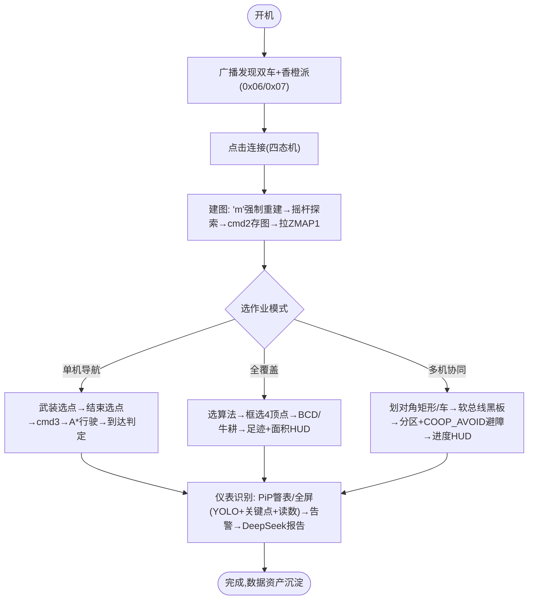
```mermaid
flowchart TB
  START([开机]) --> DISC["广播发现双车+香橙派(0x06/0x07)"]
  DISC --> CONN["点击连接(四态机)"]
  CONN --> BUILD["建图: 'm'强制重建→摇杆探索→cmd2存图→拉ZMAP1"]
  BUILD --> CHOOSE{"选作业模式"}
  CHOOSE -->|单机导航| NAV["武装选点→结束选点→cmd3→A*行驶→到达判定"]
  CHOOSE -->|全覆盖| COV["选算法→框选4顶点→BCD/牛耕→足迹+面积HUD"]
  CHOOSE -->|多机协同| MULTI["划对角矩形/车→软总线黑板→分区+COOP_AVOID避障→进度HUD"]
  NAV --> VIS
  COV --> VIS
  MULTI --> VIS
  VIS["仪表识别: PiP瞥表/全屏(YOLO+关键点+读数)→告警→DeepSeek报告"]
  VIS --> END([完成,数据资产沉淀])
```

## 1.5 理论意义与应用价值

本作品的技术路线——**开源鸿蒙 + 华为昇腾 + 国产 ArkTS + 全自研算法**——精准踩中三条国家级战略主线。

### 1.5.1 政策导向：三重风口交汇

- **具身智能 / 机器人产业**：工信部《人形机器人创新发展指导意见》将 2025 定为关键节点，要求关键技术取得突破、**确保核心部组件安全有效供给**；2025 被称"量产元年"（整机企业超 140 家、发布产品超 330 款）；2025 年 12 月工信部成立"人形机器人与具身智能标准化技术委员会"。工信部、国资委联合专项行动覆盖十省市，划定**工业制造、民生服务、特种作业**三大方向——**工业巡检正属"特种作业"重点方向**。
- **国务院"人工智能+"行动**（2025 年 8 月 26 日印发）：部署科技/产业/消费/民生/治理/全球合作六大行动与**八项基础支撑能力**，其中"**促进开源生态繁荣**"与"**提升安全能力水平**"与本作品高度契合；目标到 2027 年新一代智能终端/智能体应用普及率超 70%、2030 年超 90%。
- **信创 / 自主可控**：2025 是"国产替代"向"自主可控"跃迁关键年，核心是构建国产化软硬件底层架构、解决核心技术"卡脖子"。机器人作为软硬件深度耦合的系统工程，全栈国产化具典型示范意义。

### 1.5.2 市场价值

| 指标 | 2025 | 2026(预测) | 增速 |
|---|---|---|---|
| 中国智能巡检机器人市场规模 | **27.48 亿元** | **31.85 亿元** | **≈15.9%** |
| 市场需求量 | 7738 台 | 9722 台 | ≈25.6% |

电力领域是最大应用市场（2025 年占比 **88.54%**），另有报告预计市场将突破 70 亿元量级（口径不同）。市场处于高速增长阶段，电力为基本盘、化工/轨交/仓储为增量。

### 1.5.3 自主可控的战略意义

本作品**不是"为国产而国产"，而是技术选型天然落在政策风口交汇点**：OS（开源鸿蒙）、算力（华为昇腾）、语言（国产 ArkTS）、算法（全自研、零 ROS）、模型（自采集自训练 + 本地 DeepSeek），全链路无"卡脖子"外部依赖，数据全程不出端。它既是技术作品，也是一份可复制的**国产机器人系统工程范本**：证明了"不依赖 ROS / NVIDIA / 国外云 AI，也能做出跑通完整闭环的工业机器人"。

---

# 二、设计思路与方案

## 2.1 总体设计思路

四条核心设计原则贯穿全系统：

1. **异构分布式、各司其职**——交互可视化、实时控制、NPU 推理三类任务对硬件诉求迥异，放到各自最合适的设备上（平板/紫派/香橙派），再用契约解耦。
2. **契约驱动开发（Contract-First）**——三端代码物理隔离、互不编译依赖，用 `contracts/` 作为唯一事实来源；任何接口改动先改契约再改代码并**逐字节对账**。这让"三人异构协作"不再因接口不一致而集成失败（工业机器人项目集成失败几乎都源于接口不一致）。
3. **视觉链路与导航链路彻底解耦**——网络层（独立 socket）、线程层（独立 WS）、代码依赖层（互不 import）三重隔离，互不打扰。
4. **把机器人做成"像地图 App 一样好用"**——全屏地图打底、浮层操控、分步引导、安全门控。

## 2.2 技术路线与选型权衡

| 选型 | 取代了什么 | 理由 |
|---|---|---|
| 开源鸿蒙 OpenHarmony 5.0 | Ubuntu/Linux + ROS | 国产可控；分布式软总线/可信组网是系统原生能力 |
| 自定义 9 字节 UDP | ROS topic / gRPC / JSON | 嵌入式实时控制开销极低、确定性强、零序列化框架依赖 |
| 鸿蒙分布式软总线 | 自造 RPC/MQTT | 设备发现 + 可信组网 + 数据对象自动同步原生能力 |
| 华为昇腾 NPU + ATC/OM | NVIDIA CUDA/TensorRT | 国产边缘算力，数据不出端，低时延低带宽 |
| 全自研 SLAM/A\*/覆盖/轮控 | ROS move_base/amcl/gmapping | 自主可控、规避对国外开源中间件的路径依赖 |
| 自采集自训练视觉模型 + 本地 DeepSeek | 现成商用 API / 国外云大模型 | 数据安全、低时延、完全自主 |
| LCM 组播总线（紫派内部） | ROS topic | 高带宽低延迟、轻量，UDP 命令翻译成 LCM 命令号 |

## 2.3 系统总体架构

三个异构节点、四条契约化链路，物理隔离、互不编译依赖。

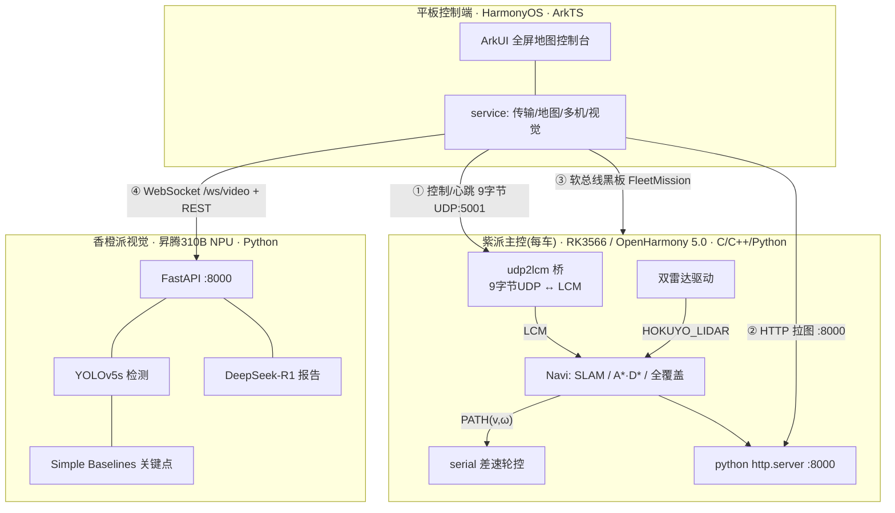
```mermaid
graph TB
  subgraph TABLET["平板控制端 · HarmonyOS · ArkTS"]
    UI["ArkUI 全屏地图控制台"]
    SVC["service: 传输/地图/多机/视觉"]
    UI --- SVC
  end
  subgraph PURPLE["紫派主控(每车) · RK3566 / OpenHarmony 5.0 · C/C++/Python"]
    BRIDGE["udp2lcm 桥<br/>9字节UDP ↔ LCM"]
    NAVI["Navi: SLAM / A*·D* / 全覆盖"]
    WHEEL["serial 差速轮控"]
    HTTP["python http.server :8000"]
    LIDAR["双雷达驱动"]
    BRIDGE -- LCM --> NAVI
    NAVI -- "PATH(v,ω)" --> WHEEL
    LIDAR -- "HOKUYO_LIDAR" --> NAVI
    NAVI --> HTTP
  end
  subgraph ORANGE["香橙派视觉 · 昇腾310B NPU · Python"]
    FAST["FastAPI :8000"]
    YOLO["YOLOv5s 检测"]
    POSE["Simple Baselines 关键点"]
    DS["DeepSeek-R1 报告"]
    FAST --- YOLO --- POSE
    FAST --- DS
  end
  SVC -- "① 控制/心跳 9字节UDP:5001" --> BRIDGE
  SVC -- "② HTTP 拉图 :8000" --> HTTP
  SVC -- "③ 软总线黑板 FleetMission" --> PURPLE
  SVC -- "④ WebSocket /ws/video + REST" --> FAST
```

**四链路职责分明、互不打扰**：

| 链路 | 协议 | 端口 | 承载 |
|---|---|---|---|
| 控制 / 心跳 | 自定义 **9 字节二进制 UDP**（大端） | 5001 | 命令下发 + 500ms 位姿心跳 |
| 地图传输 | HTTP（紫派 `python -m http.server`） | 8000 | 压缩图 `zipedMap.txt` / 普通图 `defultMap.txt` |
| 多机协同 | 鸿蒙**分布式软总线** `distributedDataObject` | — | `FleetMission` 任务黑板（协调态） |
| 视觉流 | **WebSocket** + REST | 8000(香橙派) | JPEG 帧 + 读数/告警 JSON + 配置/报告 |

### 紫派内部 LCM 信道（C/C++ 模块间总线）

| 信道 | 方向 | 用途 |
|---|---|---|
| `HOKUYO_LIDAR` | 雷达→导航 | 激光点集，供 SLAM 建图/定位 |
| `POSE` | →导航 | 位姿输入修正定位；轮控每 15ms 反馈估算坐标 |
| `ROBOT_CONTROL` | 桥/上层→导航 | 功能控制指令（命令号 7/10/20/30/32/122-127） |
| `CURRENTPOSE` | 导航→上层 | 实时当前位姿（也是 App 心跳坐标来源） |
| `PATH` | 导航→轮控 | 路径规划输出（速度、角速度） |
| `wheel_ctrl` | 桥→轮控 | 建图阶段遥控指令 |

> **双链路解耦原理**：视觉链路（④）与导航链路（①②）在网络、线程、代码依赖三层隔离。展开/收起视觉只连断本 WS，导航的保活/控制/建图照常运行，互不阻塞。

## 2.4 通信协议设计

### 2.4.1 UDP 9 字节协议

```
发送 App→紫派 (9字节, 大端/网络序):
┌────┬────────┬───────┬─────────────┬─────────────┬──────┐
│byte0│ byte1  │ byte2 │  byte3-4    │  byte5-6    │byte7-8│
│命令码│方向/号 │ 速度  │ endX int16  │ endY int16  │ 保留 │
└────┴────────┴───────┴─────────────┴─────────────┴──────┘

接收 紫派→App 心跳 (9字节, 大端, 每500ms):
┌────┬───────┬─────────────┬─────────────┬─────────────┐
│byte0│ 保留  │  byte3-4 x  │  byte5-6 y  │  byte7-8 r  │
│=3带坐标│     │ 当前X int16 │ 当前Y int16 │ 朝向(度)    │
└────┴───────┴─────────────┴─────────────┴─────────────┘
```

设计要点：

- **byte0 一字节双关**：取值刻意对齐 ASCII，既是 App 状态枚举也是紫派命令码——`'f'`=102 全路径、`'g'`=103 取消全路径、`'h'`=104 选顶点、`'i'`=105 拉图、`'k'`=107/`'l'`=108 覆盖对角点、`'m'`=0x6d 强制建图。极简且自解释。
- **字节按命令复用**：byte1/byte2 在不同命令下表达运动方向/速度/房间号/robot_id；**cmd105 把主机 IP 四段打进 byte[1,2,4,6]**（复用 endX/endY 两个 int16 的低字节，高字节恒 0）——9 字节做了远超 9 字节的事。
- **坐标单位**：1 整数单位 = 1/20m = 5cm，与地图格子 1:1；朝向 `r`=度 [-180,180]，0°=+X、正角 CCW 朝 +Y。
- **安全设计**：500ms 心跳 + **3s 看门狗急停**（紫派 3 秒未收到任何指令立即令轮控急停防失控，超时值两端契约对齐）；App 至少每 1s 发一次指令（哪怕空指令）保活。

### 2.4.2 零配置设备发现

破解"紫派要先收首包才知 App IP、App 又得先知车 IP"的死循环：

```mermaid
sequenceDiagram
  participant App as 平板
  participant Car as 紫派(车)
  participant Vis as 香橙派(视觉)
  App->>App: 向 255.255.255.255:5001 广播 9字节 byte0=0x06
  App-->>Car: 0x06 发现 ping
  App-->>Vis: 0x06 发现 ping
  Car-->>App: 回 9字节 [0]=0x06 [1]robotId [2]状态 [3..8]位姿
  Vis-->>App: 回 9字节 [0]=0x07 (区分视觉源)
  Note over Car: 只回包,不记clientIP/不起心跳/不武装急停
  App->>App: 按回包源IP收集设备; 0x07→设为视觉host
```

> 关键：发现响应**不能**让车进入"已连受控"态（否则未被选中的车会 3s 急停）；动态 IP 的香橙派也因此可被自动定位。

### 2.4.3 命令 → LCM 翻译（桥模块核心职责）

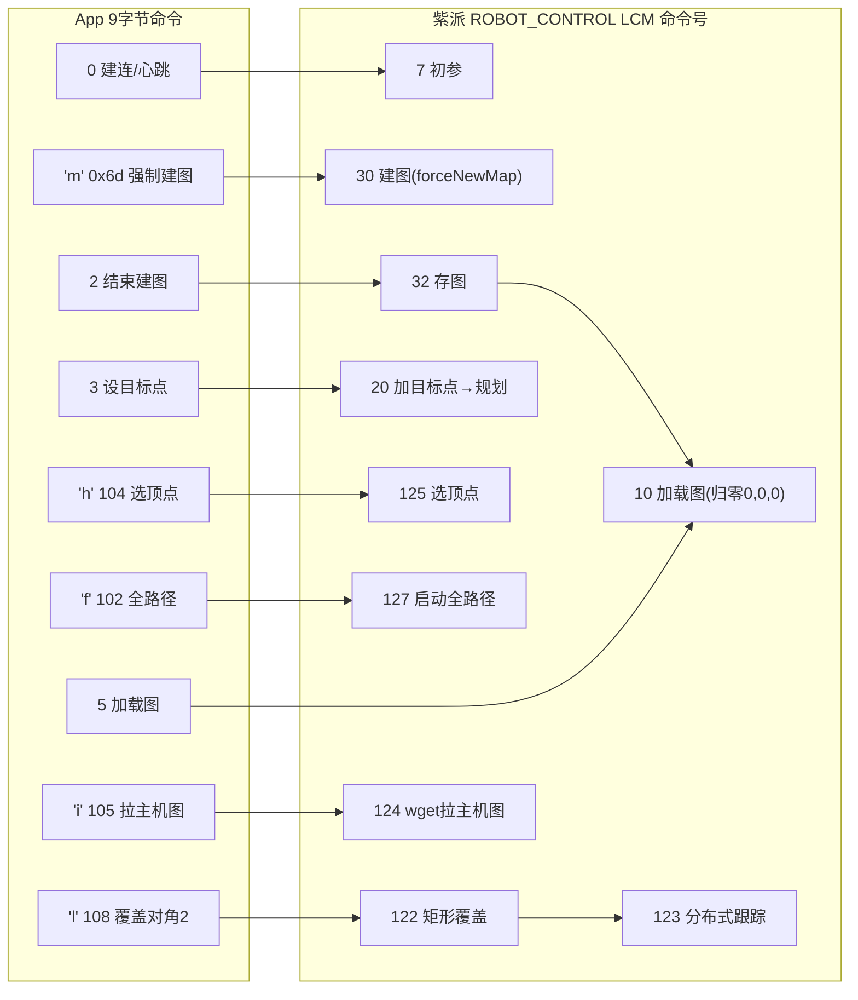
```mermaid
graph LR
  subgraph APP["App 9字节命令"]
    c0["0 建连/心跳"]
    cm["'m' 0x6d 强制建图"]
    c2["2 结束建图"]
    c3["3 设目标点"]
    c5["5 加载图"]
    cf["'f' 102 全路径"]
    ch["'h' 104 选顶点"]
    cl["'l' 108 覆盖对角2"]
    ci["'i' 105 拉主机图"]
  end
  subgraph LCM["紫派 ROBOT_CONTROL LCM 命令号"]
    L7["7 初参"]
    L30["30 建图(forceNewMap)"]
    L32["32 存图"]
    L10["10 加载图(归零0,0,0)"]
    L20["20 加目标点→规划"]
    L125["125 选顶点"]
    L127["127 启动全路径"]
    L122["122 矩形覆盖"]
    L123["123 分布式跟踪"]
    L124["124 wget拉主机图"]
  end
  c0 --> L7
  cm --> L30
  c2 --> L32 --> L10
  c3 --> L20
  c5 --> L10
  cf --> L127
  ch --> L125
  cl --> L122 --> L123
  ci --> L124
```

### 2.4.4 连接保活与看门狗时序

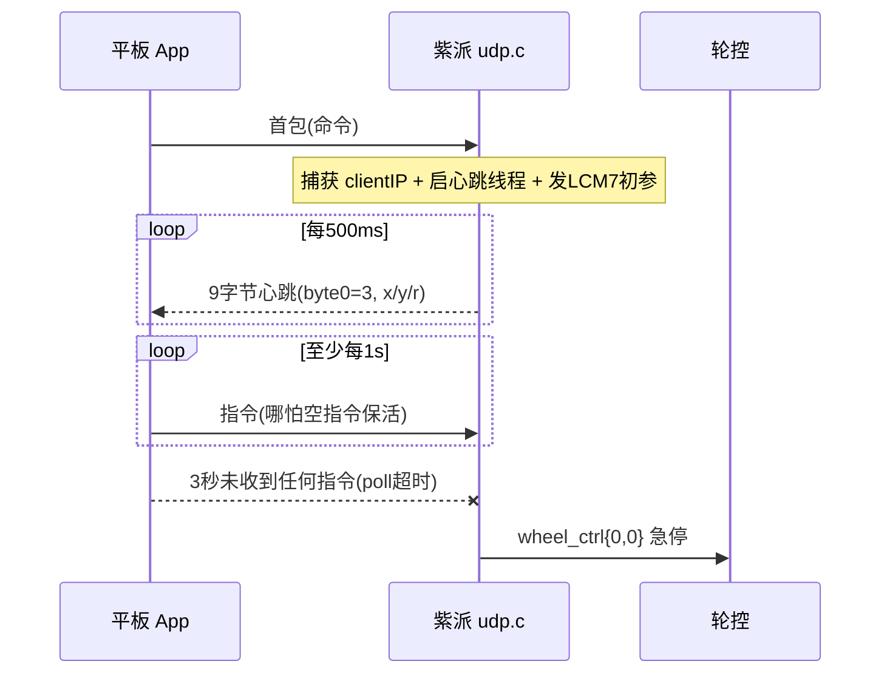
```mermaid
sequenceDiagram
  participant App as 平板 App
  participant Bridge as 紫派 udp.c
  participant Wheel as 轮控
  App->>Bridge: 首包(命令)
  Note over Bridge: 捕获 clientIP + 启心跳线程 + 发LCM7初参
  loop 每500ms
    Bridge-->>App: 9字节心跳(byte0=3, x/y/r)
  end
  loop 至少每1s
    App->>Bridge: 指令(哪怕空指令保活)
  end
  App--xBridge: 3秒未收到任何指令(poll超时)
  Bridge->>Wheel: wheel_ctrl{0,0} 急停
```

## 2.5 关键算法设计原理

### 2.5.1 激光 SLAM 建图与定位

紫派 `Navi` 模块的 SLAM 全自研，核心是**扫描匹配 + 概率栅格 + 粒子滤波**：

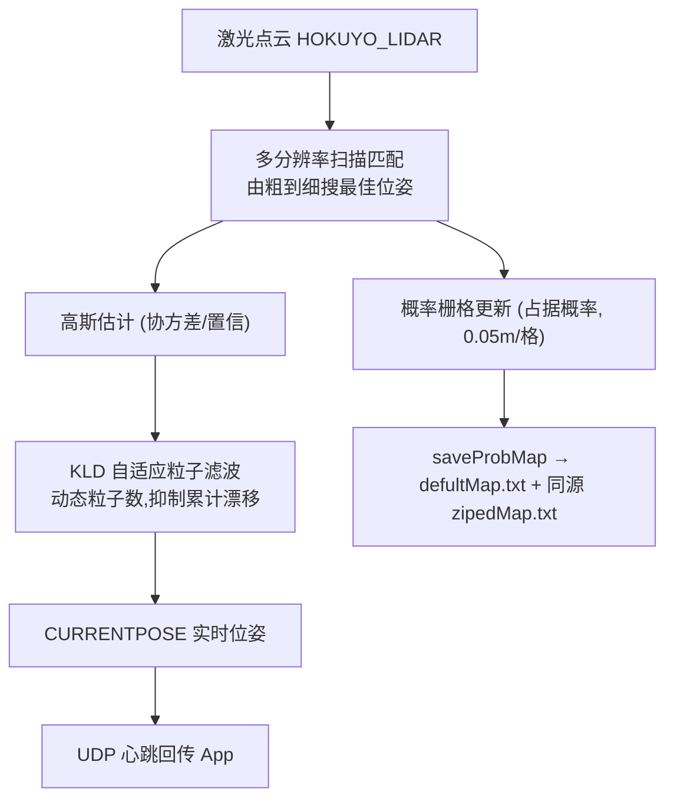
```mermaid
graph TB
  L["激光点云 HOKUYO_LIDAR"] --> SM["多分辨率扫描匹配<br/>由粗到细搜最佳位姿"]
  SM --> GE["高斯估计 (协方差/置信)"]
  GE --> PF["KLD 自适应粒子滤波<br/>动态粒子数,抑制累计漂移"]
  PF --> POSE["CURRENTPOSE 实时位姿"]
  SM --> MAP["概率栅格更新 (占据概率, 0.05m/格)"]
  MAP --> SAVE["saveProbMap → defultMap.txt + 同源 zipedMap.txt"]
  POSE --> HB["UDP 心跳回传 App"]
```

- **多分辨率扫描匹配**（`MultiResolutionScanMatcher`）：把当前激光帧与已建地图在由粗到细的多个分辨率上做相关匹配，先粗定位、再细化，兼顾速度与精度。
- **高斯估计 / 协方差**（`gaussestimator/`）：估计位姿不确定度。
- **KLD 自适应粒子滤波**（`particlefilter/KLD`）：按 KL 散度动态调整粒子数，抑制累计漂移。
- **概率栅格**（`map/MapServer`、`Gridmap`）：维护每格占据概率（`MaxOccupied=0.9`、`MinOccupied=0.2`），落盘为 `defultMap.txt`。

**地图落盘格式**（首行 7 值）：

| 字段 | range | resolution | height | width | metersPerPixel | x0 | y0 |
|---|---|---|---|---|---|---|---|
| 位置 | [0] | [1] | **[2]=行数** | **[3]=列数** | [4]≈0.05 | [5] | [6] |
| 含义 | 量程 | 分辨率 | 栅格行数 | 栅格列数 | 每格米 | 最小角世界X(可负) | 最小角世界Y |

数据区：`defultMap.txt` 空格分隔（`-1`障碍/`0`空旷/`2`已覆盖）；`defultMap.txt.txt` 密排（`1`障碍/`0`）。世界↔栅格：`grid=(world−x0)/metersPerPixel`。⚠️ 行列在第 3、4 位，**不是末两个**（末两个是 x0/y0 偏移，误取即"空气图"——真机渲染 bug 根因，已写入契约）。

**强制重建语义（经真机定位的关键接口约定）**：紫派 `cmd0` 在已有图/导航态时被 `Navi.createMap` 忽略、沿用旧图（→ 摇杆在旧图上定位漂移、cmd2 存的还是旧图），App"开始建图"必须发 **`'m'`/0x6d**（`forceNewMap=true`）才会清空旧图/路径/覆盖产物从头建。

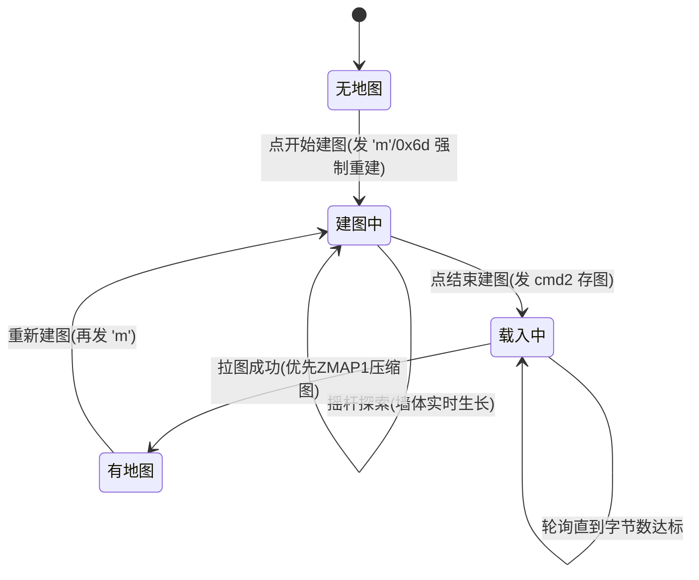
```mermaid
stateDiagram-v2
  [*] --> 无地图
  无地图 --> 建图中: 点开始建图(发 'm'/0x6d 强制重建)
  建图中 --> 建图中: 摇杆探索(墙体实时生长)
  建图中 --> 载入中: 点结束建图(发 cmd2 存图)
  载入中 --> 有地图: 拉图成功(优先ZMAP1压缩图)
  载入中 --> 载入中: 轮询直到字节数达标
  有地图 --> 建图中: 重新建图(再发 'm')
```

### 2.5.2 A\* / D\* 路径规划

A\* 规划器 `CAstar`（`Navi/planner/Astarplanner`）：

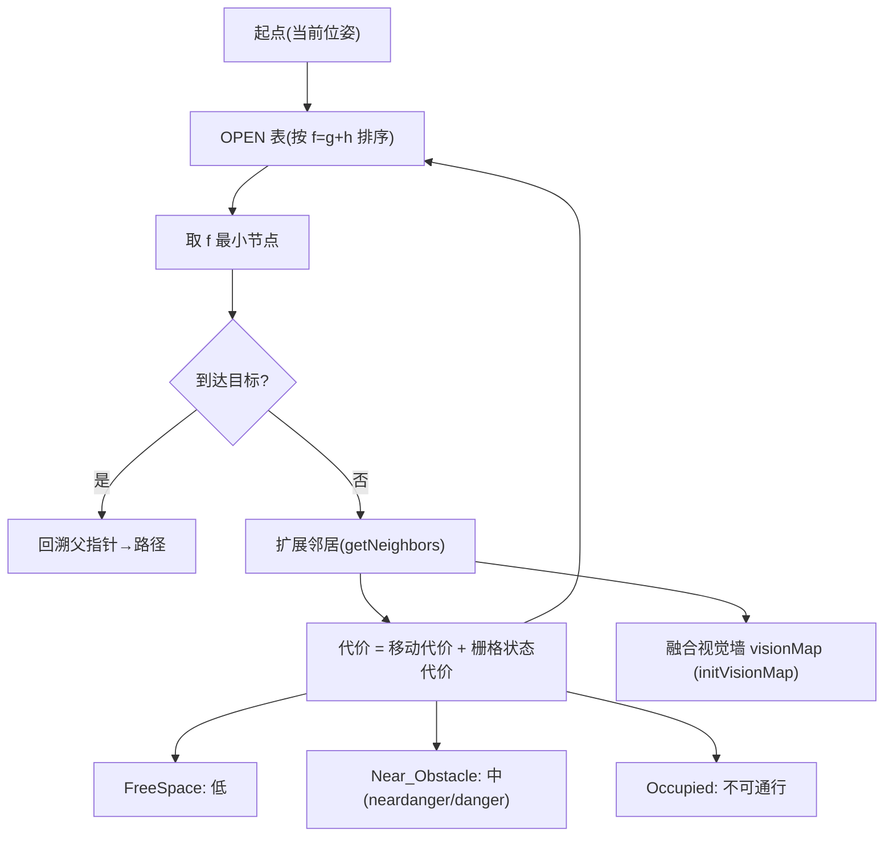
```mermaid
graph TB
  START["起点(当前位姿)"] --> OPEN["OPEN 表(按 f=g+h 排序)"]
  OPEN --> POP["取 f 最小节点"]
  POP --> GOAL{"到达目标?"}
  GOAL -->|是| PATH["回溯父指针→路径"]
  GOAL -->|否| NB["扩展邻居(getNeighbors)"]
  NB --> COST["代价 = 移动代价 + 栅格状态代价"]
  COST --> C1["FreeSpace: 低"]
  COST --> C2["Near_Obstacle: 中(neardanger/danger)"]
  COST --> C3["Occupied: 不可通行"]
  NB --> VIS["融合视觉墙 visionMap (initVisionMap)"]
  COST --> OPEN
```

- **节点结构**：`Node{state(NEW/OPEN/CLOSED), g, h, f, k, parent...}`；OPEN 表按 key 排序，最大节点数 `MAXNODES=200000`。
- **代价分级**：栅格状态 `FreeSpace/Occupied/Near_Obstacle`，并赋代价 `heighcost(5)/neardanger(10)/danger(15)`，使路径**主动远离障碍**而非贴墙。
- **三种搜索**：A\*（`AStarSearch`）/ D\*（`DStarSearch`，动态重规划）/ BFS（`BFSSearch`）；机器人半径 `SetConfig(radius)` 做膨胀。
- **视觉墙融合**：把视觉识别到的障碍注入 `visionMap` 联合规划。
- **到达判定**（App 侧镜像）：位姿与目标栅格距离平方 ≤ 32 cell²（≈ √32 格 ≈ 28cm）即判定到达。

### 2.5.3 全覆盖路径规划（算法亮点）

**两套算法 + 优雅降级**：

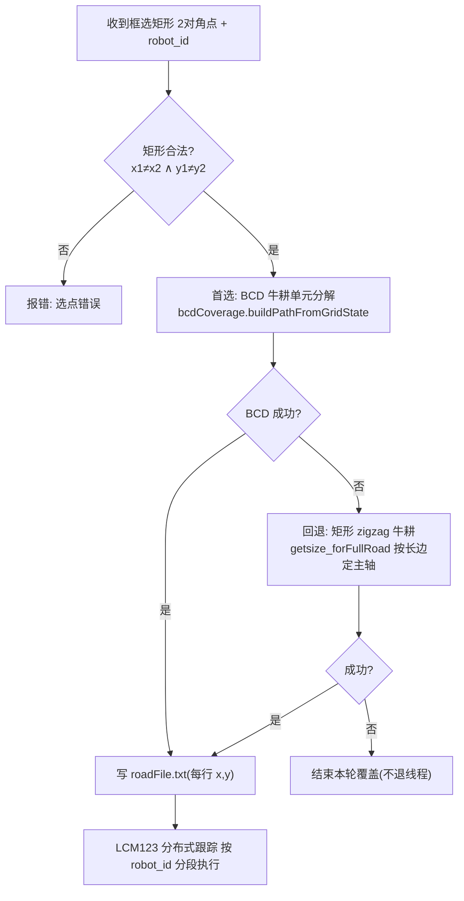
```mermaid
flowchart TB
  S["收到框选矩形 2对角点 + robot_id"] --> CHK{"矩形合法?<br/>x1≠x2 ∧ y1≠y2"}
  CHK -->|否| ERR["报错: 选点错误"]
  CHK -->|是| BCD["首选: BCD 牛耕单元分解<br/>bcdCoverage.buildPathFromGridState"]
  BCD --> OK1{"BCD 成功?"}
  OK1 -->|是| WRITE["写 roadFile.txt(每行 x,y)"]
  OK1 -->|否| ZIG["回退: 矩形 zigzag 牛耕<br/>getsize_forFullRoad 按长边定主轴"]
  ZIG --> OK2{"成功?"}
  OK2 -->|是| WRITE
  OK2 -->|否| FAIL["结束本轮覆盖(不退线程)"]
  WRITE --> TRACK["LCM123 分布式跟踪 按 robot_id 分段执行"]
```

- **首选 BCD（Boustrophedon Cellular Decomposition，牛耕单元分解）**：把框选矩形按障碍切成若干无障碍子单元，在每个子单元内做牛耕往复（来回扫描线），子单元间用 A\* 连接，生成连续覆盖路径 `fullPath[]`。
- **回退矩形 zigzag 牛耕**：BCD 失败时，比较矩形横/纵边长 `xlen/ylen`，谁长以谁为主轴做规则往复扫描；网格步长由安全半径 `safesize` 与 `minsize` 决定。
- **可选最小生成树（MST）**：单车全路径提供"牛耕 / 最小生成树"算法选择（cmd102 的 byte1=算法号 → LCM127 的 algNum）。
- **覆盖线程**（`CoverageThreadProc`，algNum=0 牛耕+D\*）：

```text
while 等待 algNum 就绪:
  清空旧覆盖路径队列
  房间边界 = 自动凸包(autoGetRoomBoundary) or 手动选点(manualGetRoomBoundary)
  初始化覆盖状态图 initCoverageState → 写 tmpcoverageMap.txt
  起点入队
  while 未完成 isFinished:
    方向 direction = 前(0)/后(1)/左(2)/右(3)
    用 D* 在当前方向 detectFrontPlan 规划探测路径
    沿路径牛耕,标记已覆盖格
  输出最终 coverageMap.txt; 路径写 roadFile.txt
```

- **覆盖路径文件 `roadFile.txt`**：每行一个 `x,y`（5cm 栅格单位）；`robot_id=0`(master) 走前半段、`robot_id=1`(sub) 走后半段逆序。

### 2.5.4 差速轮控与里程闭环

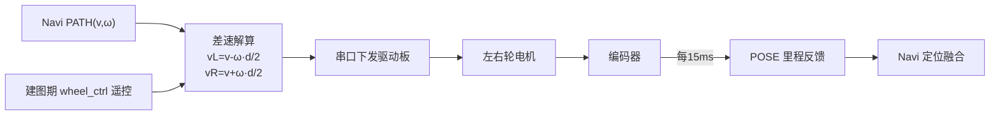
```mermaid
graph LR
  PATH["Navi PATH(v,ω)"] --> SOLVE["差速解算<br/>vL=v-ω·d/2<br/>vR=v+ω·d/2"]
  WCTRL["建图期 wheel_ctrl 遥控"] --> SOLVE
  SOLVE --> SERIAL["串口下发驱动板"]
  SERIAL --> MOTOR["左右轮电机"]
  MOTOR --> ENC["编码器"]
  ENC -->|"每15ms"| POSE["POSE 里程反馈"]
  POSE --> NAVI["Navi 定位融合"]
```

轮控（`serial/`）订阅 `PATH`（导航 v/ω）或 `wheel_ctrl`（建图遥控），解算左右轮差速经串口下发驱动板；每 15ms 由编码器经 `POSE` 回传位姿估计，与 SLAM 定位互补，形成里程闭环。

### 2.5.5 边缘视觉读数

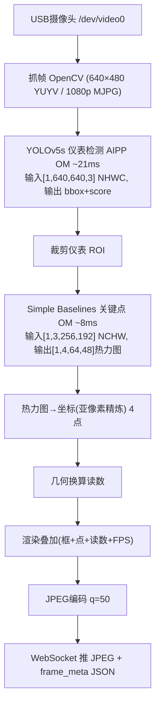
```mermaid
flowchart TB
  CAM["USB摄像头 /dev/video0"] --> GRAB["抓帧 OpenCV (640×480 YUYV / 1080p MJPG)"]
  GRAB --> YOLO["YOLOv5s 仪表检测 AIPP OM ~21ms<br/>输入[1,640,640,3] NHWC, 输出 bbox+score"]
  YOLO --> ROI["裁剪仪表 ROI"]
  ROI --> KP["Simple Baselines 关键点 OM ~8ms<br/>输入[1,3,256,192] NCHW, 输出[1,4,64,48]热力图"]
  KP --> REFINE["热力图→坐标(亚像素精炼) 4点"]
  REFINE --> READ["几何换算读数"]
  READ --> RENDER["渲染叠加(框+点+读数+FPS)"]
  RENDER --> JPEG["JPEG编码 q=50"]
  JPEG --> WS["WebSocket 推 JPEG + frame_meta JSON"]
```

**4 关键点**：`center`(圆心/轴心)、`pointer_tip`(指针尖)、`zero_mark`(零刻度)、`full_mark`(满刻度)。

**几何法读数**：以圆心为原点、用 `atan2(-y,x)` 转数学坐标系，取指针相对零→满刻度的**顺时针夹角占比**乘满量程：

```
reading = CW(zero→pointer) / CW(zero→full) × 满量程     # 占比 clamp 到 [0,1]
```

不依赖"每块表单独训练分类"。**多表支持**：YOLO 置信度阈值降到 **0.10** + 长宽比(0.6–1.7) + 面积(<85%全图) 过滤误检框，一图多表各自读数（实测一图两块压力表均正确）。端到端性能：YOLO 21ms + 关键点 8ms + 预/后处理 3ms + JPEG 2ms ≈ **34ms / ~29FPS**。

### 2.5.6 多机协同：软总线黑板模型

摒弃旧"`startAbility` 当 RPC + `Want` 塞一次性快照"的反模式，改为**共享黑板、反应式读写**：

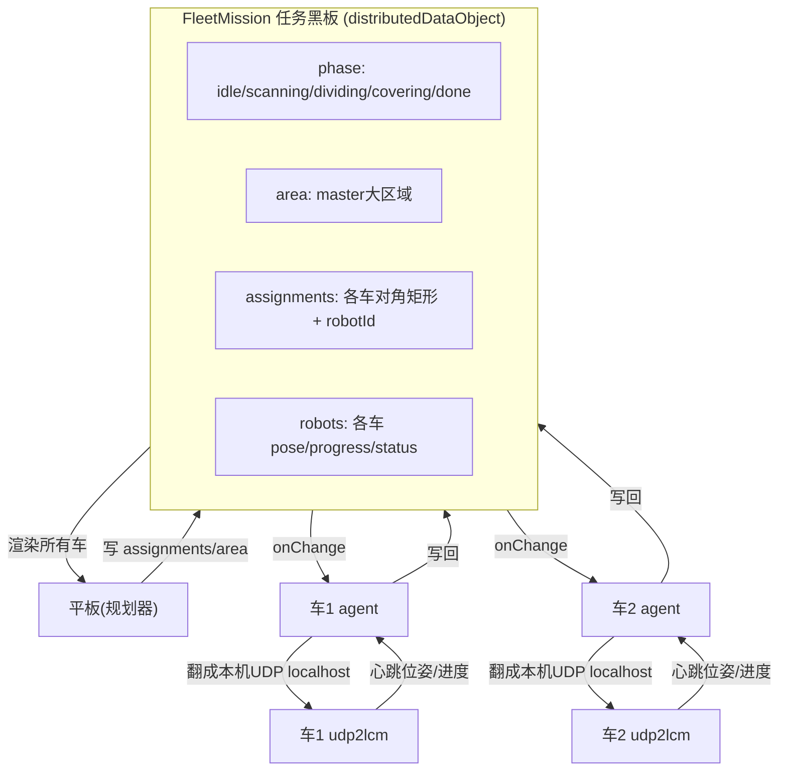
```mermaid
graph TB
  subgraph BB["FleetMission 任务黑板 (distributedDataObject)"]
    P["phase: idle/scanning/dividing/covering/done"]
    AR["area: master大区域"]
    AS["assignments: 各车对角矩形 + robotId"]
    RB["robots: 各车 pose/progress/status"]
  end
  TABLET["平板(规划器)"] -->|"写 assignments/area"| BB
  BB -->|"onChange"| AG1["车1 agent"]
  BB -->|"onChange"| AG2["车2 agent"]
  AG1 -->|"翻成本机UDP localhost"| CAR1["车1 udp2lcm"]
  AG2 -->|"翻成本机UDP localhost"| CAR2["车2 udp2lcm"]
  CAR1 -->|"心跳位姿/进度"| AG1 -->|"写回"| BB
  CAR2 -->|"心跳位姿/进度"| AG2 -->|"写回"| BB
  BB -->|"渲染所有车"| TABLET
```

**协同时序**：

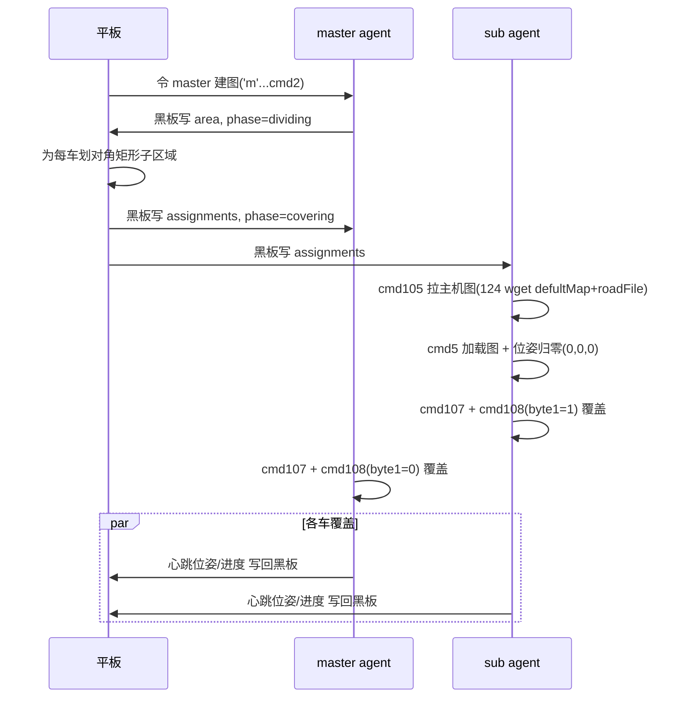
```mermaid
sequenceDiagram
  participant T as 平板
  participant Mz as master agent
  participant Sz as sub agent
  T->>Mz: 令 master 建图('m'...cmd2)
  Mz->>T: 黑板写 area, phase=dividing
  T->>T: 为每车划对角矩形子区域
  T->>Mz: 黑板写 assignments, phase=covering
  T->>Sz: 黑板写 assignments
  Sz->>Sz: cmd105 拉主机图(124 wget defultMap+roadFile)
  Sz->>Sz: cmd5 加载图 + 位姿归零(0,0,0)
  Sz->>Sz: cmd107 + cmd108(byte1=1) 覆盖
  Mz->>Mz: cmd107 + cmd108(byte1=0) 覆盖
  par 各车覆盖
    Mz->>T: 心跳位姿/进度 写回黑板
    Sz->>T: 心跳位姿/进度 写回黑板
  end
```

- **坐标系按构造对齐**：子机从 master 同一物理起点出发，`cmd5` 加载图时位姿强制归零 (0,0,0)，无需全局重定位、无需操作员点选初始位姿——一个巧妙工程约束消解了多机坐标对齐难题（朝向比位置敏感，起点需把位置+朝向都卡死、顺序出发）。
- **车间协同避障（COOP_AVOID）**：覆盖时两车路线可能交叠，紫派 `Navi` 内新增**独立多播 LCM 通道**（`udpm://239.255.76.67:7668`，频道 `COOP_AVOID`，负命令号 -40..-35），**车↔车直连、不经平板、不经软总线**：触发条件为 A\* 失败/无路径/对方在安全走廊内；被让车保存目标→发 `PATH v=0,w=0` 停车等待→恢复重下目标；两车互请停机时 `robotId=1` 继续、`robotId=0` 停等。**不改 9 字节 UDP 协议**，App 无需感知（仅可视化不可把"避让暂停"误判为"卡死掉线"）。

## 2.6 人机交互设计

全屏地图打底 + 浮层操控的 Google-Maps 范式控制台。

### 2.6.1 四态连接状态机

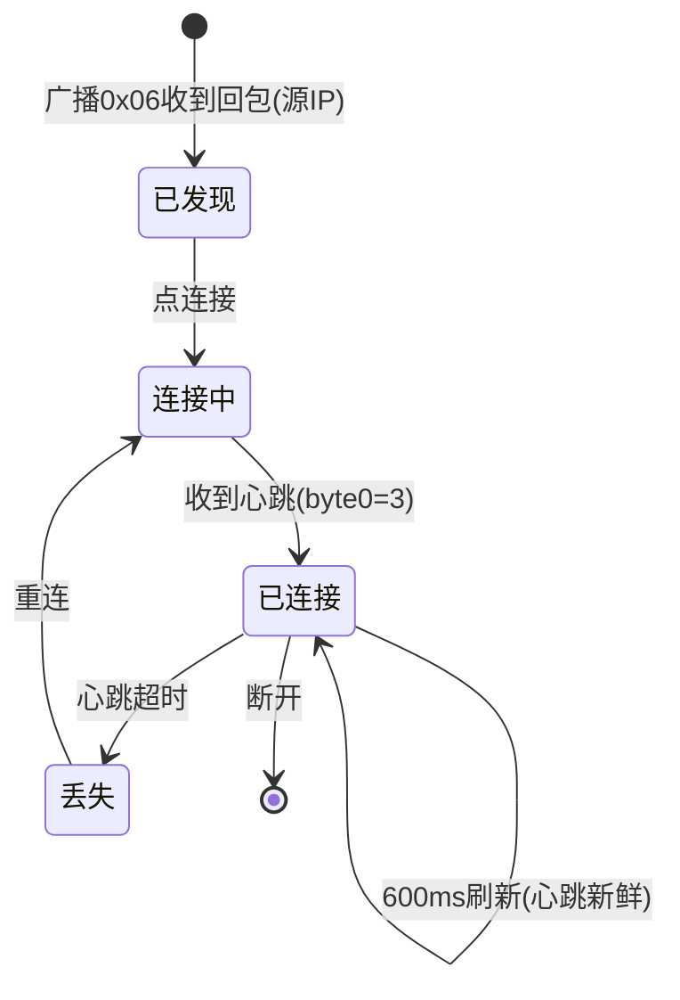
```mermaid
stateDiagram-v2
  [*] --> 已发现: 广播0x06收到回包(源IP)
  已发现 --> 连接中: 点连接
  连接中 --> 已连接: 收到心跳(byte0=3)
  已连接 --> 已连接: 600ms刷新(心跳新鲜)
  已连接 --> 丢失: 心跳超时
  丢失 --> 连接中: 重连
  已连接 --> [*]: 断开
```

连接状态由心跳新鲜度每 600ms 派生，驱动**命令门控**：未连接时下发按钮禁用，`enablePick` 也要求已连接。

### 2.6.2 两段式武装选点

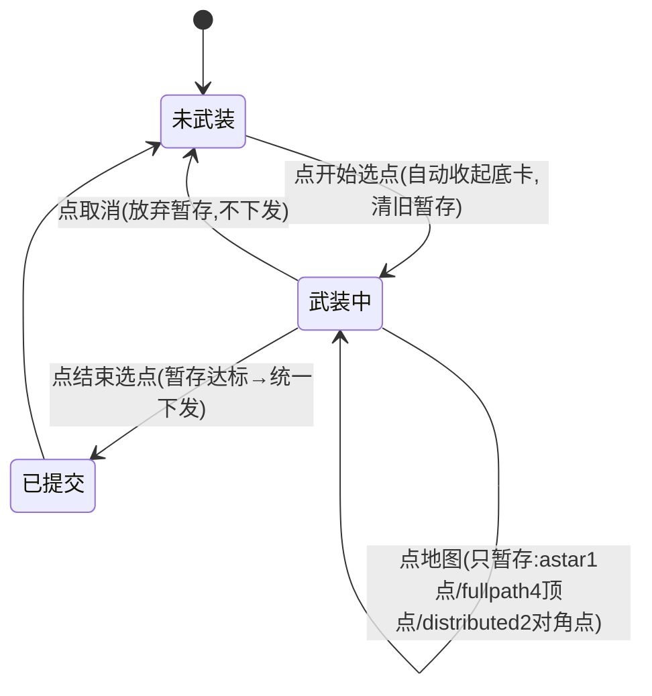
```mermaid
stateDiagram-v2
  [*] --> 未武装
  未武装 --> 武装中: 点开始选点(自动收起底卡,清旧暂存)
  武装中 --> 武装中: 点地图(只暂存:astar1点/fullpath4顶点/distributed2对角点)
  武装中 --> 未武装: 点取消(放弃暂存,不下发)
  武装中 --> 已提交: 点结束选点(暂存达标→统一下发)
  已提交 --> 未武装
```

开始选点→地图上**只暂存不下发**（可中途任意重选微调，未提交前绝不污染紫派状态、不发 cmd104/107/108）→结束选点才批量下发（fullpath 顺序发 4×cmd104 + 延时 cmd102；distributed assignArea 发 cmd107+108）/取消放弃本轮。**纯 App 侧"下发时机"改动，9 字节协议字节/语义不变，建图仍发 `'m'`/0x6d**。

### 2.6.3 三种作业模式与覆盖进度上图

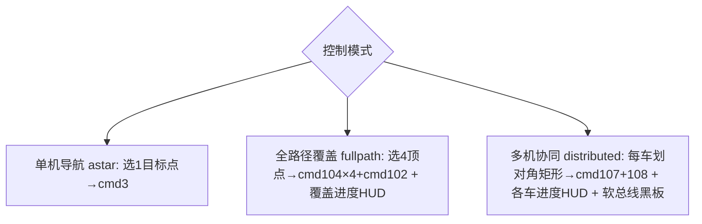
```mermaid
graph TB
  MODE{"控制模式"}
  MODE --> ASTAR["单机导航 astar: 选1目标点→cmd3"]
  MODE --> FULL["全路径覆盖 fullpath: 选4顶点→cmd104×4+cmd102 + 覆盖进度HUD"]
  MODE --> DIST["多机协同 distributed: 每车划对角矩形→cmd107+108 + 各车进度HUD + 软总线黑板"]
```

【全覆盖】【多机协同】模式把**覆盖进度做成浮于地图右上角的 CoverageHud**（单车进度+面积 / 多车每车一行），边扫边看、不与缩放 FAB/底卡/PiP 重叠；地图上绘各车**彗尾轨迹**（软辉光底+历史淡痕+头部渐亮）+ 覆盖足迹填充，按 0.0025m²/格（覆盖刷半径≈4格≈20cm）实时累计面积。底部操作卡可收起 peek（默认一行：摘要+主操作+把手），地图最大化；每个模式每一步都有分步引导文案。

---

# 三、方案实现

## 3.1 硬件实现（全自主装配）

小车底盘、电机驱动接线、电源管理全部由成员亲手装配调试。

| 部件 | 选型 | 说明 |
|---|---|---|
| 主控 | Purple Pi OH（RK3566） | 烧录 OpenHarmony 5.0 |
| 建图雷达 | **LDS-50C-2** | 专司 SLAM 建图 |
| 导航雷达 | **RPLIDAR A2M8** | 专司导航避障 |
| 串口转换 | cp210x | 雷达/驱动板串口接入 |
| 视觉 | OrangePi AI Pro（**昇腾 310B NPU**） | 达芬奇 V300 AI Core + Taishan V200M，INT8 20 TOPS、4GB LPDDR4X |
| 控制端 | HarmonyOS 平板 | 全 UI App |

**双雷达分工**的设计：建图与导航对激光的扫描特性诉求不同，分别用最合适的雷达，各取所长。

## 3.2 中间层实现（紫派 C/C++/Python3）

目录与关键模块：

```
紫派/
├── NewWheelCtrl/
│   ├── udp2lcm/   # UDP↔LCM 桥: udp.c(收发+心跳+看门狗) + udp2lcm.c(parseCmd 命令翻译)
│   ├── serial/    # 差速轮控: serial.c 串口驱动板
│   └── myctrl/    # 轮控测试客户端
├── Navi/
│   ├── main.cpp           # LCM 命令分发主循环
│   ├── NaviInterface.cpp  # A*/D*调度、CreateFullPath/CoverageThreadProc 覆盖、cmd124 wget拉图、协同避障
│   ├── planner/           # CAstar A*/D*/BFS 规划器
│   ├── map/               # MapServer(saveProbMap)/Gridmap/ScanMatcher/MultiResolutionScanMatcher
│   ├── particlefilter/    # KLD 自适应粒子滤波
│   └── gaussestimator/    # 高斯估计
└── Lidar/         # RPLIDAR/LDS 驱动
```

- **udp2lcm 桥**：`udp.c` 绑定 `INADDR_ANY:5001`，首包捕获客户端并启 500ms 心跳线程；发现 ping(`0x06`) 经 `isDiscoveryPing`→`sendDiscoveryResponse` 只回包；主循环 `poll` 3s 超时即发 `wheel_ctrl{0,0}` 急停。`udp2lcm.c::parseCmd` 把 9 字节翻译成 LCM 命令号。
- **地图服务**：`chdir(/data/test)` 后 `python -m http.server :8000` 以 `/data/test` 为 web 根暴露地图（URL 不带前缀）；保存 `defultMap.txt` 后同源生成压缩图 `zipedMap.txt`。
- **分布式拉图（方案B）**：子机 `cmd105`→`cmd124` 用 `wget` 从主机 `:8000` 优先拉 `zipedMap.txt`（解压为 `defultMap.txt`）+ `roadFile.txt`。
- **显示保活**：`test.sh run` 执行 `power-shell wakeup/timeout` 防 OH 默认 30s 息屏影响渲染。

## 3.3 视觉层实现（香橙派 Python / 昇腾）

```
orangepi-vision/
├── web/backend/
│   ├── main.py              # FastAPI: /ws/video + 全部 REST
│   ├── video_camera.py      # 摄像头抓帧
│   ├── deepseek_service.py  # DeepSeek-R1 报告(SSE)
│   ├── data_storage.py      # 历史读数/统计/报告
│   └── discovery_responder.py # 0x06→0x07 发现响应
├── deployment_bundle/       # YOLOv5s/Simple Baselines/RTMPose OM 推理
└── test_gauge_reading*.py   # 单表/多表读数测试
```

- **FastAPI + Uvicorn**：`/ws/video` 交替推 JPEG 帧 + `frame_meta` JSON（含 frame_id/fps/inference_time_ms/detections[bbox,score,keypoints]/gauge_angles）；REST 提供 `/api/summary`、`/api/history`（最近 600 条）、`/api/data/stats`、`/api/thresholds`、`/api/gauge/configs`（量程标定 CRUD）、`/api/data/report`（DeepSeek 报告）、`/api/llm/query`（SSE 对话）等完整接口。
- **推理**：模型经国产 **ATC** 工具转 `.om`，在昇腾 NPU 原生推理（ACL）；ACL 上下文独立子线程初始化、帧队列 + 跳帧保实时。
- **本地大模型**：**DeepSeek-R1-Distill-Qwen-1.5B** 基于最近 24h 读数做趋势/异常分析报告，SSE 流式返回；生成时暂停摄像头释放 NPU。
- **量程与告警**：`/api/gauge/configs` 把读数占比映射到物理量纲（MPa 等）+ 阈值告警（NORMAL/ALARM/UNKNOWN）。
- **模型权重不入 git**（`.om` 经 Git LFS 或共享盘分发）。

## 3.4 应用层实现（平板 ArkTS App）

ArkTS + ArkUI 声明式，关注点分离（model / service / component / pages），去全局化（不再持有全局 canvas context）。

```
app-harmony/entry/src/main/ets/
├── model/        protocol(9字节编解码) / mission(黑板schema) / geometry / mapContour / vision
├── service/      RobotTransport(UDP) / MapService(拉图解析) / FleetMissionService(软总线) / VisionService(WS)
├── component/    MapCanvas(地图+轨迹+覆盖) / Joystick / DeviceList / VideoView / ReadingPanel
├── pages/        Home / Control / Vision / DeviceTrust / SetIP
└── constants/    protocol / theme / motion / icons / vision
```

- **协议编解码**（`model/protocol.ets`）：`encodeSend` 编 9 字节大端缓冲；`encodePullMap` 单独处理 cmd105 的 IP 散列布局（byte[1,2,4,6]）；`decodeReceive` 解心跳。与紫派 `udp2lcm.c` 逐字段对账。
- **地图服务**（`MapService.ets`）：`fetchMapPreferZiped` 优先拉压缩图、非 ZMAP1/失败回退普通图；`parseMap` 统一三种源格式（空格 `-1/0` / 密排 `1/0` / 压缩 `ZMAP1`）归一为栅格 + 障碍包围盒裁剪 + 正方形化；**`decodeZipedRow` 用 BigInt 解 64 位字**（ArkTS number 仅 53 位精度，普通 number 丢高位导致整行错乱）；墙体"水平行程合并"+ max-pool 粗网格 + 平滑矢量等高线优化亚像素渲染。
- **传输层**（`RobotTransport.ets`）：UDP 收发、广播发现、保活节流；`sendBuffer` 支持方案A 平板直发。
- **多机服务**（`FleetMissionService.ets`）：软总线发现 + 入会话 + 黑板读写（`publishMission`/`subscribeMission`），传输层无关（可在软总线受阻时切 LAN socket）。
- **视觉服务**（`VisionService.ets`）：自持 WebSocket、引用计数（PiP+全屏共享一连接，最后一个 release 才真正断开）、退避重连、整段 try/catch 容错（缺字段转 NaN 也不崩，读数显"—"）。
- **页面**：HomePage（发现/连接/模式 chip/互信/视频入口）、ControlPage（建图/导航/覆盖/多机，全屏地图 + 浮层）、VisionPage（全屏识别 + 读数面板 + 报告）、DeviceTrustPage（软总线互信配对）、SetIPPage（手填 IP 兜底）。

### 压缩地图 ZMAP1 编解码


```mermaid
graph LR
  R["普通图 -1/0 行"] -->|"打包 64格/uint64"| Z["ZMAP1 word序列 ~6×小"]
  Z -->|"HTTP 拉到 App"| BI["BigInt 解每 word→64位串"]
  BI -->|"按width截断补零"| G["归一化栅格 1=障碍"]
```

格式：`ZMAP1` magic + 7 值头 + 每行 `rowBitCount wordCount word0...`；障碍格→bit 1，每 64 格打包成无符号 64 位整数（cell0 在最高位 bit63、依次向低位）；解码 `bit=(word[col>>6]>>(63-(col&63)))&1`。解决"~6.5MB 普通图在紫派单线程 server 上 ~47KB/s 拉不完"。

### 覆盖进度估算（App 侧实时）

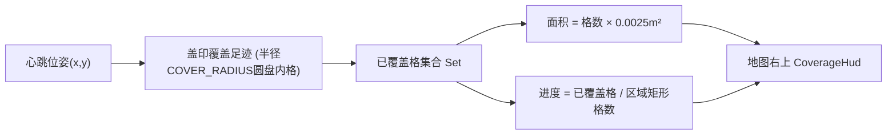
```mermaid
graph LR
  HB["心跳位姿(x,y)"] --> STAMP["盖印覆盖足迹 (半径COVER_RADIUS圆盘内格)"]
  STAMP --> CELLS["已覆盖格集合 Set"]
  CELLS --> AREA["面积 = 格数 × 0.0025m²"]
  CELLS --> PROG["进度 = 已覆盖格 / 区域矩形格数"]
  AREA --> HUD["地图右上 CoverageHud"]
  PROG --> HUD
```

## 3.5 车载轻 agent 实现（无界面 ArkTS）

`car-agent/` 常驻紫派的无界面 ArkTS 节点（code-complete）：

```
car-agent/entry/src/main/ets/
├── agent/AgentCore.ets        # 运行时核心: bind本机UDP+保活 / 入软总线持黑板 / 黑板变更→reconcile→发UDP / 心跳→写回黑板
├── reconciler/Reconciler.ets  # 黑板→本机命令 纯决策(幂等)
├── agentability/AgentAbility.ets  # UIAbility 外壳托管 AgentCore
└── {model,constants,utils,service}/  # 与 app-harmony 同源的 UI 无关层
```

`Reconciler` 把黑板里属于本车的任务翻成本机 9 字节 UDP（localhost 127.0.0.1:5001）幂等下发（子车补 `cmd105` 拉图 + `cmd5` 归零 + `cmd107/108`），把心跳位姿节流写回黑板。bundleName 与平板同为 `com.example.carapp`（软总线黑板同步硬前提）。

> **工程说明 · 双多机方案并存**：本作品同时实现并保留"软总线 DDO + 车载 agent"（产品级创新、未来增强）与"平板直连双车 UDP"（应对硬件 AP 隔离的稳健退路，当前默认 `distUseAgent=false`），`FleetMissionService` 设计为传输无关、可一键切换。

## 3.6 集成方法

工业机器人项目"集成失败几乎都来自接口不一致"，本作品以契约化协作系统性规避：

- **契约驱动**：`contracts/`（UDP 协议 / 地图格式 / 多机协同 / 视觉 API / LCM 信道）为三端唯一事实来源；改接口先改契约再改两侧代码并逐字节对账。`integration-qa.md` 让"两侧的人和 AI 异步对接"，带日期追加结论/问题，已沉淀 12+ 项对接决策（如建图 `'m'` 语义、cmd105 IP 布局、地图首行 7 值、多车覆盖算法不可选等）。
- **离线 mock 联调**：`tools/mock-purplepi`（假紫派栈，127.0.0.1:5001）、`tools/mock-orangepi`（假视觉 WS）、`tools/mock-app`（假平板），让任一端在没有其它端时独立联调。
- **纯逻辑测试守护**：`verify.mjs`（协议/坐标 17/17）、`verify-reconciler.mjs`（黑板决策 9/9）、ZMAP1 位序/补零/全障碍用例，防回归。
- **构建与装机**：DevEco Studio 自动签名 + `hdc install`（紫派装 car-agent hap、平板装 app-harmony hap，同 bundleName 不同设备）。

## 3.7 整体达成的功能/服务

| 能力 | 实现链路 |
|---|---|
| 设备发现连接 | 广播 0x06/0x07 → 源 IP 收集 → 四态机 |
| SLAM 建图 | 'm' 强制重建 → 摇杆探索 → cmd2 存图 → HTTP 拉 ZMAP1 |
| A\* 导航 | 武装选点 → cmd3 → LCM20 规划 → PATH 跟踪 → 到达判定 |
| 全覆盖 | 框选 → cmd104×4+cmd102 / cmd107+108 → BCD/牛耕 → roadFile → 足迹+面积HUD |
| 多机协同 | 软总线黑板 → agent 翻 UDP → 分区覆盖 + COOP_AVOID 避障 → 进度回写 |
| 视觉读表 | WS JPEG+读数 → 检测框+关键点+读数 → 告警 → DeepSeek 报告 + 历史资产 |

---

# 四、运行结果 / 应用效果

## 4.1 完整能力闭环（真机实测）

1. **发现连接**：同热点广播发现双车 + 香橙派，点击连接，四态机正常流转。
2. **自主建图**：`'m'` 强制重建 → 摇杆探索 → 墙体随激光实时生长 → 结束存图 → 自动拉压缩图渲染（解决了 cmd0 旧图漂移、地图首行误取 x0/y0 致空气图等真机 bug）。
3. **A\* 导航**：武装选点 → 落红色泪滴 pin → 开始导航 → 车沿 A\* 路径行驶、轨迹彗尾绘出 → 接近 pin 自动判定到达。
4. **全覆盖**：选牛耕/最小生成树 → 框选 4 顶点 → 自动启动牛耕往复 → 覆盖足迹绿色填充 + 面积 count-up。
5. **多机协同**：双车各划对角矩形子区域 → 分区清扫、互不重叠 → 各车进度条实时刷新；车间 `COOP_AVOID` 协同避障（被让车自主暂停数秒）。
6. **仪表识别**：PiP 瞥表 → 全屏识别（检测框 + 4 关键点 + 读数）→ 告警变红 → DeepSeek 生成趋势报告。**一图两块压力表均正确检出并各自读数**。

## 4.2 关键性能指标

| 指标 | 数值 |
|---|---|
| 控制协议 | 9 字节定长 UDP，500ms 心跳，3s 看门狗急停 |
| 地图分辨率 | 0.05m/格，UDP 整数坐标与格 1:1 |
| 压缩图 | `ZMAP1` 1bit/格、64 格/uint64，~6× 更小 |
| 视觉端到端 | ~34ms / ~29FPS（YOLO 21ms + 关键点 8ms + 编码 2ms） |
| 仪表识别 | 一图多表均正确检出并各自读数 |
| 覆盖刷宽 / 面积 | ≈40cm 量级；按 0.0025m²/格累计 |
| 到达判定 | 栅格距离 ≤ √32 格 ≈ 28cm |
| 多机 | 双车，robotId 1 继续/0 停等 tie-break |

## 4.3 与竞品对比

### 4.3.1 国内电力巡检头部厂商

按国网/南网招标中标包数，第一梯队为**朗驰欣创、亿嘉和（各 13.4%）、浙江国自（12.2%）、申昊科技（8.5%）**等：

| 厂商 | 主打产品 | 特点 |
|---|---|---|
| 亿嘉和 | 室内/室外/轮式智能巡检 | 电力特种机器人领先制造商 |
| 申昊科技 | 轮式/挂轨/履带式巡检 | 聚焦电力 + 轨道交通 |
| 浙江国自 | 室外轮式巡检 | 智能电网场景 |

这些产品功能强、行业落地深，但多为**面向大客户的成套商业产品、价格高、技术栈封闭**，且通常聚焦电力单一行业。本作品作为**全栈自研、开源生态、低成本、多场景**的方案，在教学科研、中小场景与国产化示范上具差异化价值。

### 4.3.2 国际竞品（Boston Dynamics Spot / ANYbotics）

| 维度 | Boston Dynamics Spot | 本作品 |
|---|---|---|
| 形态 | 四足机器狗 | 轮式底盘（结构化场景成本/稳定性更优） |
| 读表 AI | 依赖 **Google Gemini Robotics-ER** 云 AI | **昇腾 NPU 本地推理 + 本地 DeepSeek**，数据不出端 |
| 价格 | 基础套件 **$74,500**，加模块达 $130k–195k+，云分析订阅 $3,600/年/台 | 国产硬件自主装配，成本低一个数量级 |
| 生态 | 封闭，深度绑定企业 IT 与云 | 开源鸿蒙 + 昇腾，自主可控 |
| 自主可控 | 受制于国外软硬件 + 云 AI | **全栈国产、零卡脖子** |

ANYbotics 与 Spot 同台竞争但规模小（年营收约 $45–60M）。国际竞品技术领先，但**依赖国外云 AI、价格高昂、对中国用户存在供应链与数据安全风险**。

### 4.3.3 与典型高校 ROS 项目

| 维度 | 典型高校项目 | 本作品 |
|---|---|---|
| 中间件 | 重度依赖 **ROS**（move_base/amcl/gmapping） | **零 ROS 依赖**，SLAM/A\*/覆盖/轮控全自研 |
| 算力 | 多用 x86/NVIDIA | **华为昇腾 NPU** |
| OS | Ubuntu/Linux | **开源鸿蒙** |
| 多机 | 自造 RPC/MQTT | **鸿蒙分布式软总线黑板** |
| 视觉模型 | 用现成数据集/预训练 | **自采集、自标注、自训练** |

## 4.4 应用效果与价值

- **安全**：机器人替代人进入高危区，人不进场，对照行业实测可大幅降低人员暴露风险。
- **效率与覆盖**：BCD 全覆盖 + 多机协同分区，一寸不漏；对照行业实测（智能巡检效率为人工 4–5 倍）。
- **成本**：国产硬件自主装配，成本远低于国际竞品。
- **数据资产**：历史读数（最近 600 条）+ 统计 + 阈值告警 + DeepSeek 报告导出（md/txt），形成可追溯的巡检数据资产，支撑预测性维护。

## 4.5 演示片

配套**纯 HTML 概念演示片**（`demo-video/`，Apple keynote 质感、暖米白克制风格、可逐帧确定性导出），覆盖 App 每一界面/按钮/状态，含三节点架构图、9 字节协议显微镜、硬核数字墙等概念段，时长约 4 分钟。

---

# 五、创新与特色

> 按模板限 3–5 项，下列 5 项为本作品最具竞争力的创新与特色。

## 创新一：全栈国产化、自主可控、零"卡脖子"（核心叙事）

从操作系统内核到 AI 算力、从开发语言到核心算法，全链路用国产生态自主实现：**OS = 开源鸿蒙 OpenHarmony 5.0**、**算力 = 华为昇腾 310B NPU（达芬奇架构，模型经国产 ATC 转 OM 原生推理）**、**语言 = 国产 ArkTS + ArkUI**、**分析大模型 = 本地 DeepSeek-R1 蒸馏（不调用任何国外云 AI，数据不出端）**、**硬件 = 成员亲手装配**。在"具身智能量产元年"与"信创自主可控"双重国家战略下，全栈国产化具典型示范意义，是政策最硬的背书。

## 创新二：零 ROS 依赖的全自研机器人算法栈

SLAM（多分辨率扫描匹配 + KLD 自适应粒子滤波 + 概率栅格）、A\*/D\* 导航（代价分级避障 + 视觉墙融合 + 三种搜索）、**BCD 牛耕单元分解全覆盖 + 矩形 zigzag 优雅降级 + 最小生成树可选**、差速轮控、LCM 组播总线**全部成员独立实现**，不使用 ROS 的 move_base/amcl/gmapping/navigation 等任何组件。这与"绝大多数高校机器人项目重度依赖 ROS"形成根本区别，彻底规避对国外开源机器人中间件的路径依赖；视觉模型更是**自采集数据集、自标注、自训练**（YOLOv5s + Simple Baselines + 几何法读数），不依赖现成商用 API。

## 创新三：鸿蒙分布式软总线多机协同 + 契约化异构架构

以**"共享任务黑板（distributedDataObject FleetMission）"**取代"远程拉起 + 一次性快照"的反模式——多车协同是鸿蒙系统原生能力的深度运用；配合**车间独立多播 LCM 协同避障（COOP_AVOID，车↔车直连、不改 9 字节协议）**与**"从同一起点出发→坐标系按构造对齐（cmd5 归零）"**的巧妙工程约束。整个系统采用**异构三节点 + 契约驱动开发（Contract-First）**：三端物理隔离、互不编译依赖，靠 `contracts/` 逐字节对账集成、`integration-qa.md` 异步对接，是一套可复制的系统工程方法论，从机制上根治"集成失败源于接口不一致"。

## 创新四：昇腾边缘视觉 + 本地大模型，数据不出端的智能读表

**两级流水线**（YOLOv5s 检测 → 裁剪 ROI → Simple Baselines 4 关键点 → **几何法换算读数**）在昇腾 NPU 上端到端 ~34ms / ~29FPS；几何法（指针相对零→满刻度的顺时针夹角占比 × 满量程）不依赖"每块表单独训练分类"，且经阈值过滤支持一图多表并行读数。叠加**本地 DeepSeek-R1 蒸馏模型**做趋势/异常分析报告，形成边缘设备上"数据→读数→告警→洞察→数据资产"的完整闭环。对比 Spot 依赖国外云 AI 读表，本作品数据安全与时延双优。

## 创新五：把机器人做成"像地图 App 一样好用"的产品级交互

全屏地图打底、浮层操控的 **Google-Maps 范式控制台**：**零配置广播发现 + 四态连接状态机 + 命令门控**、**两段式武装选点（先选后发、可中途重选，纯 App 侧下发时机、协议不变）**、**覆盖进度上图 HUD（边扫边看）+ 轨迹彗尾 + 覆盖足迹面积**、分步引导文案、底部可收起 peek、PiP 瞥表→全屏形变、统一设计系统（暖纸墨绿克制审美、禁深色禁霓虹）。配合 **ZMAP1 压缩地图（1bit/格 + BigInt 解码）** 解决弱网慢传输。把复杂机器人系统的使用门槛降到工业现场可直接上手。

---

## 附录

### A. UDP 命令码表（byte0）

| byte0 | 命令 | 字符 | 紫派动作 |
|---|---|---|---|
| 0 | beforeStart | — | 心跳/兼容建图（有图时只当心跳，不可靠触发新建图） |
| 1 | pending | — | 遥控运动（byte1=方向 0停1前2左3右, byte2=速度） |
| 2 | afterEnd | — | 结束建图：停轮 + 存图(32) + 加载导航图(10) |
| 3 | startRoute | — | 设目标点(endX,endY) → 加目标点(20) |
| 4 | endRoute | — | 取消导航(23) |
| 5 | loadMap | — | 加载图 + 初始位姿归零(0,0,0)（子机入场用） |
| 0x06 | discoveryPing | — | 发现 ping（只回包、不记client、不起心跳、不武装急停） |
| 102 | fullpathStartRoute | 'f' | 启动全路径(127)，byte1=算法(0牛耕/1MST) |
| 103 | fullpathStartover | 'g' | 取消全路径(126) |
| 104 | fullpathSelect | 'h' | 单机全路径选顶点(125)，byte1=顶点序号 |
| 105 | distributed | 'i' | 子机拉主机图(124)，主机IP在 byte[1,2,4,6] |
| 106 | distributedEnd | 'j' | 加载图(10) + 收主机目标点 → (20) |
| 107 | distAreaCorner1 | 'k' | 覆盖矩形对角点1（暂存） |
| 108 | distAreaCorner2 | 'l' | 对角点2 + robot_id(byte1) → 覆盖(122)+跟踪(123) |
| 0x6d | forceCreateMap | 'm' | **强制重建图**（forceNewMap=true，清旧图/路径/覆盖产物从头建） |

### B. LCM 命令号（ROBOT_CONTROL）

| 号 | 功能 | 号 | 功能 |
|---|---|---|---|
| 7 | 初始化导航配置 | 32 | 保存建图 |
| 10 | 加载地图（带文件名/默认） | 122 | 矩形覆盖路径生成 |
| 20 | 添加目标点（触发规划） | 123 | 分布式覆盖跟踪 |
| 23 | 删除上一目标点 | 124 | 子机请求拉主机图 |
| 30 | 开始建图(SLAM)并定位 | 125 | 全路径选房间顶点 |
| 126 | 取消全路径 | 127 | 启动全路径规划 |

### C. 坐标系约定

1 单位 = 1/20m = 5cm（与格 1:1）；朝向 `r`=度 [-180,180]，0°=+X，正角 CCW 朝 +Y；原点 = 紫派建图初始位姿（多机时即 master 起点，子机 cmd5 归零到此）；世界↔栅格 `grid=(world−x0)/metersPerPixel`。

### D. 视觉接口要点（WebSocket /ws/video）

交替推送两条消息：① Binary = JPEG 帧（已叠加检测框/关键点/读数/FPS）；② Text = `frame_meta` JSON `{frame_id, fps, inference_time_ms, num_detections, detections:[{bbox,score,keypoints:[{name,x,y,conf}]}], gauge_angles}`。REST：`/api/summary`（实时状态+readings[status:NORMAL/ALARM/UNKNOWN]）、`/api/history`、`/api/thresholds`、`/api/gauge/configs`、`/api/data/report`（DeepSeek）。断开 3s 退避自动重连。

### E. 术语表

SLAM（同步定位与建图）｜A\*/D\*（启发式/动态全局路径搜索）｜BCD（牛耕单元分解全覆盖）｜MST（最小生成树）｜LCM（轻量通信组播总线）｜NPU（神经网络处理器，昇腾）｜软总线（鸿蒙分布式设备互联）｜DDO（distributedDataObject 分布式数据对象）｜ZMAP1（自定义 1bit/格压缩地图格式）｜ATC/OM（昇腾模型转换工具/离线模型）｜AIPP（昇腾输入预处理）。

### F. 参考来源（行业背景与对比，联网检索 2026-06）

- **政策**：[国务院《关于深入实施"人工智能+"行动的意见》— 新华网](https://www.news.cn/politics/20250826/21f5785636b14373af2e5d85ef383344/c.html)、[— 人民网](http://politics.people.com.cn/n1/2025/0827/c1001-40550667.html)；[工信部《人形机器人创新发展指导意见》— 河北省工信厅](https://gxt.hebei.gov.cn/main/policy/zxzcdetail?id=ddc63a63-ab29-4555-a4fc-8adf449b7bf9)；[人形机器人与具身智能标准化技术委员会成立 — 新华网](http://www.news.cn/tech/20251231/f9cb6428750149f08bd17e210261cdab/c.html)；[2025软件信创政策全解析 — CSDN](https://blog.csdn.net/ZCXA_zcxa/article/details/147737380)
- **市场与痛点**：[2026中国智能巡检机器人行业研判 — 智研咨询](https://www.chyxx.com/industry/1255899.html)；[2025变电站巡检机器人行业 — 智研咨询](https://www.chyxx.com/industry/1215922.html)；[2025巡检机器人市场规模 — 报告大厅](https://m.chinabgao.com/freereport/103488.html)；[从人工巡检到智能监测 — CSDN](https://blog.csdn.net/PHM_CBM/article/details/150652747)；[化工智能巡检系统 — CSDN](https://blog.csdn.net/zxsz_com_cn/article/details/144225906)
- **生态底座**：[开源鸿蒙 HDC2026 — 网易](https://www.163.com/dy/article/KV8BBEVK0514R9OJ.html)；[OpenHarmony 代码量突破 — IT之家](https://www.ithome.com/0/944/761.htm)；[鸿蒙5终端1700万·天工计划 — 华为](https://www.huawei.com/cn/news/2025/9/hc-harmonyos5-tiangong-initiative)；[OpenHarmony 技术底座与生态 — 华为](https://www.huawei.com/cn/huaweitech/publication/202503/technical-foundation-ecology-of-openharmony)；[昇腾 NPU 参数汇总 — AI柠檬](https://blog.ailemon.net/2025/05/24/huawei-ascend-npu-params-for-ai/)
- **竞品**：[亿嘉和 VS 申昊科技 — 腾讯新闻](https://news.qq.com/rain/a/20220211A09NY300)；[Industrial Inspection — Boston Dynamics](https://bostondynamics.com/solutions/inspection/)；[Spot + Gemini AI — Interesting Engineering](https://interestingengineering.com/ai-robotics/spot-robot-gemini-ai-industrial-inspection)；[Spot 价格 2026 — Standard Bots](https://standardbots.com/blog/spot-robot)；[Spot $75,000 — The Drive](https://www.thedrive.com/tech/34147/boston-dynamics-futuristic-robot-dog-can-be-yours-for-75000)；[ANYbotics 选型](https://www.anybotics.com/news/how-to-hire-an-industrial-inspection-robot-part-2/)

> 注：市场数据存在不同机构口径差异，引用已注明来源供评审核查。本文所有技术事实均来自项目实际代码（紫派 Navi/udp2lcm/serial、App service/model、香橙派 web/backend、car-agent）与 `contracts/` 契约，可逐条核查。
