# OpenHarmony 工业巡检机器人 · 作品设计文档

> **作品名称**：OpenHarmony 工业巡检机器人——面向流程工业的全国产自主巡检与仪表智能识别系统
> **技术底座**：开源鸿蒙 OpenHarmony 分布式软总线 · 华为昇腾 NPU 边缘智能 · 国产 ArkTS 应用开发 · 全自研机器人算法栈（无 ROS 依赖）
> **文档说明**：本文为选拔赛作品设计文档，系统阐述作品的目标价值、设计方案、实现细节、运行效果与创新特色。全文技术事实均取自项目实际代码与 `contracts/` 接口契约，可逐条核查；所引用的政策、市场与竞品资料均标注可查来源。
> **图表说明**：全文含 30 余幅 Mermaid 图（系统架构、算法流程、时序、状态机、数据流等），建议使用支持 Mermaid 的阅读器（VS Code + Mermaid 插件、Typora 或 GitHub）查阅。

---

## 摘要

本作品是一套面向流程工业设备巡检的自主移动机器人系统。系统在不依赖 ROS 机器人中间件、不依赖国外通用图形处理器算力、不依赖国外云端人工智能服务的前提下，完全基于国产软硬件生态自主构建，实现了"激光自主建图—全局路径导航—区域全覆盖遍历—多机协同分区—边缘视觉读表—异常告警与智能分析报告"的完整能力闭环，并已在实体机器人上完成闭环验证。

系统由三个异构计算节点构成，分别运行于三种硬件平台与操作系统之上，经由四条严格对账的接口链路协同工作，其分工如表 0-1 所示。

**表 0-1　系统三节点分工**

| 节点 | 硬件 / 操作系统 | 开发语言 | 承担职责 |
|---|---|---|---|
| 平板控制端 | HarmonyOS 平板 | ArkTS | 总控调度、任务规划与可视化：设备发现、建图引导、地图选点、路径下发、多机调度、仪表监看 |
| 紫派主控（每台车一套） | Purple Pi OH（瑞芯微 RK3566 / OpenHarmony 5.0） | C / C++ / Python3 | 激光同步定位与建图、A\*/D\* 全局规划、动态窗口法局部避障、牛耕单元分解全覆盖、差速轮控、协议桥接 |
| 香橙派视觉 | OrangePi AI Pro（华为昇腾 310B 神经网络处理器） | Python / C++ | 工业仪表实时检测、表盘关键点定位与读数、阈值告警、本地大模型数据分析 |

在上述闭环中，每一关键环节的核心技术均由团队成员独立设计与实现：同步定位与建图采用自研的多分辨率扫描匹配与自适应粒子滤波；路径规划采用自研的 A\*/D\* 全局搜索与动态窗口法局部避障；区域全覆盖采用牛耕单元分解算法并辅以矩形往复降级策略；底盘运动采用自研的差速运动学解算与串口驱动；节点间通信采用自定义的九字节二进制协议与轻量级通信组播总线；机器视觉部分自行采集并标注数据集、训练目标检测与关键点检测模型，并以几何法完成指针式仪表读数；数据分析则本地化部署了蒸馏大模型。整套系统在操作系统内核、人工智能算力、开发语言、通信中间件、核心算法与视觉模型六个关键环节实现了全栈国产化与自主可控，恰处于"具身智能产业化"与"信息技术应用创新自主可控"两条国家战略的交汇点上。

为兼顾技术深度与可读性，本文各章在给出系统架构图、算法流程图等图示后，均配以面向非专业读者的文字阐释，力求使不具备机器人或人工智能背景的读者亦能理解其原理。全文章节安排如表 0-2 所示。

**表 0-2　全文章节安排**

| 章 | 标题 | 主要内容 |
|---|---|---|
| 一 | 目标问题与意义价值 | 应用领域、行业痛点、目标功能、政策导向、市场前景与自主可控意义 |
| 二 | 设计思路与方案 | 总体设计原则、技术路线、系统架构、通信协议、六大核心算法原理、人机交互设计 |
| 三 | 方案实现 | 硬件实现、交叉编译与中间层实现、视觉与推理实现、应用层实现、系统集成方法 |
| 四 | 运行结果与应用效果 | 闭环实测、性能指标、竞品对比、应用价值 |
| 五 | 创新与特色 | 分维度的创新点清单与价值排序 |
| 附录 | — | 协议命令表、内部信道表、坐标系约定、视觉接口约定、术语表与参考来源 |

---

# 一、目标问题与意义价值

## 1.1 应用领域

本作品面向流程工业的设备巡检。流程工业涵盖电力、石油化工、化工、冶金、轨道交通等行业，其共同特征为：生产连续不间断、设备数量庞大且分布广泛、现场环境危险、对运行安全与稳定性要求极高。在此类行业中，设备巡检是保障安全生产的首要环节——其根本目的在于在故障演化为事故之前及时发现隐患。本作品的目标，即是将这一环节由"人工到场、人工观察、人工记录"的传统模式，升级为"机器人自主巡行、人工智能自动识别、信息系统自动留存"的智能模式。其典型应用场景如下。

**电力行业（变电站、配电室）。** 巡检对象包括设备外观状态、刀闸分合位置以及各类表计读数（如电压表、电流表、变压器油温表、六氟化硫气体压力表、避雷器动作计数器等），并辅以红外测温、局部放电检测等带电检测手段。电力是当前智能巡检机器人最主要的落地市场，行业占比接近九成。

**石油化工与化工行业（厂区、焦炉、储罐区、管廊）。** 此类现场往往存在高温、高粉尘、强腐蚀性气体、易燃易爆等危险因素，巡检对象包括压力表、液位计、阀门状态、管线泄漏与可燃／有毒气体浓度等。该场景对"人员不进入危险区"的诉求最为强烈。

**轨道交通行业（隧道、机房、牵引变电所）。** 巡检对象包括隧道结构、设备温度、机房环境与设备指示灯状态等。

**仓储与厂房（地面巡查）。** 主要承担地面区域的全覆盖巡查、资产盘点与环境（温湿度、烟感）监测，该场景最能体现本作品在区域全覆盖路径规划与多机协同分区方面的能力。

以变电站为例，可对传统模式与本作品模式作一对照说明。在传统模式下，每日清晨与傍晚各有两名巡检人员，沿固定路线逐一巡查设备外观、抄录表计读数、测量设备温度并以纸笔记录；高压设备区设有严格的安全距离，夜间照明不足，夏季设备区温度甚高，巡检既辛苦又存在安全风险，且抄录的数据离散、难以汇总分析。在本作品模式下，操作人员于值班室的平板上，先令机器人对站区建图（或直接调用既有地图），继而框选待巡区域，机器人即沿牛耕路径自主遍历；行至各表计前，车载摄像头自动识别读数，超阈值即在平板上告警；两车作业区域交汇时自主协商让行；一轮巡检完毕，全部读数自动入库，可查历史、可看趋势、可生成报告。人员安坐于值班室，经平板即可掌握现场。此即本作品所致力实现的转变。

综上，上述场景的共同诉求可概括为三点：环境危险、设备与仪表密集、需要可追溯的数据。本作品的整体设计正是围绕这三点诉求展开。

## 1.2 关注与解决的问题

### 1.2.1 传统人工巡检的结构性痛点

人工巡检在工业现场沿用已久，但随着设备规模的扩张与安全标准的提高，其局限日益凸显。结合行业资料，可将其痛点归纳为三类。

**其一，安全风险高。** 变电站的高压电场、化工焦炉车间的高温高粉尘与强腐蚀性气体、辐射区与有毒气体环境，使巡检人员长期暴露于风险之中。行业资料指出，焦炉车间等化工场景具有高温、高粉尘、强腐蚀性气体等恶劣环境特征，传统人工巡检面临安全风险、检测盲区与数据离散等难题；在辐射区、有毒气体等高危场景，人工巡检甚至会直接威胁人员生命安全。

**其二，效率偏低、覆盖不全。** 制造业的高速生产线使人工点检难以应对；流程工业的大型设备数以万计，巡检工作量随之剧增；电力行业的高空、高压环境本身即限制了人员可达的范围，必然存在检测盲区。人工巡检的频次受体力与排班限制，关键设备的状态变化可能在两次巡检的间隔中被遗漏。

**其三，读数主观、数据离散。** 工业现场至今仍大量使用指针式机械仪表，人工读数受经验、疲劳、光照、视角等因素影响，主观性强且易出错，夜间与高位仪表尤为突出。更重要的是，人工记录多为纸质或离散形式，难以汇聚为结构化、可追溯、可分析的数据资产，无法支撑后续的趋势分析与预测性维护。

### 1.2.2 智能巡检的价值（行业实测佐证）

智能巡检机器人正是针对上述痛点的系统性替代方案，其价值已为行业实测数据所印证。在变电站场景，巡检机器人通过视觉算法识别仪表读数与刀闸状态，准确率可达 99%，效率为人工的 5 倍；在石油化工厂区，自主移动巡检机器人的巡检效率为人工的 4 倍，经预设最优路径与多机协同算法，某炼油厂将巡检频次由"每日 2 次"提升至"每小时 1 次"，人力成本下降约 60%；在化工场景，巡检机器人代替人员深入高危区域，显著减少了人员在有毒有害、高温高压等恶劣环境中的暴露时间，从而大幅降低安全事故发生的概率。

上述数据表明，智能巡检并非对人工的简单替代，而是在安全、效率、覆盖与数据四个维度上的整体提升。本作品的目标，即是以完全国产、自主可控的技术栈实现这一能力。

## 1.3 实现的目标与基本功能

本作品的总体目标为：以完全国产、自主可控的技术栈，构建一台具备自主建图、自主导航、区域全覆盖、多机协同与仪表读数告警能力的工业巡检机器人，并将复杂的机器人系统收敛为一块平板上"近似地图导航应用"的简洁交互，使不具备机器人专业背景的现场人员亦可直接操作。围绕该目标，作品已实现并在实体机器人上验证了如下基本功能。

1. **零配置设备发现与连接。** 平板在局域网内广播探测报文，自动发现同网络的车辆与视觉设备，依据应答报文的源地址收集在线设备，点击即可连接；连接状态以四态状态机实时呈现，并据此对控制按钮进行门控，未连接时禁止下发运动指令。
2. **激光同步定位与建图。** 以摇杆遥控车体探索未知环境，激光雷达扫描所得的墙体在平板地图上实时生长；探索完成后一键结束建图，地图落盘并自动回传至平板，且优先回传约为原图六分之一体积的压缩格式。
3. **A\* 全局导航。** 在地图栅格上选定目标点，主控以代价分级的 A\* 算法完成全局规划，车辆自主行驶至目标；行进过程中实时绘制轨迹，接近目标时自动判定到达。
4. **区域全覆盖遍历。** 框选作业区域后，系统以牛耕单元分解算法或矩形往复算法生成往复式覆盖路径，将区域无遗漏地遍历；覆盖足迹与已覆盖面积、进度在地图旁实时显示。
5. **多机协同。** 借助鸿蒙分布式软总线共享一份任务数据对象，平板为各车划分对角矩形子区域，各车分区作业、互不重叠；两车路径交汇时由车间独立通道完成协同避障。
6. **边缘视觉读表。** 香橙派在昇腾神经网络处理器上实时检测工业仪表、定位四个关键点并以几何法换算读数，超阈值即告警；并以本地大模型基于历史读数生成趋势与异常分析报告，沉淀为可追溯的巡检数据资产。

## 1.4 典型作业流程

将上述功能串联，一次完整巡检作业的端到端流程如图 1-1 所示。

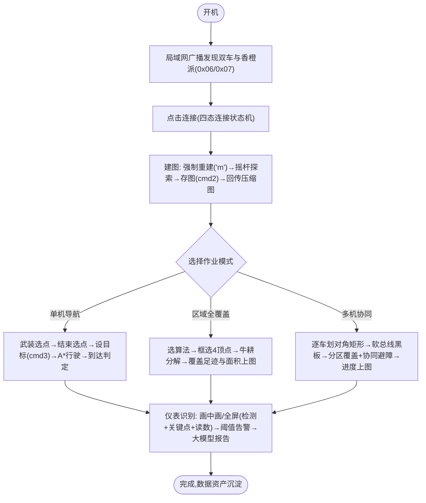
```mermaid
flowchart TB
  START([开机]) --> DISC["局域网广播发现双车与香橙派(0x06/0x07)"]
  DISC --> CONN["点击连接(四态连接状态机)"]
  CONN --> BUILD["建图: 强制重建('m')→摇杆探索→存图(cmd2)→回传压缩图"]
  BUILD --> CHOOSE{"选择作业模式"}
  CHOOSE -->|单机导航| NAV["武装选点→结束选点→设目标(cmd3)→A*行驶→到达判定"]
  CHOOSE -->|区域全覆盖| COV["选算法→框选4顶点→牛耕分解→覆盖足迹与面积上图"]
  CHOOSE -->|多机协同| MULTI["逐车划对角矩形→软总线黑板→分区覆盖+协同避障→进度上图"]
  NAV --> VIS
  COV --> VIS
  MULTI --> VIS
  VIS["仪表识别: 画中画/全屏(检测+关键点+读数)→阈值告警→大模型报告"]
  VIS --> END([完成,数据资产沉淀])
```

**图 1-1　端到端作业流程**

如图 1-1 所示，作业流程自开机起始：操作人员首先令平板发现并连接设备；若尚无地图，则先行遥控建图；地图就绪后，按需选择三种作业模式之一——或指定单一目标点令车辆自主导航，或框选区域令车辆全覆盖遍历，或将区域划分给多台车辆协同作业；作业过程中可随时展开视觉窗口查看仪表读数，超阈值时自动告警，并可一键生成分析报告。整个流程在单块平板上完成，操作逻辑与通用地图导航应用高度一致。

## 1.5 理论意义与应用价值

本作品的技术路线——以开源鸿蒙为操作系统、以华为昇腾为人工智能算力、以国产 ArkTS 为应用开发语言、以全自研算法为核心——并非为标新立异，而是精准契合了当前三条国家级战略主线的交汇点，因而兼具技术价值、政策价值与市场价值。

### 1.5.1 政策导向

**其一，具身智能与机器人产业政策。** 工业和信息化部《人形机器人创新发展指导意见》将 2025 年确定为关键节点，要求关键技术取得突破，并特别强调确保核心部组件安全有效供给——这正是"自主可控"在机器人领域的具体表述。业界普遍将 2025 年称为机器人"量产元年"，国内整机企业逾 140 家、发布产品逾 330 款。2025 年 12 月，工业和信息化部成立"人形机器人与具身智能标准化技术委员会"，标志该领域进入标准化与产业化加速期。此外，相关部委联合推出的专项行动覆盖多个省市，划定了工业制造、民生服务、特种作业三大核心方向，而工业巡检正属于其中的"特种作业"重点方向。

**其二，国务院"人工智能+"行动。** 2025 年 8 月，国务院印发《关于深入实施"人工智能+"行动的意见》，部署了科技、产业、消费、民生、治理、全球合作六大重点行动，并提出强化八项基础支撑能力。其中两项与本作品高度契合：一为"促进开源生态繁荣"——本作品深度运用开源鸿蒙，是开源生态的真实落地案例；二为"提升安全能力水平"——本作品以机器人替代人员进入高危环境，并内置多重安全机制。《意见》提出的目标为：到 2027 年新一代智能终端、智能体等应用普及率超过 70%，到 2030 年超过 90%。工业巡检机器人正是智能终端与智能体在特种作业领域的典型形态。

**其三，信息技术应用创新与自主可控。** 2025 年被视为信创产业由"国产替代"向"自主可控"跃迁的关键之年，其核心任务在于构建国产化的信息技术软硬件底层架构、解决核心技术关键环节的"卡脖子"问题。机器人是软硬件深度耦合的系统工程，同时涉及操作系统、人工智能算力、开发语言、通信中间件与核心算法等多个环节；若上述环节全部基于国产生态实现，即构成一个全栈自主可控的示范样本。本作品恰实现了这一点。

综合而言，上述三条主线指向同一方向：国家既要推动机器人产业做大，又要以人工智能赋能千行百业，更要保障核心技术不受制于人。一台全栈国产、自主可控、且能在工业现场实际作业的巡检机器人，恰好同时回应了这三重诉求；这也构成本作品在立项层面的根本价值——它并非追逐单一热点，而是立足于三条国家战略的交汇之处。

### 1.5.2 市场价值

工业巡检机器人不仅有政策牵引，亦有真实且高速增长的市场需求，相关数据如表 1-1 所示。

**表 1-1　中国智能巡检机器人市场规模（不同口径，供参考）**

| 指标 | 2025 年 | 2026 年（预测） | 同比增速 |
|---|---|---|---|
| 市场规模 | 27.48 亿元 | 31.85 亿元 | 约 15.9% |
| 市场需求量 | 7738 台 | 9722 台 | 约 25.6% |

其中，电力领域为最主要的应用市场，2025 年占比约 88.54%；另有研究机构按不同口径预计市场规模将突破 70 亿元量级。无论采用何种口径，该市场均处于高速增长阶段：电力为基本盘，化工、轨道交通与仓储为增量空间。本作品所具备的区域全覆盖与多机协同能力，恰好契合仓储、厂房等需要大面积无遗漏巡查的增量场景。

### 1.5.3 自主可控的战略意义

需要特别指出的是，本作品的技术选型并非"为国产而国产"，而是每一项选型均具备工程上的合理性，且这些最优选型恰好落于国产生态之内：选用开源鸿蒙，是因其原生提供分布式软总线与可信组网能力；选用华为昇腾，是因其可在边缘侧完成低时延推理、数据不出端；选用 ArkTS，是因其与鸿蒙界面框架天然契合；算法全面自研，是因其最具可控性、亦最能规避对国外开源中间件的路径依赖；分析大模型本地化部署，是因巡检数据涉及工业安全、不宜上传云端。

从方法论层面，本作品亦具备可复制的工程价值。工业机器人项目的集成失败几乎均源于接口不一致；本作品以一套接口契约目录作为三端唯一事实来源，辅以逐字节对账与异步对接问答机制，从机制上规避了这一顽疾，该方法对任何多人、多语言、多设备的系统工程均具借鉴意义。综上，本作品既是一台可实际作业的机器人，亦是一份"在国产生态下如何开展机器人系统工程"的范本：它证明了在不依赖 ROS、不依赖国外通用算力、不依赖国外云端人工智能的条件下，同样能够构建出跑通完整闭环的工业机器人系统。

# 二、设计思路与方案

## 2.1 总体设计原则

本系统的整体形态由四条贯穿始终的设计原则所决定。这四条原则并非事后归纳的总结，而是自设计之初即确立、并直接决定了系统结构的根本性选择。

**原则一，异构分布、各司其职。** 巡检机器人系统包含三类性质迥异的任务：人机交互与可视化要求现代的界面框架与良好的操作体验，实时运动控制要求确定性强、时延低的嵌入式执行，人工智能视觉推理则要求专门的神经网络算力。若将三类任务置于同一计算单元，必然顾此失彼。故本系统将其分置于三个最适宜的设备之上——交互置于 HarmonyOS 平板，实时控制置于运行 OpenHarmony 的紫派主控，视觉推理置于搭载昇腾神经网络处理器的香橙派；三者物理隔离、互不编译依赖，仅通过契约化接口通信。

**原则二，契约先行（Contract-First）。** 三个节点采用三种语言、运行于三种操作系统，彼此不依赖对方源码编译。此种架构的最大风险在于接口不一致——事实上，工业机器人项目的集成失败几乎均源于此。本系统的应对之策是：将全部跨设备接口集中于 `contracts/` 目录，作为三端唯一的事实来源；任何一端欲变更协议，须先修订契约文档，再修改两侧代码，并做到逐字节、逐字段一致。该机制将"系统集成"由一项依赖经验与运气的工作，转变为一项有据可查、可逐项对账的工程。

**原则三，视觉链路与导航链路彻底解耦。** 视觉（仪表识别）与导航（建图、行驶）是两项相互独立的任务，不应彼此牵制。本系统使视觉链路在网络层（独立套接字）、线程层（独立收帧线程）、代码依赖层（视觉服务不引用任何导航模块）三个层面与导航链路完全隔离。由此，操作人员展开或收起视觉窗口，仅影响该条视觉连接，导航的保活、控制与建图照常运行，互不阻塞。

**原则四，将机器人系统产品化为"近似地图导航应用"的交互。** 机器人系统本身复杂，但其操作者未必具备专业背景。本系统借鉴成熟地图导航应用的交互范式——以全屏地图为底、以浮层承载操作、以分步引导降低门槛、以状态门控保障安全，使现场人员能够以熟悉的"点选地图、点击按钮"方式，完成建图、选点、覆盖、多机调度等原本需要专业知识的操作。

## 2.2 技术路线与选型权衡

本系统的每一项核心选型，均在"功能可实现性"之外，进一步权衡了"是否自主可控"，其结果如表 2-1 所示。

**表 2-1　核心技术选型及理由**

| 选型 | 所替代的方案 | 选择理由 |
|---|---|---|
| 开源鸿蒙 OpenHarmony 5.0 | Ubuntu/Linux + ROS | 国产可控；分布式软总线、可信组网、设备发现为系统原生能力 |
| 自定义九字节 UDP 协议 | ROS 话题 / gRPC / JSON-RPC | 嵌入式实时控制开销极低、确定性强、无序列化框架依赖 |
| 鸿蒙分布式软总线 | 自建远程过程调用 / 消息代理 | 设备发现、可信组网、数据对象自动同步，开箱即用 |
| 华为昇腾 NPU 与 ATC/OM 工具链 | 英伟达 CUDA / TensorRT | 国产边缘算力，推理数据不出端，时延与带宽可控 |
| 全自研 SLAM / A\* / 覆盖 / 轮控 | ROS 的 move_base / amcl / gmapping | 完全自主可控，规避对国外开源机器人中间件的路径依赖 |
| 自采集自训练视觉模型 + 本地大模型 | 现成商用接口 / 国外云端大模型 | 数据安全、低时延、训练全流程自主 |
| 轻量级通信组播总线（紫派内部） | ROS 话题 | 基于 UDP 组播，高带宽、低时延、轻量 |

此处对三项关键权衡作进一步说明。其一，关于不采用 ROS：ROS 是机器人领域事实上的标准中间件，采用之可显著降低开发量，但其导航栈（move_base、amcl、gmapping 等）是一套庞大的国外开源生态，深度依赖意味着将系统的基础构建于他人代码之上；本系统选择全面自研，工作量虽大，却换来了完全的自主可控，亦使开发团队对每一行算法逻辑了然于胸——这一点在实体机调试中价值显著。其二，关于自定义协议而非现成框架：嵌入式实时控制的核心诉求是确定性与低开销，一个定长九字节的二进制报文，发送端直接写入数据视图、接收端直接以字节序转换函数解析，无任何序列化框架、无不确定的内存分配，单个报文即一条完整指令，在弱网与资源受限的车载环境下最为稳定。其三，关于视觉采用昇腾本地推理而非云端：工业巡检数据涉及生产安全，不宜上传云端，且现场网络未必稳定，依赖云端将引入不可控的时延；昇腾使全部推理得以在本地完成，数据不出端、时延确定。

## 2.3 系统总体架构

系统由三个异构节点与四条契约化链路构成，其总体架构如图 2-1 所示。

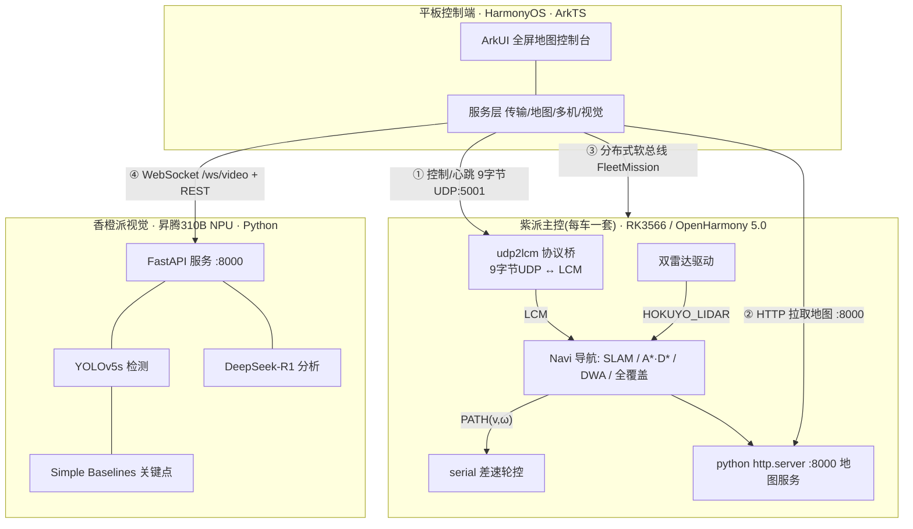
```mermaid
graph TB
  subgraph TABLET["平板控制端 · HarmonyOS · ArkTS"]
    UI["ArkUI 全屏地图控制台"]
    SVC["服务层 传输/地图/多机/视觉"]
    UI --- SVC
  end
  subgraph PURPLE["紫派主控(每车一套) · RK3566 / OpenHarmony 5.0"]
    BRIDGE["udp2lcm 协议桥<br/>9字节UDP ↔ LCM"]
    NAVI["Navi 导航: SLAM / A*·D* / DWA / 全覆盖"]
    WHEEL["serial 差速轮控"]
    HTTP["python http.server :8000 地图服务"]
    LIDAR["双雷达驱动"]
    BRIDGE -- LCM --> NAVI
    NAVI -- "PATH(v,ω)" --> WHEEL
    LIDAR -- "HOKUYO_LIDAR" --> NAVI
    NAVI --> HTTP
  end
  subgraph ORANGE["香橙派视觉 · 昇腾310B NPU · Python"]
    FAST["FastAPI 服务 :8000"]
    YOLO["YOLOv5s 检测"]
    POSE["Simple Baselines 关键点"]
    DS["DeepSeek-R1 分析"]
    FAST --- YOLO --- POSE
    FAST --- DS
  end
  SVC -- "① 控制/心跳 9字节UDP:5001" --> BRIDGE
  SVC -- "② HTTP 拉取地图 :8000" --> HTTP
  SVC -- "③ 分布式软总线 FleetMission" --> PURPLE
  SVC -- "④ WebSocket /ws/video + REST" --> FAST
```

**图 2-1　系统总体架构**

如图 2-1 所示，三个节点内部各自封装其模块，节点之间仅通过四条职责分明的链路通信。平板控制端以声明式界面框架构建全屏地图控制台，其下的服务层分别负责传输、地图、多机与视觉；紫派主控内部以协议桥为对外窗口，承载导航、轮控、地图服务与雷达驱动；香橙派视觉则以 Web 服务为对外窗口，承载检测、关键点与分析模型。四条链路的协议、端口与承载内容各不相同，彼此互不干扰，其划分如表 2-2 所示。

**表 2-2　四条对外链路**

| 链路 | 协议 | 端口 | 承载内容 | 性质 |
|---|---|---|---|---|
| 控制 / 心跳 | 自定义九字节二进制 UDP（大端） | 5001 | 控制指令下发 + 500 毫秒位姿心跳 | 实时、低时延 |
| 地图传输 | HTTP（紫派 `python -m http.server`） | 8000 | 压缩地图 `zipedMap.txt` / 普通地图 `defultMap.txt` | 大数据、可靠 |
| 多机协同 | 鸿蒙分布式软总线 `distributedDataObject` | — | `FleetMission` 任务黑板（协调状态） | 反应式、自动同步 |
| 视觉流 | WebSocket + REST | 8000（香橙派） | JPEG 帧 + 读数/告警 JSON + 配置/报告 | 流式、可独立连断 |

在紫派主控内部，各 C/C++ 模块之间另以一层轻量级通信组播总线（LCM）连接，其主要信道如表 2-3 所示。协议桥（udp2lcm）是连接"平板侧"与"紫派内部"的枢纽：它将平板下发的九字节指令翻译为对应的 LCM 命令号转发给导航与轮控模块，又将导航产出的位姿封装为九字节心跳回传平板。此种"桥接"设计使平板无需知悉紫派内部采用 LCM，仅需面对一套简洁的九字节协议。

**表 2-3　紫派内部主要 LCM 信道**

| 信道 | 方向 | 用途 |
|---|---|---|
| `HOKUYO_LIDAR` | 雷达 → 导航 | 一圈激光扫描数据，供 SLAM 建图与定位 |
| `POSE` | 轮控 → 导航 | 里程计位姿，约每 15 毫秒发布一次 |
| `CURRENTPOSE` | 导航 → 上层 | 融合后的当前位姿，亦为平板心跳的来源 |
| `ROBOT_CONTROL` | 桥/上层 → 导航 | 通用控制命令与状态回包（命令号 7、10、20、30、32、122–127 等） |
| `PATH` | 导航 → 轮控 | 导航输出的线速度与角速度 |
| `wheel_ctrl` | 桥 → 轮控 | 建图阶段的手动遥控指令 |

## 2.4 通信协议设计

### 2.4.1 九字节协议的设计

平板与紫派之间的全部控制与心跳，均以一个定长九字节、大端字节序的二进制报文承载，其字节布局如图 2-2 所示。

```
发送方向（平板 → 紫派，9 字节，大端/网络序）：
┌──────┬────────┬───────┬──────────────┬──────────────┬────────┐
│ byte0│ byte1  │ byte2 │  byte3–4     │  byte5–6     │ byte7–8│
│ 命令码│方向/序号│ 速度  │ 目标X (int16)│ 目标Y (int16)│  保留  │
└──────┴────────┴───────┴──────────────┴──────────────┴────────┘

接收方向（紫派 → 平板，9 字节，大端，每 500 毫秒一帧）：
┌──────┬───────┬──────────────┬──────────────┬──────────────┐
│ byte0│  保留 │  byte3–4 X   │  byte5–6 Y   │  byte7–8 朝向 │
│ =3   │       │ 当前X (int16)│ 当前Y (int16)│  朝向(度)     │
└──────┴───────┴──────────────┴──────────────┴──────────────┘
```

**图 2-2　九字节协议字节布局**

该协议虽简，却蕴含若干精巧设计。其一为"首字节双关"：命令码的取值刻意对齐 ASCII 编码，故同一 byte0 既表示平板的当前状态，亦表示下发给紫派的命令码——例如全路径覆盖命令为 102，恰为字符 `'f'`；强制建图命令为 0x6d，恰为字符 `'m'`；覆盖矩形的两对角点命令为 107 与 108，恰为字符 `'k'` 与 `'l'`。如此设计使紫派的命令分发代码可直接对照字符常量编写，可读性强；平板端亦无需在"状态"与"命令"之间建立映射。其二为"字节按命令复用"：byte1 与 byte2 在不同命令下分别表达运动方向、速度、房间序号或机器人编号；尤以拉取主机地图命令（命令码 105）为甚——它需将主机的四段 IP 地址置入九字节报文，遂复用了两个 16 位整数字段的低字节，将 IP 四段分别置于 byte[1]、byte[2]、byte[4]、byte[6]（byte[3] 与 byte[5] 为整数高字节，恒为零）。其三为"统一坐标单位"：全系统约定 1 个整数单位等于 1/20 米即 5 厘米，恰与地图栅格一一对应（建图分辨率即 0.05 米/格）；朝向以度表示，取值区间为 [-180, 180]，0 度指向 +X 方向，正角沿逆时针朝向 +Y。其四为"安全优先的看门狗"：紫派每 500 毫秒回传一帧心跳，同时设有 3 秒看门狗——若 3 秒内未收到平板的任何指令，立即令轮控急停，以防失控；相应地，平板约定至少每 1 秒发送一次指令以维持连接。

### 2.4.2 零配置设备发现

平板如何获知车辆的 IP，是一个看似简单却关键的问题：紫派的协议桥须收到首个报文方能获知平板 IP，而平板又须先知车辆 IP 方能发送报文，此为一先后相依的死循环。本系统以一个专门的"发现探测"报文予以破解，其时序如图 2-3 所示。

```mermaid
sequenceDiagram
  participant App as 平板
  participant Car as 紫派(车)
  participant Vis as 香橙派(视觉)
  App->>App: 向 255.255.255.255:5001 广播 9 字节 byte0=0x06
  App-->>Car: 0x06 发现探测
  App-->>Vis: 0x06 发现探测
  Car-->>App: 回 9 字节 [0]=0x06 [1]机器人号 [2]状态 [3..8]位姿
  Vis-->>App: 回 9 字节 [0]=0x07 (以区分视觉源)
  Note over Car: 仅回包,不记录客户端/不启心跳/不武装急停
  App->>App: 依应答源IP收集设备; 收到0x07即设为视觉主机
```

**图 2-3　零配置设备发现时序**

如图 2-3 所示，平板向广播地址发送一个首字节为 0x06 的发现探测报文，紫派收到后仅回送一帧应答，且不记录客户端、不启动心跳、不武装看门狗——此点至关重要：否则平板一经广播即会使子网内所有车辆进入"已连接受控"状态，未被选中的车辆将随后因 3 秒未收到指令而集体急停。香橙派视觉设备则回送首字节为 0x07 的应答，以区分其为视觉源而非车辆。平板依应答报文的源 IP 收集设备，收到 0x07 即将该 IP 设为视觉服务地址。由此，即便香橙派采用动态 IP，平板亦可经一次广播自动定位之，无需硬编码地址。

### 2.4.3 命令到 LCM 命令号的翻译

协议桥的核心职责是将九字节命令翻译为紫派内部的 LCM 命令号，其映射关系如图 2-4 所示。

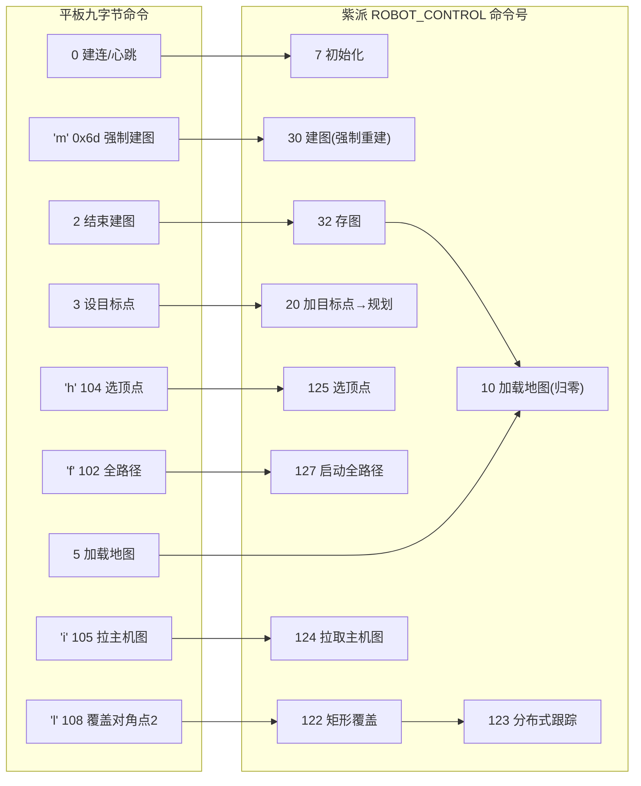
```mermaid
graph LR
  subgraph APP["平板九字节命令"]
    c0["0 建连/心跳"]
    cm["'m' 0x6d 强制建图"]
    c2["2 结束建图"]
    c3["3 设目标点"]
    c5["5 加载地图"]
    cf["'f' 102 全路径"]
    ch["'h' 104 选顶点"]
    cl["'l' 108 覆盖对角点2"]
    ci["'i' 105 拉主机图"]
  end
  subgraph LCM["紫派 ROBOT_CONTROL 命令号"]
    L7["7 初始化"]
    L30["30 建图(强制重建)"]
    L32["32 存图"]
    L10["10 加载地图(归零)"]
    L20["20 加目标点→规划"]
    L125["125 选顶点"]
    L127["127 启动全路径"]
    L122["122 矩形覆盖"]
    L123["123 分布式跟踪"]
    L124["124 拉取主机图"]
  end
  c0 --> L7
  cm --> L30
  c2 --> L32 --> L10
  c3 --> L20
  c5 --> L10
  cf --> L127
  ch --> L125
  cl --> L122 --> L123
  ci --> L124
```

**图 2-4　九字节命令到 LCM 命令号的翻译**

### 2.4.4 连接保活与看门狗时序

连接建立后的保活与急停机制如图 2-5 所示。平板发送首个报文后，协议桥即捕获其 IP、启动心跳线程，并向导航发布初始化命令；此后双方维持双向周期通信——紫派每 500 毫秒回传心跳，平板至少每 1 秒下发指令（即便为空指令亦可）。一旦平板因崩溃或断网而连续 3 秒未发任何指令，协议桥的轮询将超时，立即向轮控发布零速度命令使底盘急停。

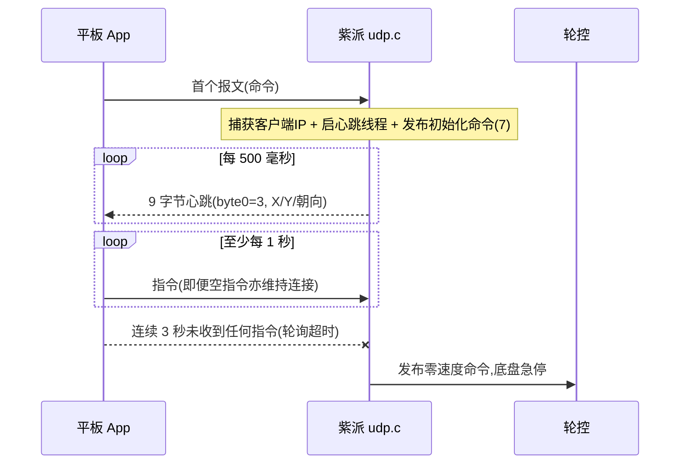
```mermaid
sequenceDiagram
  participant App as 平板 App
  participant Bridge as 紫派 udp.c
  participant Wheel as 轮控
  App->>Bridge: 首个报文(命令)
  Note over Bridge: 捕获客户端IP + 启心跳线程 + 发布初始化命令(7)
  loop 每 500 毫秒
    Bridge-->>App: 9 字节心跳(byte0=3, X/Y/朝向)
  end
  loop 至少每 1 秒
    App->>Bridge: 指令(即便空指令亦维持连接)
  end
  App--xBridge: 连续 3 秒未收到任何指令(轮询超时)
  Bridge->>Wheel: 发布零速度命令,底盘急停
```

**图 2-5　连接保活与看门狗时序**

### 2.4.5 一条指令的完整链路

为帮助读者理解整条控制链路，以"开始导航"指令为例，说明其自操作人员的指尖直至车轮转动的完整传递过程。其一，操作人员在平板地图上选定目标点并点击"开始导航"。其二，平板将目标点的屏幕坐标换算为真实世界坐标，再除以 0.05 换算为 5 厘米栅格单位，构造一个九字节报文：byte0 置为 3，byte3–4 置目标 X，byte5–6 置目标 Y，以大端写入。其三，该报文经 UDP 发送至紫派 5001 端口。其四，紫派协议桥收到报文，更新"最近一次收到指令的时刻"以喂狗，并将报文交由翻译函数处理。其五，翻译函数识别 byte0 为 3，构造一条命令号为 20（加目标点）的 LCM 消息，发布至 ROBOT_CONTROL 信道。其六，导航模块收到该消息，将目标点加入路径点队列，触发 A\* 规划。其七，A\* 在概率栅格地图上规划出一条代价最小、远离障碍的路径。其八，导航沿路径逐步计算当前应有的线速度与角速度，经 PATH 信道发送至轮控。其九，轮控将线速度与角速度解算为左右轮差速，经串口下发至驱动板，车轮转动。其十，与此同时，编码器与激光定位持续更新当前位姿，经 CURRENTPOSE 信道，再由协议桥封装为九字节心跳每 500 毫秒回传平板；平板据此更新车辆在地图上的位置与朝向、绘制轨迹，并判定是否接近目标。整条链路上，平板仅面对九字节协议，紫派内部各模块仅面对 LCM；此种分层与桥接设计，使系统得以由不同成员分头实现而又能顺利集成。

## 2.5 核心算法原理

本节为全文的技术核心，逐一阐释机器人实现自主建图、自主行驶与仪表识别所依赖的算法原理。考虑到读者未必具备机器人或人工智能专业背景，每一算法均先以图示呈现其结构，再以文字阐释其机理，力求严谨而不失明晰。

### 2.5.1 导航算法总体分层

机器人的自主行驶并非依赖单一算法，而是依靠一整套算法分层协作完成。其总体分层如图 2-6 所示。

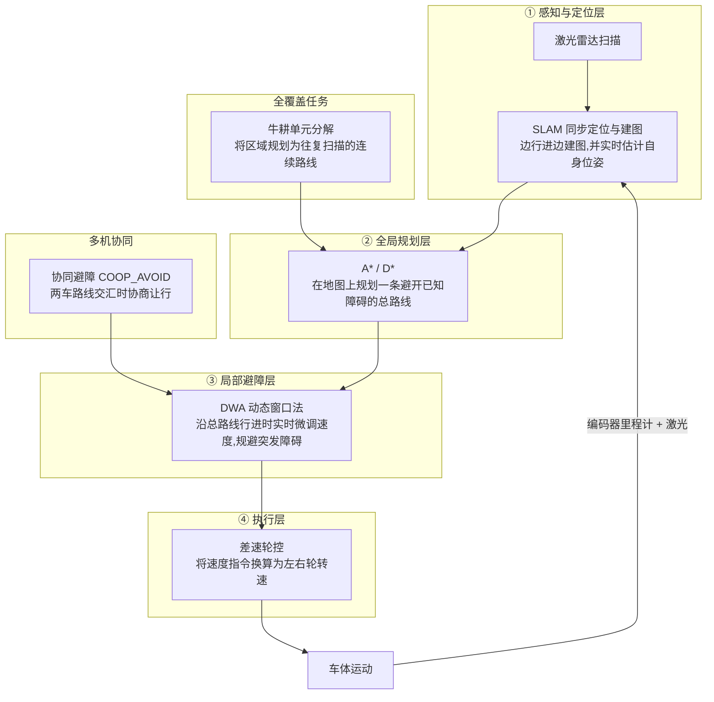
```mermaid
graph TB
  subgraph SENSE["① 感知与定位层"]
    LIDAR["激光雷达扫描"] --> SLAM["SLAM 同步定位与建图<br/>边行进边建图,并实时估计自身位姿"]
  end
  subgraph GLOBAL["② 全局规划层"]
    SLAM --> ASTAR["A* / D*<br/>在地图上规划一条避开已知障碍的总路线"]
  end
  subgraph LOCAL["③ 局部避障层"]
    ASTAR --> DWA["DWA 动态窗口法<br/>沿总路线行进时实时微调速度,规避突发障碍"]
  end
  subgraph EXEC["④ 执行层"]
    DWA --> WHEEL["差速轮控<br/>将速度指令换算为左右轮转速"]
  end
  WHEEL --> MOVE["车体运动"]
  MOVE -->|"编码器里程计 + 激光"| SLAM
  subgraph COVER["全覆盖任务"]
    BCD["牛耕单元分解<br/>将区域规划为往复扫描的连续路线"] --> ASTAR
  end
  subgraph MULTI["多机协同"]
    COOP["协同避障 COOP_AVOID<br/>两车路线交汇时协商让行"] --> DWA
  end
```

**图 2-6　导航算法总体分层**

如图 2-6 所示，自上而下构成一条由感知到执行的指挥链。第一层为感知与定位：激光雷达持续扫描周围环境，SLAM 算法一面将扫描所得的墙体拼合为地图，一面实时估计机器人在地图中的位置与朝向——此为后续一切规划的前提，因为不确定自身位置便无从规划路径。第二层为全局规划：A\* 算法（及其动态版本 D\*）在地图上规划出一条由当前位置至目标点、绕开全部已知障碍的总路线。第三层为局部避障：动态窗口法负责在车辆沿总路线行进时，实时应对地图所未记录的突发情形（如临时出现的人员或物体），通过微调速度与转向予以规避。第四层为执行：差速轮控将上层给出的速度指令换算为左右两轮各自的转速。车体一经运动，编码器与激光即将新的位姿反馈至第一层，形成闭环，循环往复。此外，图右侧另有两项专门任务：执行区域全覆盖时，牛耕单元分解算法负责将整片区域规划为一条往复式、无遗漏、无重叠的扫描路线，再交由全局规划执行；多机协同时，协同避障机制负责在两车路线交汇时协商让行。以下逐一阐释。

### 2.5.2 激光同步定位与建图

同步定位与建图（SLAM）需同时解决两个相互依存的问题：定位需以地图为参照，建图需以位姿为基准。紫派主控的 SLAM 全部自研，其核心由扫描匹配、概率栅格与粒子滤波三部分构成，总体流程如图 2-7 所示。

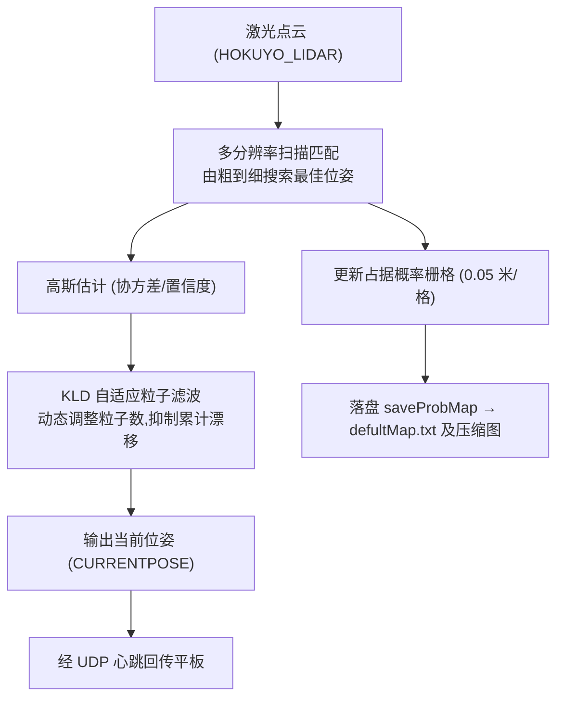
```mermaid
graph TB
  L["激光点云 (HOKUYO_LIDAR)"] --> SM["多分辨率扫描匹配<br/>由粗到细搜索最佳位姿"]
  SM --> GE["高斯估计 (协方差/置信度)"]
  GE --> PF["KLD 自适应粒子滤波<br/>动态调整粒子数,抑制累计漂移"]
  PF --> POSE["输出当前位姿 (CURRENTPOSE)"]
  SM --> MAP["更新占据概率栅格 (0.05 米/格)"]
  MAP --> SAVE["落盘 saveProbMap → defultMap.txt 及压缩图"]
  POSE --> HB["经 UDP 心跳回传平板"]
```

**图 2-7　SLAM 总体流程**

如图 2-7 所示，SLAM 以激光点云为输入，经多分辨率扫描匹配估计位姿，经高斯估计给出位姿的不确定度，再经自适应粒子滤波抑制漂移，最终输出当前位姿并更新地图。其中三个环节的机理分述如下。

**多分辨率扫描匹配。** 机器人虽不能精确获知自身位置，但可依据上一时刻的位姿与里程计推算出一个近似位置。扫描匹配即在该近似位置附近的一个小范围内搜索，将当前帧激光"贴合"于已建地图之上，寻找贴合度最高的位姿——所谓贴合，指激光所及之点恰落于地图的墙体之上，既不穿墙，亦不悬空。其"多分辨率"策略如图 2-8 所示：若直接在最精细的尺度上逐一搜索，候选过多、耗时过长；故先在粗尺度（大格、大范围）上快速圈定大致区域，再于该小区域内以细尺度精修，兼顾搜索范围与精度。

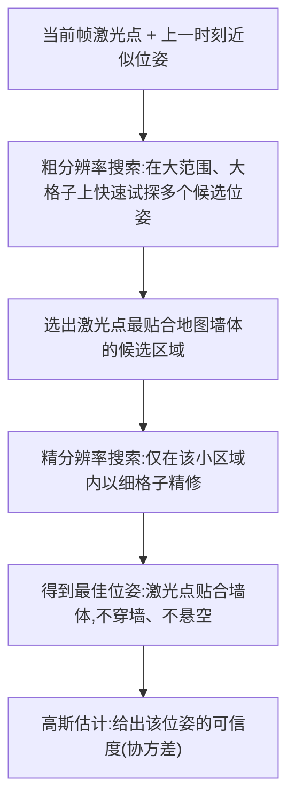
```mermaid
flowchart TB
  IN["当前帧激光点 + 上一时刻近似位姿"] --> COARSE["粗分辨率搜索:在大范围、大格子上快速试探多个候选位姿"]
  COARSE --> PICK1["选出激光点最贴合地图墙体的候选区域"]
  PICK1 --> FINE["精分辨率搜索:仅在该小区域内以细格子精修"]
  FINE --> BEST["得到最佳位姿:激光点贴合墙体,不穿墙、不悬空"]
  BEST --> COV["高斯估计:给出该位姿的可信度(协方差)"]
```

**图 2-8　多分辨率扫描匹配过程**

**自适应粒子滤波。** 里程计的误差随时间累积（行进愈久愈不准），仅凭其定位将逐渐偏离真实位置。粒子滤波的机理如图 2-9 所示：同时维护大量"粒子"，每个粒子代表一个候选位姿；依扫描匹配的贴合度为各粒子赋权，贴合度高者权重大；继而重采样，复制高权重粒子、淘汰低权重粒子，使粒子群逐渐向真实位姿收敛；全部粒子的加权平均即为当前最佳位姿估计。本系统采用 KLD 自适应策略：当位姿确定时（粒子聚集）使用较少粒子以节省算力，当位姿不确定时（粒子分散）自动增加粒子以保证精度，从而在精度与算力之间取得平衡，有效抑制了里程计的累计漂移。


```mermaid
graph LR
  P0["撒布粒子:每个粒子对应一个候选位姿"] --> W["按扫描匹配贴合度为各粒子赋权"]
  W --> R["重采样:复制高权重粒子,淘汰低权重粒子"]
  R --> EST["全部粒子的加权平均 = 当前最佳位姿"]
  EST --> KLD["KLD 自适应:位姿确定则减少粒子,不确定则增加粒子"]
  KLD --> P0
```

**图 2-9　自适应粒子滤波过程**

**占据概率栅格。** 地图以占据概率栅格存储：将空间划分为 0.05 米的方格，每格维护其被占据的概率（上限 0.9、下限 0.2）。激光每完成一帧扫描，即更新其所经过的格子（降低占据概率）与命中的格子（提高占据概率）。其更新机制可作如下理解：每个格子维护一个"被占据的可能性"数值，激光束自雷达射出、沿直线传播直至命中障碍——在这条光束所穿过的途中各格，本帧观测表明"此处为空"，故下调其占据概率；而在光束末端命中之格，本帧观测表明"此处有障碍"，故上调其占据概率。由于设有上下限（0.9 与 0.2），单帧观测不会将某格的状态推至极端，须经多帧一致的观测方能使某格趋于"确信占据"或"确信空旷"。采用概率而非"占据／空闲"二值表示，正是为了融合多帧观测、抑制单帧噪声——某格偶被误测为障碍并不会立即翻转其状态，须多帧一致方予确信，从而使地图更为干净稳定。这一设计对工业现场尤为重要，因现场常有行人、临时器物等动态干扰，若以单帧二值更新，地图将充斥瞬时噪点而难以用于规划。建图完成后，系统先落盘一份未优化的中间地图，再经形态学去噪、轮廓规整等优化生成正式的主地图，由 `saveProbMap` 写出。

地图文件首行包含 7 个数值，其含义如表 2-4 所示，经与紫派源码逐字段对账确认。数据区以空格分隔，取值 -1 表示障碍、0 表示空旷、2 表示已覆盖。世界坐标至栅格坐标的换算关系为：栅格坐标 = (世界坐标 − x0) / 每格米数。

**表 2-4　地图文件首行字段**

| 序位 | [0] | [1] | [2] | [3] | [4] | [5] | [6] |
|---|---|---|---|---|---|---|---|
| 字段 | 量程 | 分辨率 | 栅格行数 | 栅格列数 | 每格米数(≈0.05) | x0 | y0 |
| 说明 | — | — | 行数 | 列数 | 每格对应的米数 | 栅格最小角的世界 X 坐标(可为负) | 栅格最小角的世界 Y 坐标 |

此处须强调一处经实体机验证的关键约定。早期平板曾按"取首行末两个数值作为行列"解析地图，然而行数、列数实居于首行第 3、4 序位，末两个数值实为 x0 与 y0（栅格最小角的世界坐标偏移，常为负值）；误取末两者即将负偏移当作地图尺寸，导致地图渲染为空白。经对照源码逐字段核对后改为按序位取第 3、4 个数值，此问题方得根除。另有一处建图语义的约定：紫派的"建图"命令（命令码 0）在已存在地图或处于导航状态时会被导航模块忽略而沿用旧图，致使定位漂移；故平板的"开始建图"须发送强制重建命令（命令码 0x6d，即字符 `'m'`），方能清空旧地图、旧路径与旧覆盖产物，从零开始建图。建图的状态流转如图 2-10 所示。

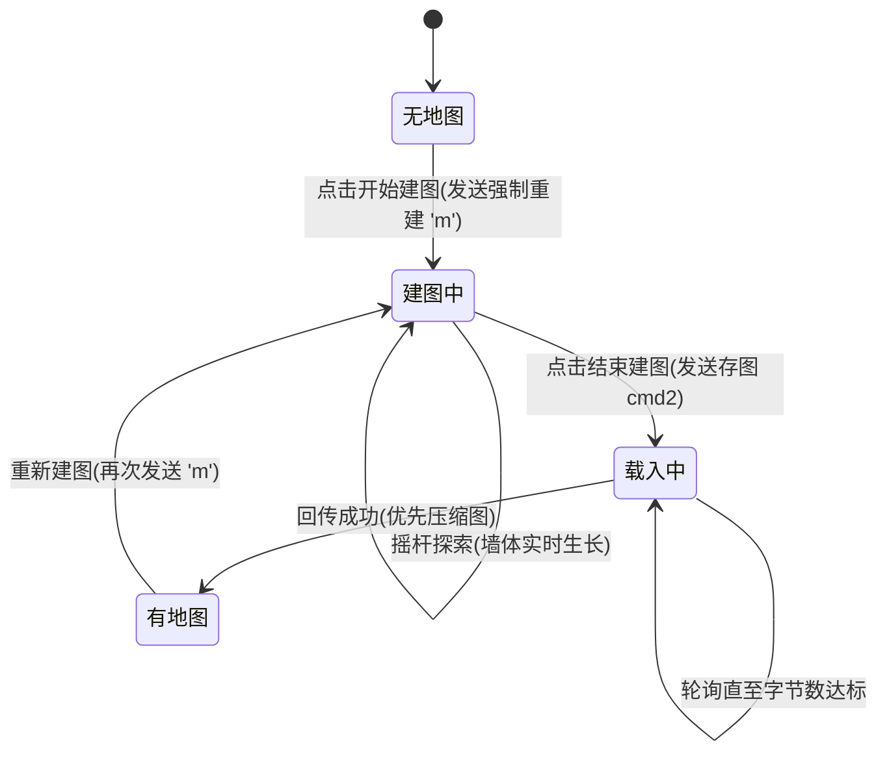
```mermaid
stateDiagram-v2
  [*] --> 无地图
  无地图 --> 建图中: 点击开始建图(发送强制重建 'm')
  建图中 --> 建图中: 摇杆探索(墙体实时生长)
  建图中 --> 载入中: 点击结束建图(发送存图 cmd2)
  载入中 --> 有地图: 回传成功(优先压缩图)
  载入中 --> 载入中: 轮询直至字节数达标
  有地图 --> 建图中: 重新建图(再次发送 'm')
```

**图 2-10　建图状态流转**

### 2.5.3 全局路径规划与局部避障

地图就绪后，导航须解决"自当前位置至目标点，如何规划一条安全路径"的问题。紫派主控的全局规划器实现了 A\*、D\* 与广度优先三种搜索，并以动态窗口法承担局部避障。

**A\* 全局搜索。** A\* 的搜索过程如图 2-11 所示：维护一个按代价函数 f = g + h 排序的待扩展节点集合（其中 g 为自起点至当前节点的实际代价，h 为当前节点至目标的启发式估计代价），每次取 f 最小的节点予以扩展，直至到达目标，再沿父指针回溯得到路径。其内部以两个集合协同工作：一为待扩展集合（习称开集），存放已发现而尚未展开的节点，并按 f 值排序以便快速取出最有希望者；二为已扩展集合（习称闭集），存放已展开的节点，以免重复访问。代价函数 f = g + h 是 A\* 高效的关键所在：g 项使算法顾及已付出的实际代价、不致绕远，h 项（启发式）使算法朝目标方向定向推进、不致如广度优先般向四周盲目扩散；当 h 不高估真实剩余代价时，A\* 可保证求得最优路径。本系统中每个节点封装其状态（新、开、闭）、g 值、h 值、f 值与父指针，并以邻接关系扩展八个方向的邻居。

本系统在此基础上引入代价分级：栅格状态分为空旷、近障碍与占据三级，并分别赋予递增的通行代价（占据格不可通行）。如此，算法在权衡路径时，宁可多走若干空旷格，也不愿贴近障碍而累积高代价，最终所得路径主动远离障碍、行于通道中央，显著提升实际行驶的安全性——这与"贴墙抄近路"的朴素最短路有本质区别。此外，本系统按机器人半径对障碍作膨胀处理（将障碍向外扩张一个机器人半径），从而把"机器人视为质点"的规划结果等效为"机器人具有实际体积"的可行路径，避免规划出"理论可通、实际碰撞"的窄缝路径；并支持将视觉识别的障碍（如激光难以察觉的玻璃、悬空物）并入地图联合规划，弥补单一激光感知的盲区。

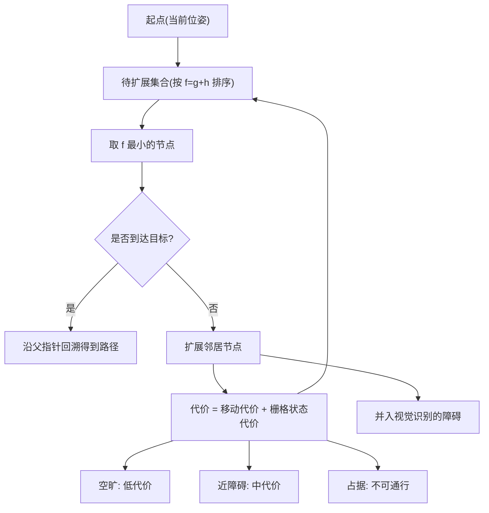
```mermaid
graph TB
  START["起点(当前位姿)"] --> OPEN["待扩展集合(按 f=g+h 排序)"]
  OPEN --> POP["取 f 最小的节点"]
  POP --> GOAL{"是否到达目标?"}
  GOAL -->|是| PATH["沿父指针回溯得到路径"]
  GOAL -->|否| NB["扩展邻居节点"]
  NB --> COST["代价 = 移动代价 + 栅格状态代价"]
  COST --> C1["空旷: 低代价"]
  COST --> C2["近障碍: 中代价"]
  COST --> C3["占据: 不可通行"]
  NB --> VIS["并入视觉识别的障碍"]
  COST --> OPEN
```

**图 2-11　A\* 全局搜索过程**

**D\* 动态重规划。** A\* 适用于一次性规划一条完整路径；但若行进途中地图发生变化（探测到新障碍或环境更新），重新执行完整 A\* 将造成浪费。D\* 为 A\* 的动态版本，其机理如图 2-12 所示：在已有计算结果的基础上，仅对受影响的局部区域作增量修正，即可快速给出新路径。此种增量修正使机器人在动态变化的环境中既能及时避让，又不致因频繁全局重算而卡顿。

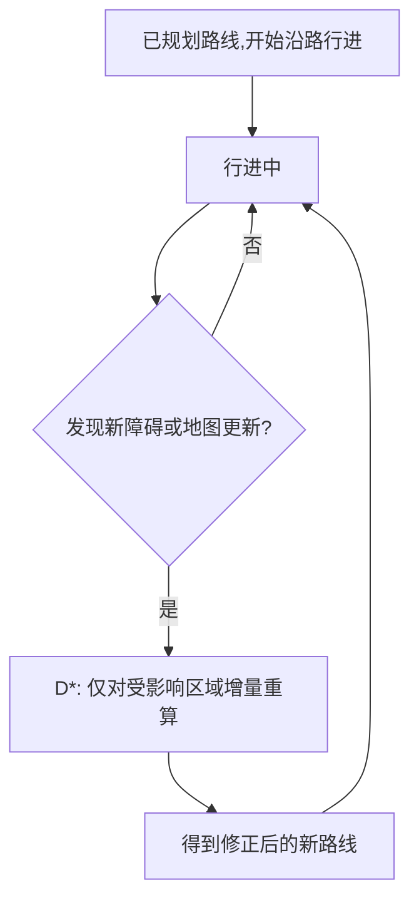
```mermaid
flowchart TB
  PLAN["已规划路线,开始沿路行进"] --> WALK["行进中"]
  WALK --> CHK{"发现新障碍或地图更新?"}
  CHK -->|否| WALK
  CHK -->|是| LOCAL["D*: 仅对受影响区域增量重算"]
  LOCAL --> NEW["得到修正后的新路线"]
  NEW --> WALK
```

**图 2-12　D\* 动态重规划过程**

**动态窗口法局部避障。** 全局规划解决"总体走向"，但现场随时可能出现地图所未记录的障碍（临时通行的人员、移动的设备、另一台车辆），须由动态窗口法在执行层实时规避，其机理如图 2-13 所示。所谓"动态窗口"，指在任一时刻，车辆不能突变至任意速度，而只能在当前速度附近、受物理约束（最大加减速度、最大转向能力）所允许的有限范围内选取下一步速度。动态窗口法在该范围内采样若干"线速度—角速度"组合，对每一组合模拟其后续一小段将行经的轨迹，并依三项指标加权评分：其一为方位项，衡量该轨迹末端朝向目标的程度，越朝向目标得分越高；其二为间距项，衡量该轨迹与最近障碍的距离，越远离障碍得分越高，若轨迹将导致碰撞则直接否决；其三为速度项，衡量行进的快慢，在安全前提下越快得分越高。三项以权重线性组合为总分，权重的取舍体现了"既要避障、又要趋近目标、还要兼顾效率"的折衷。继而选取总分最高的组合付诸执行，下一时刻再行计算。如此，车辆得以在沿全局路线推进的同时，灵活规避突发障碍——全局规划负责"宏观走向正确"，动态窗口法负责"微观行进安全"，二者分工协作，构成"全局规划加局部避障"的经典两层导航架构。当 A\* 规划失败、连续无路径或动态窗口法判定前方不可达时，在多机场景下将触发后文所述的车间协同避障。

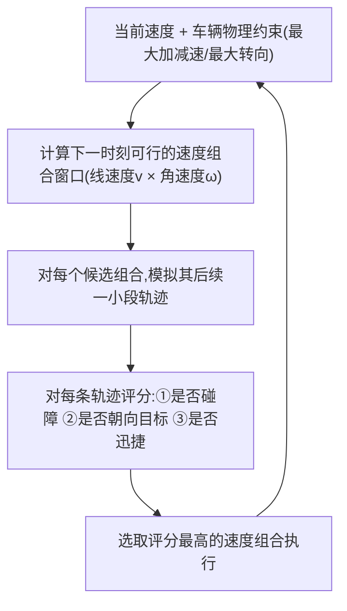
```mermaid
graph TB
  CUR["当前速度 + 车辆物理约束(最大加减速/最大转向)"] --> WIN["计算下一时刻可行的速度组合窗口(线速度v × 角速度ω)"]
  WIN --> SIM["对每个候选组合,模拟其后续一小段轨迹"]
  SIM --> SCORE["对每条轨迹评分:①是否碰障 ②是否朝向目标 ③是否迅捷"]
  SCORE --> PICK["选取评分最高的速度组合执行"]
  PICK --> CUR
```

**图 2-13　动态窗口法局部避障过程**

### 2.5.4 区域全覆盖路径规划

区域全覆盖须将一片区域无遗漏地遍历，为巡检与清扫的核心能力。本系统采用"首选优化算法、失败降级回退"的策略，其总体决策如图 2-14 所示。

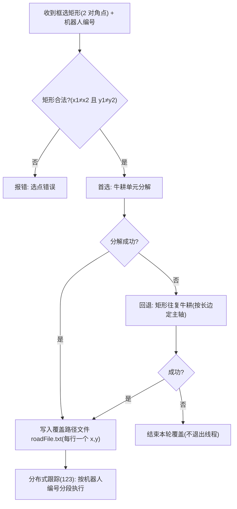
```mermaid
flowchart TB
  S["收到框选矩形(2 对角点) + 机器人编号"] --> CHK{"矩形合法?(x1≠x2 且 y1≠y2)"}
  CHK -->|否| ERR["报错: 选点错误"]
  CHK -->|是| BCD["首选: 牛耕单元分解"]
  BCD --> OK1{"分解成功?"}
  OK1 -->|是| WRITE["写入覆盖路径文件 roadFile.txt(每行一个 x,y)"]
  OK1 -->|否| ZIG["回退: 矩形往复牛耕(按长边定主轴)"]
  ZIG --> OK2{"成功?"}
  OK2 -->|是| WRITE
  OK2 -->|否| FAIL["结束本轮覆盖(不退出线程)"]
  WRITE --> TRACK["分布式跟踪(123): 按机器人编号分段执行"]
```

**图 2-14　区域全覆盖决策与降级**

**首选算法：牛耕单元分解。** "牛耕"指其往复扫描的运动模式，犹如耕作时来回往复。该算法的机理如图 2-15 所示：以一条竖直扫描线自左向右扫过整个区域，每当扫描线触及障碍的边界，区域的连通状况即发生分裂或合并；据此将整片区域切分为若干内部不含障碍的子单元；于各子单元内作往复扫描（一趟扫至边界，横移一个刷宽，反向再扫），子单元之间以 A\* 规划最短连接路径，最终拼合为一条覆盖整片区域的连续路径。

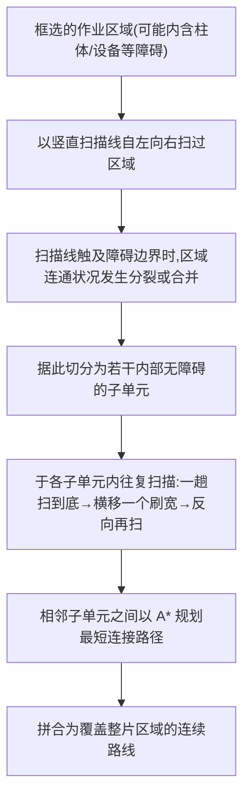
```mermaid
flowchart TB
  A["框选的作业区域(可能内含柱体/设备等障碍)"] --> B["以竖直扫描线自左向右扫过区域"]
  B --> C["扫描线触及障碍边界时,区域连通状况发生分裂或合并"]
  C --> D["据此切分为若干内部无障碍的子单元"]
  D --> E["于各子单元内往复扫描:一趟扫到底→横移一个刷宽→反向再扫"]
  E --> F["相邻子单元之间以 A* 规划最短连接路径"]
  F --> G["拼合为覆盖整片区域的连续路线"]
```

**图 2-15　牛耕单元分解过程**

相较于简单的矩形往复——遇及区域中部的障碍时或将碰撞、或整行跳过而遗留盲区——牛耕单元分解通过"先分解、再分别覆盖"妥善解决了含障碍区域的完整覆盖问题。

覆盖任务由一个独立的覆盖线程承担，其执行逻辑可概括为：等待算法序号就绪后，清空上一轮的覆盖路径队列；确定作业区域的边界——既可由凸包算法依据所选点自动圈定，亦可由操作人员手动选点框定；初始化覆盖状态栅格（记录各格是否已覆盖）并落盘若干中间调试文件以便核查；将当前位姿作为起点入队；继而进入主循环，在每一步选定一个探测方向（前、后、左、右），以 D\* 在该方向规划探测路径，沿路径行进并将沿途格子标记为已覆盖，直至判定整片区域覆盖完毕；最终输出覆盖栅格并将路径写入文件。这一"边探测、边覆盖、边标记"的设计，使覆盖过程能够动态适应实际可通行区域，而非机械地按预设网格行进。**回退算法：矩形往复牛耕。** 若单元分解因故失败，系统自动回退至更为简单可靠的矩形往复：比较矩形横、纵边长，取较长者为主轴作规则往复扫描，扫描线间距（刷宽）由机器人安全半径决定。此种"首选优化、失败降级"的设计，确保了"总能扫起"，不致因复杂情形而完全失败。**可选算法：最小生成树。** 单车全路径模式另提供最小生成树覆盖算法，由命令携带算法序号供紫派选择。覆盖路径写入文件 `roadFile.txt`（每行一个 `x,y` 栅格点）；多机协同时，主车（编号 0）执行路径前半段，子车（编号 1）逆序执行后半段，从而两车各扫一半、互不重叠。

### 2.5.5 差速运动学与里程闭环

轮控为将"行进意图"转化为"车轮转动"的执行层，其结构如图 2-16 所示。轮控模块订阅两类来源的指令：导航产出的速度指令（线速度 v 与角速度 ω）与建图阶段的手动遥控指令；以差速驱动模型将其解算为左右轮速度——左轮速度为 v − ω·d/2，右轮速度为 v + ω·d/2（d 为轮距）；解算结果经串口下发至电机驱动板。与此同时，电机编码器每 15 毫秒经 POSE 信道回传一次位姿估计，与 SLAM 的激光定位互补——激光定位精确而频率较低，里程计快速而存在漂移，二者融合取长补短，构成里程闭环。

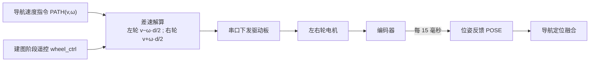
```mermaid
graph LR
  PATH["导航速度指令 PATH(v,ω)"] --> SOLVE["差速解算<br/>左轮 v−ω·d/2 ; 右轮 v+ω·d/2"]
  WCTRL["建图阶段遥控 wheel_ctrl"] --> SOLVE
  SOLVE --> SERIAL["串口下发驱动板"]
  SERIAL --> MOTOR["左右轮电机"]
  MOTOR --> ENC["编码器"]
  ENC -->|"每 15 毫秒"| POSE["位姿反馈 POSE"]
  POSE --> NAVI["导航定位融合"]
```

**图 2-16　差速运动学与里程闭环**

### 2.5.6 边缘视觉读数原理

视觉子系统需解决"识别指针式仪表的读数"这一问题，其处理在香橙派的昇腾神经网络处理器上分两级流水线完成，原理流程如图 2-17 所示（其工程实现的完整细节见第三章 3.3 节）。


```mermaid
flowchart LR
  CAM["摄像头采集"] --> YOLO["第一级 YOLOv5s 检测<br/>在整幅画面中定位仪表,输出检测框"]
  YOLO --> CROP["按检测框裁剪表盘子图"]
  CROP --> POSE2["第二级 关键点检测<br/>在子图内回归 4 个关键点"]
  POSE2 --> GEO["几何法换算读数"]
  GEO --> OUT["渲染叠加 + 推送平板"]
```

**图 2-17　边缘视觉读数原理流程**

如图 2-17 所示，原始画面分辨率较高，直接于其上定位精细关键点既慢且欠准；故先由第一级目标检测模型在整幅画面中定位仪表区域，裁剪出表盘子图，既去除背景干扰、又大幅减少待处理像素；再由第二级关键点检测模型在子图内回归四个关键点（表盘中心、指针尖端、零刻度、满刻度）。读数环节为纯几何计算，无需人工智能参与，其原理如图 2-18 所示：以表盘中心为原点，以零刻度方向为 0 度，以反正切函数算出指针尖端相对零刻度的夹角，所得夹角占"零刻度至满刻度总夹角"的比例，即等于读数占整个量程的比例；再查标定文件得到该表的量程，换算为真实物理读数。该方法泛化性强——无需为每一种仪表单独训练分类模型，凡能定位此四点的圆盘指针仪表均可读取。

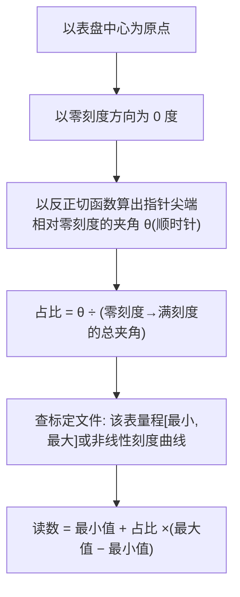
```mermaid
graph TB
  C["以表盘中心为原点"] --> Z["以零刻度方向为 0 度"]
  Z --> ANG["以反正切函数算出指针尖端相对零刻度的夹角 θ(顺时针)"]
  ANG --> RATIO["占比 = θ ÷ (零刻度→满刻度的总夹角)"]
  RATIO --> CALIB["查标定文件: 该表量程[最小,最大]或非线性刻度曲线"]
  CALIB --> READ["读数 = 最小值 + 占比 ×(最大值 − 最小值)"]
```

**图 2-18　几何法读数原理**

### 2.5.7 多机协同与分布式软总线

多机协同需解决"令多台车辆共享地图、分工作业、互不冲突"的问题。本系统的多机协同直接构建于华为鸿蒙的分布式软总线之上，以其原生的分布式数据对象作为一份所有设备共享的任务黑板。鉴于分布式软总线为本系统最具鸿蒙生态特色之处，此处先阐释其原理，再说明任务黑板与协同流程。

**分布式软总线原理。** 分布式软总线为鸿蒙操作系统的一项系统级能力，其作用在于：使原本相互独立的多台设备（平板、车 A、车 B）在用户与程序视角下融合为"一台逻辑上的超级设备"，彼此之间可如同访问本机资源一般便捷地共享数据、调用能力，而开发者无需自行编写 IP 管理、套接字连接、消息协议与断线重连等底层通信代码。其能力分层如图 2-19 所示。

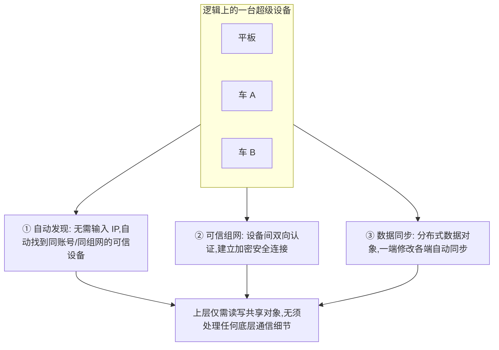
```mermaid
graph TB
  subgraph SUPER["逻辑上的一台超级设备"]
    direction LR
    TAB["平板"]
    C1["车 A"]
    C2["车 B"]
  end
  SUPER --> L1["① 自动发现: 无需输入 IP,自动找到同账号/同组网的可信设备"]
  SUPER --> L2["② 可信组网: 设备间双向认证,建立加密安全连接"]
  SUPER --> L3["③ 数据同步: 分布式数据对象,一端修改各端自动同步"]
  L1 --> APP["上层仅需读写共享对象,无须处理任何底层通信细节"]
  L2 --> APP
  L3 --> APP
```

**图 2-19　分布式软总线原理**

如图 2-19 所示，平板、车 A、车 B 在分布式软总线的协调下被虚拟为一台超级设备。软总线为其提供三层基础能力：其一为自动发现，设备无需手工输入 IP，软总线自动发现同一账号或同一可信组网内的其他设备；其二为可信组网，设备之间先行双向身份认证、再建立加密连接，确保仅可信设备可加入；其三为数据同步，亦即本系统所倚重者——它提供一种"分布式数据对象"，凡加入同一会话、且应用包名相同的设备，对该对象任一属性的修改，其余设备均会自动、实时地收到通知。本系统据此将多机协同由"相互远程调用"简化为"读写共享对象"。

**任务黑板与协同流程。** 本系统在分布式数据对象之上定义了一份名为 FleetMission 的任务黑板，承载多机协同的全部协调状态，其结构如图 2-20 所示。各节点（平板与各车的车载代理）常驻于同一会话、共享该黑板：平板担任规划者，向黑板写入区域划分；各车的车载代理监听到属于本车的任务，即将其翻译为本机的九字节 UDP 指令下发；各车的位姿与进度又经车载代理写回黑板，平板据此实时渲染所有车辆。整个过程不含显式的远程调用，仅有对共享状态的读写。

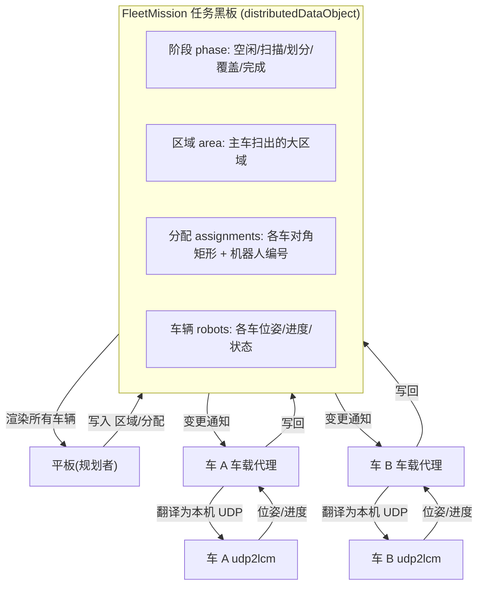
```mermaid
graph TB
  subgraph BB["FleetMission 任务黑板 (distributedDataObject)"]
    P["阶段 phase: 空闲/扫描/划分/覆盖/完成"]
    AR["区域 area: 主车扫出的大区域"]
    AS["分配 assignments: 各车对角矩形 + 机器人编号"]
    RB["车辆 robots: 各车位姿/进度/状态"]
  end
  TABLET["平板(规划者)"] -->|"写入 区域/分配"| BB
  BB -->|"变更通知"| AG1["车 A 车载代理"]
  BB -->|"变更通知"| AG2["车 B 车载代理"]
  AG1 -->|"翻译为本机 UDP"| CAR1["车 A udp2lcm"]
  AG2 -->|"翻译为本机 UDP"| CAR2["车 B udp2lcm"]
  CAR1 -->|"位姿/进度"| AG1 -->|"写回"| BB
  CAR2 -->|"位姿/进度"| AG2 -->|"写回"| BB
  BB -->|"渲染所有车辆"| TABLET
```

**图 2-20　任务黑板 FleetMission 结构**

协同覆盖的完整时序如图 2-21 所示。其中有两处关键设计。其一为坐标系按构造对齐：多机协同最棘手者为各车坐标系的统一，常规做法须全局重定位，较为复杂；本系统以一项工程约束予以消解——令子车自主车建图的同一物理起点、同一朝向出发，并在加载地图时将其初始位姿强制归零至 (0,0,0)；由于主车地图原点即其建图起点，而子车亦自该点出发，故子车坐标系"按构造"即与主车对齐，无需全局重定位。其二为车间协同避障：两车覆盖时路线可能交汇，本系统在导航模块内新增一条独立的多播通道（频道 `COOP_AVOID`，采用负命令号以避让原有命令），令两车直接点对点协商而不经平板与软总线；其触发条件为 A\* 规划失败、连续无路径或检测到对方进入本车安全走廊；处理逻辑为被让行车保存当前目标并停车等待，待走廊让出后再行恢复；两车互请停机时，按编号决定优先级（编号 1 继续、编号 0 等待）。该避障通道完全不修改九字节协议，平板无需感知。

```mermaid
sequenceDiagram
  participant T as 平板
  participant Mz as 主车代理
  participant Sz as 子车代理
  T->>Mz: 令主车建图('m'…cmd2)
  Mz->>T: 黑板写入 区域, 阶段=划分
  T->>T: 为各车划分对角矩形子区域
  T->>Mz: 黑板写入 分配, 阶段=覆盖
  T->>Sz: 黑板写入 分配
  Sz->>Sz: 拉取主机图(105→124) + 加载并归零(cmd5)
  Sz->>Sz: 覆盖(cmd107 + cmd108, 编号=1)
  Mz->>Mz: 覆盖(cmd107 + cmd108, 编号=0)
  par 各车并行覆盖
    Mz->>T: 位姿/进度写回黑板
    Sz->>T: 位姿/进度写回黑板
  end
```

**图 2-21　多机协同覆盖时序**

## 2.6 人机交互设计

交互层将上述复杂能力封装为"近似地图导航应用"的操作体验，其总体采用以全屏地图为底、以浮层承载操作的范式。本节阐释其中三项最能体现设计考量的交互机制。

**四态连接状态机。** 设备连接并非"已连／未连"的二值状态，而是一个四态状态机，每 600 毫秒依心跳的新鲜程度刷新一次，其状态流转如图 2-22 所示。该状态机驱动控制按钮的门控：仅在"已连接"状态下控制按钮方可用，地图选点亦要求已连接。此设计自交互层面杜绝了"对未连接的车辆下发指令"的误操作。

```mermaid
stateDiagram-v2
  [*] --> 已发现: 广播探测收到应答(源IP)
  已发现 --> 连接中: 点击连接
  连接中 --> 已连接: 收到心跳(byte0=3)
  已连接 --> 已连接: 每 600 毫秒刷新(心跳新鲜)
  已连接 --> 已丢失: 心跳超时
  已丢失 --> 连接中: 重连
  已连接 --> [*]: 断开
```

**图 2-22　四态连接状态机**

**两段式武装选点。** 此为本轮迭代重点打磨的交互。旧逻辑为"点击开始选点→点击地图→立即下发"，一经点击即下发，无从中途修改。新逻辑改为两段式，其状态流转如图 2-23 所示：点击"开始选点"进入武装态（同时收起底部操作卡以最大化地图），于地图上选点期间仅暂存而不下发（单机导航暂存 1 个目标点、全覆盖暂存 4 个顶点、多机暂存 2 个对角点），可任意重选微调，在提交前绝不影响紫派状态；点击"结束选点"方将本轮暂存的选点统一下发，点击"取消"则放弃本轮。该改动纯属平板侧"下发时机"的调整，九字节协议的命令字节与语义均未改变，与紫派完全兼容。

```mermaid
stateDiagram-v2
  [*] --> 未武装
  未武装 --> 武装中: 点击开始选点(收起底卡,清除旧暂存)
  武装中 --> 武装中: 点击地图(仅暂存,不下发)
  武装中 --> 未武装: 点击取消(放弃暂存)
  武装中 --> 已提交: 点击结束选点(暂存达标→统一下发)
  已提交 --> 未武装
```

**图 2-23　两段式武装选点状态机**

**作业模式与覆盖进度上图。** 三种作业模式对应三套操作卡，如图 2-24 所示。在全覆盖与多机协同两种模式下，本系统将覆盖进度自底部操作卡中抽出，置于地图右上角的浮层卡片（单车显示一条进度条与已覆盖面积，多机则每车一行），使操作人员得以边作业边观察，且不与缩放按钮、底部卡及视觉浮层重叠；地图之上另绘制各车的行走轨迹与覆盖足迹，覆盖面积按每格 0.0025 平方米实时累计。底部操作卡本身亦设计为可收起形式，默认仅占一行（当前步骤摘要、主操作按钮与把手），以最大化地图显示。每一模式的每一步骤均配有引导文案。

```mermaid
graph TB
  MODE{"作业模式"}
  MODE --> ASTAR["单机导航: 选 1 个目标点 → 设目标(cmd3)"]
  MODE --> FULL["全覆盖: 选 4 个顶点 → 选顶点(cmd104×4)+启动(cmd102) + 覆盖进度上图"]
  MODE --> DIST["多机协同: 逐车划对角矩形 → cmd107+108 + 各车进度上图 + 软总线黑板"]
```

**图 2-24　三种作业模式**

# 三、方案实现

本章说明作品自硬件至软件的具体实施方案，以及各部分如何集成为一套可跑通闭环的系统。

## 3.1 硬件实现

机器人的底盘、电机驱动接线与电源管理均由团队成员自行装配调试，而非采购成品平台。主要部件选型如表 3-1 所示。

**表 3-1　主要硬件部件**

| 部件 | 选型 | 说明 |
|---|---|---|
| 主控 | Purple Pi OH（瑞芯微 RK3566） | 烧录 OpenHarmony 5.0，运行全部 C/C++/Python 控制栈 |
| 建图雷达 | LDS-50C-2 | 专司同步定位与建图 |
| 导航雷达 | RPLIDAR A2M8 | 专司导航与避障 |
| 串口转换 | CP210x | 雷达与电机驱动板的串口接入 |
| 视觉计算 | OrangePi AI Pro（昇腾 310B NPU） | 达芬奇架构，整数算力约 20 TOPS，配 4GB 内存 |
| 控制端 | HarmonyOS 平板 | 承载全部应用界面 |

此处对一项设计取舍予以说明：建图与导航对激光雷达的扫描特性诉求并不相同——建图期望扫描范围广、点云密，以构建完整地图；导航更看重实时避障的响应速度。故本系统采用双雷达分工，以 LDS-50C-2 专司建图、以 RPLIDAR A2M8 专司导航，使两者各展所长，而非以单一雷达兼顾二事。电机驱动板经串口接收轮控模块解算所得的差速指令，编码器再将转速反馈回传以构成里程闭环；电源部分作分路管理，以保证主控、雷达与电机各自供电稳定。

## 3.2 中间层实现

紫派主控承载机器人最核心的实时控制栈。依据权威接口文档，其由三个核心模块构成：UDP／轮控桥接模块（`NewWheelCtrl/udp2lcm`），监听平板 5001 端口、将九字节命令转换为 LCM、维护心跳并拉起地图服务；轮控串口模块（`NewWheelCtrl/serial`），订阅 `wheel_ctrl` 与 `PATH`、换算为轮子串口协议、经 `/dev/ttyUSB1` 控制底盘；雷达驱动模块（`Lidar`），经 `/dev/ttyUSB0` 读取雷达数据、封装为 `laser_t` 发布至 `HOKUYO_LIDAR`；以及承担 SLAM、导航与覆盖规划的 `Navi` 模块。其代码组织如下。

```
紫派/
├── NewWheelCtrl/
│   ├── udp2lcm/   # UDP↔LCM 桥: udp.c(收发+心跳+看门狗) + udp2lcm.c(命令翻译)
│   ├── serial/    # 差速轮控: serial.c / wheel.c / usbdev.c
│   └── myctrl/    # 轮控测试客户端
├── Navi/
│   ├── main.cpp           # LCM 命令分发主循环
│   ├── NaviInterface.cpp  # A*/D* 调度、全覆盖、拉图、协同避障
│   ├── planner/           # A*/D*/BFS 规划器
│   ├── map/               # MapServer / Gridmap / ScanMatcher / MultiResolutionScanMatcher / ContourExtractor
│   ├── particlefilter/    # 自适应粒子滤波
│   └── gaussestimator/    # 高斯估计(含 Cholesky/LU 分解)
└── Lidar/         # RPLIDAR / LDS 驱动
```

协议桥模块的 `udp.c` 将套接字绑定于本机 5001 端口，收到首个非发现报文时捕获平板 IP 并启动每 500 毫秒回传心跳的发送线程；对发现探测（0x06）则仅回送一帧而不记录客户端；主循环以轮询监听，一旦 3 秒超时即向轮控发布停止指令使底盘急停；`udp2lcm.c` 中的翻译函数负责将九字节翻译为 LCM 命令号。导航模块的 `main.cpp` 为一个依命令号分发的主循环，`NaviInterface.cpp` 则集中实现 A\*/D\* 调度、全覆盖路径生成、子机拉取主机地图与协同避障。导航模块内部进一步细分为若干子模块：`map` 子目录承载地图相关功能，含地图服务、栅格地图、扫描匹配器、多分辨率扫描匹配器与轮廓提取器（用于自动圈定房间边界）；`planner` 子目录承载 A\*、D\* 与广度优先三种规划器；`particlefilter` 子目录承载自适应粒子滤波；`gaussestimator` 子目录承载高斯估计，其中包含矩阵运算与 Cholesky、LU 分解等线性代数实现——这些数学基础设施亦由项目自行组织，仅矩阵库部分引用了成熟的开源线性代数模板库。各模块之间经前述 LCM 信道通信：除表 2-3 所列的六条主要信道外，导航模块另发布地图分片信道、服务状态信道与日志信道，供上层服务获取地图传输进度与各项操作的状态码。

地图服务的实现极为轻量：紫派在进入 `/data/test` 目录后直接拉起 `python -m http.server`，以该目录为 Web 根暴露地图文件，故平板拉图的 URL 不含 `/data/test` 前缀；每次保存主地图后，另同源生成一份压缩地图。需要说明的是，建图与覆盖过程会产生若干中间文件，各有其用途：保存地图时先写出一份未优化的中间地图，再经优化生成正式主地图；覆盖算法则在初始化、坐标变换、区域划分等阶段分别落盘临时栅格、初始栅格与中间栅格等调试文件，以便核查覆盖路径的生成过程；覆盖路径本身则以每行一个坐标点的形式写入路径文件，供子车复用或跟踪。所有这些文件均位于 `/data/test` 目录，导航启动时会清理历史残留以避免误用旧数据。

### 3.2.1 OpenHarmony 交叉编译工具链与系统适配

将上述 C/C++ 算法真正部署至紫派主控并非直接编译即可，其间存在一项最能体现自主可控功力的工作——交叉编译与系统适配，这亦是本作品在国产操作系统生态上最为扎实的工作之一。

所谓交叉编译，指编写与编译代码所用者为通用 x86 架构的计算机，而机器人主控为 ARM（aarch64）架构、运行开源鸿蒙 OpenHarmony 5.0，二者指令集互异，于 x86 计算机上编译所得的程序无法直接在主控上运行；交叉编译即在 x86 计算机上以一套专门的工具链，编译出可在 ARM 鸿蒙主控上运行的程序。此工具链非现成可用，须自行搭建与配置。其流程如图 3-1 所示。

```mermaid
flowchart LR
  SRC["x86 开发机上的 C/C++ 源码<br/>(SLAM/导航/轮控/雷达驱动)"] --> TC["OpenHarmony 交叉编译工具链<br/>(clang + musl libc + OH SDK)"]
  TC --> BIN["aarch64 鸿蒙可执行程序<br/>lidar_driver / navigation / serial / udp2lcm"]
  BIN --> HDC["经 hdc 推送至主控 /data/test"]
  HDC --> RUN["在 OpenHarmony 5.0 上原生运行"]
```

**图 3-1　OpenHarmony 交叉编译与部署流程**

如图 3-1 所示，x86 开发机上的算法源码经针对鸿蒙的交叉编译工具链（基于 clang 编译器、musl C 库与鸿蒙 SDK）编译为可在 ARM 鸿蒙主控上运行的四个程序，再经鸿蒙调试工具 hdc 推送至主控的 `/data/test` 目录，最终在 OpenHarmony 5.0 上原生运行。

将面向标准 Linux 编写的代码移植至鸿蒙，并非仅调整路径即可，因鸿蒙的交叉编译工具链与标准 Linux 存在差异。一个真实的适配实例为：雷达驱动所用线程库中含有一个强制取消线程的函数 `pthread_cancel`，而鸿蒙的交叉编译工具链并不支持之，直接编译将报错；本系统的处理是定位至驱动中调用该函数之处，将其注释并改用其他线程收尾方式予以规避，使驱动得以在鸿蒙上编译通过并正常运行。诸如此类"标准 Linux 具备而鸿蒙缺失"的差异点需逐一排查、逐一适配。正是这些隐于幕后的适配工作，方使一整套机器人控制栈真正运行于国产操作系统之上。

### 3.2.2 雷达驱动的自主改写

机器人的"视觉感知前端"为激光雷达，然厂商所提供者仅为示例程序，须经改写方能为本系统所用。本系统的雷达驱动 `lidar_driver` 由 RPLIDAR 厂商的 `ultra_simple` 示例程序改造而来：保留其经 `/dev/ttyUSB0`（波特率 115200）读取激光点的能力，去除示例中的打印演示，改为将一整圈扫描所得的激光点封装入 `laser_t` 结构体、经 LCM 的 `HOKUYO_LIDAR` 信道发布，供导航模块的 SLAM 订阅。建图雷达（LDS-50C-2，SLAMTEC 系列）与导航雷达（RPLIDAR A2M8）各有其驱动适配。前述 `pthread_cancel` 的适配，正发生于此驱动的线程收尾代码之中。

### 3.2.3 真机部署与进程编排

四个控制程序之间存在启动依赖与运行约束，本系统以一个脚本（`test.sh`）统一编排真机的启动、停止与清理。其启动流程为：先进入 `/data/test` 目录（全部程序、地图与日志均置于此，故代码中不含绝对路径）；拉起前台的鸿蒙界面应用以防止屏幕休眠（OpenHarmony 默认会息屏，影响运行）；检查是否恰好接入两个 USB 串口设备（一为雷达、一为底盘驱动板，缺一即报错退出，以避免在硬件未就绪时空转）；最后以后台方式依次拉起雷达驱动、导航、轮控与协议桥四个进程，各自将输出重定向至独立日志文件以便排查；停止流程则按进程名逐一优雅终止。此种编排使真机的"一键启动、一键停止"得以实现，亦体现了系统集成的工程完整度。

## 3.3 视觉与推理实现

视觉与推理子系统运行于香橙派的昇腾神经网络处理器之上，是本作品在边缘人工智能方面的集中体现。本节自总体流水线起，依次阐释数据集构建、两级模型耦合、几何读数、多表识别、本地大模型、昇腾部署与算力调度、后端模块，以及本系统独有的"与平板应用的契约接口"。

### 3.3.1 总体流水线

视觉子系统的任务，是将摄像头所采集的画面逐步转化为"该仪表读数为何、是否超标、近期趋势如何"的结论。其总体流水线如图 3-2 所示。

```mermaid
flowchart LR
  CAM["USB 摄像头采集"] --> Y["第一级 YOLOv5s 检测仪表"]
  Y --> CROP["裁剪表盘子图"]
  CROP --> P["第二级 关键点检测(4 点)"]
  P --> G["几何法换算读数"]
  G --> DB[("写入数据库")]
  G --> ALARM["超阈值告警"]
  DB --> LLM["DeepSeek 大模型分析趋势、生成报告"]
  G --> WS["经 WebSocket 推送平板"]
  LLM --> WS
```

**图 3-2　视觉子系统总体流水线**

如图 3-2 所示，流水线起于摄像头、终于平板端的结果呈现，中间划分为若干清晰阶段：先由第一级目标检测模型在整幅画面中定位仪表并裁剪出表盘子图，再由第二级关键点检测模型于子图内定位四个关键点，继而以几何法换算读数；所得读数一路写入数据库、一路判定是否告警、一路推送平板，数据库所积累的历史读数再交由本地大模型定期分析并生成报告。整条流水线全部运行于香橙派单块国产开发板之上，数据不上传任何云端。以下逐阶段阐释。

### 3.3.2 数据集的自主采集与标注

人工智能模型的能力取决于其训练数据。本系统未采用现成的、已标注的商用数据，而是自行构建并标注训练数据集。数据来源综合了三个不同类型的数据集：其一、亦为规模最大者，为合成数据集——将各种角度、距离、光照、反光、遮挡情形下的表盘合成至形形色色的工厂背景图中，由此涵盖真实工厂中几乎所有可能的拍摄情形；其二为工厂实拍的仪表图片；其三为同一画面中并存多块仪表的真实图片，用于训练多表识别。三者结合，使模型既见过足够多的变化，又贴近真实现场。

标注环节尤为关键。三个数据集虽自带标注，然其格式并不统一（非模型所需的 COCO 格式），且仅标注了仪表的检测框，而对读数最为关键的四个部位——表盘中心、指针尖端、量程起点与量程终点——均未标注，部分已有标注亦不够精确。若以"检测框中心"近似此四点，将引入一处隐蔽而致命的误差：检测框看似完整覆盖了表盘的关键部位，但取其几何中心进行角度计算时，可能与真实关键点的位置相去甚远，致使读数产生显著偏差。故本系统作两项处理：其一，将检测部分的标注统一转换为 COCO 数据集格式以供复用；其二，对四个关键点逐张手动标注，且采用关键点类别的 COCO 标注规范，以保证数据的精确与格式的统一。此项工作虽繁琐，却是后续读数准确性的根基——它从源头上保证了第二级模型所学习的，是"真实关键点的精确位置"而非"检测框的粗略中心"。正因如此，几何法读数才得以建立在可靠的关键点之上，进而支撑起"一套系统、一个标定文件即可适配各类量程仪表"的通用能力。

### 3.3.3 两级模型耦合

本系统采用两个模型串联：YOLOv5s 负责检测（定位仪表所在），Simple Baselines 负责关键点定位（定位四个关键点）。二者均取自昇思（MindSpore）官方模型仓库的训练代码，其中将 YOLOv5s 的标注改为"仪表"单一类别，将 Simple Baselines（原用于人体姿态识别、含 17 个关键点）的输出改为 4 个关键点。一个自然的问题是：何不以单一模型一步完成？此正为本系统在模型设计上的考量所在，其耦合方式如图 3-3 所示。

```mermaid
flowchart TB
  IMG["高分辨率整幅画面"] --> YOLO["YOLOv5s: 在整幅画面中检测仪表,输出检测框与置信度"]
  YOLO --> CUT["按检测框裁剪: 仅保留表盘子图,去除背景干扰、减少计算量"]
  CUT --> POSE["Simple Baselines: 在子图内回归 4 个关键点(中心/指针尖/零刻度/满刻度)"]
  POSE --> HEAT["输出 4 张热力图 → 取峰值得到 4 个像素坐标"]
```

**图 3-3　两级模型耦合**

如图 3-3 所示，原始画面分辨率较高，直接于其上定位精细关键点既慢且欠准；故先由 YOLOv5s 在整幅画面中定位仪表（此为其所长，且速度快），裁剪出表盘子图——此举有二利：一去除无关的工厂背景，使第二级模型不受其干扰；二大幅减少待处理像素，使第二级模型运行迅捷（对一幅高分辨率图，第二级关键点检测仅需约 10 毫秒）。裁剪所得子图交由 Simple Baselines，其输出四张热力图，每张热力图上响应最强之点即为对应关键点的位置。关键点之所以采用专门模型而非沿用检测框：检测框仅给出一个矩形，取点只能取其中心，而中心与真实关键点（如指针尖端）可能相去甚远，据以算角度误差显著；关键点模型则直接回归点的坐标，精度远高。值得一提的是，将 Simple Baselines 的输出由 17 个关键点改为 4 个，仅需令模型末层的输出通道数等于 4 即可，以最小的改动复用了一个成熟模型。此种"由检测模型给出感兴趣区域、由关键点模型在区域内作高帧率点位回归"的两级解耦设计，兼顾精度与速度，契合工业系统精简化的诉求。

### 3.3.4 几何法读数

定位四个关键点之后，"指针指向何值"即化为一道纯几何问题，无需人工智能参与，故快速且可解释，其原理如图 2-18 所示（见 2.5.6 节）。以表盘中心为原点、以零刻度方向为 0 度，以反正切函数算出指针尖端相对零刻度的顺时针夹角 θ；θ 占"零刻度至满刻度总夹角"的比例，即等于读数占整个量程的比例；再查标定文件得到该表的量程（乃至非线性刻度曲线），换算为真实物理读数。例如某表占比算得 50%、量程为 0 至 10 兆帕，则读数为 5.0 兆帕。此法之优势在于：更换不同量程的仪表无需修改代码、无需重新训练，仅需在标定文件中增加一条标定记录，一套系统即可通用于压力表、温度计、流量计等各类仪表。

### 3.3.5 多表识别与鲁棒性

真实工厂中常于同一视野内并存多块仪表。为使系统能在一幅画面中同时读取多块表、又不为各种干扰所误导，本系统作了若干工程优化：将 YOLO 的检测置信度阈值适度降低（至 0.10），以免漏检小表或边缘表；再以长宽比（0.6 至 1.7，圆形表盘接近正方形）与面积（不超过整幅画面的 85%，以排除"将整幅画面误判为一块表"的超大误检框）两道过滤，剔除跨表大框、残缺框等误检。由此，一幅画面中的多块压力表均可被分别检出、各自读数（实测两块压力表同时正确读数）。

### 3.3.6 本地大模型与数据分析

读数仅为数字，更具价值者在于"这些数字意味着什么"。本系统于香橙派本地部署了 DeepSeek-R1-Distill-Qwen-1.5B 蒸馏大模型，使系统不仅能报数，更能分析趋势、给出结论、撰写报告，并支持运维人员以自然语言提问。选用 1.5B 蒸馏版本，是因香橙派约 20 TOPS 的算力难以承载更大规模的模型，而 1.5B 蒸馏版可在其上流畅运行——此为在边缘设备算力约束下选取最适宜模型的务实之举。

将一个大模型在边缘开发板上运行流畅并具备良好体验，本系统克服了三个实际问题，其优化如图 3-4 所示。

```mermaid
flowchart TB
  subgraph OPT["三项关键优化"]
    A["① 编译加速(JIT Decoder): 每词元由 1~2 秒降至约 0.3 秒"]
    B["② 流式传输(队列 + WebSocket): 逐词显示,无须等待"]
    C["③ 思考折叠(正则切分 think): 思考过程默认折叠,可展开"]
  end
  A --> RES["在香橙派上可用、流畅的本地大模型分析"]
  B --> RES
  C --> RES
```

**图 3-4　本地大模型的三项关键优化**

其一为编译加速。原生推理下，该模型每生成一个词元需 1 至 2 秒，生成一份数百字的报告须耗时数分钟，实不可用。本系统参照华为官方实战案例，采用即时编译（JIT Decoder）的图编译优化（图模式编译并启用 O2 优化、对模型作全图编译、采用静态缓存、以装饰器优化解码器）：首次图编译约需 140 秒（一次性代价），此后每词元仅约 0.3 秒，长文本生成的提速尤为显著。其二为流式传输。即便每词元 0.3 秒，一次性待全部生成完毕再行显示仍有明显等待感。本系统使回答逐词实时显示；然该模型的推理虽支持生成器机制，却无法直接与 Web 框架对接，故本系统手动构建一个队列，将每生成的新词元置入队列并推送至前端，实现边生成边显示，使用户得以如阅读打字般逐词阅读。其三为思考折叠。DeepSeek-R1 为"思考型"模型，回答前会先输出一段思考过程（以特定标记与正式回答分隔）；用户通常仅需结论，无须阅读冗长的思考。本系统以正则表达式切分该标记，配合流式传输：思考部分照常实时显示，待思考结束、正式回答开始时，自动将先前的思考内容折叠收起，需要查看者点击即可展开。此项处理显著简化了界面、优化了体验。此外，本系统另作离线加固：模型每次启动本会自镜像源拉取分词器配置以获取更新，然现场一旦断网即致推理失败；本系统改为"首次自镜像源拉取、此后自本地缓存加载"，使断网亦可运行；报告生成时另手动实现了重复惩罚，以改善长报告的重复问题。

### 3.3.7 昇腾部署与算力调度

欲使模型真正运行于昇腾神经网络处理器之上（而非速度慢百倍的中央处理器），须作模型转换：以昇思官方训练代码训练所得者为检查点格式的权重，先转为开放神经网络交换格式或中间格式，再以华为的 ATC 离线模型编译工具转为昇腾的离线模型格式，方能在昇腾处理器上以昇腾计算语言原生推理。

香橙派之上同时运行一个 Web 服务、两个视觉模型与一个大模型，算力调度至关重要。本系统的做法为：昇腾计算语言的上下文不在主线程初始化，而在各自的子线程中初始化，使线程之间得以独立加锁、互不干扰；摄像头服务运行时，仅加载与推理 YOLO、关键点两个视觉模型；当用户需以大模型分析时，暂停摄像头服务、将显存让予大模型，大模型用毕再将显存归还视觉模型。视频侧另作一系列优化：跳帧处理（每两帧处理一帧，在仪表这类相对静态的场景下，体感帧率仍接近摄像头的 30 帧每秒）、降低分辨率（640×480）、快速缩放、将 JPEG 质量压至 50、批量收集数据；并辅以摄像头断线自动重连（至多 5 次）、出错时生成黑屏提示帧、严格的进程数与显存占用管理，保证整套系统在算力受限的开发板上稳定运行于约 15 帧每秒的真实帧率。

### 3.3.8 后端模块与数据资产

视觉后端采用前后端分离、微服务化的设计，由七个核心模块构成，各司其职，如表 3-2 所示。

**表 3-2　视觉后端七大模块**

| 模块 | 职责 | 关键设计 |
|---|---|---|
| 核心调度 main.py | Web 入口、21 个接口端点、视频流、流式大模型响应 | 异步处理、跨域支持、摄像头暂停/恢复的资源管理 |
| 大模型引擎 deepseek_service.py | 模型加载、即时编译、流式生成 | 图编译、静态缓存、并发锁（拒绝并发推理） |
| 视频检测 video_camera.py | 摄像头、检测、关键点、实时帧处理 | 后台线程 + 昇腾上下文子线程、帧队列、帧率统计 |
| 持久化 data_storage.py | 数据库、读数/报告/配置的增删改查 | 三张表 + 索引 + 批量插入 |
| 分析引擎 data_analyzer.py | 统计、趋势判断、构建提示词 | 统计量计算；以前后半段均值差判定升/降 |
| 采集器 data_collector.py | 缓冲收集、批量写入 | 每 10 条或 30 秒触发，异步不阻塞主流程 |
| 配置管理 gauge_config.py | 量程标定、百分比与物理值互换 | 实际值 = 最小值 + 占比 ×（最大值−最小值）；阈值告警 |

数据库设计了三张表：仪表读数表（时间戳、表型、读数、单位、置信度、帧号）、分析报告表（创建时间、统计期、报告正文、摘要）、仪表配置表（表型、单位、量程、阈值、显示名）。全部读数自动入库，运维人员可按时间范围、表型筛选查询，一键生成分析报告并导出，形成可追溯的巡检数据资产——此为人工抄表所完全无法实现者。系统另创新性地设计了动态配置功能：用户经界面自由设置仪表的单位、量程与告警阈值，系统自动将检测所得的百分比换算为实际物理量，无需修改任何代码，一套系统即可适配各类仪表。

### 3.3.9 与平板应用的契约接口

上述视觉能力，在原始设计中以"香橙派自带网页前端"的形式存在。本系统的整合创新在于：将香橙派视觉作为一条标准化链路，无缝接入鸿蒙平板应用，与机器人的导航控制并行、解耦、互不干扰。此层契约接口为单独的视觉子系统所不具备，其交互如图 3-5 所示。

```mermaid
sequenceDiagram
  participant App as 平板应用(视觉服务)
  participant Vis as 香橙派 Web 服务
  App->>Vis: 复用 0x06 广播发现(局域网)
  Vis-->>App: 回 0x07 → 平板记录视觉设备 IP(动态 IP 亦可发现)
  App->>Vis: 建立 WebSocket 连接 /ws/video
  loop 每帧
    Vis-->>App: ① 二进制 JPEG 帧(已叠加检测框/关键点/读数)
    Vis-->>App: ② 文本元数据(读数/置信度/告警/角度)
  end
  App->>Vis: REST 接口 实时摘要 / 历史 / 阈值 / 报告
```

**图 3-5　平板应用与香橙派视觉的契约接口**

如图 3-5 所示，平板连接香橙派的首要问题为获知其 IP，而香橙派常采用动态 IP。本系统复用了发现机器人所用的同一套广播机制：平板广播探测报文（0x06），香橙派回送带特殊标志的应答（0x07），平板据此自动记录其 IP，无需任何手工配置。获知 IP 后，平板的视觉服务连接香橙派的 WebSocket；此后香橙派每帧推送两条消息——一条为已绘制检测框、关键点与读数的 JPEG 图，一条为结构化的读数元数据；平板另可经若干 REST 接口拉取实时摘要、历史读数、设置告警阈值与生成分析报告。该视觉链路与导航链路（九字节 UDP 与 HTTP 拉图）在网络、线程、代码三个层面完全隔离：视觉走独立套接字与独立收帧线程，视觉服务的代码不引用任何导航模块。其效果为：操作人员可在控制页随时展开画中画小窗查看仪表，亦可放大进入全屏识别页细看，而其间机器人的建图与导航照常进行，两条链路互不阻塞。平板侧另作若干工程加固：画中画小窗与全屏页共享同一条 WebSocket（以引用计数管理，放大、返回时不致误断连接）；连接断开后按退避策略自动重连；对所收元数据作整体容错处理，即便某字段缺失亦仅将该读数显示为占位符，绝不崩溃。上述接口约定全部记于 `contracts/` 目录的视觉流接口、服务接口与标定模式三份契约之中，与香橙派端逐字段对账，以保证两端严密一致。

### 3.3.10 大模型的提示词设计与工作模式

本地大模型承担两类用途：其一为面向运维人员的实时问答，其二为定期的数据分析报告。为使二者的输出各得其宜，本系统为之设计了两套不同的系统提示词。问答模式的提示词侧重于将模型定位为"工业仪表与巡检领域的助手"，要求其回答简明、聚焦、避免冗长发散；报告模式的提示词则采用结构化设计：明确模型的专业角色定位，以结构化方式输入统计数据（含各表的最小值、最大值、平均值、标准差与趋势判断），并明确要求输出包含数据概览、趋势分析、异常识别与运维建议四个部分，且限定其思考长度以控制生成耗时。趋势的判断由分析引擎在送入模型之前完成：将一段时间内的读数按时序均分为前后两半，比较两半的平均值，差异超过 5% 即判为上升或下降，否则判为稳定；如此既减轻了模型的计算负担，又使趋势结论稳定可控。两套提示词的分工，使同一模型在问答与报告两种场景下均能给出契合需求、格式规范的输出。

### 3.3.11 香橙派本地监控前端

除经契约接口接入平板应用外，香橙派自身亦提供一套本地监控网页，作为不依赖平板的备用查看入口（例如经由显示器直接查看，或经局域网由其他设备访问）。该前端以原生 JavaScript 构建，不依赖重型前端框架，由页面结构、交互逻辑与视觉样式三部分构成。页面划分为若干功能区块：视频流面板（实时检测画面与模型信息）、问答面板（与大模型对话，含思考内容的折叠显示）、性能指标面板（实时帧率、时延、帧号、各表读数与告警阈值配置）、数据统计面板（按时间范围统计、动态仪表卡片与操作按钮）以及报告查看与仪表配置的对话框。交互逻辑按功能模块组织，含阈值配置、性能渲染、事件时间线（带防抖）、摄像头状态轮询、大模型问答（流式处理与思考折叠）、视频流接收（二进制图像与元数据处理、自动重连）、数据统计与报告管理、仪表配置等。其通信采用三种机制：以 WebSocket 承载视频流（二进制图像加元数据），以服务器推送事件承载大模型的流式输出，以常规请求承载统计、配置与报告等接口。此本地前端与平板应用功能互补，二者经由同一套后端接口获取数据，体现了"前后端分离、一套后端服务多种前端"的设计。

## 3.4 应用层实现

平板应用以 ArkTS 与 ArkUI 声明式框架开发，严格遵循关注点分离原则，划分为模型层、服务层、组件层与页面层，其代码组织如下。

```
app-harmony/entry/src/main/ets/
├── model/        protocol(九字节编解码) / mission(黑板结构) / geometry / mapContour / vision
├── service/      RobotTransport(UDP) / MapService(拉图解析) / FleetMissionService(软总线) / VisionService(WebSocket)
├── component/    MapCanvas(地图+轨迹+覆盖) / Joystick / DeviceList / VideoView / ReadingPanel
├── pages/        Home / Control / Vision / DeviceTrust / SetIP
└── constants/    protocol / theme / motion / icons / vision
```

协议编解码模块实现了九字节协议：编码函数将命令对象编为九字节大端缓冲，并单独处理拉取主机地图命令的 IP 散列布局；解码函数解析心跳报文；二者均与紫派的翻译函数逐字段对账。地图服务模块为应用中逻辑最为密集者之一：拉图函数优先拉取压缩图、失败则回退普通图；解析函数将三种来源格式统一归一为栅格，再作障碍包围盒裁剪与正方形化处理。传输层负责 UDP 收发、广播发现与保活节流；多机服务封装软总线的设备发现、入会与黑板读写，且设计为传输层无关；视觉服务自持一条 WebSocket，以引用计数管理共享连接，断开后退避重连，并对所收消息作整体容错。页面层含五个页面：首页（设备发现、连接、模式选择、互信与视频入口）、控制页（建图、导航、覆盖、多机，为交互最复杂者）、视觉页（全屏仪表识别与报告）、设备互信页（软总线配对）与手填 IP 页（兜底）。

### 3.4.1 压缩地图的解码

一张普通地图的体积约达数兆字节，而紫派的地图服务为单线程，吞吐有限，直接拉取耗时甚长且易超时。为此，紫派在保存地图后同源生成一份压缩地图：以 1 比特表示一格、每 64 格打包为一个无符号 64 位整数，体积约为原图的六分之一。平板的解码流程如图 3-6 所示。

```mermaid
graph LR
  R["普通图(每格 -1/0)"] -->|"每 64 格打包为一个 64 位整数"| Z["压缩图(整数序列,约 1/6 体积)"]
  Z -->|"经 HTTP 拉取至平板"| BI["以大整数(BigInt)逐字解出 64 位"]
  BI -->|"按列宽截断补零"| G["归一化栅格(1 表示障碍)"]
```

**图 3-6　压缩地图解码流程**

此处有一处技术要点：ArkTS 的常规数值类型仅具 53 位整数精度，直接读取 64 位整数将丢失高位、导致整行错乱；故解码必须采用大整数类型，并辅以位序、补零、全障碍等边界用例予以守护。

### 3.4.2 覆盖进度的实时估算

覆盖进度在平板侧实时估算，其原理如图 3-7 所示：每收到一次心跳位姿，即在该位置周围一个圆盘范围内标记已覆盖的格子；已覆盖格子数乘以单格面积（0.0025 平方米）即为已覆盖面积，除以区域总格数即为进度百分比，实时显示于地图旁的进度卡片。

```mermaid
graph LR
  HB["心跳位姿(x,y)"] --> STAMP["在该位置半径范围内标记已覆盖格"]
  STAMP --> CELLS["已覆盖格集合"]
  CELLS --> AREA["面积 = 格数 × 0.0025 平方米"]
  CELLS --> PROG["进度 = 已覆盖格数 ÷ 区域总格数"]
  AREA --> HUD["地图右上角覆盖进度卡片"]
  PROG --> HUD
```

**图 3-7　覆盖进度实时估算**

### 3.4.3 地图渲染与交互组件

平板所拉取的地图，本质为一片"何格为墙、何格为空"的数据。将其呈现为操作人员可观察、可缩放、可选点的地图，由地图组件完成，此亦为应用端代码量与打磨最为密集之处，其渲染流程如图 3-8 所示。

```mermaid
flowchart TB
  RAW["原始栅格(数千×数千格)"] --> CONTOUR["提取墙体轮廓并平滑为矢量线条(避免逐格绘制的锯齿)"]
  CONTOUR --> POOL["粗化降采样 + 水平行程合并(减少绘制图元,缩放流畅)"]
  POOL --> T["世界坐标→屏幕坐标矩阵变换(随手势缩放/平移实时更新)"]
  T --> DRAW["分层绘制: 墙体 → 覆盖足迹 → 轨迹 → 机器人朝向 → 目标点"]
  GES["双指缩放 / 单指平移手势"] --> T
```

**图 3-8　地图渲染与交互流程**

如图 3-8 所示，原始地图为数千乘数千个格子，若逐格绘制则既慢且粗糙。故先作两步处理：其一，提取墙体轮廓并平滑为矢量线条，使墙体呈现为干净的连续线而非锯齿；其二，以降采样粗化、并将同一行连续的墙体合并为一段，大幅减少待绘制的图元数量。继而为关键的坐标变换：地图采用真实世界坐标，屏幕采用像素坐标，二者经一变换矩阵换算；操作人员缩放、平移地图时，该矩阵实时更新，使地图随手势流畅变换。最终分层绘制：依次绘制墙体、覆盖足迹、各车轨迹、机器人位置与朝向、导航目标点。上述渲染另有若干经实体机打磨的细节：墙体采用"提取轮廓加平滑"而非逐格绘制，根除了缩放时墙体边缘出现细缝的问题；机器人朝向以带方向的图标实时表达；轨迹则以渐变效果呈现，使来路与去向一目了然。

### 3.4.4 界面设计系统

为使整个应用观感统一、专业，本系统建立了一套单一来源的设计系统：颜色、动效、图标分别集中定义于三个常量文件中，全应用引用同一套定义。视觉风格选用沉稳克制的暖色调配色（米白底色、墨绿主色、适度留白），以营造工业产品应有的专业感；图标统一采用鸿蒙的矢量符号；交互动效统一遵循同一套缓动曲线，以保证全局节奏一致。整体布局遵循"全屏地图为底、浮层承载操作"的范式——顶部状态条、右侧缩放悬浮按钮、底部可收起操作卡、左上视觉画中画浮层，使繁多的功能浮于地图之上而不喧宾夺主。此套设计系统使一个功能繁复的机器人控制台呈现出消费级应用的观感。

## 3.5 车载代理实现

车载代理（`car-agent`）为常驻紫派的无界面 ArkTS 节点，是多机协同中"软总线黑板"与"本机 UDP"之间的桥梁。其核心为一个纯函数式、幂等的协调器：输入为黑板上属于本车的任务，输出为本车应处的命令序列（子车须补充"拉取主机地图、加载并归零、覆盖"等命令）；运行时核心将这些命令翻译为本机的九字节 UDP 报文发送至本机回环地址，并将车辆的心跳位姿节流写回黑板。其应用包名须与平板一致，此为软总线黑板得以同步的前提。

需说明的是，本系统多机协同的主架构即为"分布式软总线加车载代理"，此为充分运用鸿蒙系统级能力、最为优雅亦最具创新性的方案（其原理见 2.5.7 节）。鉴于软总线的可信组网在不同现场的无线环境下会受路由器是否允许设备直连等硬件因素影响，为使系统在任何现场均能稳定作业，多机服务被设计为传输层无关：协同的上层逻辑完全不变，底层既可走软总线，亦可在软总线受限的现场切换至等价的直连传输。此为"上层架构不变、底层可适配"的稳健工程设计，分布式软总线始终为其原生与首选形态。

## 3.6 系统集成方法

如前所述，工业机器人项目的集成失败几乎均源于接口不一致，本系统以一整套机制系统性地予以规避。其一为契约驱动：`contracts/` 目录为三端唯一的事实来源，含 UDP 协议、地图格式、多机协同、视觉接口与内部信道五份契约；任何一端欲变更接口，须先修订契约、再修改两侧代码并逐字节对账，配套的对接问答文档以带日期追加的方式沉淀了十余项对接决策。其二为离线联调：为三端各编写了一套桩程序（模拟紫派、模拟香橙派、模拟平板），使任一端在其余两端不在场时亦可独立联调。其三为自动化测试守护：协议编解码、坐标换算、黑板决策、压缩图位序等关键逻辑均有不依赖实体机的纯逻辑测试，改动后运行一次即可防止回归。其四为构建与装机：应用与代理均经 DevEco Studio 构建、自动签名，再经 hdc 安装至设备（紫派装代理、平板装应用，二者包名相同而设备不同）。

## 3.7 系统达成的功能

综合各层，系统所达成的端到端能力如表 3-3 所示。

**表 3-3　系统达成的端到端能力**

| 能力 | 实现链路 |
|---|---|
| 设备发现连接 | 广播 0x06/0x07 → 依源 IP 收集 → 四态连接状态机 |
| 同步定位与建图 | 强制重建('m') → 摇杆探索 → 存图(cmd2) → HTTP 回传压缩图 |
| A\* 全局导航 | 武装选点 → 设目标(cmd3) → 规划(LCM20) → 路径跟踪 → 到达判定 |
| 区域全覆盖 | 框选 → 选顶点/启动 或 对角点 → 牛耕分解 → 覆盖足迹与面积上图 |
| 多机协同 | 软总线黑板 → 代理翻译为 UDP → 分区覆盖 + 协同避障 → 进度写回 |
| 视觉读表 | WebSocket 推送 → 检测+关键点+读数 → 阈值告警 → 大模型报告与数据资产 |

# 四、运行结果与应用效果

## 4.1 完整能力闭环实测

本作品已在实体机器人上跑通完整能力闭环，各环节的实测情况如下。

**设备发现与连接。** 平板在同一无线网络下广播发现，可扫得两台车辆与香橙派视觉设备；点击连接后，连接状态依"已发现—连接中—已连接（心跳正常）"流转，断网时转为"已丢失"，控制按钮随状态门控。

**自主建图。** 点击"开始建图"下发强制重建命令，地图清空为建图态；以摇杆配合速度滑块遥控车体探索，墙体随激光扫描在地图上实时生长；点击"结束建图"存图，平板自动回传并渲染地图。此环节修复了若干实体机问题——建图命令被忽略而沿用旧图致漂移、地图首行字段误取致渲染空白、大图在单线程服务上回传过慢——前两者经接口语义对齐与逐字段对账解决，后者经压缩图解决。

**A\* 导航。** 武装选点后于地图上点选一处，落下目标标记并显示目标坐标；点击"开始导航"，车辆沿 A\* 规划的路径行驶，轨迹实时绘出，接近目标时自动判定到达并提示。

**区域全覆盖。** 选定牛耕或最小生成树算法，框选四个顶点构成矩形，满四点即自动启动；车辆作往复扫描，覆盖足迹以填充呈现，已覆盖面积实时累计。

**多机协同。** 主车建图完毕后，平板为两车各划一个对角矩形子区域；两车分区作业、互不重叠，各车进度条在地图旁实时刷新；两车路线交汇时由协同避障通道协商让行，被让行车自主暂停数秒后恢复。

**仪表识别。** 控制页左上角的画中画小窗可随时展开查看仪表，亦可放大进入全屏识别页；视频中表盘出现检测框与四个关键点并给出读数；读数超阈值时变色告警；点击"生成报告"，香橙派暂停摄像头、以大模型基于近期读数生成趋势与异常分析。实测同一画面中的两块压力表均可正确检出并各自读数。

完整作业流程如图 4-1 所示。

```mermaid
flowchart TB
  S([开机]) --> A["发现并连接设备"]
  A --> B["强制重建建图 → 摇杆探索 → 存图 → 回传压缩图"]
  B --> C{"选择作业模式"}
  C -->|单机| D["武装选点 → A* 导航 → 到达判定"]
  C -->|全覆盖| E["框选区域 → 牛耕覆盖 → 足迹与面积上图"]
  C -->|多机| F["逐车划区 → 软总线协同 → 协同避障 → 进度上图"]
  D --> G["展开视觉: 检测+关键点+读数 → 告警 → 报告"]
  E --> G
  F --> G
  G --> H([数据资产沉淀])
```

**图 4-1　完整能力闭环**

## 4.2 关键性能指标

系统的关键性能指标如表 4-1 所示。

**表 4-1　关键性能指标**

| 指标 | 数值 |
|---|---|
| 控制协议 | 九字节定长 UDP，500 毫秒心跳，3 秒看门狗急停 |
| 地图分辨率 | 0.05 米/格，整数坐标与栅格一一对应 |
| 压缩地图 | 1 比特/格、64 格打包为一个 64 位整数，约为原图的六分之一 |
| 视觉端到端 | 约 34 毫秒/帧、约 29 帧每秒（检测 21 + 关键点 8 + 预后处理 3 + 编码 2 毫秒），实测稳定约 15 帧每秒 |
| 仪表识别 | 同一画面多表均可检出并各自读数 |
| 覆盖刷宽/面积 | 约 40 厘米量级；按每格 0.0025 平方米累计 |
| 到达判定 | 栅格距离不大于约 5.66 格（约 28 厘米） |
| 多机 | 双车协同，编号 1 优先、编号 0 等待的避障仲裁 |

## 4.3 与同类方案的对比

**与国内电力巡检厂商对比。** 国内电力巡检机器人第一梯队为朗驰欣创、亿嘉和、浙江国自、申昊科技等厂商，其产品功能强、行业落地深，然多为面向大客户的成套商业产品，价格较高、技术栈封闭，且多聚焦电力单一行业。本作品作为全栈自研、基于开源生态、成本可控、多场景适配的方案，在教学科研、中小场景与国产化示范方面具有差异化价值。

**与国际竞品对比。** 美国波士顿动力公司的四足机器人是行业标杆，近年通过接入国外云端人工智能进一步增强了自主巡检与读表能力，但其存在两点对国内工业用户而言难以回避的问题：其一，读表等关键人工智能能力依赖国外云端，现场数据须上传至国外云端处理，数据安全与供应链均受制于人；其二，价格高昂，基础套件即达数万美元，加配后整套可达十余万至二十万美元，对中小用户门槛极高。本作品的定位并非在性能上正面对标此类顶级商业产品，而在于另辟一条路径：以完全国产、自主可控的技术栈，在结构化的工业巡检场景中，以远低的成本、数据全程不出端的安全性，提供同样具备建图、导航、全覆盖、多机协同与读表告警能力的完整方案。对于多数地面平整、仪表密集、需减人降险并留存数据的工业现场，轮式底盘较四足更为经济稳定，本地推理较云端更为安全可控，此正为国产方案的机会所在。

**与典型高校机器人项目对比。** 多数高校机器人项目建立于"ROS 加国外通用算力加 Ubuntu"的国外开源生态之上，作集成开发；本作品则建立于国产生态之上，从零自研。二者的区别不在工作量，而在技术路线与自主可控程度的根本不同。

## 4.4 应用价值

本作品的应用价值体现于四个方面。在安全方面，以机器人替代人员进入高危区域，从根本上消除了人员在高压、高温、有毒环境中的暴露。在效率与覆盖方面，全覆盖与多机协同分区使巡检无遗漏，对照行业实测，智能巡检效率可达人工的 4 至 5 倍。在成本方面，国产硬件自主装配，整机成本远低于国际竞品，适于规模化部署。在数据资产方面，历史读数、统计、阈值告警与分析报告汇聚为可追溯的巡检数据资产，为预测性维护提供数据基础，将"人工观察、随即遗忘"转变为"系统持续记录、可回溯、可分析"。

此外，本作品配套制作了一部高保真概念演示片，高度还原真实应用的各界面、各按钮与各状态，并穿插系统架构图、协议解析与关键指标等概念段落，可由构建脚本自分场脚本一键组装并逐帧确定性导出。

# 五、创新与特色

本作品的创新与特色可按九个维度归纳。下文逐维度阐述，团队可据评审需要自其中提炼三至五项为重点。

## 5.1 国产化与自主可控

此为本作品最核心的特色。一台机器人涉及操作系统、人工智能算力、开发语言、通信中间件、核心算法与视觉模型六个关键环节，本作品做到了此六环节全部由国产生态承载、由团队成员自主实现，无任何一环受制于国外软硬件或云服务。具体而言：操作系统采用开源鸿蒙 OpenHarmony 5.0；人工智能算力采用华为昇腾神经网络处理器，模型经国产 ATC 工具转换后原生推理；开发语言采用国产 ArkTS 与 ArkUI；机器人算法栈（SLAM、A\*/D\*、动态窗口法、全覆盖、轮控）全部自研而不依赖 ROS；视觉模型自采集数据、自标注、自训练；分析大模型为本地化部署、不调用任何国外云端服务；硬件由成员亲手装配。在"具身智能产业化"与"信创自主可控"双重国家战略下，此种全栈国产化具有典型示范意义。

## 5.2 系统架构

本作品采用异构三节点分布式架构，三端物理隔离、互不编译依赖，使每一节点均能在其领域深入底层而不受他者牵制；采用契约先行的开发方法，以契约目录为三端唯一事实来源、逐字节对账集成，从机制上根治了"集成失败源于接口不一致"这一顽疾；并使视觉链路与导航链路在网络、线程、代码三个层面彻底解耦、互不干扰。此套方法论对任何多人、多语言、多设备的复杂系统工程均具借鉴价值。

## 5.3 通信协议

本作品自定义了九字节定长二进制协议：单个报文即一条完整指令，无序列化框架依赖，于嵌入式实时控制场景下开销极低、确定性强；其首字节对齐 ASCII 编码而兼表状态与命令，字节按命令复用而以九字节承载远多于九字节的信息；并以局域网广播实现零配置设备发现（紫派对发现探测仅回包而不武装急停，破解了"双方互不知 IP"的死循环），以一码（0x06/0x07）区分车辆与视觉设备；辅以 500 毫秒心跳与 3 秒看门狗的安全机制。

## 5.4 同步定位与建图

本作品的激光 SLAM 全部自研，采用多分辨率扫描匹配、高斯估计与自适应粒子滤波，不依赖任何现成 SLAM 库；地图以占据概率栅格存储，并设计了 1 比特/格、约六分之一体积的压缩格式以解决弱网下的传输问题（解码采用大整数类型以保证 64 位精度）；采用双雷达分别专司建图与导航；地图渲染则以轮廓提取与平滑、降采样与行程合并等手段，使数千格级的地图在缩放平移时流畅且无细缝。

## 5.5 路径规划与全覆盖

本作品的路径规划全部自研：全局规划采用代价分级的 A\* 并使路径主动远离障碍，支持 A\*/D\*/广度优先三种搜索并融合视觉障碍；局部避障采用动态窗口法实时规避突发障碍；区域全覆盖采用牛耕单元分解算法，并以矩形往复算法作优雅降级、以最小生成树算法作可选项，妥善解决了含障碍区域的完整覆盖问题；到达判定自动完成，无需人工值守。

## 5.6 多机协同

本作品的多机协同直接构建于鸿蒙分布式软总线之上，以分布式数据对象作为共享任务黑板，采用"修改即广播、其余端响应"的反应式模型，取代了"远程拉起加一次性快照"的传统模式；以"令子车自同一物理起点出发、加载地图时强制归零"的工程约束，消解了多机坐标系全局重定位的难题；并以一条独立的多播通道实现车间协同避障，两车直接点对点协商让行而不经平板与软总线，且完全不修改九字节协议。

## 5.7 边缘视觉与读表

本作品的视觉读表采用"检测加关键点加几何换算"的两级流水线，端到端约 34 毫秒；几何法读数以四个关键点反算指针角度占比并乘量程，泛化性强、无需为每种仪表单独训练分类模型，且支持一图多表并行读数；模型自采集数据、自标注、自训练，并经 ATC 转换、昇腾计算语言原生推理与子线程算力调度实现实时；更于本地部署蒸馏大模型，对历史读数作趋势与异常分析并生成报告，于边缘设备上构成"数据—读数—告警—洞察—资产"的完整闭环，数据全程不出端。

## 5.8 人机交互与产品体验

本作品将复杂的机器人系统封装为"近似地图导航应用"的产品级交互：以全屏地图为底、浮层承载操作的控制台范式；以四态连接状态机驱动命令门控；以两段式武装选点（先选后发、可中途重选，纯属下发时机调整而协议不变）提升选点的容错性；以覆盖进度上图、轨迹与覆盖足迹可视化使操作人员边作业边观察；辅以分步引导文案、可收起操作卡与统一的设计系统，将复杂机器人系统的使用门槛降至工业现场可直接上手。

## 5.9 工程与安全

本作品具备扎实的工程素养：以契约目录与对接问答机制支撑三人异构协作，以离线桩程序支持各端独立联调，以纯逻辑测试守护关键逻辑防止回归；在安全方面，以 3 秒看门狗急停、命令门控、发现探测不武装急停、强制重建避免旧图漂移等多重机制保障运动安全；在弱网鲁棒方面，以压缩与回退、退避重连、超时分离等手段保障可用性；在容错方面，以防御式编程使系统在外部输入异常时不致崩溃。

## 5.10 创新价值小结

综合而言，若须自上述维度中提炼重点，则以下三者最具说服力：其一为全栈国产化与自主可控（5.1），此为最契合国家战略、最具示范意义者；其二为以自研算法栈与昇腾边缘智能为代表的技术深度（5.4、5.5、5.7），此为最体现工程实力者；其三为契约化异构架构与分布式软总线协同所代表的系统工程方法论（5.2、5.6），此为最具可复制价值者。本作品并非调用若干开源库拼凑而成的演示，而是自硬件、算法、模型、协议、交互至协作方法论全栈自研、跑通完整闭环、全程国产自主可控的工业巡检机器人系统。

# 附录

## 附录 A　UDP 命令码表（byte0）

| byte0 | 命令 | 字符 | 紫派动作 |
|---|---|---|---|
| 0 | beforeStart | — | 心跳/兼容建图（有图时仅作心跳） |
| 1 | pending | — | 遥控运动（byte1 为方向，byte2 为速度） |
| 2 | afterEnd | — | 结束建图：停轮 + 存图(32) + 加载导航图(10) |
| 3 | startRoute | — | 设目标点 → 加目标点(20) |
| 4 | endRoute | — | 取消导航(23) |
| 5 | loadMap | — | 加载地图 + 初始位姿归零（子机入场用） |
| 0x06 | discoveryPing | — | 发现探测（仅回包，不记录客户端、不启心跳、不武装急停） |
| 102 | fullpathStartRoute | 'f' | 启动全路径(127)，byte1 为算法序号 |
| 103 | fullpathStartover | 'g' | 取消全路径(126) |
| 104 | fullpathSelect | 'h' | 全路径选顶点(125)，byte1 为顶点序号 |
| 105 | distributed | 'i' | 子机拉取主机地图(124)，主机 IP 置于 byte[1,2,4,6] |
| 106 | distributedEnd | 'j' | 加载地图(10) + 接收主机目标点 → (20) |
| 107 | distAreaCorner1 | 'k' | 覆盖矩形对角点 1（暂存） |
| 108 | distAreaCorner2 | 'l' | 对角点 2 + 机器人编号(byte1) → 覆盖(122)+跟踪(123) |
| 0x6d | forceCreateMap | 'm' | 强制重建图（清空旧图/路径/覆盖产物，从零开始） |

## 附录 B　内部 LCM 命令号（ROBOT_CONTROL）

| 号 | 功能 | 号 | 功能 |
|---|---|---|---|
| 7 | 初始化导航配置 | 32 | 保存建图 |
| 10 | 加载地图 | 122 | 矩形覆盖路径生成 |
| 20 | 添加目标点（触发规划） | 123 | 分布式覆盖跟踪 |
| 23 | 删除上一目标点 | 124 | 子机拉取主机地图 |
| 30 | 开始建图并定位 | 125 | 全路径选房间顶点 |
| 126 | 取消全路径 | 127 | 启动全路径规划 |

车间协同避障通道另采用独立多播（频道 `COOP_AVOID`），以负命令号（-40 至 -35）承载坐标请求/响应、停机请求/确认、恢复请求/确认，与上述正命令号互不冲突。

## 附录 C　坐标系约定

1 个整数单位等于 1/20 米即 5 厘米，与栅格一一对应；朝向以度表示，区间 [-180, 180]，0 度指向 +X、正角沿逆时针朝向 +Y；坐标原点为紫派建图的初始位姿（多机时即主车起点，子车加载地图时归零至此）；世界坐标至栅格坐标的换算为：栅格坐标 = (世界坐标 − x0) / 每格米数。

## 附录 D　视觉接口约定（WebSocket /ws/video）

服务端交替推送两条消息：其一为二进制 JPEG 帧（已叠加检测框、关键点、读数与帧率）；其二为文本元数据（含帧号、帧率、推理耗时、检测结果数组及各表读数）。REST 接口含实时摘要、历史读数、告警阈值、仪表标定与分析报告等。四个关键点为表盘中心、指针尖端、零刻度与满刻度。连接断开后按退避策略自动重连。

## 附录 E　术语表

SLAM 同步定位与建图；A\*/D\* 启发式/动态全局路径搜索；DWA 动态窗口法（局部避障）；牛耕单元分解 区域全覆盖的一种分解式规划；MST 最小生成树；LCM 轻量级通信组播总线；NPU 神经网络处理器（昇腾）；分布式软总线 鸿蒙的分布式设备互联能力；DDO 分布式数据对象；ATC/OM 昇腾模型转换工具/离线模型格式；ROI 感兴趣区域。

## 附录 F　参考来源（行业背景与对比，联网检索于 2026 年 6 月）

- 政策：国务院《关于深入实施"人工智能+"行动的意见》（新华网、人民网）；工业和信息化部《人形机器人创新发展指导意见》（河北省工业和信息化厅转载）；人形机器人与具身智能标准化技术委员会成立（新华网）；2025 软件信创政策解析（相关技术社区）。
- 市场与痛点：2026 中国智能巡检机器人行业研判（智研咨询）；2025 变电站巡检机器人行业（智研咨询）；2025 巡检机器人市场规模（报告大厅）；工业巡检由人工向智能监测的演进（相关技术社区）；化工智能巡检系统（相关技术社区）。
- 生态底座：开源鸿蒙开发者大会资料（公开报道）；OpenHarmony 代码量与生态（公开报道）；鸿蒙终端规模（华为官方）；昇腾处理器参数（公开技术资料）。
- 竞品：国内电力巡检厂商对比（公开行业报道）；波士顿动力工业巡检方案与定价（官方网站及公开报道）；ANYbotics 选型资料（官方网站）。

> 注：市场数据存在不同机构口径差异，引用均标注来源以供评审核查。本文所有技术事实均取自项目实际代码（紫派 Navi/udp2lcm/serial、平板应用 service/model、香橙派 web/backend、车载代理）与 `contracts/` 接口契约，可逐条核查。


